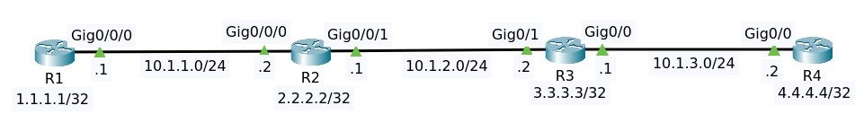

# OSPF Single Area Basic



File packet tracer [OSPF Single Area](OSPF_Single_Area_Basic.pkt).

## Objectives

Configure OSPF in a single area as follows:

1. Use OSPF process ID 1
2. R1, enable OSPF using the network command with exact IP match
3. R2, enable OSPF using the network command based on subnet mask
4. R3, enable OSPF using the interface command
5. R4, enable OSPF on all interfaces with a single network command

## Configuration

### Router R1

Show ip interface brief

```
Interface              IP-Address      OK? Method Status                Protocol 
GigabitEthernet0/0/0   10.1.1.1        YES manual up                    up 
GigabitEthernet0/0/1   unassigned      YES unset  administratively down down 
Loopback0              1.1.1.1         YES manual up                    up 
Vlan1                  unassigned      YES unset  administratively down down
```

We told to use the network command with an exact IP match using OSPF ID 1.
Now, in OSPF, the backbone area is Area 0. So you should start with Area 0 when configuring OSPF.

```
conf t
router ospf 1
 network 10.1.1.1 0.0.0.0 area 0
 network 1.1.1.1 0.0.0.0 area 0
 end
wr
```

Show ip ospf interface

```
GigabitEthernet0/0/0 is up, line protocol is up
  Internet address is 10.1.1.1/24, Area 0
  Process ID 1, Router ID 1.1.1.1, Network Type BROADCAST, Cost: 1
  Transmit Delay is 1 sec, State DR, Priority 1
  Designated Router (ID) 1.1.1.1, Interface address 10.1.1.1
  No backup designated router on this network
  Timer intervals configured, Hello 10, Dead 40, Wait 40, Retransmit 5
    Hello due in 00:00:04
  Index 1/1, flood queue length 0
  Next 0x0(0)/0x0(0)
  Last flood scan length is 1, maximum is 1
  Last flood scan time is 0 msec, maximum is 0 msec
  Neighbor Count is 0, Adjacent neighbor count is 0
  Suppress hello for 0 neighbor(s)
Loopback0 is up, line protocol is up
  Internet address is 1.1.1.1/32, Area 0
  Process ID 1, Router ID 1.1.1.1, Network Type LOOPBACK, Cost: 1
  Loopback interface is treated as a stub Host
```

- Process ID 1
- Router ID 1.1.1.1
- State DR (Designated Router), Priority 1
- Designated Router (ID) 1.1.1.1

>The router ID of an OSPF router is the highest IP address of any physical interface. But if you've got a 
loopback interface, it's the highest IP address of any loopback interface configured on the router.

Show ip ospf database

```
            OSPF Router with ID (1.1.1.1) (Process ID 1)

                Router Link States (Area 0)

Link ID         ADV Router      Age         Seq#       Checksum Link count
1.1.1.1         1.1.1.1         60          0x80000002 0x00e346 2
```

Show ip protocols

```
Routing Protocol is "ospf 1"
  Outgoing update filter list for all interfaces is not set 
  Incoming update filter list for all interfaces is not set 
  Router ID 1.1.1.1
  Number of areas in this router is 1. 1 normal 0 stub 0 nssa
  Maximum path: 4
  Routing for Networks:
    10.1.1.1 0.0.0.0 area 0
    1.1.1.1 0.0.0.0 area 0
  Routing Information Sources:  
    Gateway         Distance      Last Update 
    1.1.1.1              110      00:01:14
  Distance: (default is 110)
```

After the moment, we only have one router in Area 0. We have one normal area. There are no stub areas and 
no not-so-stubby areas (nssa) at the moment.

Show running config `sh running-config | section router ospf`

```
!
router ospf 1
 log-adjacency-changes
 network 10.1.1.1 0.0.0.0 area 0
 network 1.1.1.1 0.0.0.0 area 0
!
```

### Router R2

Show ip interface brief

```
Interface              IP-Address      OK? Method Status                Protocol 
GigabitEthernet0/0/0   10.1.1.2        YES manual up                    up 
GigabitEthernet0/0/1   10.1.2.1        YES manual up                    up 
Loopback0              2.2.2.2         YES manual up                    up 
Vlan1                  unassigned      YES unset  administratively down down
```

We need to configure OSPF using the network command and base that on the subnet mask of the interfaces.

```
conf t
router ospf 1
 network 2.2.2.2 0.0.0.0 area 0
 network 10.1.1.0 0.0.0.255 area 0
 network 10.1.2.0 0.0.0.255 area 0
 end
write
```

Show running config `sh running-config | section router ospf`

```
!
router ospf 1
 log-adjacency-changes
 network 2.2.2.2 0.0.0.0 area 0
 network 10.1.1.0 0.0.0.255 area 0
 network 10.1.2.0 0.0.0.255 area 0
!
```

Show ip ospf database

```
            OSPF Router with ID (2.2.2.2) (Process ID 1)

                Router Link States (Area 0)

Link ID         ADV Router      Age         Seq#       Checksum Link count
1.1.1.1         1.1.1.1         35          0x80000003 0x0072a9 2
2.2.2.2         2.2.2.2         34          0x80000004 0x00b43b 3

                Net Link States (Area 0)
Link ID         ADV Router      Age         Seq#       Checksum
10.1.1.1        1.1.1.1         35          0x80000001 0x008b72
```

On router R1

```
            OSPF Router with ID (1.1.1.1) (Process ID 1)

                Router Link States (Area 0)

Link ID         ADV Router      Age         Seq#       Checksum Link count
1.1.1.1         1.1.1.1         110         0x80000003 0x0072a9 2
2.2.2.2         2.2.2.2         109         0x80000004 0x00b43b 3

                Net Link States (Area 0)
Link ID         ADV Router      Age         Seq#       Checksum
10.1.1.1        1.1.1.1         110         0x80000001 0x008b72
```


Show ip protocols

```
Routing Protocol is "ospf 1"
  Outgoing update filter list for all interfaces is not set 
  Incoming update filter list for all interfaces is not set 
  Router ID 2.2.2.2
  Number of areas in this router is 1. 1 normal 0 stub 0 nssa
  Maximum path: 4
  Routing for Networks:
    2.2.2.2 0.0.0.0 area 0
    10.1.1.0 0.0.0.255 area 0
    10.1.2.0 0.0.0.255 area 0
  Routing Information Sources:  
    Gateway         Distance      Last Update 
    1.1.1.1              110      00:02:43
    2.2.2.2              110      00:02:20
  Distance: (default is 110)
```

Show ip ospf interface

```
Loopback0 is up, line protocol is up
  Internet address is 2.2.2.2/32, Area 0
  Process ID 1, Router ID 2.2.2.2, Network Type LOOPBACK, Cost: 1
  Loopback interface is treated as a stub Host
GigabitEthernet0/0/0 is up, line protocol is up
  Internet address is 10.1.1.2/24, Area 0
  Process ID 1, Router ID 2.2.2.2, Network Type BROADCAST, Cost: 1
  Transmit Delay is 1 sec, State BDR, Priority 1
  Designated Router (ID) 1.1.1.1, Interface address 10.1.1.1
  Backup Designated Router (ID) 2.2.2.2, Interface address 10.1.1.2
  Timer intervals configured, Hello 10, Dead 40, Wait 40, Retransmit 5
    Hello due in 00:00:01
  Index 2/2, flood queue length 0
  Next 0x0(0)/0x0(0)
  Last flood scan length is 1, maximum is 1
  Last flood scan time is 0 msec, maximum is 0 msec
  Neighbor Count is 1, Adjacent neighbor count is 1
    Adjacent with neighbor 1.1.1.1  (Designated Router)
  Suppress hello for 0 neighbor(s)
GigabitEthernet0/0/1 is up, line protocol is up
  Internet address is 10.1.2.1/24, Area 0
  Process ID 1, Router ID 2.2.2.2, Network Type BROADCAST, Cost: 1
  Transmit Delay is 1 sec, State DR, Priority 1
  Designated Router (ID) 2.2.2.2, Interface address 10.1.2.1
  No backup designated router on this network
  Timer intervals configured, Hello 10, Dead 40, Wait 40, Retransmit 5
    Hello due in 00:00:01
  Index 3/3, flood queue length 0
  Next 0x0(0)/0x0(0)
  Last flood scan length is 1, maximum is 1
  Last flood scan time is 0 msec, maximum is 0 msec
  Neighbor Count is 0, Adjacent neighbor count is 0
  Suppress hello for 0 neighbor(s)
```

- Process ID 1
- Router ID 2.2.2.2
- State BDR (Backup Designated Router) on GigabitEthernet0/0/0, Priority 1
  - Designated Router (ID) 1.1.1.1
- State DR  on GigabitEthernet0/0/1, Priority 1
  - Designated Router (ID) 2.2.2.2
  

Show ip route

```
Gateway of last resort is not set

     1.0.0.0/32 is subnetted, 1 subnets
O       1.1.1.1/32 [110/2] via 10.1.1.1, 00:09:36, GigabitEthernet0/0/0
     2.0.0.0/32 is subnetted, 1 subnets
C       2.2.2.2/32 is directly connected, Loopback0
     10.0.0.0/8 is variably subnetted, 4 subnets, 2 masks
C       10.1.1.0/24 is directly connected, GigabitEthernet0/0/0
L       10.1.1.2/32 is directly connected, GigabitEthernet0/0/0
C       10.1.2.0/24 is directly connected, GigabitEthernet0/0/1
L       10.1.2.1/32 is directly connected, GigabitEthernet0/0/1
```

On router R1, show ip route

```
Gateway of last resort is not set

     1.0.0.0/32 is subnetted, 1 subnets
C       1.1.1.1/32 is directly connected, Loopback0
     2.0.0.0/32 is subnetted, 1 subnets
O       2.2.2.2/32 [110/2] via 10.1.1.2, 00:11:46, GigabitEthernet0/0/0
     10.0.0.0/8 is variably subnetted, 3 subnets, 2 masks
C       10.1.1.0/24 is directly connected, GigabitEthernet0/0/0
L       10.1.1.1/32 is directly connected, GigabitEthernet0/0/0
O       10.1.2.0/24 [110/2] via 10.1.1.2, 00:11:23, GigabitEthernet0/0/0
```


### Router R3

Show ip interface brief

```
Interface              IP-Address      OK? Method Status                Protocol 
GigabitEthernet0/0     10.1.3.1        YES manual up                    up 
GigabitEthernet0/1     10.1.2.2        YES manual up                    up 
Loopback0              3.3.3.3         YES manual up                    up 
Vlan1                  unassigned      YES unset  administratively down down
```

We're told to enable OSPF using the interface command. So we are not gonna use the network 
command on router three.

```
conf t
router ospf 1
 exit
int g0/0
```

```
R3(config-if)#ip ospf ?
  <1-65535>           Process ID
  authentication      Enable authentication
  authentication-key  Authentication password (key)
  cost                Interface cost
  dead-interval       Interval after which a neighbor is declared dead
  hello-interval      Time between HELLO packets
  message-digest-key  Message digest authentication password (key)
  network             Network type
  priority            Router priority
```

```
 ip ospf 1 area 0
 exit
int g0/1
 ip ospf 1 area 0
 exit
int loopback 0
 ip ospf 1 area 0
 end
wr
```

Show ip ospf database

```
            OSPF Router with ID (3.3.3.3) (Process ID 1)

                Router Link States (Area 0)

Link ID         ADV Router      Age         Seq#       Checksum Link count
1.1.1.1         1.1.1.1         1343        0x80000003 0x0072a9 2
2.2.2.2         2.2.2.2         70          0x80000005 0x00a13f 3
3.3.3.3         3.3.3.3         66          0x80000004 0x00a937 3

                Net Link States (Area 0)
Link ID         ADV Router      Age         Seq#       Checksum
10.1.1.1        1.1.1.1         1343        0x80000001 0x008b72
10.1.2.1        2.2.2.2         70          0x80000001 0x00bf2e
```


Show running config

```
!
interface Loopback0
 ip address 3.3.3.3 255.255.255.255
 ip ospf 1 area 0
!
interface GigabitEthernet0/0
 ip address 10.1.3.1 255.255.255.0
 ip ospf 1 area 0
 duplex auto
 speed auto
!
interface GigabitEthernet0/1
 ip address 10.1.2.2 255.255.255.0
 ip ospf 1 area 0
 duplex auto
 speed auto
!
interface Vlan1
 no ip address
 shutdown
!
router ospf 1
 log-adjacency-changes
!
```

Show run shows us that we've got OSPF configured on the individual interfaces, and globally we've got 
OSPF configured. The difference now is we're configuring OSPF on individual interfaces and globally configuring OSPF,

Show ip protocols

```
Routing Protocol is "ospf 1"
  Outgoing update filter list for all interfaces is not set 
  Incoming update filter list for all interfaces is not set 
  Router ID 3.3.3.3
  Number of areas in this router is 1. 1 normal 0 stub 0 nssa
  Maximum path: 4
  Routing for Networks:
  Routing Information Sources:  
    Gateway         Distance      Last Update 
    1.1.1.1              110      00:21:13
    2.2.2.2              110      00:03:18
    3.3.3.3              110      00:02:54
  Distance: (default is 110)
```

Notice the difference in output when compared to router two. On router R2 show IP protocols.

```
Routing Protocol is "ospf 1"
  Outgoing update filter list for all interfaces is not set 
  Incoming update filter list for all interfaces is not set 
  Router ID 2.2.2.2
  Number of areas in this router is 1. 1 normal 0 stub 0 nssa
  Maximum path: 4
  Routing for Networks:
    2.2.2.2 0.0.0.0 area 0
    10.1.1.0 0.0.0.255 area 0
    10.1.2.0 0.0.0.255 area 0
  Routing Information Sources:  
    Gateway         Distance      Last Update 
    1.1.1.1              110      00:21:40
    2.2.2.2              110      00:03:45
    3.3.3.3              110      00:03:21
  Distance: (default is 110)
```

Show ip ospf interface 

```
GigabitEthernet0/0 is up, line protocol is up
  Internet address is 10.1.3.1/24, Area 0
  Process ID 1, Router ID 3.3.3.3, Network Type BROADCAST, Cost: 1
  Transmit Delay is 1 sec, State DR, Priority 1
  Designated Router (ID) 3.3.3.3, Interface address 10.1.3.1
  No backup designated router on this network
  Timer intervals configured, Hello 10, Dead 40, Wait 40, Retransmit 5
    Hello due in 00:00:00
  Index 1/1, flood queue length 0
  Next 0x0(0)/0x0(0)
  Last flood scan length is 1, maximum is 1
  Last flood scan time is 0 msec, maximum is 0 msec
  Neighbor Count is 0, Adjacent neighbor count is 0
  Suppress hello for 0 neighbor(s)
GigabitEthernet0/1 is up, line protocol is up
  Internet address is 10.1.2.2/24, Area 0
  Process ID 1, Router ID 3.3.3.3, Network Type BROADCAST, Cost: 1
  Transmit Delay is 1 sec, State BDR, Priority 1
  Designated Router (ID) 2.2.2.2, Interface address 10.1.2.1
  Backup Designated Router (ID) 3.3.3.3, Interface address 10.1.2.2
  Timer intervals configured, Hello 10, Dead 40, Wait 40, Retransmit 5
    Hello due in 00:00:07
  Index 2/2, flood queue length 0
  Next 0x0(0)/0x0(0)
  Last flood scan length is 1, maximum is 1
  Last flood scan time is 0 msec, maximum is 0 msec
  Neighbor Count is 1, Adjacent neighbor count is 1
    Adjacent with neighbor 2.2.2.2  (Designated Router)
  Suppress hello for 0 neighbor(s)
Loopback0 is up, line protocol is up
  Internet address is 3.3.3.3/32, Area 0
  Process ID 1, Router ID 3.3.3.3, Network Type LOOPBACK, Cost: 1
  Loopback interface is treated as a stub Host
```

Show ip ospf neighbor 

```
Neighbor ID     Pri   State           Dead Time   Address         Interface
2.2.2.2           1   FULL/DR         00:00:30    10.1.2.1        GigabitEthernet0/1
```

On router R2 show ip ospf neighbor 

```
Neighbor ID     Pri   State           Dead Time   Address         Interface
1.1.1.1           1   FULL/DR         00:00:36    10.1.1.1        GigabitEthernet0/0/0
3.3.3.3           1   FULL/BDR        00:00:39    10.1.2.2        GigabitEthernet0/0/1
```

Show ip route

```
Gateway of last resort is not set

     1.0.0.0/32 is subnetted, 1 subnets
O       1.1.1.1/32 [110/3] via 10.1.2.1, 00:10:15, GigabitEthernet0/1
     2.0.0.0/32 is subnetted, 1 subnets
O       2.2.2.2/32 [110/2] via 10.1.2.1, 00:10:15, GigabitEthernet0/1
     3.0.0.0/32 is subnetted, 1 subnets
C       3.3.3.3/32 is directly connected, Loopback0
     10.0.0.0/8 is variably subnetted, 5 subnets, 2 masks
O       10.1.1.0/24 [110/2] via 10.1.2.1, 00:10:15, GigabitEthernet0/1
C       10.1.2.0/24 is directly connected, GigabitEthernet0/1
L       10.1.2.2/32 is directly connected, GigabitEthernet0/1
C       10.1.3.0/24 is directly connected, GigabitEthernet0/0
L       10.1.3.1/32 is directly connected, GigabitEthernet0/0
```

#### Extras

To enable ospf authentication

```
conf t
int g0/0
ip ospf authentication-key ospfpass
```

You can set passwords differently on a per interface basis.

### Router R4

Show ip interface brief 

```
Interface              IP-Address      OK? Method Status                Protocol 
GigabitEthernet0/0     10.1.3.2        YES manual up                    up 
GigabitEthernet0/1     unassigned      YES unset  administratively down down 
Loopback0              4.4.4.4         YES manual up                    up 
Vlan1                  unassigned      YES unset  administratively down down
```

We need to enable OSPF on all interfaces with a single network command. So this is the easiest one of all.

```
conf t
router ospf 1
network 0.0.0.0 255.255.255.255 area 0
end
write
```

Show running config

```
!
router ospf 1
 log-adjacency-changes
 network 0.0.0.0 255.255.255.255 area 0
!
```

Show ip ospf neighbor

```
Neighbor ID     Pri   State           Dead Time   Address         Interface
3.3.3.3           1   FULL/DR         00:00:38    10.1.3.1        GigabitEthernet0/0
```

Show ip ospf interface 

```
GigabitEthernet0/0 is up, line protocol is up
  Internet address is 10.1.3.2/24, Area 0
  Process ID 1, Router ID 4.4.4.4, Network Type BROADCAST, Cost: 1
  Transmit Delay is 1 sec, State BDR, Priority 1
  Designated Router (ID) 3.3.3.3, Interface address 10.1.3.1
  Backup Designated Router (ID) 4.4.4.4, Interface address 10.1.3.2
  Timer intervals configured, Hello 10, Dead 40, Wait 40, Retransmit 5
    Hello due in 00:00:00
  Index 1/1, flood queue length 0
  Next 0x0(0)/0x0(0)
  Last flood scan length is 1, maximum is 1
  Last flood scan time is 0 msec, maximum is 0 msec
  Neighbor Count is 1, Adjacent neighbor count is 1
    Adjacent with neighbor 3.3.3.3  (Designated Router)
  Suppress hello for 0 neighbor(s)
Loopback0 is up, line protocol is up
  Internet address is 4.4.4.4/32, Area 0
  Process ID 1, Router ID 4.4.4.4, Network Type LOOPBACK, Cost: 1
  Loopback interface is treated as a stub Host
```

Show ip ospf database

```
            OSPF Router with ID (4.4.4.4) (Process ID 1)

                Router Link States (Area 0)

Link ID         ADV Router      Age         Seq#       Checksum Link count
4.4.4.4         4.4.4.4         371         0x80000003 0x007d74 2
2.2.2.2         2.2.2.2         371         0x80000005 0x00d905 3
1.1.1.1         1.1.1.1         371         0x80000003 0x008595 2
3.3.3.3         3.3.3.3         366         0x80000005 0x0024aa 3

                Net Link States (Area 0)
Link ID         ADV Router      Age         Seq#       Checksum
10.1.3.2        4.4.4.4         371         0x80000001 0x002cdd
10.1.2.2        3.3.3.3         371         0x80000001 0x002fe6
10.1.1.2        2.2.2.2         371         0x80000001 0x00cf59
```

Show ip route

```
Gateway of last resort is not set

     1.0.0.0/32 is subnetted, 1 subnets
O       1.1.1.1/32 [110/4] via 10.1.3.1, 00:02:10, GigabitEthernet0/0
     2.0.0.0/32 is subnetted, 1 subnets
O       2.2.2.2/32 [110/3] via 10.1.3.1, 00:02:10, GigabitEthernet0/0
     3.0.0.0/32 is subnetted, 1 subnets
O       3.3.3.3/32 [110/2] via 10.1.3.1, 00:02:10, GigabitEthernet0/0
     4.0.0.0/32 is subnetted, 1 subnets
C       4.4.4.4/32 is directly connected, Loopback0
     10.0.0.0/8 is variably subnetted, 4 subnets, 2 masks
O       10.1.1.0/24 [110/3] via 10.1.3.1, 00:02:10, GigabitEthernet0/0
O       10.1.2.0/24 [110/2] via 10.1.3.1, 00:02:10, GigabitEthernet0/0
C       10.1.3.0/24 is directly connected, GigabitEthernet0/0
L       10.1.3.2/32 is directly connected, GigabitEthernet0/0
```

## Stable Condition

When condition is stable

On router R1 `sh ip ospf interface brief`

```
Interface     PID   Area                     IP Address/Mask          Cost  State  Nbrs F/C
Lo0             1   0                        1.1.1.1/255.255.255.255   1     WAIT  0/0
Gig0/0/0        1   0                         10.1.1.1/255.255.255.0   1      BDR  0/0
```

On router R2 `sh ip ospf interface brief`

```
Interface     PID   Area                     IP Address/Mask          Cost  State  Nbrs F/C
Lo0             1   0                        2.2.2.2/255.255.255.255   1     WAIT  0/0
Gig0/0/0        1   0                         10.1.1.2/255.255.255.0   1       DR  0/0
Gig0/0/1        1   0                         10.1.2.1/255.255.255.0   1      BDR  0/0
```

On router R3 `sh ip ospf interface brief`

```
Interface     PID   Area                     IP Address/Mask          Cost  State  Nbrs F/C
Lo0             1   0                        3.3.3.3/255.255.255.255   1     WAIT  0/0
Gig0/1          1   0                         10.1.2.2/255.255.255.0   1       DR  0/0
Gig0/0          1   0                         10.1.3.1/255.255.255.0   1      BDR  0/0
```

On router R4 `sh ip ospf interface brief`

```
Interface     PID   Area                     IP Address/Mask          Cost  State  Nbrs F/C
Lo0             1   0                        4.4.4.4/255.255.255.255   1     WAIT  0/0
Gig0/0          1   0                         10.1.3.2/255.255.255.0   1       DR  0/0
```

