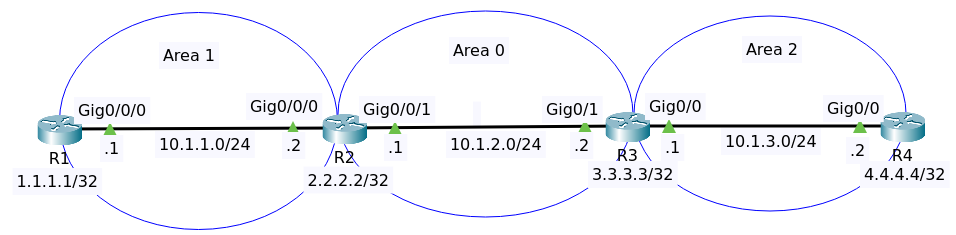

# OSPF 2



File packet tracer [OSPF Three Area](OSPF_3_Area.pkt).

## Objectives

Configure OSPF in a single area as follows:

1. Use OSPF process ID 1
2. R1, R2, R3, R4 enable OSPF using the network command based on subnet mask

## Configuration

We need to configure OSPF using the network command and base that on the subnet mask of the interfaces.

### Router R1

Show ip interface brief

```
Interface              IP-Address      OK? Method Status                Protocol 
GigabitEthernet0/0/0   10.1.1.1        YES manual up                    up 
GigabitEthernet0/0/1   unassigned      YES unset  administratively down down 
Loopback0              1.1.1.1         YES manual up                    up 
Vlan1                  unassigned      YES unset  administratively down down
```

```
conf t
router ospf 1
network 10.1.1.0 0.0.0.255 area 1
end
write
```

### Router R2

Show ip interface brief

```
Interface              IP-Address      OK? Method Status                Protocol 
GigabitEthernet0/0/0   10.1.1.2        YES manual up                    up 
GigabitEthernet0/0/1   10.1.2.1        YES manual up                    up 
Loopback0              2.2.2.2         YES manual up                    up 
Vlan1                  unassigned      YES unset  administratively down down
```

```
conf t
router ospf 1
network 10.1.1.0 0.0.0.255 area 1
network 10.1.2.0 0.0.0.255 area 0
```

### Router R3

Show ip interface brief

```
Interface              IP-Address      OK? Method Status                Protocol 
GigabitEthernet0/0     10.1.3.1        YES manual up                    up 
GigabitEthernet0/1     10.1.2.2        YES manual up                    up 
Loopback0              3.3.3.3         YES manual up                    up 
Vlan1                  unassigned      YES unset  administratively down down
```

```
conf t
router ospf 1
network 10.1.2.0 0.0.0.255 area 0
network 10.1.3.0 0.0.0.255 area 2
```

### Router R4

Show ip interface brief 

```
Interface              IP-Address      OK? Method Status                Protocol 
GigabitEthernet0/0     10.1.3.2        YES manual up                    up 
GigabitEthernet0/1     unassigned      YES unset  administratively down down 
Loopback0              4.4.4.4         YES manual up                    up 
Vlan1                  unassigned      YES unset  administratively down down
```

```
conf t
router ospf 1
network 10.1.3.0 0.0.0.255 area 2
```

## Verifying

### Router R1

Show ip ospf interface 

```
GigabitEthernet0/0/0 is up, line protocol is up
  Internet address is 10.1.1.1/24, Area 1
  Process ID 1, Router ID 1.1.1.1, Network Type BROADCAST, Cost: 1
  Transmit Delay is 1 sec, State DR, Priority 1
  Designated Router (ID) 1.1.1.1, Interface address 10.1.1.1
  Backup Designated Router (ID) 2.2.2.2, Interface address 10.1.1.2
  Timer intervals configured, Hello 10, Dead 40, Wait 40, Retransmit 5
    Hello due in 00:00:06
  Index 1/1, flood queue length 0
  Next 0x0(0)/0x0(0)
  Last flood scan length is 1, maximum is 1
  Last flood scan time is 0 msec, maximum is 0 msec
  Neighbor Count is 1, Adjacent neighbor count is 1
    Adjacent with neighbor 2.2.2.2  (Backup Designated Router)
  Suppress hello for 0 neighbor(s)
```

Show ip ospf interface brief

```
Interface     PID   Area                     IP Address/Mask          Cost  State  Nbrs F/C
Gig0/0/0        1   1                         10.1.1.1/255.255.255.0   1       DR  0/0
```

Show ip protocols 

```
Routing Protocol is "ospf 1"
  Outgoing update filter list for all interfaces is not set 
  Incoming update filter list for all interfaces is not set 
  Router ID 1.1.1.1
  Number of areas in this router is 1. 1 normal 0 stub 0 nssa
  Maximum path: 4
  Routing for Networks:
    10.1.1.0 0.0.0.255 area 1
  Routing Information Sources:  
    Gateway         Distance      Last Update 
    1.1.1.1              110      00:06:08
    2.2.2.2              110      00:06:08
  Distance: (default is 110)
```

Show ip route

```
Codes: L - local, C - connected, S - static, R - RIP, M - mobile, B - BGP
       D - EIGRP, EX - EIGRP external, O - OSPF, IA - OSPF inter area
       N1 - OSPF NSSA external type 1, N2 - OSPF NSSA external type 2
       E1 - OSPF external type 1, E2 - OSPF external type 2, E - EGP
       i - IS-IS, L1 - IS-IS level-1, L2 - IS-IS level-2, ia - IS-IS inter area
       * - candidate default, U - per-user static route, o - ODR
       P - periodic downloaded static route

Gateway of last resort is not set

     1.0.0.0/32 is subnetted, 1 subnets
C       1.1.1.1/32 is directly connected, Loopback0
     10.0.0.0/8 is variably subnetted, 4 subnets, 2 masks
C       10.1.1.0/24 is directly connected, GigabitEthernet0/0/0
L       10.1.1.1/32 is directly connected, GigabitEthernet0/0/0
O IA    10.1.2.0/24 [110/2] via 10.1.1.2, 00:06:43, GigabitEthernet0/0/0
O IA    10.1.3.0/24 [110/3] via 10.1.1.2, 00:03:48, GigabitEthernet0/0/0
```

>Note notation O (OSPF) and IA (OSPF Inter Area)

Do the same on other routers.

### Router R2

Show ip ospf interface brief

```
Interface     PID   Area                     IP Address/Mask          Cost  State  Nbrs F/C
Gig0/0/0        1   1                         10.1.1.2/255.255.255.0   1      BDR  0/0
Gig0/0/1        1   0                         10.1.2.1/255.255.255.0   1       DR  0/0
```

### Router R3

Show ip ospf interface brief

```
Interface     PID   Area                     IP Address/Mask          Cost  State  Nbrs F/C
Gig0/1          1   0                         10.1.2.2/255.255.255.0   1      BDR  0/0
Gig0/0          1   2                         10.1.3.1/255.255.255.0   1       DR  0/0
```

### Router R4

Show ip ospf interface brief

```
Interface     PID   Area                     IP Address/Mask          Cost  State  Nbrs F/C
Gig0/0          1   2                         10.1.3.2/255.255.255.0   1      BDR  0/0
```


