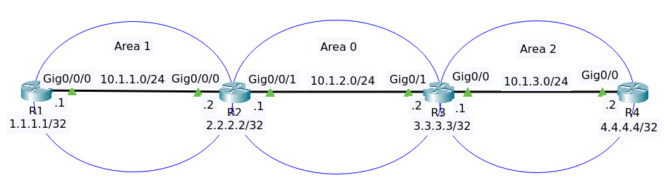

# OSPF Troubleshooting Lab 1



File packet tracer [OSPF Lab 1](OSPF_TS_Lab1_Initial.pkt).

## Objectives

Troubleshooting ticket

- Customer has told you that Router1 is not able to ping the loopback of Router4.

Your job: Fix the network!

## Analyze OSPF

On router R1 show ip ospf interface brief

```
Interface     PID   Area                     IP Address/Mask          Cost  State  Nbrs F/C
Lo0             1   1                        1.1.1.1/255.255.255.255   1     WAIT  0/0
Gig0/0/0        1   1                         10.1.1.1/255.255.255.0   1      BDR  0/0
```

On router R2 show ip ospf interface brief

```
Interface     PID   Area                     IP Address/Mask          Cost  State  Nbrs F/C
Lo0             1   0                        2.2.2.2/255.255.255.255   1     WAIT  0/0
Gig0/0/1        1   0                         10.1.2.1/255.255.255.0   1       DR  0/0
Gig0/0/0        1   1                         10.1.1.2/255.255.255.0   1       DR  0/0
```

On router R3 show ip ospf interface brief

```
Interface     PID   Area                     IP Address/Mask          Cost  State  Nbrs F/C
Lo0             1   2                        3.3.3.3/255.255.255.255   1     WAIT  0/0
Gig0/1          1   2                         10.1.2.2/255.255.255.0   1       DR  0/0
Gig0/0          1   2                         10.1.3.1/255.255.255.0   1      BDR  0/0
```

On router R4 show ip ospf interface brief

```
Interface     PID   Area                     IP Address/Mask          Cost  State  Nbrs F/C
Lo0             1   2                        4.4.4.4/255.255.255.255   1     WAIT  0/0
Gig0/0          1   2                         10.1.3.2/255.255.255.0   1       DR  0/0
```

On R2 interface Gig0/0/1 has an Area 0 while on R3 interface Gig0/1 has an Area 2. 
OSPF requires that neighboring routers be in the same area. So interface Gig0/1 R3 should on Area 0.

On router R3

```
conf t
interface GigabitEthernet0/1
ip ospf 1 area 0
end
write
```

On router R1 try to ping loopback of R4 (4.4.4.4). If failed then reload R4.

```
R1#ping 4.4.4.4

Type escape sequence to abort.
Sending 5, 100-byte ICMP Echos to 4.4.4.4, timeout is 2 seconds:
!!!!!
Success rate is 100 percent (5/5), round-trip min/avg/max = 0/0/0 ms
```


