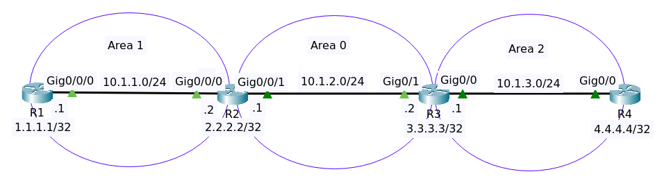

# OSPF Troubleshooting Lab 2



File packet tracer [OSPF Lab 1](OSPF_TS_Lab2_Initial.pkt).

## Objectives

Troubleshooting ticket

- Customer has told you that Router1 is not able to ping the loopback of Router4.

Your job: Fix the network!

## Analyze OSPF

    IMHO, the most efficient analyze is by reading the running configuration !

### Router 1

On router R1 show ip ospf interface brief

```
Interface     PID   Area                     IP Address/Mask          Cost  State  Nbrs F/C
Lo0             1   1                        1.1.1.1/255.255.255.255   1     WAIT  0/0
Gig0/0/0        1   1                       10.1.1.1/255.255.255.0     1      BDR  0/0
```

Show ip ospf neighbor 

```
Neighbor ID     Pri   State           Dead Time   Address         Interface
2.2.2.2           1   FULL/DR         00:00:35    10.1.1.2        GigabitEthernet0/0/0
```

Show ip protocols 

```
Routing Protocol is "ospf 1"
  Outgoing update filter list for all interfaces is not set 
  Incoming update filter list for all interfaces is not set 
  Router ID 1.1.1.1
  Number of areas in this router is 1. 1 normal 0 stub 0 nssa
  Maximum path: 4
  Routing for Networks:
  Routing Information Sources:  
    Gateway         Distance      Last Update 
    1.1.1.1              110      00:16:36
    2.2.2.2              110      00:16:36
  Distance: (default is 110)
```

### Router 2

On router R2 show ip ospf interface brief

```
Interface     PID   Area                     IP Address/Mask          Cost  State  Nbrs F/C
Lo0             1   0                        2.2.2.2/255.255.255.255   1     WAIT  0/0
Gig0/0/1        1   0                         10.1.2.1/255.255.255.0   1    DROTH  0/0
Gig0/0/0        1   1                         10.1.1.2/255.255.255.0   1       DR  0/0
```

Show ip ospf neighbor 

```
Neighbor ID     Pri   State           Dead Time   Address         Interface
2.2.2.2           1   EXSTART/DR      00:00:32    10.1.2.2        GigabitEthernet0/0/1
1.1.1.1           1   FULL/BDR        00:00:32    10.1.1.1        GigabitEthernet0/0/0
```

>Why there's a neighbor with the same ID, 2.2.2.2 ?

Show ip protocols 

```
Routing Protocol is "ospf 1"
  Outgoing update filter list for all interfaces is not set 
  Incoming update filter list for all interfaces is not set 
  Router ID 2.2.2.2
  Number of areas in this router is 2. 2 normal 0 stub 0 nssa
  Maximum path: 4
  Routing for Networks:
    2.2.2.2 0.0.0.0 area 0
    10.1.2.0 0.0.0.255 area 0
    10.1.1.0 0.0.0.255 area 1
  Routing Information Sources:  
    Gateway         Distance      Last Update 
    1.1.1.1              110      00:16:50
    2.2.2.2              110      00:16:50
  Distance: (default is 110)
```

Router ID is 2.2.2.2.

### Router 3

Show ip ospf interface brief 

```
Interface     PID   Area                     IP Address/Mask          Cost  State  Nbrs F/C
Lo0             1   0                        3.3.3.3/255.255.255.255   1     WAIT  0/0
Gig0/1          1   0                         10.1.2.2/255.255.255.0   1    DROTH  0/0
Gig0/0          1   2                         10.1.3.1/255.255.255.0   1      BDR  0/0
```

Show ip ospf neighbor 

```
Neighbor ID     Pri   State           Dead Time   Address         Interface
2.2.2.2           1   EXSTART/DR      00:00:30    10.1.2.1        GigabitEthernet0/1
4.4.4.4           1   FULL/DR         00:00:30    10.1.3.2        GigabitEthernet0/0
```

Show ip protocols 

```
Routing Protocol is "ospf 1"
  Outgoing update filter list for all interfaces is not set 
  Incoming update filter list for all interfaces is not set 
  Router ID 2.2.2.2
  Number of areas in this router is 2. 2 normal 0 stub 0 nssa
  Maximum path: 4
  Routing for Networks:
  Routing Information Sources:  
    Gateway         Distance      Last Update 
    2.2.2.2              110      00:24:54
    4.4.4.4              110      00:24:54
  Distance: (default is 110)
```

Router R3 has a duplicte Router ID with router R2.

Show running config

```
!
router ospf 1
 router-id 2.2.2.2
 log-adjacency-changes
!
```

Just remove router-id.

```
conf t
router ospf 1
router-id 2.2.2.2
end
write
```

```
R3#sh ip protocols 

Routing Protocol is "ospf 1"
  Outgoing update filter list for all interfaces is not set 
  Incoming update filter list for all interfaces is not set 
  Router ID 2.2.2.2
  Number of areas in this router is 2. 2 normal 0 stub 0 nssa
  Maximum path: 4
  Routing for Networks:
  Routing Information Sources:  
    Gateway         Distance      Last Update 
    2.2.2.2              110      00:03:05
    4.4.4.4              110      00:03:06
  Distance: (default is 110)
```

```
R3#clear ip ospf process 
Reset ALL OSPF processes? [no]: yes

R3#
00:34:12: %OSPF-5-ADJCHG: Process 1, Nbr 2.2.2.2 on GigabitEthernet0/1 from EXSTART to DOWN, Neighbor Down: Adjacency forced to reset

00:34:12: %OSPF-5-ADJCHG: Process 1, Nbr 2.2.2.2 on GigabitEthernet0/1 from EXSTART to DOWN, Neighbor Down: Interface down or detached

00:34:12: %OSPF-5-ADJCHG: Process 1, Nbr 4.4.4.4 on GigabitEthernet0/0 from FULL to DOWN, Neighbor Down: Adjacency forced to reset

00:34:12: %OSPF-5-ADJCHG: Process 1, Nbr 4.4.4.4 on GigabitEthernet0/0 from FULL to DOWN, Neighbor Down: Interface down or detached
```

```
R3#sh ip protocols 
00:34:20: %OSPF-5-ADJCHG: Process 1, Nbr 4.4.4.4 on GigabitEthernet0/0 from LOADING to FULL, Loading Done


Routing Protocol is "ospf 1"
  Outgoing update filter list for all interfaces is not set 
  Incoming update filter list for all interfaces is not set 
  Router ID 2.2.2.2
  Number of areas in this router is 2. 2 normal 0 stub 0 nssa
  Maximum path: 4
  Routing for Networks:
  Routing Information Sources:  
    Gateway         Distance      Last Update 
    2.2.2.2              110      00:00:00
    4.4.4.4              110      00:03:34
  Distance: (default is 110)
```

Then manually configure router-id

```
conf t
router ospf 1
router-id 3.3.3.3
end
write
```

Show ip protocols 

```
Routing Protocol is "ospf 1"
  Outgoing update filter list for all interfaces is not set 
  Incoming update filter list for all interfaces is not set 
  Router ID 3.3.3.3
  Number of areas in this router is 2. 2 normal 0 stub 0 nssa
  Maximum path: 4
  Routing for Networks:
  Routing Information Sources:  
    Gateway         Distance      Last Update 
    2.2.2.2              110      00:02:48
    3.3.3.3              110      00:00:09
    4.4.4.4              110      00:06:22
  Distance: (default is 110)
```

On router R2 show ip ospf neighbor 

```
Neighbor ID     Pri   State           Dead Time   Address         Interface
3.3.3.3           1   FULL/DR         00:00:36    10.1.2.2        GigabitEthernet0/0/1
1.1.1.1           1   FULL/BDR        00:00:36    10.1.1.1        GigabitEthernet0/0/0
```

Now on R1 can ping to ip loopback of R4

```
R1>ping 4.4.4.4

Type escape sequence to abort.
Sending 5, 100-byte ICMP Echos to 4.4.4.4, timeout is 2 seconds:
!!!!!
Success rate is 100 percent (5/5), round-trip min/avg/max = 0/0/0 ms
```

