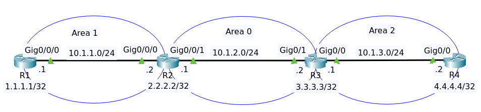

# OSPF Troubleshooting Lab 3



File packet tracer [OSPF Lab 3](OSPF_TS_Lab3_Initial.pkt).

## Objectives

Troubleshooting ticket

- Customer has told you that Router1 is not able to ping the loopback of Router4.

Your job: Fix the network!

## Analyze OSPF

### Router R1

Show ip protocols

```
Routing Protocol is "ospf 1"
  Outgoing update filter list for all interfaces is not set 
  Incoming update filter list for all interfaces is not set 
  Router ID 1.1.1.1
  Number of areas in this router is 1. 1 normal 0 stub 0 nssa
  Maximum path: 4
  Routing for Networks:
  Routing Information Sources:  
    Gateway         Distance      Last Update 
    1.1.1.1              110      00:02:35
    2.2.2.2              110      00:02:36
  Distance: (default is 110)
```

Show ip ospf neighbors

```
Neighbor ID     Pri   State           Dead Time   Address         Interface
2.2.2.2           1   FULL/DR         00:00:30    10.1.1.2        GigabitEthernet0/0/0
```

### Router R2

Show ip protocols

```
Routing Protocol is "ospf 1"
  Outgoing update filter list for all interfaces is not set 
  Incoming update filter list for all interfaces is not set 
  Router ID 2.2.2.2
  Number of areas in this router is 2. 2 normal 0 stub 0 nssa
  Maximum path: 4
  Routing for Networks:
    2.2.2.2 0.0.0.0 area 0
    10.1.2.0 0.0.0.255 area 0
    10.1.1.0 0.0.0.255 area 1
  Routing Information Sources:  
    Gateway         Distance      Last Update 
    1.1.1.1              110      00:28:01
    2.2.2.2              110      00:28:01
  Distance: (default is 110)
```

Show ip ospf neighbors

```
Neighbor ID     Pri   State           Dead Time   Address         Interface
1.1.1.1           1   FULL/BDR        00:00:39    10.1.1.1        GigabitEthernet0/0/0
```

>There's no ospf from router R3.

### Router R3

Show ip protocols

```
Routing Protocol is "ospf 1"
  Outgoing update filter list for all interfaces is not set 
  Incoming update filter list for all interfaces is not set 
  Router ID 3.3.3.3
  Number of areas in this router is 2. 2 normal 0 stub 0 nssa
  Maximum path: 4
  Routing for Networks:
    10.1.0.0 0.0.0.255 area 0
    3.3.3.3 0.0.0.0 area 0
    10.1.3.0 0.0.0.255 area 2
  Routing Information Sources:  
    Gateway         Distance      Last Update 
    3.3.3.3              110      00:28:13
    4.4.4.4              110      00:28:13
  Distance: (default is 110)
```

>Network 10.1.2.0/24 is not configured properly.

Show ip ospf interface 

```
Loopback0 is up, line protocol is up
  Internet address is 3.3.3.3/32, Area 0
  Process ID 1, Router ID 3.3.3.3, Network Type LOOPBACK, Cost: 1
  Loopback interface is treated as a stub Host
GigabitEthernet0/0 is up, line protocol is up
  Internet address is 10.1.3.1/24, Area 2
  Process ID 1, Router ID 3.3.3.3, Network Type BROADCAST, Cost: 1
  Transmit Delay is 1 sec, State WAITING, Priority 1
  No designated router on this network
  No backup designated router on this network
  Timer intervals configured, Hello 10, Dead 40, Wait 40, Retransmit 5
    Hello due in 00:00:02
  Index 2/2, flood queue length 0
  Next 0x0(0)/0x0(0)
  Last flood scan length is 1, maximum is 1
  Last flood scan time is 0 msec, maximum is 0 msec
  Neighbor Count is 1, Adjacent neighbor count is 0
  Suppress hello for 0 neighbor(s)
```

Notice OSPF is only enabled on the loopback interface and Gig0/0/0. OSPF is not enabled on Gig0/0/1 !

Show running config.

```
!
interface Loopback0
 ip address 3.3.3.3 255.255.255.255
!
interface GigabitEthernet0/0
 ip address 10.1.3.1 255.255.255.0
 duplex auto
 speed auto
!
interface GigabitEthernet0/1
 ip address 10.1.2.2 255.255.255.0
 duplex auto
 speed auto
!
interface Vlan1
 no ip address
 shutdown
!
router ospf 1
 log-adjacency-changes
 network 10.1.0.0 0.0.0.255 area 0
 network 3.3.3.3 0.0.0.0 area 0
 network 10.1.3.0 0.0.0.255 area 2
!
```

Edit network ospf

```
conf t
router ospf 1
no network 10.1.0.0 0.0.0.255 area 0
network 10.1.2.0 0.0.0.255 area 0
end
```

Show ip protocols 

```
Routing Protocol is "ospf 1"
  Outgoing update filter list for all interfaces is not set 
  Incoming update filter list for all interfaces is not set 
  Router ID 3.3.3.3
  Number of areas in this router is 2. 2 normal 0 stub 0 nssa
  Maximum path: 4
  Routing for Networks:
    3.3.3.3 0.0.0.0 area 0
    10.1.2.0 0.0.0.255 area 0
    10.1.3.0 0.0.0.255 area 2
  Routing Information Sources:  
    Gateway         Distance      Last Update 
    2.2.2.2              110      00:01:07
    3.3.3.3              110      00:07:55
    4.4.4.4              110      00:07:55
  Distance: (default is 110)
```

Show ip ospf neighbor 

```
Neighbor ID     Pri   State           Dead Time   Address         Interface
2.2.2.2           1   FULL/DR         00:00:33    10.1.2.1        GigabitEthernet0/1
4.4.4.4           1   FULL/DR         00:00:33    10.1.3.2        GigabitEthernet0/0
```

Ping to ip loopback R1 is successful

```
R3#ping 1.1.1.1

Type escape sequence to abort.
Sending 5, 100-byte ICMP Echos to 1.1.1.1, timeout is 2 seconds:
!!!!!
Success rate is 100 percent (5/5), round-trip min/avg/max = 0/0/0 ms
```

On router R2

```
R2#sh ip ospf neighbor 


Neighbor ID     Pri   State           Dead Time   Address         Interface
3.3.3.3           1   FULL/BDR        00:00:35    10.1.2.2        GigabitEthernet0/0/1
1.1.1.1           1   FULL/BDR        00:00:36    10.1.1.1        GigabitEthernet0/0/0
```

On router R1 ping to ip loopback R4

```
R1#ping 4.4.4.4

Type escape sequence to abort.
Sending 5, 100-byte ICMP Echos to 4.4.4.4, timeout is 2 seconds:
!!!!!
Success rate is 100 percent (5/5), round-trip min/avg/max = 0/0/0 ms
```

Problem solved.


