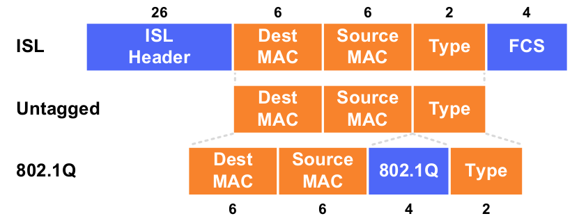
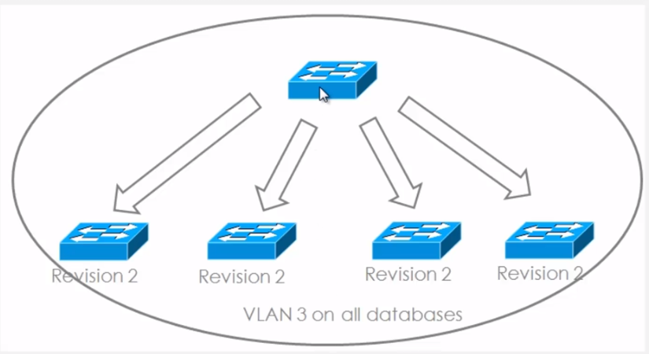
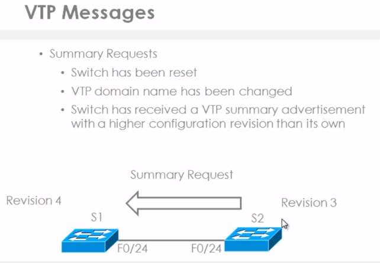
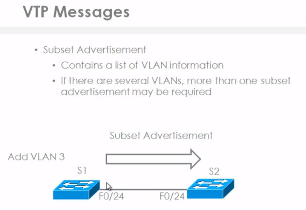
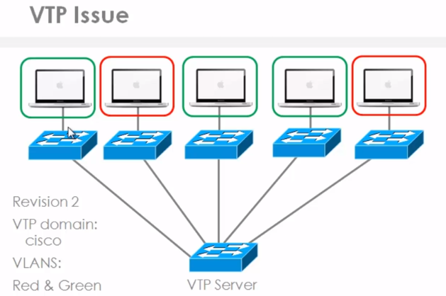
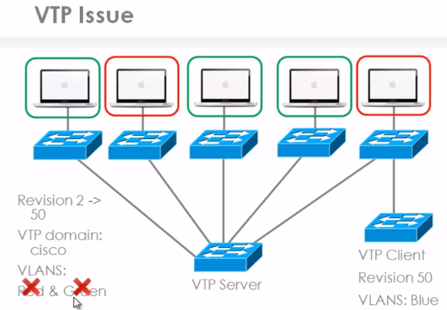
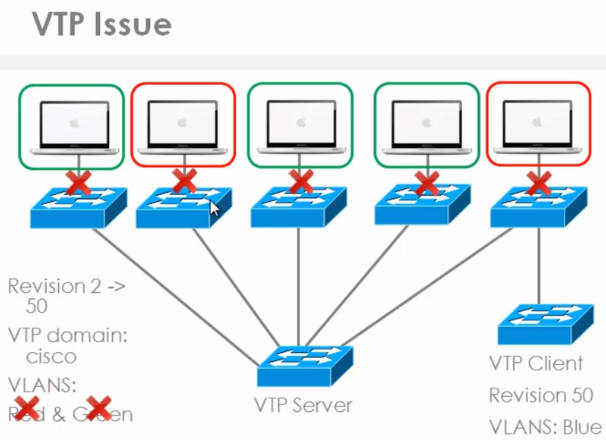

# Introduction to VLAN and VTP

## Native VLAN

Native VLANs are untagged

Management traffic
- Always use native VLAN
  * STP BPDU (Spanning-tree BPDU)
  * DTP (Dynamin Trunking Protocol)
- Always use VLAN 1, tagged if native VLAN not VLAN 1
  * CDP (Cisco Discovery Protocol)
  * VTP (VLAN Trunking Protocol)
  * PAgP (Port Aggregation Protocol)
  * UDLD (Unidirectional Link Detection)

DTP is a protocol that switches negotiate to setup a trunk between themselves automatically.
CDP allow us to view directly connected devices.
VTP is a way to update dynamically other switches with changes made on a single switch in a VTP domain.
PAgP is a protocol used for the automatic creation of ether channels 
UDLD is used to monitor the physical configuration of cables between devices and detect unidirectional links

### Port Assignment

- Static VLAN
  * Administrator
- Dynamic VLAN
  * VMPS (VLAN Membership Policy Server)
- Voice VLAN
  * IP Phones

Dynamic VLAN allow for a ports, VLAN to be dynamically updated base on MAC Address of the device attached to that port.

So in a boardroom, for example, when a director plugs in a laptop based on the Mac address of that laptop
that port is dynamically assigned to the director's VLAN. When a manager plugs his laptop
into that same port the next day, for example that VLAN is automatically updated to the manager's VLAN.

### Trunk Types

Note | 802.1Q | ISL
---------|---------|------
Header Size | 4 bytes | 26 bytes
Trailer Size | N/A | 4 bytes
Standard | IEEE | Cisco
Maximum VLANs | 4094 | 1000

### Terminology

**Trunking**
Carrying multiple VLANs over the same physical connection

**Native VLAN**
By default, frames in this VLAN are untagged when sent across a trunk

**Access VLAN**
The VLAN to which an access port is assigned

**Voice VLAN**
If configured, enables minimal trunking to support voice traffic in addition to data traffic on an access port

**Dynamic Trunking Protocol (DTP)**
Can be used to automatically establish trunks between capable ports (insecure)

**Switched Virtual Interface (SVI)**
A virtual interface which provides a routed gateway into and out of a VLAN

### Switch Port Modes

**trunk**
Forms an unconditional trunk

**dynamic desirable**
Attempts to negotiate a trunk with the far end

**dynamic auto**
Forms a trunk only if requested by the far end

**access**
Will never form a trunk

### Trunk Encapsulation

## VTP

- Cisco proprietary
- Layer 2 protocol
- Allows for  propagation of VLAN information
  - Addition, deleting and renaming of VLANs
- Propagated across trunk links
- Use MAC address 01-00-0C-CC-CC-CC-CC
- Messages
  - Summary Advertisements
  - Subset  Advertisements
  - Advertisement requests

VTP or VLAN trunking protocol is a Cisco proprietary layer two protocol, which allows for the propagation of VLAN 
information from one switch to another rather than tail netting to multiple switches.
You can create, delete or rename VLANs on one switch and have that information automatically propagated 
to other switches across trunk links.

VTP can save you a lot of time but as a lot of Cisco engineers will tell you VTP can cause you a lot of headaches.
Switches can have the entire VLAN configuration wiped out if a new switch is added to the network without 
following a proper procedure. So a lot of Cisco engineers will not enable VTP in modern environments because 
of the inherent risks associated with this protocol.

When setting up VTP, devices will by default belong to the null domain. For VTP to work put the devices into a spesific VTP domain.
Only devices within the same VTP domain will be updated with VLAN information.

The whole concept with VTP is that you can make changes on an individual device. As those changes are made, all 
other switches are informed of the change and they will synchronize their databases to the latest revision number 
so that they end up having the same VLANs in their VLAN databases.

That means that you as the administrator only need to make changes 
on one switch rather than five switches in this topology.

VTP does not put ports into individual VLANs. It just updates the VLAN database so that the switches know which 
VLANs exist. You as an administrators still need to put those ports into the relevant VLANs.

### VTP Modes

- Server
  - Create VLANs
  - Modify VLANs
  - Delete VLANs
  - Sends and forwards Advertisements
- Client
  - Cannot create, change or delete VLANs
  - Sends and forwards Advertisements
  - Synchronizes database
- Transparent
  - Forwards advertisements but does not participate in VTP
  - VLANs must be configured manually

### VTP Issue

Before adding a switch

After adding a another switch which has revision number 50 from the lab.

Now all of the ports on all the switches that have manually been put into the green or red VLAN are error 
disabled. The issue here is that a port belongs to the red VLAN but the red VLAN does not exist in
the database. So the port is automatically error disabled.

Essentially what happens is that the entire network is brought down by the introduction of the single switch.

