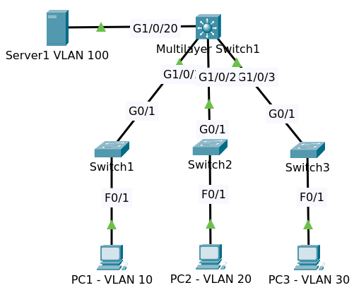

# Configuring VLAN and Inter VLAN Routing

## Problem

Configure the network as follows

Multilayer Switch 3650
* IP addresses and interVLAN routing
  * VLAN 1 = 10.1.1.254/24
  * VLAN 10 = 10.1.10.254/24,  
  * VLAN 20 = 10.1.20.254/24
  * VLAN 30 = 10.1.30.254/24,
  * VLAN 100 = 10.1.100.254/24  

Access Layer Switches 
* Setup one management IP addresses in VLAN 1
  * Switch 1 = 10.1.1.1/24
  * Switch 2 = 10.1.1.2/24
  * Switch 3 = 10.1.1.3/24

Configure access ports as follows:
* PC1 in VLAN 10
  * IP Address 10.1.10.10/24
* PC2 in VLAN 20
  * IP Address 10.1.20.20/24
* PC3 in VLAN 30
  * IP Address 10.1.30.30/24
* Server1 in VLAN 100 has an ip address 10.1.100.100/24

The others
* Configure ports between switches as trunks (use 802.1Q trunking)
* Make sure that PCs can ping each other and the server
* Make sure that switches can ping the PCs and server

Use file packet tracer [Basic VLANs Initial](Basic%s0VLANs%s0Initial.pkt)

## Basic Configuration

### Core Switch (Multilayer Switch)

We need to configure multiple ip addresses on the switch and enable ip routing between the VLANs.

#### Configure VLANs 10, 20, 30 and 100

Enter privilege mode by typing `en` to configure

    conf t
    vlan 10
    vlan 20
    vlan 30
    vlan 100
    end
    write

Typing command `sh vlan brief` to show the VLANs

    VLAN Name                             Status    Ports
    ---- -------------------------------- --------- -------------------------------
    1    default                          active    Gig1/0/1, Gig1/0/2, Gig1/0/3, Gig1/0/4
                                                    Gig1/0/5, Gig1/0/6, Gig1/0/7, Gig1/0/8
                                                    Gig1/0/9, Gig1/0/10, Gig1/0/11, Gig1/0/12
                                                    Gig1/0/13, Gig1/0/14, Gig1/0/15, Gig1/0/16
                                                    Gig1/0/17, Gig1/0/18, Gig1/0/19, Gig1/0/20
                                                    Gig1/0/21, Gig1/0/22, Gig1/0/23, Gig1/0/24
                                                    Gig1/1/1, Gig1/1/2, Gig1/1/3, Gig1/1/4
    10   VLAN0010                         active    
    20   VLAN0020                         active    
    30   VLAN0030                         active    
    100  VLAN0100                         active    
    1002 fddi-default                     active    
    1003 token-ring-default               active    
    1004 fddinet-default                  active    
    1005 trnet-default                    active    

#### Configure Access Ports for VLAN 100

Show the switchport information on interface `gi1/0/20` by typing `sh interfaces gi1/0/20 switchport`

    Name: Gig1/0/20
    Switchport: Enabled
    Administrative Mode: dynamic auto
    Operational Mode: static access
    Administrative Trunking Encapsulation: dot1q
    Operational Trunking Encapsulation: native
    Negotiation of Trunking: On
    Access Mode VLAN: 1 (default)
    Trunking Native Mode VLAN: 1 (default)
    Voice VLAN: none
    ......
 
>Some lines not shown here marked with `......`

It shows:
* Switchport is enabled
* Administrative Mode is dynamic auto
* Operational Mode is static access or acting as access port
* Negotiation of Trunking is On
* Access Mode VLAN is 1 (default)

>DTP (Dynamic Trunking Protocol) is enabled by default, and the interface is in `dynamic auto` or `dynamic desirable` mode.

We configure it to VLAN 100.

    conf t
    int gi1/0/20
    switchport mode access
    switchport access vlan 100
    switchport nonegotiate
    end
    write

Verify again by running command `sh interfaces gi 1/0/20 switchport`

    Name: Gig1/0/20
    Switchport: Enabled
    Administrative Mode: static access
    Operational Mode: static access
    Administrative Trunking Encapsulation: dot1q
    Operational Trunking Encapsulation: native
    Negotiation of Trunking: Off
    Access Mode VLAN: 100 (VLAN0100)
    Trunking Native Mode VLAN: 1 (default)
    Voice VLAN: none

It shows:
* Switchport is still enabled
* Administrative Mode is static access
* Operational Mode is static access or acting as access port
* Negotiation of Trunking is Off
* Access Mode VLAN is 100

>DTP is disabled.

**Configure manually as below to configure the port as an access port and disable DTP**

    switchport mode access
    switchport nonegotiate

#### Configure Trunk Ports

Interfaces `gi1/0/1`, `gi1/0/2` and `gi1/0/3` need to be configured as trunk ports

Show the switchport information on interface `gi1/0/1` before configuring as trunk by typing `sh interfaces gi1/0/1 switchport`

    Name: Gig1/0/1
    Switchport: Enabled
    Administrative Mode: dynamic auto
    Operational Mode: static access
    Administrative Trunking Encapsulation: dot1q
    Operational Trunking Encapsulation: native
    Negotiation of Trunking: On
    Access Mode VLAN: 1 (default)
    Trunking Native Mode VLAN: 1 (default)
    Voice VLAN: none
    ......

It shows:
* Switchport is enabled
* Administrative Mode is dynamic auto
* Operational Mode is static access or acting as access port
* Negotiation of Trunking is On (DTP is auto)
* Access Mode VLAN is 1 (default)

>DTP (Dynamic Trunking Protocol) is enabled by default, and the interface is in `dynamic auto` or `dynamic desirable` mode.

We configure these ports as trunk

    conf t
    int Gig 1/0/1
    switchport mode trunk
    switchport nonegotiate
    exit

    int Gig 1/0/2
    switchport mode trunk
    switchport nonegotiate
    exit
    
    int Gig 1/0/3
    switchport mode trunk
    switchport nonegotiate
    exit
    end
    write

If the command `switchport mode trunk` doesn't work then do below instead of

    switchport trunk encapsulation dot1q
    switchport mode trunk

Verify again by running command `sh interfaces gi 1/0/1 switchport`

    Name: Gig1/0/1
    Switchport: Enabled
    Administrative Mode: trunk
    Operational Mode: trunk
    Administrative Trunking Encapsulation: dot1q
    Operational Trunking Encapsulation: dot1q
    Negotiation of Trunking: Off
    Access Mode VLAN: 1 (default)
    Trunking Native Mode VLAN: 1 (default)
    Voice VLAN: none
    ......

It shows:
* Switchport is enabled
* Administrative Mode is trunk
* Operational Mode is trunk
* Negotiation of Trunking is Off
* Access Mode VLAN is 1 (default)

>DTP is disabled.

**Configure manually as below to configure the port as a trunk and disable DTP**

    switchport mode trunk
    switchport nonegotiate

Show the trunk by typing `sh interfaces trunk`

    Port        Mode         Encapsulation  Status        Native vlan
    Gig1/0/1    on           802.1q         trunking      1
    Gig1/0/2    on           802.1q         trunking      1
    Gig1/0/3    on           802.1q         trunking      1

    Port        Vlans allowed on trunk
    Gig1/0/1    1-1005
    Gig1/0/2    1-1005
    Gig1/0/3    1-1005

    Port        Vlans allowed and active in management domain
    Gig1/0/1    1,10,20,30,100
    Gig1/0/2    1,10,20,30,100
    Gig1/0/3    1,10,20,30,100

    Port        Vlans in spanning tree forwarding state and not pruned
    Gig1/0/1    1,10,20,30,100
    Gig1/0/2    1,10,20,30,100
    Gig1/0/3    1,10,20,30,100

#### Configure SVI (Switch Virtual Interface)

We will configure SVI (Switch Virtual Interface) to enable inter VLAN routing.

Typing `sh ip interface brief`

    Interface              IP-Address      OK? Method Status                Protocol 
    GigabitEthernet1/0/1   unassigned      YES unset  up                    up 
    GigabitEthernet1/0/2   unassigned      YES unset  up                    up 
    GigabitEthernet1/0/3   unassigned      YES unset  up                    up 
    GigabitEthernet1/0/4   unassigned      YES unset  down                  down 
    GigabitEthernet1/0/5   unassigned      YES unset  down                  down 
    GigabitEthernet1/0/6   unassigned      YES unset  down                  down 
    GigabitEthernet1/0/7   unassigned      YES unset  down                  down 
    GigabitEthernet1/0/8   unassigned      YES unset  down                  down 
    GigabitEthernet1/0/9   unassigned      YES unset  down                  down 
    GigabitEthernet1/0/10  unassigned      YES unset  down                  down 
    GigabitEthernet1/0/11  unassigned      YES unset  down                  down 
    GigabitEthernet1/0/12  unassigned      YES unset  down                  down 
    GigabitEthernet1/0/13  unassigned      YES unset  down                  down 
    GigabitEthernet1/0/14  unassigned      YES unset  down                  down 
    GigabitEthernet1/0/15  unassigned      YES unset  down                  down 
    GigabitEthernet1/0/16  unassigned      YES unset  down                  down 
    GigabitEthernet1/0/17  unassigned      YES unset  down                  down 
    GigabitEthernet1/0/18  unassigned      YES unset  down                  down 
    GigabitEthernet1/0/19  unassigned      YES unset  down                  down 
    GigabitEthernet1/0/20  unassigned      YES unset  up                    up 
    GigabitEthernet1/0/21  unassigned      YES unset  down                  down 
    GigabitEthernet1/0/22  unassigned      YES unset  down                  down 
    GigabitEthernet1/0/23  unassigned      YES unset  down                  down 
    GigabitEthernet1/0/24  unassigned      YES unset  down                  down 
    GigabitEthernet1/1/1   unassigned      YES unset  down                  down 
    GigabitEthernet1/1/2   unassigned      YES unset  down                  down 
    GigabitEthernet1/1/3   unassigned      YES unset  down                  down 
    GigabitEthernet1/1/4   unassigned      YES unset  down                  down 
    Vlan1                  unassigned      YES unset  administratively down down

Configure ip address for VLAN 1, 10, 20, 30 and 100

    conf t
    int vlan 1
    ip address 10.1.1.254 255.255.255.0
    no shutdown

    int vlan 10
    ip address 10.1.10.254 255.255.255.0
    no shutdown
    
    int vlan 20
    ip address 10.1.20.254 255.255.255.0
    no shutdown
    
    int vlan 30
    ip address 10.1.30.254 255.255.255.0
    no shutdown

    int vlan 100
    ip address 10.1.100.254 255.255.255.0
    no shutdown
    write

Typing `sh ip interface brief` again

    Interface              IP-Address      OK? Method Status                Protocol 
    GigabitEthernet1/0/1   unassigned      YES unset  up                    up 
    GigabitEthernet1/0/2   unassigned      YES unset  up                    up 
    GigabitEthernet1/0/3   unassigned      YES unset  up                    up 
    GigabitEthernet1/0/4   unassigned      YES unset  down                  down 
    ......
    GigabitEthernet1/0/20  unassigned      YES unset  up                    up 
    GigabitEthernet1/0/21  unassigned      YES unset  down                  down 
    ......
    Vlan1                  10.1.1.254      YES manual up                    up 
    Vlan10                 10.1.10.254     YES manual up                    up 
    Vlan20                 10.1.20.254     YES manual up                    up 
    Vlan30                 10.1.30.254     YES manual up                    up 
    Vlan100                10.1.100.254    YES manual up                    up

Show vlan information by typing command `sh vlan brief`

    VLAN Name                             Status    Ports
    ---- -------------------------------- --------- -------------------------------
    1    default                          active    Gig1/0/4, Gig1/0/5, Gig1/0/6, Gig1/0/7
                                                    Gig1/0/8, Gig1/0/9, Gig1/0/10, Gig1/0/11
                                                    Gig1/0/12, Gig1/0/13, Gig1/0/14, Gig1/0/15
                                                    Gig1/0/16, Gig1/0/17, Gig1/0/18, Gig1/0/19
                                                    Gig1/0/21, Gig1/0/22, Gig1/0/23, Gig1/0/24
                                                    Gig1/1/1, Gig1/1/2, Gig1/1/3, Gig1/1/4
    10   VLAN0010                         active    
    20   VLAN0020                         active    
    30   VLAN0030                         active    
    100  VLAN0100                         active    Gig1/0/20
    ......

#### Enable ip routing

The Core switch already configure as `ip routing`

    Core#sh running-config | include ip r
    ip routing

But you can configure it manually again and add `no ip domain-lookup` to not query to dns server.

    conf t
    ip routing
    no ip domain-lookup
    end
    write

#### Configure VTP

VTP or VLAN trunking protocol is a Cisco proprietary layer two protocol, which allows for the propagation of VLAN 
information from one switch to another rather than configure manually VLANs at multiple switches.
You can create, delete or rename VLANs on one switch and have that information automatically propagated 
to other switches across trunk links.

>VTP can be a very useful protocol but can be extremely dangerous and has caused a lot of problems for Cisco engineers for years.

Show vtp status by typing `sh vtp status`

    VTP Version capable             : 1 to 2
    VTP version running             : 1
    VTP Domain Name                 : 
    VTP Pruning Mode                : Disabled
    VTP Traps Generation            : Disabled
    Device ID                       : 0002.4A33.EC00
    Configuration last modified by 0.0.0.0 at 3-1-93 00:00:00
    Local updater ID is 10.1.1.254 on interface Vl1 (lowest numbered VLAN interface found)

    Feature VLAN : 
    --------------
    VTP Operating Mode                : Server
    Maximum VLANs supported locally   : 1005
    Number of existing VLANs          : 9
    Configuration Revision            : 32
    MD5 digest                        : 0xA6 0xDF 0xAE 0xA7 0xFE 0xCB 0xCA 0xE0 
                                        0x16 0x49 0x0A 0x6E 0x84 0x16 0x41 0xF8 

It shows
- VTP Domain Name not set or null
- VTP Operating Mode is Server
- Number of VLANs is 9

We will configure this core switch as `VTP Server` and make the others as `VTP Client` then set VTP Domain `ccna`.

    conf t
    vtp mode server
    vtp domain ccna
    end
    write

Now show vtp status again

    VTP Version capable             : 1 to 2
    VTP version running             : 1
    VTP Domain Name                 : ccna
    VTP Pruning Mode                : Disabled
    VTP Traps Generation            : Disabled
    Device ID                       : 0002.4A33.EC00
    Configuration last modified by 0.0.0.0 at 3-1-93 00:00:00
    Local updater ID is 10.1.1.254 on interface Vl1 (lowest numbered VLAN interface found)

    Feature VLAN : 
    --------------
    VTP Operating Mode                : Server
    Maximum VLANs supported locally   : 1005
    Number of existing VLANs          : 9
    Configuration Revision            : 0

>Configuration Revision change to 0.

### Switch 1 (S1)

#### Configure Trunk Port & VTP mode Client

Remember VTP only propagated across trunk link so before configuring trunk port we configure the vtp first.

Show `vtp status`

    VTP Version                     : 1
    Configuration Revision          : 0
    Maximum VLANs supported locally : 255
    Number of existing VLANs        : 5
    VTP Operating Mode              : Server
    VTP Domain Name                 : 
    VTP Pruning Mode                : Disabled
    VTP V2 Mode                     : Disabled
    VTP Traps Generation            : Disabled
    ......

It shows
- VTP Domain Name not set or null
- VTP Operating Mode is Server
- Number of VLANs is 5 (default)

Show vlan by typing `sh vlan brief`

    VLAN Name                             Status    Ports
    ---- -------------------------------- --------- -------------------------------
    1    default                          active    Fa0/1, Fa0/2, Fa0/3, Fa0/4
                                                    Fa0/5, Fa0/6, Fa0/7, Fa0/8
                                                    Fa0/9, Fa0/10, Fa0/11, Fa0/12
                                                    Fa0/13, Fa0/14, Fa0/15, Fa0/16
                                                    Fa0/17, Fa0/18, Fa0/19, Fa0/20
                                                    Fa0/21, Fa0/22, Fa0/23, Fa0/24
                                                    Gig0/1, Gig0/2
    1002 fddi-default                     active    
    1003 token-ring-default               active    
    1004 fddinet-default                  active    
    1005 trnet-default                    active    

>VLAN database not propagated because the trunk port is not set.

Now configure vtp mode client and vtp domain ccna.

    conf t
    vtp mode client
    vtp domain ccna
    end
    write

Show vtp status again and we see

- Number of existing VLANs still 5
- VTP Operating Mode is set to Client
- VTP Domain Name is set to ccna

Before configuring the trunk port the interface `gig0/1` status is below

    Name: Gig0/1
    Switchport: Enabled
    Administrative Mode: dynamic auto
    Operational Mode: static access
    Administrative Trunking Encapsulation: dot1q
    Operational Trunking Encapsulation: native
    Negotiation of Trunking: On
    Access Mode VLAN: 1 (default)
    Trunking Native Mode VLAN: 1 (default)
    Voice VLAN: none
    ......

And no interfaces set as trunk

    S1#sh interfaces trunk 
    
    S1#

Now configure interface `gig0/1` as trunk port. 

    conf t
    int gig0/1
    switchport mode trunk
    switchport nonegotiate
    end
    write

Now run again command to show trunk

    Port        Mode         Encapsulation  Status        Native vlan
    Gig0/1      on           802.1q         trunking      1

    Port        Vlans allowed on trunk
    Gig0/1      1-1005

    Port        Vlans allowed and active in management domain
    Gig0/1      1,10,20,30,100

    Port        Vlans in spanning tree forwarding state and not pruned
    Gig0/1      none

The vlans databas already in sync with core switch. See the result of `sh vtp status`

    VTP Version                     : 1
    Configuration Revision          : 0
    Maximum VLANs supported locally : 255
    Number of existing VLANs        : 9
    VTP Operating Mode              : Client
    VTP Domain Name                 : ccna

We see number of existing VLANs changed to 9. Show vlan brief is below.

    VLAN Name                             Status    Ports
    ---- -------------------------------- --------- -------------------------------
    1    default                          active    Fa0/1, Fa0/2, Fa0/3, Fa0/4
                                                    Fa0/5, Fa0/6, Fa0/7, Fa0/8
                                                    Fa0/9, Fa0/10, Fa0/11, Fa0/12
                                                    Fa0/13, Fa0/14, Fa0/15, Fa0/16
                                                    Fa0/17, Fa0/18, Fa0/19, Fa0/20
                                                    Fa0/21, Fa0/22, Fa0/23, Fa0/24
                                                    Gig0/2
    10   VLAN0010                         active    
    20   VLAN0020                         active    
    30   VLAN0030                         active    
    100  VLAN0100                         active    
    1002 fddi-default                     active    
    1003 token-ring-default               active    
    1004 fddinet-default                  active    
    1005 trnet-default                    active    

#### Configure Access Ports for VLAN 10

    conf t
    int fa0/1
    switchport mode access 
    switchport access vlan 10
    switchport nonegotiate
    end
    write  
    
#### Configure IP Address on VLAN 1 and default gateway

    conf t
    int vlan 1
    ip address 10.1.1.1 255.255.255.0
    no shutdown
    exit
    ip default-gateway 10.1.1.254
    no ip domain-lookup
    end
    write

>By default, any single word entered on a command line that is not recognized as a valid command is considered as a hostname by the router, and the router will by default try to telnet to that hostname. This is extremely annoying, especially when you do a simple typo, as the router will try to translate that typo into an IP address. If you do not have a DNS server configured, the command line will stall for several seconds until the DNS request times out ([NO ip-domain lookup](https://community.cisco.com/t5/switching/no-ip-domain-lookup/td-p/2705168))

#### Test ping to Core Switch

Ping to Core Switch in the same network

    S1#ping 10.1.1.254

    Type escape sequence to abort.
    Sending 5, 100-byte ICMP Echos to 10.1.1.254, timeout is 2 seconds:
    .!!!!
    Success rate is 80 percent (4/5), round-trip min/avg/max = 0/0/0 ms

Ping to Core Switch with the different network

    S1#ping 10.1.100.254

    Type escape sequence to abort.
    Sending 5, 100-byte ICMP Echos to 10.1.100.254, timeout is 2 seconds:
    !!!!!
    Success rate is 100 percent (5/5), round-trip min/avg/max = 0/0/0 ms

Show running-config

    Current configuration : 1260 bytes
    !
    version 12.2
    no service timestamps log datetime msec
    no service timestamps debug datetime msec
    no service password-encryption
    !
    hostname S1
    !
    !
    !
    no ip domain-lookup
    !
    !
    !
    spanning-tree mode pvst
    spanning-tree extend system-id
    !
    interface FastEthernet0/1
     switchport access vlan 10
     switchport mode access
     switchport nonegotiate
    !
    interface FastEthernet0/2
    !
    interface FastEthernet0/3
    !
    interface FastEthernet0/4
    !
    interface FastEthernet0/5
    !
    interface FastEthernet0/6
    !
    interface FastEthernet0/7
    !
    interface FastEthernet0/8
    !
    interface FastEthernet0/9
    !
    interface FastEthernet0/10
    !
    interface FastEthernet0/11
    !
    interface FastEthernet0/12
    !
    interface FastEthernet0/13
    !
    interface FastEthernet0/14
    !
    interface FastEthernet0/15
    !
    interface FastEthernet0/16
    !
    interface FastEthernet0/17
    !
    interface FastEthernet0/18
    !
    interface FastEthernet0/19
    !
    interface FastEthernet0/20
    !
    interface FastEthernet0/21
    !
    interface FastEthernet0/22
    !
    interface FastEthernet0/23
    !
    interface FastEthernet0/24
    !
    interface GigabitEthernet0/1
     switchport mode trunk
     switchport nonegotiate
    !
    interface GigabitEthernet0/2
    !
    interface Vlan1
     ip address 10.1.1.1 255.255.255.0
    !
    ip default-gateway 10.1.1.254
    !
    !
    !
    !
    line con 0
    !
    line vty 0 4
     login
    line vty 5 15
     login
    !
    !
    !
    !
    end

Do something similar on switch 2 and switch 3.

### Switch 2 

### Configure Trunk Port & VTP mode Client

Configure vtp mode client and vtp domain ccna.

    conf t
    vtp mode client
    vtp domain ccna
    end
    write

Configure interface `gig0/1` as trunk port.

    conf t
    int gig0/1
    switchport mode trunk
    switchport nonegotiate
    end
    write

#### Configure Access Ports for VLAN 20

    conf t
    int fa0/1
    switchport mode access 
    switchport access vlan 20
    switchport nonegotiate
    end
    write

### Configure IP Address on VLAN 1 and default gateway

    conf t
    int vlan 1
    ip address 10.1.1.2 255.255.255.0
    no shutdown
    exit
    ip default-gateway 10.1.1.254
    no ip domain-lookup
    end
    write

#### Test ping to Core Switch

Ping to 10.1.1.254.
Ping to 10.1.100.254.

### Switch 3

#### Configure Trunk Port & VTP mode Client

Configure vtp mode client and vtp domain ccna.

    conf t
    vtp mode client
    vtp domain ccna
    end
    write

Configure interface `gig0/1` as trunk port.

    conf t
    int gig0/1
    switchport mode trunk
    switchport nonegotiate
    end
    write

#### Configure Access Ports for VLAN 30

    conf t
    int fa0/1
    switchport mode access 
    switchport access vlan 30
    switchport nonegotiate
    end
    write

#### Configure IP Address on VLAN 1 and default gateway

    conf t
    int vlan 1
    ip address 10.1.1.3 255.255.255.0
    no shutdown
    exit
    ip default-gateway 10.1.1.254
    no ip domain-lookup
    end
    write

#### Test ping to Core Switch

Ping to 10.1.1.254
Ping to 10.1.100.254

### Configure Server1 and the PCs

Configure ip address at Server VLAN 100

    ip address  : 10.1.100.100
    netmask     : 255.255.255.0
    gateway     : 10.1.100.254
    
Configure ip address at PC1 VLAN 10

    ip address  : 10.1.10.10
    netmask     : 255.255.255.0
    gateway     : 10.1.10.254

Configure ip address at PC2 VLAN 20

    ip address  : 10.1.20.20
    netmask     : 255.255.255.0
    gateway     : 10.1.20.254
    
Configure ip address at PC3 VLAN 30

    ip address  : 10.1.30.30
    netmask     : 255.255.255.0
    gateway     : 10.1.30.254
    
Then do test ping to the core switch and access switch.

## Final Configuration

The final configuration saved as file packet tracer [Basic VLANs Initial](Basic%s0VLANs%s0Final.pkt)

