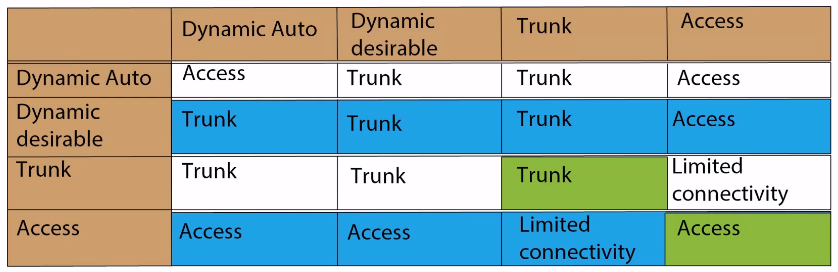
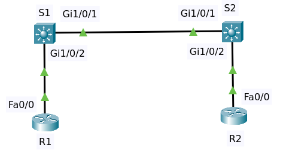

# Dynamic Trunking Protocol (DTP)

## Introduction

Many Cisco switches support Dynamic Trunking Protocol or DTP this allows switches to dynamically negotiate the forming of trunks.
DTP is a Cisco propriety protocol and hence other vendors don’t support it. A lot of switches have this configured by default
which means that they can automatically negotiate trunking with neighboring switches.

The best practice is to disable DTP and use manual configuration. Two Cisco switches can dynamically through DTP negotiate to form a trunk
and permit VLANs across the trunk automatically it can also negotiate the protocol used such as the ISL or 802.1Q.

DTP supports 2 main modes
- Dynamic auto
  - Auto means that it doesn’t initiate but if the other side initiates the trunking, trunking will be formed.
- Dynamic desirable
  - Desirable means that the switch initiates trunking with the remote end.

See the diagram below

It is best practice, however, to configure both sides manually for trunking or configure both sides as access ports.

## Network Topology

Consider the following topology.

- Two Multilayer Switch 3650-24PS
- Two Router 1841

They have default configuration except changes on hostnames.

### DTP's Default Configuration

To show dtp information at the interface run command `sh dtp int g1/0/1` but I can't execute it instead of using `sh int g1/0/1 switchport` at S1.

    Name: Gig1/0/1
    Switchport: Enabled
    Administrative Mode: dynamic auto
    Operational Mode: static access
    Administrative Trunking Encapsulation: dot1q
    Operational Trunking Encapsulation: native
    Negotiation of Trunking: On
    Access Mode VLAN: 1 (default)
    Trunking Native Mode VLAN: 1 (default)
    Voice VLAN: none
    ......

>Some lines not shown here marked with `......`

It shows:
* Switchport is enabled
* Administrative Mode is dynamic auto
* Operational Mode is static access or acting as access port
* Negotiation of Trunking is On

The same thing happens at S2.

If we run command `sh interfaces trunk` there's no trunk.

### Change Configuration for DTP

#### Dynamic Desirable

We will change DTP mode to `dynamic desirable` on the link between switch S1 and S2. At switch S1 change DTP to dynamic desirable

    conf t
    interface gi 1/0/1
    switchport mode dynamic desirable 
    end

At S1 execute command `sh int g1/0/1 switchport` to check interface `gi 1/0/1`

    Name: Gig1/0/1
    Switchport: Enabled
    Administrative Mode: dynamic desirable
    Operational Mode: trunk
    Administrative Trunking Encapsulation: dot1q
    Operational Trunking Encapsulation: dot1q
    Negotiation of Trunking: On
    Access Mode VLAN: 1 (default)

It shows:
* Administrative Mode is dynamic desirable
* Operational Mode is trunk
* Negotiation of Trunking is On

Cek interface `gi 1/0/1` at Switch 2.

    Name: Gig1/0/1
    Switchport: Enabled
    Administrative Mode: dynamic auto
    Operational Mode: trunk
    Administrative Trunking Encapsulation: dot1q
    Operational Trunking Encapsulation: dot1q
    Negotiation of Trunking: On
    Access Mode VLAN: 1 (default)
    Trunking Native Mode VLAN: 1 (default)
    Voice VLAN: none

It shows:
* Administrative Mode is dynamic auto
* Operational Mode is trunk
* Negotiation of Trunking is On

Cek interface trunk at S2 by running command `sh interfaces trunk`

    Port        Mode         Encapsulation  Status        Native vlan
    Gig1/0/1    auto         n-802.1q       trunking      1

    Port        Vlans allowed on trunk
    Gig1/0/1    1-1005

    Port        Vlans allowed and active in management domain
    Gig1/0/1    1

    Port        Vlans in spanning tree forwarding state and not pruned
    Gig1/0/1    1

So the link state between switches change from access to trunk by changing dtp mode to `dynamic desirable` on one of the switches.

The link state between switch and router is always static access regardless of wheter dtp on switch changed to desirable or trunk mode.

Interface `fa0/0` at router R1 not switch port but routed port.

    Router#sh interfaces fa0/0 switchport 
    % Fa0/0 is not a switchable port

#### Disable DTP

At switch S1 & S2 change DTP mode to trunk and turn off negotiation of trunking

    conf t
    interface gi1/0/1
    switchport mode trunk 
    switchport nonegotiate 
    end

Do command `sh int g1/0/1 switchport` at both switch shows the same result

    Name: Gig1/0/1
    Switchport: Enabled
    Administrative Mode: trunk
    Operational Mode: trunk
    Administrative Trunking Encapsulation: dot1q
    Operational Trunking Encapsulation: dot1q
    Negotiation of Trunking: Off
    Access Mode VLAN: 1 (default)
    Trunking Native Mode VLAN: 1 (default)
    Voice VLAN: none

## Recommendation

Manually configure both side and turn off DTP.

Configure manually like this if want to be a trunk

    switchport mode trunk
    switchport nonegotiate
    
Configure manually like this if want to be an acces

    switchport mode access
    switchport nonegotiate

