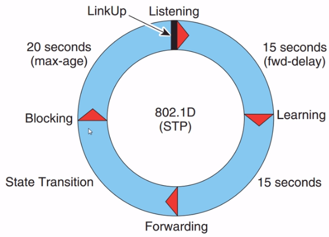

# Spanning Tree

## Contents

  * [Introduction](#introduction)
  * [Spanning Tree Protocol Characteristics](#spanning-tree-protocol-characteristics)
    + [STP](#stp)
    + [PVST+](#pvst)
    + [RSTP](#rstp)
    + [Rapid PVST+](#rapid-pvst)
    + [MSTP](#mstp)
  * [Comparing Spanning Tree Protocols](#comparing-spanning-tree-protocols)
  * [BPDU](#bpdu)
  * [PVST Demo](#pvst-demo)
    + [Switch S1](#switch-s1)
    + [Switch S2](#switch-s2)
    + [Root Port Decision](#root-port-decision)
  * [PVST plus Extended Bridge ID](#pvst-plus-extended-bridge-id)
  * [Fast Ports](#fast-ports)
  * [Rapid PVST+ Demo](#rapid-pvst-demo)

## Introduction

Spanning tree is a very important protocol in traditional networks, and once again, 
its primary purpose is to stop loops in a switched environment and not necessarily 
to stop them as quickly as we would like.

In the past, slower convergence was fine, but that's a major problem in today's 
environments where we run voiceover IP or other protocols that require very quick 
convergence. The original standard spanning tree, or 802.1D spanning tree, has been 
superseded by newer versions such as rapid spanning tree and multiple spanning tree.

## Spanning Tree Protocol Characteristics

Source [STP](https://www.ciscopress.com/articles/article.asp?p=2832407&seqNum=5)

### STP
	
- IEEE 802.1D is the original standard.
- STP creates one spanning-tree instance for the entire bridged network, regardless of the number of VLANs.
- However, because there is only one root bridge, traffic for all VLANs flows over the same path, which can lead to suboptimal traffic flows.
- This version is slow to converge.
- The CPU and memory requirements are lower than for all other STP protocols.

[↟](#contents)

### PVST+

- This is a Cisco enhancement of STP that provides a separate STP instance for each VLAN.
- Each instance supports PortFast, BPDU guard, BPDU filter, root guard, and loop guard.
- This design allows the spanning tree to be optimized for the traffic of each VLAN.
- However, CPU and memory requirements are high due to maintaining separate STP instances per VLAN.
- Convergence is per-VLAN and is slow, like 802.1D.

[↟](#contents)

### RSTP

- 802.1w is an evolution of 802.1D that addresses many convergence issues.
- Like STP, it provides only a single instance of STP and therefore does not address suboptimal traffic flow issues.
- The CPU and memory requirements are less than for Rapid PVST+ but more than for 802.1D.

[↟](#contents)

### Rapid PVST+

- This is a Cisco enhancement of RSTP.
- Rapid PVST+ uses PVST+ and provides a separate instance of 802.1w for each VLAN.
- Each instance supports PortFast, BPDU guard, BPDU filter, root guard, and loop guard.
- This version addresses the convergence issues and the suboptimal traffic flow issues.
- The CPU and memory requirements are the highest of all STP implementations.

[↟](#contents)

### MSTP

- IEEE 802.1s is based on the Cisco Multiple Instance Spanning-Tree Protocol (MISTP) which is often simply referred to as Multiple Spanning Tree (MST).
- The Cisco implementation is often referred to as Multiple Spanning Tree (MST).
- MSTP maps multiple VLANs into the same spanning-tree instance.
- It supports up to 16 instances of RSTP.
- Each instance supports PortFast, BPDU guard, BPDU filter, root guard, and loop guard.
- The CPU and memory requirements are less than for Rapid PVST+ but more than for RSTP.

[↟](#contents)

## Comparing Spanning Tree Protocols

Protocol | Standard | Resources Needed | Convergence | STP Tree Calculation
---------|----------|------------------|-------------|---------------------
STP | IEEE 802.1D | Low | Slow | All VLANs
PVST+ | Cisco | High | Slow | Per VLAN
RSTP | IEEE 802.1w | Medium | Fast | All VLANs
Rapid PVST+ | Cisco | High | Fast | Per VLAN
MSTP (MST) | IEEE 802.1s, Cisco | Medium or high | Fast | Per instance

[↟](#contents)
 
## BPDU

Bridge protocol data units or BPDUs are sent out of all ports on switches by default every two seconds when running spanning tree.
So switches will learn about each other when they receive BPDUs from other switches on their ports.

As an example, in this topology, switch one (S1) will know that there's a loop because it's receiving a BPDU from switch two (S2)
on port 2 as well as port 3. So BPDUs from a switch with the same bridge ID are received on multiple ports and thus S1 knows
that there's a loop between itself and S2.

In the same way, S2 knows that there's a loop because it receives BPDUs from S1 on both port 1 and port 3.

In other words, it's receiving BPDUs from the same switch on multiple ports, hence there must be a loop.

[↟](#contents)

## PVST Demo

Spanning Tree PVST (Per VLAN Spanning Tree)

Consider the following topology:
- Switch S1 and Switch S2
- Router R1 and Router R2. 

They have default configuration except changes on hostnames.
Packet tracer file [Topology 1](topology-1.pkt)

[↟](#contents)

### Switch S1

Show running-config at switch S1 that contain word `spanning`

    S1# sh running-config | in spannning
    spanning-tree mode pvst
    spanning-tree extend system-id

Execute command `sh ip interface brief`

    Interface              IP-Address      OK? Method Status                Protocol 
    GigabitEthernet0/1     unassigned      YES manual up                    up 
    GigabitEthernet1/1     unassigned      YES manual up                    up 
    GigabitEthernet2/1     unassigned      YES manual up                    up 
    GigabitEthernet3/1     unassigned      YES manual down                  down 
    Vlan1                  unassigned      YES manual administratively down down

All interfaces up except `GigabitEthernet3/1` and `vlan`

Show spanning-tree by command `sh spanning-tree`

    VLAN0001
      Spanning tree enabled protocol ieee
      Root ID    Priority    32769
                 Address     00D0.BC45.4822
                 This bridge is the root
                 Hello Time  2 sec  Max Age 20 sec  Forward Delay 15 sec

      Bridge ID  Priority    32769  (priority 32768 sys-id-ext 1)
                 Address     00D0.BC45.4822
                 Hello Time  2 sec  Max Age 20 sec  Forward Delay 15 sec
                 Aging Time  20

    Interface        Role Sts Cost      Prio.Nbr Type
    ---------------- ---- --- --------- -------- --------------------------------
    Gi0/1            Desg FWD 4         128.1    P2p
    Gi2/1            Desg FWD 19        128.3    P2p
    Gi1/1            Desg FWD 4         128.2    P2p

It shows
- The Root ID is 00D0.BC45.4822.
- The bridge ID is 00D0.BC45.4822.
- This switch S1 is the root of the spanning tree
- All ports on the root are forwarding (Desg is designated port)
- Prio is priority (the port priority is 128 by default).
- Nbr is port number, eg. Gi0/1 is port 1.

Show the spanning-tree on the forwarded port.

    S1#sh spanning-tree interface gigabitEthernet 0/1 detail 

    Port 1 (GigabitEthernet0/1) of VLAN0001 is designated forwarding
      Port path cost 4, Port priority 128, Port Identifier 128.1
      Designated root has priority 32769, address 00D0.BC45.4822
      Designated bridge has priority 32769, address 00D0.BC45.4822
      Designated port id is 128.1, designated path cost 4
      Timers: message age 16, forward delay 0, hold 0
      Number of transitions to forwarding state: 1
      Link type is point-to-point by default

[↟](#contents)

### Switch S2

Show running-config at switch S2 that contain word `spanning`

    S2# sh running-config | in spannning
    spanning-tree mode pvst
    spanning-tree extend system-id

Execute command `sh ip interface brief`

    Interface              IP-Address      OK? Method Status                Protocol 
    GigabitEthernet0/1     unassigned      YES manual up                    up 
    GigabitEthernet1/1     unassigned      YES manual up                    up 
    GigabitEthernet2/1     unassigned      YES manual up                    up 
    GigabitEthernet3/1     unassigned      YES manual down                  down 
    Vlan1                  unassigned      YES manual administratively down down

All interfaces up except `GigabitEthernet3/1` and `vlan`

Spaning tree on S2 by command `sh spanning-tree`

    VLAN0001
      Spanning tree enabled protocol ieee
      Root ID    Priority    32769
                 Address     00D0.BC45.4822
                 Cost        4
                 Port        1(GigabitEthernet0/1)
                 Hello Time  2 sec  Max Age 20 sec  Forward Delay 15 sec

      Bridge ID  Priority    32769  (priority 32768 sys-id-ext 1)
                 Address     00E0.B054.A478
                 Hello Time  2 sec  Max Age 20 sec  Forward Delay 15 sec
                 Aging Time  20

    Interface        Role Sts Cost      Prio.Nbr Type
    ---------------- ---- --- --------- -------- --------------------------------
    Gi0/1            Root FWD 4         128.1    P2p
    Gi1/1            Altn BLK 4         128.2    P2p
    Gi2/1            Desg FWD 19        128.3    P2p

It shows
- The Root ID is 00D0.BC45.4822.
- The Bridge ID is 00E0.B054.A478.
- Port 1 (GigabitEthernet 0/1) is the root port, and its forwarding, has a path cost of four.
- Port Gigabit 1/1 is blocking, or discarding (Altn is alternate port).
- Port Gigabit 2/1, which connect to router R2 two is forwarding and has a path cost of 19.

Show the spanning-tree on the blocked port.

    S2#sh spanning-tree interface gigabitEthernet 1/1 detail 

    Port 2 (GigabitEthernet1/1) of VLAN0001 is alternate blocking
      Port path cost 4, Port priority 128, Port Identifier 128.2
      Designated root has priority 32769, address 00D0.BC45.4822
      Designated bridge has priority 32769, address 00D0.BC45.4822
      Timers: message age 16, forward delay 0, hold 0
      Number of transitions to forwarding state: 1
      Link type is point-to-point by default

Switch S1 has become the root of the spanning tree because it has a lower bridge ID when compared to the switch S2.
So it's based on lowest bridge ID (the bridge ID itself consists of the priority and Mac address). Switch S1 has the 
same priority as switch S2, 32769 so that can't be used to determine the spanning tree root. So the tiebreaker is 
based on the Mac address. So lowest MAC address will win. Switch S1 has a lower Mac address when compared to switch S2.

Execute command

    sh interfaces gigabitEthernet 0/1 | in address is
    
to show the mac address of the interface.

Switch S1

      Hardware is Lance, address is 0001.43c5.6485 (bia 0001.43c5.6485)

Switch S2

      Hardware is Lance, address is 00d0.ffe7.5cdb (bia 00d0.ffe7.5cdb)

> 0001.43c5.6485 is lower than 00d0.ffe7.5cdb

[↟](#contents)

### Root Port Decision

[↟](#contents)

## PVST plus Extended Bridge ID

PVST creates an instance on a per-VLAN basis. So, to ensure that the bridge ID is unique on a per VLAN basis,
a different MAC address would have to be allocated.

It is fine if you only have a few VLANs, but if you configuring hundreds or thousands of VLANs, it's not scalable.
In theory, if 4,094 VLANs were supported on a switch, 4,094 unique Mac addresses would need to be assigned to every switch.

To conserve MAC addresses, the system was changed, and an extended system ID is also known as MAC address reduction.
With extended bridge IDs, the bridge ID is still 8 bytes in size, but the priority is now split into two parts.
The 2-byte priority portion consists of a 4-bit bridge priority and a 12-bit extended system ID.
The MAC address is still 6 bytes in size.

[↟](#contents)

## Fast Ports

  

  
<strong>802.1D Cycle</strong>

A standard port on a switch could take 30 seconds to converge, and that's not acceptable in modern-day networks.
As an example, if the PC was booting up  and needed to connect to a DHCP server, the PC would boot up and send out a DHCP request
before the switch porters converged. So the PC would've already booted up and requested an IP address before 30 seconds have expired,
and hence, the PC wouldn't receive an IP address from the DHCP server because the DHCP request from the PC would be dropped by this port,
which is blocking while it's converging.

So to improve performance in switched environments, edge ports, ports connected to edge devices such as PCs, some servers, and routers,
would be configured as port fast ports in a Cisco environment or as edge ports on other vendor equipment.

Fast Ports

- Configure only on access ports. Do not enable on link between switches (trunk ports) because that will introduce
  loops in the topology.
- By pass listening and learning states. Goes directyly from blocking to forwarding
- Quicker convergence rather than waiting for spanning tree to go through states: blocking, listening, learning, forwarding
- Spanning Tree still running on that ports but transition immediately to forwarding

[↟](#contents)

## Rapid PVST+ Demo

Change to rapid-pvst to all switches, S1 and S2

    conf t
    spanning-tree mode rapid-pvst 
    end

Show spanning tree 

Switch S1

    VLAN0001
      Spanning tree enabled protocol rstp
      Root ID    Priority    32769
                 Address     00D0.BC45.4822
                 This bridge is the root
                 Hello Time  2 sec  Max Age 20 sec  Forward Delay 15 sec

      Bridge ID  Priority    32769  (priority 32768 sys-id-ext 1)
                 Address     00D0.BC45.4822
                 Hello Time  2 sec  Max Age 20 sec  Forward Delay 15 sec
                 Aging Time  20

    Interface        Role Sts Cost      Prio.Nbr Type
    ---------------- ---- --- --------- -------- --------------------------------
    Gi0/1            Desg FWD 4         128.1    P2p
    Gi2/1            Desg FWD 19        128.3    P2p
    Gi1/1            Desg FWD 4         128.2    P2p

Switch S2

    VLAN0001
      Spanning tree enabled protocol rstp
      Root ID    Priority    32769
                 Address     00D0.BC45.4822
                 Cost        4
                 Port        1(GigabitEthernet0/1)
                 Hello Time  2 sec  Max Age 20 sec  Forward Delay 15 sec

      Bridge ID  Priority    32769  (priority 32768 sys-id-ext 1)
                 Address     00E0.B054.A478
                 Hello Time  2 sec  Max Age 20 sec  Forward Delay 15 sec
                 Aging Time  20

    Interface        Role Sts Cost      Prio.Nbr Type
    ---------------- ---- --- --------- -------- --------------------------------
    Gi0/1            Root FWD 4         128.1    P2p
    Gi1/1            Altn BLK 4         128.2    P2p
    Gi2/1            Desg FWD 19        128.3    P2p

Show running-config

    # sh running-config | in span
    spanning-tree mode rapid-pvst
    spanning-tree extend system-id

Write to memori. Reboot all switch. The spanning-tree is faster than before.

RPVST is backward compatible with 802.1d. RPVST is compatible with PVST.

[↟](#contents)

