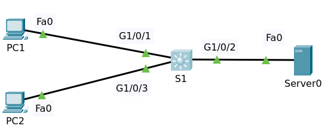

# Spanning Tree PortFast

## Contents

  * [Introduction](#introduction)
  * [Background](#background)
  * [Configure PortFast](#configure-portfast)

## Intoduction

PortFast causes a switch or trunk port to enter the spanning tree forwarding state immediately 
bypassing the listening and learning states.

You can configure spanning tree PortFast on switch or trunk ports that are connected to a 
single workstation, switch or server to allow those devices to connect to the network 
immediately instead of waiting for the port to transition from the listening to learning to 
the forwarding state.

>You can use PortFast to connect a single end station or a switch port to a switch port. 
If you enable PortFast on a port connected to another Layer 2 device, such as a switch, 
you might create network loops.

When the switch powers up, or when a device is connected to a port, the port enters the spanning 
tree listening state. When the Forward Delay timer expires, the port enters the learning state. 
When the Forward Delay timer expires a second time, the port is transitioned to the forwarding or 
blocking state.

When you enable PortFast on a switch or trunk port, the port is immediately transitioned to the 
spanning tree forwarding state.

[How Portfasts Works](https://www.cisco.com/en/US/docs/switches/lan/catalyst4000/7.5/configuration/guide/stp_enha_support_TSD_Island_of_Content_Chapter.html#wp1019862)

## Background

Consider the following topology:
- Switch Multilayer S1
- PC1 and PC2 all have been configured as dhcp-client
- Server0 as DHCP Server



They have default configuration except changes on hostnames. File packet tracer [Topology](topology.pkt)

When all devices reboot, the switch was transitioning from blocking to listening to learning to forwarding.
That makes the PCs is not going to get an IP address from the DHCP Server because these ports are currently 
blocked by spanning tree. Instead of the PCs get ip 169.254.x.x which is a IP version 4 link-local address.

>169.254.x.x is a private IP (Internet Protocol) address that the device automatically assigns itself when 
it can't get a valid IP from the DHCP (Dynamic Host Configuration Protocol) server. Essentially, getting 
any IP that begins with 169.254 tells you that something isn't working.

Later on thePC would get an IP address if it continues to send DHCP request messages.

But you can have problems with applications on your PC if it takes 30 seconds for a PC to receive an IP address.

So how do we fix this?

The answer is to use PortFast, so can you configure this network so that the PCs receive IP addresses 
from the DHCP Server immediately as soon as they boot up.

[↟](#contents)

## Configure PortFast

Execute command `sh spanning-tree` at S1, default is using protocol pvst or ieee.

    S1#sh spanning-tree 
    VLAN0001
      Spanning tree enabled protocol ieee
      Root ID    Priority    32769
                 Address     00D0.D3D0.A2A8
                 This bridge is the root
                 Hello Time  2 sec  Max Age 20 sec  Forward Delay 15 sec

      Bridge ID  Priority    32769  (priority 32768 sys-id-ext 1)
                 Address     00D0.D3D0.A2A8
                 Hello Time  2 sec  Max Age 20 sec  Forward Delay 15 sec
                 Aging Time  20

    Interface        Role Sts Cost      Prio.Nbr Type
    ---------------- ---- --- --------- -------- --------------------------------
    Gi1/0/1          Desg FWD 19        128.1    P2p
    Gi1/0/2          Desg FWD 19        128.2    P2p
    Gi1/0/3          Desg FWD 19        128.3    P2p

Show running-config

    S1#sh running-config | in span
    spanning-tree mode pvst
    
To make port Gi1/0/1, Gi1/0/2 and Gi1/0/3 directly to forwarding state then edit these ports to using portfast

    conf t
    interface range gi1/0/1 - 3
    spanning-tree portfast

>When you select portfast the switch show the warning message below

    %Warning: portfast should only be enabled on ports connected to a single
    host. Connecting hubs, concentrators, switches, bridges, etc... to this
    interface  when portfast is enabled, can cause temporary bridging loops.
    Use with CAUTION

    %Portfast has been configured on GigabitEthernet1/0/1 but will only
    have effect when the interface is in a non-trunking mode.
    %Warning: portfast should only be enabled on ports connected to a single
    host. Connecting hubs, concentrators, switches, bridges, etc... to this
    interface  when portfast is enabled, can cause temporary bridging loops.
    Use with CAUTION

    %Portfast has been configured on GigabitEthernet1/0/2 but will only
    have effect when the interface is in a non-trunking mode.
    %Warning: portfast should only be enabled on ports connected to a single
    host. Connecting hubs, concentrators, switches, bridges, etc... to this
    interface  when portfast is enabled, can cause temporary bridging loops.
    Use with CAUTION

    %Portfast has been configured on GigabitEthernet1/0/3 but will only
    have effect when the interface is in a non-trunking mode.

End the configuration by doing these commands below

    end
    write

Show running config at S1.

```
S1#sh running-config 
Building configuration...

Current configuration : 1458 bytes
!
version 16.3.2
no service timestamps log datetime msec
no service timestamps debug datetime msec
no service password-encryption
!
hostname S1
!
!
!
!
!
!
!
no ip cef
no ipv6 cef
!
spanning-tree mode pvst
!
interface GigabitEthernet1/0/1
 spanning-tree portfast
!
interface GigabitEthernet1/0/2
 spanning-tree portfast
!
interface GigabitEthernet1/0/3
 spanning-tree portfast
!
interface GigabitEthernet1/0/4
!
interface GigabitEthernet1/1/4
!
interface Vlan1
 no ip address
 shutdown
!
ip classless
!
ip flow-export version 9
!
logging trap debugging
logging 10.1.1.200
line con 0
!
line aux 0
!
line vty 0 4
 login
!
end
```

Do `Power Cycles All Devices` then switch will go directy to forwarding state, bypassing listening and learning state.

[↟](#contents)


