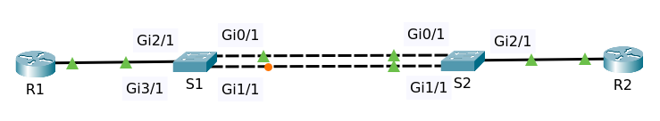
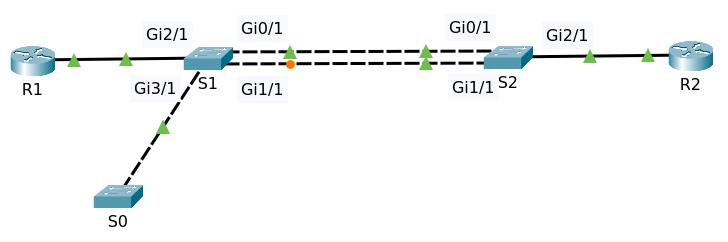

# BPDU Guard

## Contents

  * [Introduction](#introduction)
  * [Background](#background)
  * [Configure BPDU Guard](#configure-bpdu-guard)
    + [Configure BPDU Guard per interface](#configure-bpdu-guard-per-interface)
    + [Configure BPDU Guard Globally on PortFast](#configure-bpdu-guard-globally-on-portFast)
  
## Intoduction

BPDU Guard is one of multiple security mechanisms available in spanning tree to protect your spanning tree
network. This could be something as simple as a user connecting a cheap consumer switch to your network that doesn't
support spanning tree and hence causing a loop or something malicious such as an attacker plugging in
a switch and making that switch the root of the spanning tree so that the attacker can analyze your network traffic that traverses that
switch or it could be an attacker simply connecting a switch to your topology.

Lowering the priority and degrading the performance of your network considerably by forcing the network
traffic to go through a low performance switch. One of the options you have to stop this is BPDU Guard which 
will disable a port if any BPDU user received on that port. This is useful on ports that are going to be used as access ports 
and that should never be connected to another switch (portfast ports).

There are two ways to configure BPDU Guard.

* Configure a per-interface basis
* Configure globally on a switch on portfast

## Background

Consider the following topology:
- Two switches S1 and S2
- Router R1 connected to interface Gi2/1 at S1
- Router R2 connected to interface Gi2/1 at S2

They have default configuration except changes on hostnames. File packet tracer [Topology](topology-1.pkt)

The topology above has spanning tree mode rapid-pvst (rstp).

    S1#sh spanning-tree 
    VLAN0001
      Spanning tree enabled protocol rstp
      Root ID    Priority    32769
                 Address     0002.4AA2.0849
                 Cost        4
                 Port        4(GigabitEthernet3/1)
                 Hello Time  2 sec  Max Age 20 sec  Forward Delay 15 sec

      Bridge ID  Priority    32769  (priority 32768 sys-id-ext 1)
                 Address     00E0.B054.A478
                 Hello Time  2 sec  Max Age 20 sec  Forward Delay 15 sec
                 Aging Time  20

    Interface        Role Sts Cost      Prio.Nbr Type
    ---------------- ---- --- --------- -------- --------------------------------
    Gi0/1            Desg FWD 4         128.1    P2p
    Gi2/1            Desg FWD 19        128.3    P2p
    Gi1/1            Desg FWD 4         128.2    P2p
    Gi3/1            Root FWD 4         128.4    P2p

At first both portfast and bpduguard are disabled. 

    S1# sh spanning-tree summary 
    Switch is in rapid-pvst mode
    Root bridge for:
    Extended system ID           is enabled
    Portfast Default             is disabled
    PortFast BPDU Guard Default  is disabled
    ......

Show running config at S1

    S1#sh running-config 
    Building configuration...

    Current configuration : 489 bytes
    !
    version 12.1
    no service timestamps log datetime msec
    no service timestamps debug datetime msec
    no service password-encryption
    !
    hostname S1
    !
    !
    !
    !
    !
    !
    spanning-tree mode rapid-pvst
    spanning-tree extend system-id
    !
    interface GigabitEthernet0/1
    !
    interface GigabitEthernet1/1
    !
    interface GigabitEthernet2/1
    !
    interface GigabitEthernet3/1
    !
    interface Vlan1
     no ip address
     shutdown
    !
    !
    !
    !
    line con 0
    !
    line vty 0 4
     login
    line vty 5 15
     login
    !
    !
    !
    !
    end

[↟](#contents)

## Configure BPDU Guard

Now, there's someone put a unknown switch S0 and connect it to interface Gi3/1 at switch S1.

File packet tracer [Topology](topology-2.pkt)

You want to protect the interface Gi3/1 with BPDU Guard from the unknown switches. There are two ways to configure it.

* Configure BPDU Guard per interface
* Configure BPDU Guard globally on portfast

[↟](#contents)

### Configure BPDU Guard per Interface

At switch S1 configure BPDU Guard.

    conf t
    interface gigabitEthernet 3/1
    spanning-tree bpduguard enable
    end

When you enable some logs will shown on console

    %SPANTREE-2-BLOCK_BPDUGUARD: Received BPDU on port GigabitEthernet3/1 with BPDU Guard enabled. Disabling port.
    %PM-4-ERR_DISABLE: bpduguard error detected on 3/1, putting 3/1 in err-disable state
    %LINK-5-CHANGED: Interface GigabitEthernet3/1, changed state to administratively down
    %LINEPROTO-5-UPDOWN: Line protocol on Interface GigabitEthernet3/1, changed state to down

The port GigabitEthernet3/1 which is connected to switch S0 in err-disable state and automatically down.

    S1#sh ip interface brief  | in GigabitEthernet3/1
    GigabitEthernet3/1     unassigned      YES manual down                  down

Show spanning-tree at S1, the port Gi3/1 is now excluded.

    ......
    Interface        Role Sts Cost      Prio.Nbr Type
    ---------------- ---- --- --------- -------- --------------------------------
    Gi0/1            Root FWD 4         128.1    P2p
    Gi2/1            Desg FWD 19        128.3    P2p
    Gi1/1            Altn BLK 4         128.2    P2p
    
>If you enable BPDU Guard on an interface the port doesn't even need to be configured as a portfast port. When a BPDUs received on the port
it immediately error disables.

Show running config at S1, it looks like the interface Gi3/1 has bpduguard enable.

    !
    interface GigabitEthernet3/1
     spanning-tree bpduguard enable
    !

If you want to make the port Gi3/1 up again then disable bpduguard.

    conf t
    interface gigabitEthernet 3/1
    no spanning-tree bpduguard enable
    shutdown
    no shutdown
    end

[↟](#contents)

### Configure BPDU Guard Globally on PortFast

We make the interface Gi2/1 and Gi3/1 at S1 as portfast. 

    conf t
    interface gigabitEthernet 2/1
    spanning-tree portfast
    exit    
    interface gigabitEthernet 3/1
    spanning-tree portfast
    end

Show spanning-tree portfast at the ports Gi2/1 and Gi3/1

    S1#sh spanning-tree interface gigabitEthernet 2/1 portfast 
    VLAN0001         enabled

    S1#sh spanning-tree interface gigabitEthernet 3/1 portfast 
    VLAN0001         enabled

Now we configure bpduguard globally on portfast.

    conf t
    spanning-tree portfast bpduguard default
    end

When you set bpduguard on portfast some logs will shown on console.

    %SPANTREE-2-BLOCK_BPDUGUARD: Received BPDU on port GigabitEthernet3/1 with BPDU Guard enabled. Disabling port.
    %PM-4-ERR_DISABLE: bpduguard error detected on 3/1, putting 3/1 in err-disable state
    %LINK-5-CHANGED: Interface GigabitEthernet3/1, changed state to administratively down
    %LINEPROTO-5-UPDOWN: Line protocol on Interface GigabitEthernet3/1, changed state to down

The port GigabitEthernet3/1 which is connected to switch S0 in err-disable state and automatically down.

    S1#sh ip interface brief  | in GigabitEthernet3/1
    GigabitEthernet3/1     unassigned      YES manual down                  down

Show running config at S1

    !
    spanning-tree mode rapid-pvst
    spanning-tree portfast bpduguard default
    spanning-tree extend system-id
    !
    ...
    !
    interface GigabitEthernet2/1
     spanning-tree portfast
    !
    !
    interface GigabitEthernet3/1
     spanning-tree portfast
    !

Show spanning-tree portfast at the ports Gi2/1 and Gi3/1

    S1#sh spanning-tree interface gigabitEthernet 2/1 portfast 
    VLAN0001         enabled

    S1#sh spanning-tree interface gigabitEthernet 3/1 portfast 
    no spanning tree info available for GigabitEthernet3/1

The portfast should not used to connect to the switches. BPDU Guard is enabled to protect the portfast. If  
there are incoming BPDUs on the portfast that port will automatically shutdown

[↟](#contents)

