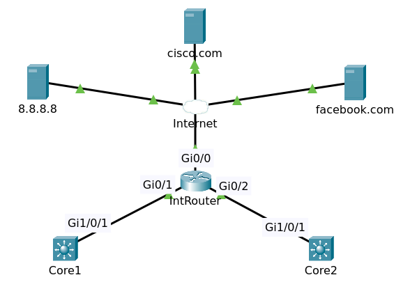

# Cisco Discovery Protocol

## Introduction

### CDP

CDP is a Cisco proprietary protocol that is used for collecting directly connected neighbor device information like hardware, software, device name details and many more.

CDP versions

- CDPV1: The initial version which is capable only to collect device information connected to next end.
- CDPV2: Is the most recent release of the protocol and provides more intelligent device tracking features like instances of mismatch native VLAN IDs on 802.1Q trunks, and mismatch in duplex states between connecting devices.

>CDP runs at layer 2 in the OSI Model.

[Cisco Discovery Protocol (CDP)](https://learningnetwork.cisco.com/s/article/cisco-discovery-protocol-cdp-x)

**How CDP Works**

All Cisco devices transmit CDP packets periodically. These packets advertise a time-to-live (TTL) value in seconds, which indicates the number of seconds that the packet must be retained before it can be discarded.

All Cisco devices receive CDP packets, process them and cache the information in the packet. Cisco devices never forward a CDP packet. If any information changes from the last received packet, the new information is cached and the older information is discarded even if its time-to-live value has not yet expired.

### LLDP

Link Layer Discovery Protocol (LLDP) is a vendor independent link layer protocol used by network devices for advertising their identity, capabilities to neighbors on a LAN segment. LACP specified in IEEE 802.1AB. One-way protocol with periodic retransmissions out each port (30 sec default).

[Link Layer Discovery Protocol (LLDP)](https://learningnetwork.cisco.com/s/article/link-layer-discovery-protocol-lldp-x)

>LLDP is a standard protocol while CDP is a Cisco proprietary protocol. Cisco devices support the IEEE 802.1ab version of LLDP. This allows non-Cisco devices to advertise information about themselves to our network devices. LLDP also runs at layer 2 in the OSI Model.

## Demo

### CDP

The topology used in this demo

Packet tracer file [Topology](topology.pkt)

**Switch Multilayer Core1**

Enter command `sh cdp` to show cdp information.

    Global CDP information:
        Sending CDP packets every 60 seconds
        Sending a holdtime value of 180 seconds
        Sending CDPv2 advertisements is enabled

If you get this output you must enable cdp at configuration mode.

    % CDP is not enabled

Enable cdp

    conf t
    cdp run
    end

**Router IntRouter**

Enter command `sh cdp neighbors` at IntRouter to show cdp information of the neighbors.

    Capability Codes: R - Router, T - Trans Bridge, B - Source Route Bridge
                      S - Switch, H - Host, I - IGMP, r - Repeater, P - Phone
    Device ID    Local Intrfce   Holdtme    Capability   Platform    Port ID
    Core2        Gig 0/2          150                    3650        Gig 1/0/1
    Core1        Gig 0/1          169                    3650        Gig 1/0/1

Enter command `sh cdp entry DEVICEID` to show detailed cdp information of specific neighbor.

IntRouter#sh cdp entry Core1

    Device ID: Core1
    Entry address(es): 
    Platform: cisco 3650, Capabilities: 
    Interface: GigabitEthernet0/1, Port ID (outgoing port): GigabitEthernet1/0/1
    Holdtime: 167

    Version :
    Cisco IOS Software [Denali], Catalyst L3 Switch Software (CAT3K_CAA-UNIVERSALK9-M), Version 16.3.2, RELEASE SOFTWARE (fc4)
    Technical Support : http://www.cisco.com/techsupport
    Copyright(c) 1986 - 2016 by Cisco Systems, Inc.
    Compiled Tue 08 - Nov - 16 17:31 by pt_team

    Cisco IOS-XE software, Copyright(c) 2005 - 2016 by cisco Systems, Inc.
    All rights reserved.Certain components of Cisco IOS - XE software are
    licensed under the GNU General Public License("GPL") Version 2.0.The
    software code licensed under GPL Version 2.0 is free software that comes
    with ABSOLUTELY NO WARRANTY.You can redistribute and / or modify such
    GPL code under the terms of GPL Version 2.0.For more details, see the
    documentation or "License Notice" file accompanying the IOS - XE software,
    or the applicable URL provided on the flyer accompanying the IOS - XE
    software.

    advertisement version: 2
    Duplex: full
    ---------------------------

>You can enter command `sh cdp neighbors detail` show cdp neighbors in detail.

### LLDP

**Switch Multilayer Core1**

Enter command `sh lldp` to show lldp information.

    Global LLDP Information:
        Status: ACTIVE
        LLDP advertisements are sent every 30 seconds
        LLDP hold time advertised is 120 seconds
        LLDP interface reinitialisation delay is 2 seconds

If you get this output you must enable cdp at configuration mode.

    % LLDP is not enabled

Enable lldp

    conf t
    lldp run
    end

**Router IntRouter**

By default lldp is not enabled. So you should enable lldp.

    conf t
    lldp run
    end

Enter command `sh lldp neighbors` at IntRouter to show lldp information of the neighbors.

    Capability codes:
        (R) Router, (B) Bridge, (T) Telephone, (C) DOCSIS Cable Device
        (W) WLAN Access Point, (P) Repeater, (S) Station, (O) Other
    Device ID           Local Intf     Hold-time  Capability      Port ID
    Core1               Gig0/1         120        R               Gig1/0/1

    Total entries displayed: 1

Enable lldp on switch Core2. After about 30 seconds enter command `sh lldp neighbors`

    Capability codes:
        (R) Router, (B) Bridge, (T) Telephone, (C) DOCSIS Cable Device
        (W) WLAN Access Point, (P) Repeater, (S) Station, (O) Other
    Device ID           Local Intf     Hold-time  Capability      Port ID
    Core1               Gig0/1         120        R               Gig1/0/1
    Core2               Gig0/2         120        R               Gig1/0/1

    Total entries displayed: 2

>You can enter command `sh lldp neighbors detail` show lldp neighbors in detail.

