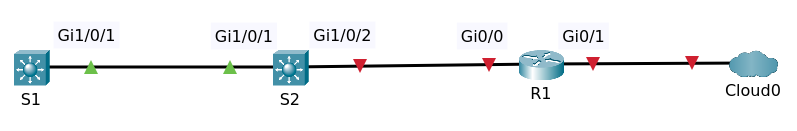
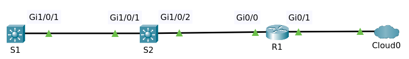

# Configure Layer 3 Switching and Routing

## Contents

  * [Background](#background)
  * [Objectives](#objectives)
  * [Configurations](#configurations)
    + [Configure SVI](#configure-svi)
    + [Configure Routed Port](#configure-routed-port)
    + [Configure IP Address at Router Interfaces](#Configure-ip-address-at-router-interfaces)
    + [EIGRP](#eigrp)
      - [Configuration at Router](#configuration-at-router)
      - [Configuration at Switch](#configuration-at-switch)
  * [Final](#final)

## Background

Consider the following topology:

- Two Multilayer Switches S1 and S2
- Router R1 connected to interface Gi1/0/2 at S2

They have default configuration except changes on hostnames. File packet tracer [Topology](topology-1.pkt)

## Objectives

For switches
- Configure IP Address on SVI (Switch Virtual Interface)
- Configure IP Address on routed interface
- Configure EIGRP

For router
- Power the interface up
- Configure IP Address

For all devices
- Tes ping between devices

## Configurations

### Configure SVI

We will configure SVI or Switch Virtual Interface at switch S1 and S2.

Setup ip address on VLAN 1 at switch S1.

    conf t
    int vlan 1
    ip address 10.1.1.1 255.255.255.0
    no shutdown
    end
    write

Enter command `sh ip interface brief` at switch S1

    Interface              IP-Address      OK? Method Status                Protocol 
    GigabitEthernet1/0/1   unassigned      YES unset  up                    up 
    ......
    GigabitEthernet1/0/24  unassigned      YES unset  down                  down 
    GigabitEthernet1/1/1   unassigned      YES unset  down                  down 
    GigabitEthernet1/1/2   unassigned      YES unset  down                  down 
    GigabitEthernet1/1/3   unassigned      YES unset  down                  down 
    GigabitEthernet1/1/4   unassigned      YES unset  down                  down 
    Vlan1                  10.1.1.1        YES manual up                    up

>>Some lines not shown here replaced with `......`

Setup ip address on VLAN 1 at switch S2.

    conf t
    int vlan 1
    ip address 10.1.1.2 255.255.255.0
    no shutdown
    end
    write

Enter command `sh ip interface brief` at switch S2

    Interface              IP-Address      OK? Method Status                Protocol 
    GigabitEthernet1/0/1   unassigned      YES unset  up                    up 
    ......
    GigabitEthernet1/0/24  unassigned      YES unset  down                  down 
    GigabitEthernet1/1/1   unassigned      YES unset  down                  down 
    GigabitEthernet1/1/2   unassigned      YES unset  down                  down 
    GigabitEthernet1/1/3   unassigned      YES unset  down                  down 
    GigabitEthernet1/1/4   unassigned      YES unset  down                  down 
    Vlan1                  10.1.1.2        YES manual up                    up

Tes ping between devices, at switch S1 ping to S2 (10.1.1.2)

    S1#ping 10.1.1.2

    Type escape sequence to abort.
    Sending 5, 100-byte ICMP Echos to 10.1.1.2, timeout is 2 seconds:
    .!!!!
    Success rate is 80 percent (4/5), round-trip min/avg/max = 0/0/0 ms

[↟](#contents)

### Configure Routed Port

Port Gi1/0/2 switch S2 connected to port Gi0/0 router R1. At switch S2 We will configure routed port at that interface and setup ip address.

    conf t
    interface gi1/0/2
    no switchport
    ip address 10.1.3.1 255.255.255.0
    end

Enter command `sh ip interface brief` at switch S2.

    S2#sh ip interface brief 
    Interface              IP-Address      OK? Method Status                Protocol 
    GigabitEthernet1/0/1   unassigned      YES unset  up                    up 
    GigabitEthernet1/0/2   10.1.3.1        YES manual down                  down 
    ......
    GigabitEthernet1/0/24  unassigned      YES unset  down                  down 
    GigabitEthernet1/1/1   unassigned      YES unset  down                  down 
    GigabitEthernet1/1/2   unassigned      YES unset  down                  down 
    GigabitEthernet1/1/3   unassigned      YES unset  down                  down 
    GigabitEthernet1/1/4   unassigned      YES unset  down                  down 
    Vlan1                  10.1.1.2        YES manual up                    up

Interface Gi1/0/2 is down. That's because the router interfaces are shut down by default.

Enter command `sh vlan brief` at S2

    VLAN Name                             Status    Ports
    ---- -------------------------------- --------- -------------------------------
    1    default                          active    Gig1/0/1, Gig1/0/3, Gig1/0/4, Gig1/0/5
                                                    Gig1/0/6, Gig1/0/7, Gig1/0/8, Gig1/0/9
                                                    Gig1/0/10, Gig1/0/11, Gig1/0/12, Gig1/0/13
                                                    Gig1/0/14, Gig1/0/15, Gig1/0/16, Gig1/0/17
                                                    Gig1/0/18, Gig1/0/19, Gig1/0/20, Gig1/0/21
                                                    Gig1/0/22, Gig1/0/23, Gig1/0/24, Gig1/1/1
                                                    Gig1/1/2, Gig1/1/3, Gig1/1/4
    1002 fddi-default                     active    
    1003 token-ring-default               active    
    1004 fddinet-default                  active    
    1005 trnet-default                    active    

It shows the port Gi1/0/2 is excluded from VLAN 1 because it's not switchport.

[↟](#contents)

### Configure IP Address at Router Interfaces

At router R1, power on the interface Gi0/0 and setup ip address.

    conf t
    interface gi0/0
    ip address 10.1.3.2 255.255.255.0
    no shutdown 
    end

Also setup ip address at port Gi0/1

    conf t
    interface gi0/1
    ip address 10.1.4.1 255.255.255.0
    no shutdown 
    end

Enter command `sh ip interface brief` at router R1.

    Interface              IP-Address      OK? Method Status                Protocol 
    GigabitEthernet0/0     10.1.3.2        YES manual up                    up 
    GigabitEthernet0/1     10.1.4.1        YES manual up                    up 
    Vlan1                  unassigned      YES unset  administratively down down

Test ping to 10.1.3.1 (switch S2)

    Type escape sequence to abort.
    Sending 5, 100-byte ICMP Echos to 10.1.3.1, timeout is 2 seconds:
    .!!!!
    Success rate is 80 percent (4/5), round-trip min/avg/max = 0/0/0 ms

[↟](#contents)

### EIGRP

Now back to switch S2, can S2 ping to ip router 10.1.4.1 ?

    S2#ping 10.1.4.1

    Type escape sequence to abort.
    Sending 5, 100-byte ICMP Echos to 10.1.4.1, timeout is 2 seconds:
    .....
    Success rate is 0 percent (0/5)

It can't ! So, how to solve that problem? Then we need configure EIGRP.

>Enhanced Interior Gateway Routing Protocol (EIGRP) is a network protocol that enables routers to exchange information more efficiently than earlier network protocols, such as Interior Gateway Routing Protocol (IGRP) or Border Gateway Protocol (BGP).

[↟](#contents)

#### Configuration at Router

Show routing table at router R1

    R1#sh ip route
    Codes: L - local, C - connected, S - static, R - RIP, M - mobile, B - BGP
           D - EIGRP, EX - EIGRP external, O - OSPF, IA - OSPF inter area
           N1 - OSPF NSSA external type 1, N2 - OSPF NSSA external type 2
           E1 - OSPF external type 1, E2 - OSPF external type 2, E - EGP
           i - IS-IS, L1 - IS-IS level-1, L2 - IS-IS level-2, ia - IS-IS inter area
           * - candidate default, U - per-user static route, o - ODR
           P - periodic downloaded static route

    Gateway of last resort is not set

         10.0.0.0/8 is variably subnetted, 4 subnets, 2 masks
    C       10.1.3.0/24 is directly connected, GigabitEthernet0/0
    L       10.1.3.2/32 is directly connected, GigabitEthernet0/0
    C       10.1.4.0/24 is directly connected, GigabitEthernet0/1
    L       10.1.4.1/32 is directly connected, GigabitEthernet0/1

Before configure eigrp at R1 the table is empty

    R1#sh ip eigrp interfaces
    R1#

Configure eigrp at all interfaces

    conf t
    router eigrp 1
    network 0.0.0.0
    end

After configuring eigrp

    R1#sh ip eigrp interfaces 
    IP-EIGRP interfaces for process 1

                            Xmit Queue   Mean   Pacing Time   Multicast    Pending
    Interface        Peers  Un/Reliable  SRTT   Un/Reliable   Flow Timer   Routes
    Gig0/0             0        0/0      1236       0/10           0           0
    Gig0/1             0        0/0      1236       0/10           0           0

[↟](#contents)

#### Configuration at Switch

Do the same at switch S2

    S2# conf t
    S2(config)#
    S2(config)# router eigrp 1
    IP routing not enabled
    S2(config)# network 0.0.0.0
                    ^
    % Invalid input detected at '^' marker.

Configuration is failed. We must configur ip routing first.

Show table routing at S2

    S2#sh ip route
    Default gateway is not set

    Host               Gateway           Last Use    Total Uses  Interface
    ICMP redirect cache is empty

Configur ip routing

    conf t
    ip routing
    end

Now, show table routing again at S2

    Codes: C - connected, S - static, I - IGRP, R - RIP, M - mobile, B - BGP
           D - EIGRP, EX - EIGRP external, O - OSPF, IA - OSPF inter area
           N1 - OSPF NSSA external type 1, N2 - OSPF NSSA external type 2
           E1 - OSPF external type 1, E2 - OSPF external type 2, E - EGP
           i - IS-IS, L1 - IS-IS level-1, L2 - IS-IS level-2, ia - IS-IS inter area
           * - candidate default, U - per-user static route, o - ODR
           P - periodic downloaded static route

    Gateway of last resort is not set

         10.0.0.0/24 is subnetted, 2 subnets
    C       10.1.1.0 is directly connected, Vlan1
    C       10.1.3.0 is directly connected, GigabitEthernet1/0/2

Configure again eigrp at all interfaces

    conf t
    router eigrp 1
    network 0.0.0.0
    end
    
Enter command `sh ip eigrp interfaces`

    S2#sh ip eigrp interfaces 
    IP-EIGRP interfaces for process 1

                            Xmit Queue   Mean   Pacing Time   Multicast    Pending
    Interface        Peers  Un/Reliable  SRTT   Un/Reliable   Flow Timer   Routes
    Vlan               0        0/0      1236       0/10           0           0
    Gig1/0/2           1        0/0      1236       0/10           0           0

Enter command `sh ip eigrp neighbors`

    IP-EIGRP neighbors for process 1
    H   Address         Interface      Hold Uptime    SRTT   RTO   Q   Seq
                                       (sec)          (ms)        Cnt  Num
    0   10.1.3.2        Gig1/0/2       13   00:04:57  40     1000  0   3

Test ping to 10.1.4.1 (R1)

    S2#ping 10.1.4.1

    Type escape sequence to abort.
    Sending 5, 100-byte ICMP Echos to 10.1.4.1, timeout is 2 seconds:
    !!!!!
    Success rate is 100 percent (5/5), round-trip min/avg/max = 0/0/0 ms

Enter command `sh ip route` to show routing table at S2

    Codes: C - connected, S - static, I - IGRP, R - RIP, M - mobile, B - BGP
           D - EIGRP, EX - EIGRP external, O - OSPF, IA - OSPF inter area
           N1 - OSPF NSSA external type 1, N2 - OSPF NSSA external type 2
           E1 - OSPF external type 1, E2 - OSPF external type 2, E - EGP
           i - IS-IS, L1 - IS-IS level-1, L2 - IS-IS level-2, ia - IS-IS inter area
           * - candidate default, U - per-user static route, o - ODR
           P - periodic downloaded static route

    Gateway of last resort is not set

         10.0.0.0/24 is subnetted, 3 subnets
    C       10.1.1.0 is directly connected, Vlan1
    C       10.1.3.0 is directly connected, GigabitEthernet1/0/2
    D       10.1.4.0 [90/28416] via 10.1.3.2, 00:02:45, GigabitEthernet1/0/2

See the differences after configuring eigrp?

How about configuring eigrp at switch S1? We don't configure routed port at S1. Just enable ip routing and configure ip routing.

At switch S1

    conf t
    ip routing
    router eigrp 1
    network 0.0.0.0
    end

Enter command `sh ip eigrp interfaces`

    S1#sh ip eigrp interfaces
    IP-EIGRP interfaces for process 1

                            Xmit Queue   Mean   Pacing Time   Multicast    Pending
    Interface        Peers  Un/Reliable  SRTT   Un/Reliable   Flow Timer   Routes
    Vlan               1        0/0      1236       0/10           0           0

Enter command `sh ip eigrp neighbors`

    S1#sh ip eigrp neighbors
    IP-EIGRP neighbors for process 1
    H   Address         Interface      Hold Uptime    SRTT   RTO   Q   Seq
                                       (sec)          (ms)        Cnt  Num
    0   10.1.1.2        Vlan           14   00:03:31  40     1000  0   4

Test ping to ip 10.1.4.1 (R1)

    S1#ping 10.1.4.1

    Type escape sequence to abort.
    Sending 5, 100-byte ICMP Echos to 10.1.4.1, timeout is 2 seconds:
    !!!!!
    Success rate is 100 percent (5/5), round-trip min/avg/max = 0/0/0 ms

[↟](#contents)

## Final

File packet tracer [Topology Final](topology-2.pkt).

