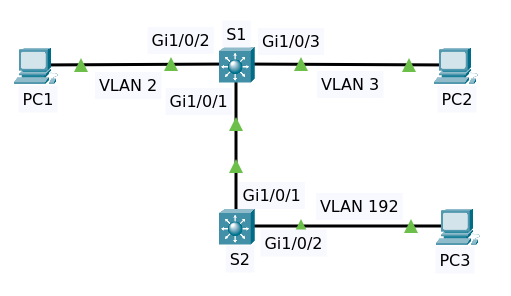

# Configure Layer 3 Switching and Inter VLAN Routing

## Contents

  * [Background](#background)
  * [Objectives](#objectives)
  * [Configurations](#configurations)
    + [Switch 1](#switch-1)
      - [Enable InterVLAN routing](#enable-intervlan-routing-1)
      - [Routed Port](#routed-port-1)
    + [PC 1 and PC 2](#pc-1-and-pc-2)
    + [Switch 2](#switch-2)
      - [Enable InterVLAN routing](#enable-intervlan-routing-2)
      - [Routed Port](#routed-port-2)
    + [PC 3](#pc-3)
    + [EIGRP](#eigrp)
  * [Final](#final)

## Background

Consider the following topology:

- Two Multilayer Switches S1 and S2
- Three PCs

They have default configuration except changes on hostnames. File packet tracer [Topology](topology-1.pkt)

## Objectives

For all switches

- Configure VLAN 2, VLAN 3 and VLAN 192
- Configure IP Address on SVI (Switch Virtual Interface)
- Configure IP Address on routed interface
- Configure IP Address on PC
  - PC 1 (VLAN 2)
    - IP 10.1.2.1/24
    - Gateway 10.1.2.254
  - PC 2 (VLAN 3)
    - IP 10.1.3.1/24
    - Gateway 10.1.3.254
  - PC 3 (VLAN 192)
    - IP 192.168.0.1/24
    - Gateway 192.168.0.254

For all devices
- Tes ping between devices

## Configuration

Always setup this first for all switches.

    conf t
    no ip domain-lookup
    end
    write

We configure `no switchport` at port Gig1/0/1 switch S1 and switch S2 to make them as routed ports then add ip address.

[↟](#contents)

### Switch S1

Enter command `sh spanning-tree`.

    VLAN0001
      Spanning tree enabled protocol ieee
      Root ID    Priority    32769
                 Address     00E0.A347.8D5A
                 This bridge is the root
                 Hello Time  2 sec  Max Age 20 sec  Forward Delay 15 sec

      Bridge ID  Priority    32769  (priority 32768 sys-id-ext 1)
                 Address     00E0.A347.8D5A
                 Hello Time  2 sec  Max Age 20 sec  Forward Delay 15 sec
                 Aging Time  20

    Interface        Role Sts Cost      Prio.Nbr Type
    ---------------- ---- --- --------- -------- --------------------------------
    Gi1/0/1          Desg FWD 4         128.1    P2p
    Gi1/0/2          Desg FWD 19        128.2    P2p
    Gi1/0/3          Desg FWD 19        128.3    P2p

Enter command `sh interface gi1/0/1 switchport`

    Name: Gig1/0/1
    Switchport: Enabled
    Administrative Mode: dynamic auto
    Operational Mode: static access
    Administrative Trunking Encapsulation: dot1q
    Operational Trunking Encapsulation: native
    Negotiation of Trunking: On
    Access Mode VLAN: 1 (default)
    Trunking Native Mode VLAN: 1 (default)
    Voice VLAN: none
    ......

Enter command `sh interface gi1/0/2 switchport`

    Name: Gig1/0/2
    Switchport: Enabled
    Administrative Mode: dynamic auto
    Operational Mode: static access
    Administrative Trunking Encapsulation: dot1q
    Operational Trunking Encapsulation: native
    Negotiation of Trunking: On
    Access Mode VLAN: 1 (default)
    Trunking Native Mode VLAN: 1 (default)
    Voice VLAN: none
    ......
    
Enter command `sh interface gi1/0/3 switchport`

    Name: Gig1/0/3
    Switchport: Enabled
    Administrative Mode: dynamic auto
    Operational Mode: static access
    Administrative Trunking Encapsulation: dot1q
    Operational Trunking Encapsulation: native
    Negotiation of Trunking: On
    Access Mode VLAN: 1 (default)
    Trunking Native Mode VLAN: 1 (default)
    Voice VLAN: none
    ......

Setup vlan 2 and vlan 3

    conf t
    vlan 2
    vlan 3
    end
    write

Enter command `sh vlan brief`

    VLAN Name                             Status    Ports
    ---- -------------------------------- --------- -------------------------------
    1    default                          active    Gig1/0/1, Gig1/0/2, Gig1/0/3, Gig1/0/4
                                                    Gig1/0/5, Gig1/0/6, Gig1/0/7, Gig1/0/8
                                                    Gig1/0/9, Gig1/0/10, Gig1/0/11, Gig1/0/12
                                                    Gig1/0/13, Gig1/0/14, Gig1/0/15, Gig1/0/16
                                                    Gig1/0/17, Gig1/0/18, Gig1/0/19, Gig1/0/20
                                                    Gig1/0/21, Gig1/0/22, Gig1/0/23, Gig1/0/24
                                                    Gig1/1/1, Gig1/1/2, Gig1/1/3, Gig1/1/4
    2    VLAN0002                         active    
    3    VLAN0003                         active    

Configure vlan2 and vlan3 on intergace Gi1/0/2 and Gig1/0/3

    conf t
    interface Gi1/0/2
    switchport access vlan 2
    interface Gi1/0/3
    switchport access vlan 3
    end

Enter command `sh interface gi1/0/2 switchport`

    Name: Gig1/0/2
    Switchport: Enabled
    Administrative Mode: dynamic auto
    Operational Mode: static access
    Administrative Trunking Encapsulation: dot1q
    Operational Trunking Encapsulation: native
    Negotiation of Trunking: On
    Access Mode VLAN: 2 (VLAN0002)
    Trunking Native Mode VLAN: 1 (default)
    Voice VLAN: none
    ......
    
Enter command `sh interface gi1/0/3 switchport`

    Name: Gig1/0/3
    Switchport: Enabled
    Administrative Mode: dynamic auto
    Operational Mode: static access
    Administrative Trunking Encapsulation: dot1q
    Operational Trunking Encapsulation: native
    Negotiation of Trunking: On
    Access Mode VLAN: 3 (VLAN0003)
    Trunking Native Mode VLAN: 1 (default)
    Voice VLAN: none
    ......

Setup ip on interface vlan

    conf t
    interface vlan 2
    ip address 10.1.2.254 255.255.255.0
    exit
    interface vlan 3
    ip address 10.1.3.254 255.255.255.0
    end
    write

Enter command `sh ip interface brief`

    Interface              IP-Address      OK? Method Status                Protocol 
    GigabitEthernet1/0/1   unassigned      YES unset  up                    up 
    GigabitEthernet1/0/2   unassigned      YES unset  up                    up 
    GigabitEthernet1/0/3   unassigned      YES unset  up                    up 
    GigabitEthernet1/0/4   unassigned      YES unset  down                  down 
    ......
    GigabitEthernet1/1/4   unassigned      YES unset  down                  down 
    Vlan1                  unassigned      YES unset  administratively down down 
    Vlan2                  10.1.2.254      YES manual up                    up 
    Vlan3                  10.1.3.254      YES manual up                    up    
    
Enter command `sh vlan brief`
  
    VLAN Name                             Status    Ports
    ---- -------------------------------- --------- -------------------------------
    1    default                          active    Gig1/0/1, Gig1/0/4, Gig1/0/5, Gig1/0/6
                                                    Gig1/0/7, Gig1/0/8, Gig1/0/9, Gig1/0/10
                                                    Gig1/0/11, Gig1/0/12, Gig1/0/13, Gig1/0/14
                                                    Gig1/0/15, Gig1/0/16, Gig1/0/17, Gig1/0/18
                                                    Gig1/0/19, Gig1/0/20, Gig1/0/21, Gig1/0/22
                                                    Gig1/0/23, Gig1/0/24, Gig1/1/1, Gig1/1/2
                                                    Gig1/1/3, Gig1/1/4
    2    VLAN0002                         active    Gig1/0/2
    3    VLAN0003                         active    Gig1/0/3
    ......

Enter command `sh spanning-tree`

    VLAN0002
      Spanning tree enabled protocol ieee
      Root ID    Priority    32770
                 Address     00E0.A347.8D5A
                 This bridge is the root
                 Hello Time  2 sec  Max Age 20 sec  Forward Delay 15 sec

      Bridge ID  Priority    32770  (priority 32768 sys-id-ext 2)
                 Address     00E0.A347.8D5A
                 Hello Time  2 sec  Max Age 20 sec  Forward Delay 15 sec
                 Aging Time  20

    Interface        Role Sts Cost      Prio.Nbr Type
    ---------------- ---- --- --------- -------- --------------------------------
    Gi1/0/2          Desg FWD 19        128.2    P2p

    VLAN0003
      Spanning tree enabled protocol ieee
      Root ID    Priority    32771
                 Address     00E0.A347.8D5A
                 This bridge is the root
                 Hello Time  2 sec  Max Age 20 sec  Forward Delay 15 sec

      Bridge ID  Priority    32771  (priority 32768 sys-id-ext 3)
                 Address     00E0.A347.8D5A
                 Hello Time  2 sec  Max Age 20 sec  Forward Delay 15 sec
                 Aging Time  20

    Interface        Role Sts Cost      Prio.Nbr Type
    ---------------- ---- --- --------- -------- --------------------------------
    Gi1/0/3          Desg FWD 19        128.3    P2p

[↟](#contents)

#### Enable InterVLAN routing 1

Show ip routing

    S1#sh ip route 
    Default gateway is not set

    Host               Gateway           Last Use    Total Uses  Interface
    ICMP redirect cache is empty

Now configure ip routing

    conf t
    ip routing
    end
    write

Enter command `sh ip route`

    Codes: C - connected, S - static, I - IGRP, R - RIP, M - mobile, B - BGP
           D - EIGRP, EX - EIGRP external, O - OSPF, IA - OSPF inter area
           N1 - OSPF NSSA external type 1, N2 - OSPF NSSA external type 2
           E1 - OSPF external type 1, E2 - OSPF external type 2, E - EGP
           i - IS-IS, L1 - IS-IS level-1, L2 - IS-IS level-2, ia - IS-IS inter area
           * - candidate default, U - per-user static route, o - ODR
           P - periodic downloaded static route

    Gateway of last resort is not set

         10.0.0.0/24 is subnetted, 2 subnets
    C       10.1.2.0 is directly connected, Vlan2
    C       10.1.3.0 is directly connected, Vlan3

[↟](#contents)

#### Routed port 1

We configure `no switchport` on port Gig1/0/1 on switch S1 to make them as routed port and add ip address.

    conf t
    interface Gi1/0/1
    no switchport
    ip address 10.1.10.1 255.255.255.0
    end
    write
    
Enter command `sh ip interface brief`

    Interface              IP-Address      OK? Method Status                Protocol 
    GigabitEthernet1/0/1   10.1.10.1       YES manual up                    up 
    GigabitEthernet1/0/2   unassigned      YES unset  up                    up 
    GigabitEthernet1/0/3   unassigned      YES unset  up                    up
    GigabitEthernet1/0/4   unassigned      YES unset  down                  down 
    ......
    GigabitEthernet1/1/4   unassigned      YES unset  down                  down 
    Vlan1                  unassigned      YES unset  administratively down down 
    Vlan2                  10.1.2.254      YES manual up                    up 
    Vlan3                  10.1.3.254      YES manual up                    up

Enter command `sh spanning-tree`

    VLAN0002
      Spanning tree enabled protocol ieee
      Root ID    Priority    32770
                 Address     00E0.A347.8D5A
                 This bridge is the root
                 Hello Time  2 sec  Max Age 20 sec  Forward Delay 15 sec

      Bridge ID  Priority    32770  (priority 32768 sys-id-ext 2)
                 Address     00E0.A347.8D5A
                 Hello Time  2 sec  Max Age 20 sec  Forward Delay 15 sec
                 Aging Time  20

    Interface        Role Sts Cost      Prio.Nbr Type
    ---------------- ---- --- --------- -------- --------------------------------
    Gi1/0/2          Desg FWD 19        128.2    P2p

    VLAN0003
      Spanning tree enabled protocol ieee
      Root ID    Priority    32771
                 Address     00E0.A347.8D5A
                 This bridge is the root
                 Hello Time  2 sec  Max Age 20 sec  Forward Delay 15 sec

      Bridge ID  Priority    32771  (priority 32768 sys-id-ext 3)
                 Address     00E0.A347.8D5A
                 Hello Time  2 sec  Max Age 20 sec  Forward Delay 15 sec
                 Aging Time  20

    Interface        Role Sts Cost      Prio.Nbr Type
    ---------------- ---- --- --------- -------- --------------------------------
    Gi1/0/3          Desg FWD 19        128.3    P2p

[↟](#contents)

### PC 1 and PC 2

PC1
- IP 10.1.2.1
- Netmask 255.255.255.0
- Gateway 10.1.2.254

PC2
- IP 10.1.3.1
- Netmask 255.255.255.0
- Gateway 10.1.3.254

PC1 can ping to PC2 and vice versa. 

### Switch S2

Do the same as switch S1.

Setup vlan 192

    conf t
    vlan 192
    end
    write

Configure vlan 192 on intergace Gi1/0/2 

    conf t
    interface Gi1/0/2
    switchport access vlan 192
    end

Setup ip on interface vlan 192

    conf t
    interface vlan 192
    ip address 192.168.0.254 255.255.255.0
    end
    write

Enter command `sh vlan brief`

    VLAN Name                             Status    Ports
    ---- -------------------------------- --------- -------------------------------
    1    default                          active    Gig1/0/1, Gig1/0/3, Gig1/0/4, Gig1/0/5
                                                    Gig1/0/6, Gig1/0/7, Gig1/0/8, Gig1/0/9
                                                    Gig1/0/10, Gig1/0/11, Gig1/0/12, Gig1/0/13
                                                    Gig1/0/14, Gig1/0/15, Gig1/0/16, Gig1/0/17
                                                    Gig1/0/18, Gig1/0/19, Gig1/0/20, Gig1/0/21
                                                    Gig1/0/22, Gig1/0/23, Gig1/0/24, Gig1/1/1
                                                    Gig1/1/2, Gig1/1/3, Gig1/1/4
    192  VLAN0192                         active    Gig1/0/2

[↟](#contents)

#### Enable InterVLAN routing 2

Now configure ip routing.

    conf t
    ip routing
    end
    write

#### Routed port 2

We configure `no switchport` on port Gig1/0/1 on switch S2 to make them as routed port and add ip address.

    conf t
    interface Gi1/0/1
    no switchport
    ip address 10.1.10.2 255.255.255.0
    end
    write
    
Enter command `sh ip interface brief`

    Interface              IP-Address      OK? Method Status                Protocol 
    GigabitEthernet1/0/1   10.1.10.2       YES manual up                    up 
    GigabitEthernet1/0/2   unassigned      YES unset  up                    up 
    GigabitEthernet1/0/3   unassigned      YES unset  down                  down 
    ......
    GigabitEthernet1/1/4   unassigned      YES unset  down                  down 
    Vlan1                  unassigned      YES unset  administratively down down 
    Vlan192                192.168.0.254   YES manual up                    up

Enter command `sh spanning-tree`

    VLAN0192
      Spanning tree enabled protocol ieee
      Root ID    Priority    32960
                 Address     00E0.F76E.67BC
                 This bridge is the root
                 Hello Time  2 sec  Max Age 20 sec  Forward Delay 15 sec

      Bridge ID  Priority    32960  (priority 32768 sys-id-ext 192)
                 Address     00E0.F76E.67BC
                 Hello Time  2 sec  Max Age 20 sec  Forward Delay 15 sec
                 Aging Time  20

    Interface        Role Sts Cost      Prio.Nbr Type
    ---------------- ---- --- --------- -------- --------------------------------
    Gi1/0/2          Desg FWD 19        128.2    P2p

[↟](#contents)

### PC 3

PC3
- IP 192.168.0.1
- Netmask 255.255.255.0
- Gateway 192.168.0.254

PC3 can ping gateway 192.168.0.254 and ip 10.1.10.2 but can't ping ip address S1, PC1 dan PC2.

### EIGRP

At switch S1

    conf t
    router eigrp 100
    network 0.0.0.0
    no auto-summary
    end
    write

At switch S2

    conf t
    router eigrp 100
    network 0.0.0.0
    no auto-summary
    end
    write

Enter command `sh ip route` at S1

    Codes: C - connected, S - static, I - IGRP, R - RIP, M - mobile, B - BGP
           D - EIGRP, EX - EIGRP external, O - OSPF, IA - OSPF inter area
           N1 - OSPF NSSA external type 1, N2 - OSPF NSSA external type 2
           E1 - OSPF external type 1, E2 - OSPF external type 2, E - EGP
           i - IS-IS, L1 - IS-IS level-1, L2 - IS-IS level-2, ia - IS-IS inter area
           * - candidate default, U - per-user static route, o - ODR
           P - periodic downloaded static route

    Gateway of last resort is not set

         10.0.0.0/24 is subnetted, 3 subnets
    C       10.1.2.0 is directly connected, Vlan2
    C       10.1.3.0 is directly connected, Vlan3
    C       10.1.10.0 is directly connected, GigabitEthernet1/0/1
    D    192.168.0.0/24 [90/25625856] via 10.1.10.2, 00:01:07, GigabitEthernet1/0/1
    
Enter command `sh ip eigrp interfaces` at S1

                            Xmit Queue   Mean   Pacing Time   Multicast    Pending
    Interface        Peers  Un/Reliable  SRTT   Un/Reliable   Flow Timer   Routes
    Gig1/0/1           1        0/0      1236       0/10           0           0
    Vlan               0        0/0      1236       0/10           0           0
    Vlan               0        0/0      1236       0/10           0           0

Enter command `sh ip eigrp neighbors` at S1

    IP-EIGRP neighbors for process 100
    H   Address         Interface      Hold Uptime    SRTT   RTO   Q   Seq
                                       (sec)          (ms)        Cnt  Num
    0   10.1.10.2       Gig1/0/1       12   00:07:28  40     1000  0   5

Do the same commands at S2.
   
Now try ping from PC3 to PC1 and PC2 and vice versa.

## Final

File packet tracer [Topology Final](topology-2.pkt).

[↟](#contents)

