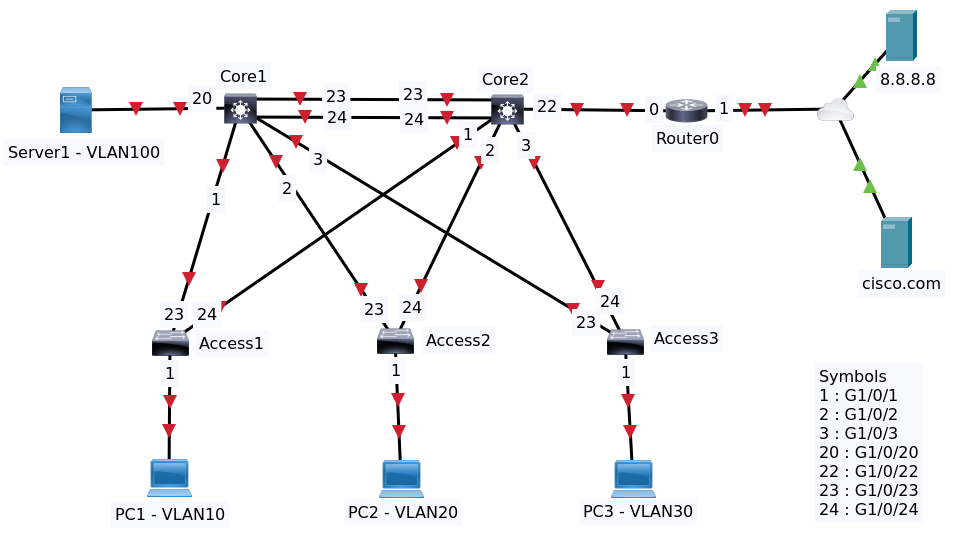
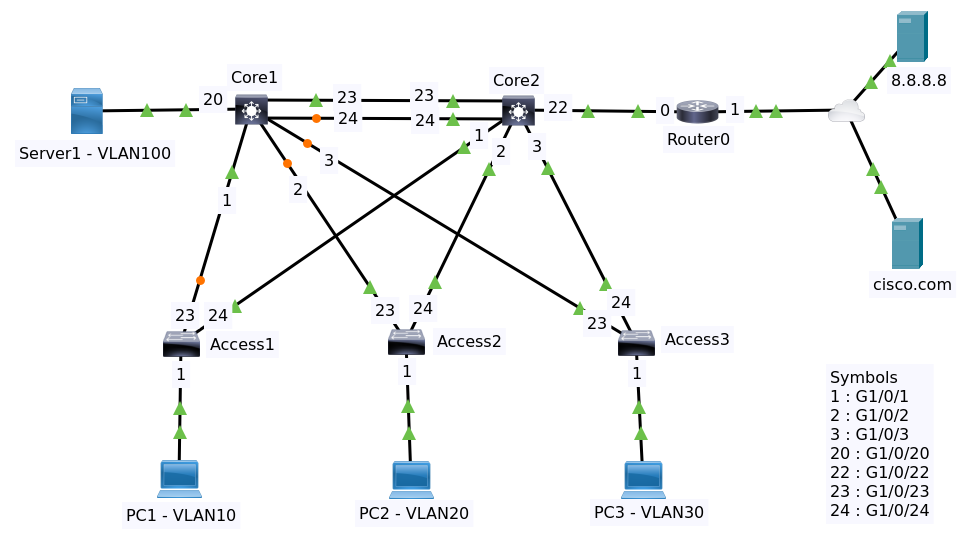

# Readme

## Contents

  * [Background](#background)
  * [Objectives](#objectives)
  * [Configurations](#configurations)
  * [Basic Configuration](#basic-configuration)
    + [Core Switch 1](#core-switch-1)
    + [Core Switch 2](#core-switch-2)
    + [Internet Router](#internet-router)
    + [Access Switch 1](#Access-switch-1)
    + [Access Switch 2](#Access-switch-2)
    + [Access Switch 3](#Access-switch-3)
  * [Configure VTP and VLAN](#configure-vtp-and-vlan)
    + [Core Switch 1 VLANs](#core-switch-1-vlans)
    + [Core Switch 1 VLANs](#core-switch-1-vlans)
    + [Access Switch 1 VLANs](#access-switch-1-vlans)
    + [Access Switch 2 VLANs](#access-switch-2-vlans)
    + [Access Switch 3 VLANs](#access-switch-3-vlans)
  * [Configure Trunks](#configure-trunks)
    + [Core Switch 1 Trunks](#core-switch-1-trunks)
    + [Core Switch 2 Trunks](#core-switch-2-trunks)
    + [Access Switch 1 2 3 Trunks](#access-switch-1-2-3-trunks)
  * [Configure Access Ports](#configure-access-ports)
    + [Core Switch 1 Access Port](#core-switch-1-access-port)
    + [Core Switch 2 Access Port](#core-switch-2-access-port)
    + [Access Switch 1 Access Port](#access-switch-1-access-port)
    + [Access Switch 2 Access Port](#access-switch-2-access-port)
    + [Access Switch 3 Access Port](#access-switch-3-access-port)
  * [Final](#final)

## Background

Consider the following topology:

- Two Core Switches Core1 and Core2
- Three Access Switches S1, S2, and S3
- Router0
- Three PCs and One Server
  - PC1 (VLAN 10)
  - PC2 (VLAN 20)
  - PC3 (VLAN 30)
  - Server1 (VLAN 100)
  

They have default configuration. File packet tracer [Topology](topology-1.pkt)

## Objectives

Configure the network as follows:

* Configure Host Names
* Shutdown unused interfaces
* Configure enable secret and vty passwords of cisco devices
* Use VTP mode transparent and domain ccna
* Add VLANS 10,20,30,100 to the VLAN database
* Configure ports between switches as trunks
* Configure access ports for links between switches and PCs
* Configure interVLAN routing on the core switches
* Optimize the spanning tree in the network
  * Configure the core switch on the left as the root switch for some VLANs
  * Configure the core switch on the right as the root switch for other VLANs
* Optimize the spanning tree so the core switches are the root switches.
* Configure two links in the core to use ether channel so that both are forwarding rather than having one of the ports blocking.
* Enable protocols such as HSRP or hot standby running protocol on the core network.

[↟](#contents)

## Basic Configuration

Before do configuration we will do these

* Add 2 power supply module for core switches. The devices will automatically booting.
* Add 1 power supply module for access switches. The devices will automatically booting.
* Turn the router on.
* Skip the initial configuration dialog. We will configure manually

In this section we will

* Configure hostname
* Configure enable secret and vty passwords of all switches and router
* For the switches shutdown unused interfaces
* For the router power the used interfaces on

Then save all running configuration to memory.

For all switches and router type `no` to skip the initial configuration dialog then type `en` to enter privileges mode.

>All commands are executed in privilege mode.

[↟](#contents)

### Core Switch 1

    conf t
    no ip domain-lookup
    hostname Core1
    enable secret cisco
    line vty 0 4
    password cisco
    login
    exit
    interface range gigabitEthernet 1/0/4 - 19
    shutdown
    interface range gigabitEthernet 1/0/21 - 22
    shutdown
    interface range gigabitEthernet 1/1/1 - 4
    shutdown
    end
    write

Enter command `sh ip interface brief` to show interface status

    Core1#sh ip interface brief 
    Interface              IP-Address      OK? Method Status                Protocol 
    GigabitEthernet1/0/1   unassigned      YES unset  up                    up 
    GigabitEthernet1/0/2   unassigned      YES unset  up                    up 
    GigabitEthernet1/0/3   unassigned      YES unset  up                    up 
    GigabitEthernet1/0/4   unassigned      YES unset  administratively down down 
    GigabitEthernet1/0/5   unassigned      YES unset  administratively down down 
    GigabitEthernet1/0/6   unassigned      YES unset  administratively down down 
    GigabitEthernet1/0/7   unassigned      YES unset  administratively down down 
    GigabitEthernet1/0/8   unassigned      YES unset  administratively down down 
    GigabitEthernet1/0/9   unassigned      YES unset  administratively down down 
    GigabitEthernet1/0/10  unassigned      YES unset  administratively down down 
    GigabitEthernet1/0/11  unassigned      YES unset  administratively down down 
    GigabitEthernet1/0/12  unassigned      YES unset  administratively down down 
    GigabitEthernet1/0/13  unassigned      YES unset  administratively down down 
    GigabitEthernet1/0/14  unassigned      YES unset  administratively down down 
    GigabitEthernet1/0/15  unassigned      YES unset  administratively down down 
    GigabitEthernet1/0/16  unassigned      YES unset  administratively down down 
    GigabitEthernet1/0/17  unassigned      YES unset  administratively down down 
    GigabitEthernet1/0/18  unassigned      YES unset  administratively down down 
    GigabitEthernet1/0/19  unassigned      YES unset  administratively down down 
    GigabitEthernet1/0/20  unassigned      YES unset  up                    up 
    GigabitEthernet1/0/21  unassigned      YES unset  administratively down down 
    GigabitEthernet1/0/22  unassigned      YES unset  administratively down down 
    GigabitEthernet1/0/23  unassigned      YES unset  up                    up 
    GigabitEthernet1/0/24  unassigned      YES unset  up                    up 
    GigabitEthernet1/1/1   unassigned      YES unset  administratively down down 
    GigabitEthernet1/1/2   unassigned      YES unset  administratively down down 
    GigabitEthernet1/1/3   unassigned      YES unset  administratively down down 
    GigabitEthernet1/1/4   unassigned      YES unset  administratively down down 
    Vlan1                  unassigned      YES unset  administratively down down

[↟](#contents)

### Core Switch 2

    conf t
    no ip domain-lookup
    hostname Core2
    enable secret cisco
    line vty 0 4
    password cisco
    login
    exit
    interface range gigabitEthernet 1/0/4 - 21
    shutdown
    interface range gigabitEthernet 1/1/1 - 4
    shutdown
    end
    write
    
Enter command `sh ip interface brief` to show interface status

[↟](#contents)

### Interner Router

    conf t
    no ip domain-lookup
    hostname IntRouter
    enable secret cisco
    line vty 0 4
    password cisco
    login
    exit
    interface gigabitEthernet 0/0/0
    no shutdown
    exit
    interface gigabitEthernet 0/0/1
    no shutdown
    end
    write
    
Enter command `sh ip interface brief` to show interface status

    Interface              IP-Address      OK? Method Status                Protocol 
    GigabitEthernet0/0/0   unassigned      YES unset  up                    up 
    GigabitEthernet0/0/1   unassigned      YES unset  up                    up 
    Vlan1                  unassigned      YES unset  administratively down down

[↟](#contents)

### Access Switch 1

    conf t
    no ip domain-lookup
    hostname Access1
    enable secret cisco
    line vty 0 4
    password cisco
    login
    exit    
    interface range gigabitEthernet 1/0/2 - 22
    shutdown
    exit
    interface range gigabitEthernet 1/1/1 - 4
    shutdown
    end
    write
    
Enter command `sh ip interface brief` to show interface status

### Access Switch 2

    conf t
    no ip domain-lookup
    hostname Access2
    enable secret cisco
    line vty 0 4
    password cisco
    login
    exit    
    interface range gigabitEthernet 1/0/2 - 22
    shutdown
    exit
    interface range gigabitEthernet 1/1/1 - 4
    shutdown
    end
    write
    
Enter command `sh ip interface brief` to show interface status

### Access Switch 3

    conf t
    no ip domain-lookup
    hostname Access3
    enable secret cisco
    line vty 0 4
    password cisco
    login
    exit    
    interface range gigabitEthernet 1/0/2 - 22
    shutdown
    exit
    interface range gigabitEthernet 1/1/1 - 4
    shutdown
    end
    write
    
Enter command `sh ip interface brief` to show interface status

[↟](#contents)

## Configure VTP and VLAN

This topology after doing some configurations. The color of links change to green (up) while the orange indicate the links are blocked by spanning-tree (default).

File packet tracer [Topology](topology-2.pkt)

On this configuration we will use transparent VTP mode and a VTP domain CCNA.

>VTP Transparent Mode, forwards advertisements but does not participate in VTP. VLANs must be configured manually

>We don't configure VTP and VLANs on a router. Router is a layer 3 device so we don't do it.

### Core Switch 1 VLANs

Enter command `sh vtp status`

    VTP Version capable             : 1 to 2
    VTP version running             : 1
    VTP Domain Name                 : 
    VTP Pruning Mode                : Disabled
    VTP Traps Generation            : Disabled
    Device ID                       : 0002.4A33.EC00
    Configuration last modified by 0.0.0.0 at 3-1-93 00:00:00
    Local updater ID is 0.0.0.0 (no valid interface found)

    Feature VLAN : 
    --------------
    VTP Operating Mode                : Server
    Maximum VLANs supported locally   : 1005
    Number of existing VLANs          : 5
    Configuration Revision            : 8
    MD5 digest                        : 0x2F 0xD6 0x4B 0x25 0x85 0xA7 0xED 0xC3 
                                    0x97 0x96 0xC1 0x86 0x4E 0x9A 0xE1 0x1A 
We see

* Default VTP mode is Server
* VTP version is 2
* No VTP domain
* Number of existing VLANs is 5

Configure VTP mode to transparent, VTP Domain CCNA, vlan 10, vlan 20, vlan 30 and vlan 100. Then write to memory

    conf t
    vtp mode transparent
    vtp domain ccna
    vlan 10
    vlan 20
    vlan 30
    vlan 100
    end
    write

Do `sh vtp status`

    VTP Version capable             : 1 to 2
    VTP version running             : 1
    VTP Domain Name                 : ccna
    VTP Pruning Mode                : Disabled
    VTP Traps Generation            : Disabled
    Device ID                       : 0002.4A33.EC00
    Configuration last modified by 0.0.0.0 at 3-1-93 00:00:00

    Feature VLAN : 
    --------------
    VTP Operating Mode                : Transparent
    Maximum VLANs supported locally   : 1005
    Number of existing VLANs          : 9
    Configuration Revision            : 0
    MD5 digest                        : 0x0B 0x20 0x50 0xFF 0x44 0x93 0x63 0xA5 
                                        0x3A 0xDA 0xE9 0x44 0xBD 0x57 0xF6 0x09

Enter command `sh vlan brief`

    VLAN Name                             Status    Ports
    ---- -------------------------------- --------- -------------------------------
    1    default                          active    Gig1/0/1, Gig1/0/2, Gig1/0/3, Gig1/0/4
                                                    Gig1/0/5, Gig1/0/6, Gig1/0/7, Gig1/0/8
                                                    Gig1/0/9, Gig1/0/10, Gig1/0/11, Gig1/0/12
                                                    Gig1/0/13, Gig1/0/14, Gig1/0/15, Gig1/0/16
                                                    Gig1/0/17, Gig1/0/18, Gig1/0/19, Gig1/0/20
                                                    Gig1/0/21, Gig1/0/22, Gig1/0/23, Gig1/0/24
                                                    Gig1/1/1, Gig1/1/2, Gig1/1/3, Gig1/1/4
    10   VLAN0010                         active    
    20   VLAN0020                         active    
    30   VLAN0030                         active    
    100  VLAN0100                         active    
    1002 fddi-default                     active    
    1003 token-ring-default               active    
    1004 fddinet-default                  active    
    1005 trnet-default                    active  

[↟](#contents)

### Core Switch 2 VLANs

Do the same thing as on Core Switch 1.

    conf t
    vtp mode transparent
    vtp domain ccna
    vlan 10
    vlan 20
    vlan 30
    vlan 100
    end
    write

### Access Switch 1 VLANs

Do the same thing as on Core Switch 1.

    conf t
    vtp mode transparent
    vtp domain ccna
    vlan 10
    vlan 20
    vlan 30
    vlan 100
    end
    write

### Access Switch 2 VLANs

Do the same thing as on Core Switch 1.

    conf t
    vtp mode transparent
    vtp domain ccna
    vlan 10
    vlan 20
    vlan 30
    vlan 100
    end
    write

### Access Switch 3 VLANs

Do the same thing as on Core Switch 1.

    conf t
    vtp mode transparent
    vtp domain ccna
    vlan 10
    vlan 20
    vlan 30
    vlan 100
    end
    write

## Configure Trunks

Configure ports between switches as trunks and access ports on links to the PCs.

[↟](#contents)

### Core Switch 1 Trunks

Show interface Gi1/0/23 switchport information. Enter command `sh interfaces g1/0/23 switchport`

    Name: Gig1/0/23
    Switchport: Enabled
    Administrative Mode: dynamic auto
    Operational Mode: static access
    Administrative Trunking Encapsulation: dot1q
    Operational Trunking Encapsulation: native
    Negotiation of Trunking: On
    Access Mode VLAN: 1 (default)
    Trunking Native Mode VLAN: 1 (default)
    Voice VLAN: none

This command shows:

* Switchport is enabled
* Administrative Mode is dynamic auto (DTP is auto)
* Operational Mode is static access or acting as access port

Something similar on interface Gi1/0/1, Gi1/0/2, Gi1/0/3 and Gi1/0/24

We configure those as trunk

    conf t
    interface range g1/0/1 - 3
    switchport mode trunk
    exit
    interface range g1/0/23 - 24
    switchport mode trunk
    end
    write

If the command `switchport mode trunk` doesn't work then do this instead of

    switchport trunk encapsulation dot1q
    switchport mode trunk

>Some switches require that you specify the encapsulation first.

Notice we're getting spanning tree warnings about inconsistent ports on console Core Switch2 and that's 
because core 2 is configured with access ports rather than trunk ports.

    Core2#%SPANTREE-2-RECV_PVID_ERR: Received 802.1Q BPDU on non trunk GigabitEthernet1/0/23 VLAN1.
    %SPANTREE-2-BLOCK_PVID_LOCAL: Blocking GigabitEthernet1/0/23 on VLAN0001. Inconsistent port type.
    %SPANTREE-2-RECV_PVID_ERR: Received 802.1Q BPDU on non trunk GigabitEthernet1/0/24 VLAN1.
    %SPANTREE-2-BLOCK_PVID_LOCAL: Blocking GigabitEthernet1/0/24 on VLAN0001. Inconsistent port type.

Verify again to show interface `g1/0/23` switchport information.

    Name: Gig1/0/23
    Switchport: Enabled
    Administrative Mode: trunk
    Operational Mode: trunk
    Administrative Trunking Encapsulation: dot1q
    Operational Trunking Encapsulation: dot1q
    Negotiation of Trunking: On
    Access Mode VLAN: 1 (default)
    Trunking Native Mode VLAN: 1 (default)
    Voice VLAN: none

What we see here

* Switchport is still enabled
* Administrative Mode is changed to trunk
* Operational Mode is changed to trunk

We don't configure the link to the Server1 as a trunk port, it will be an access port.

[↟](#contents)

### Core Switch 2 Trunks

Do the same thing as on Core Switch 1.

    conf t
    interface range g1/0/1 - 3
    switchport mode trunk
    exit
    interface range g1/0/23 - 24
    switchport mode trunk
    end
    write

We don't configure the link to the Router0 as a trunk port, it will be an access port.

### Access Switch 1 2 3 Trunks

The two uplink ports `g1/0/23` and `g1/0/24` will be configured as trunk ports.

    conf t
    interface range g1/0/23 - 24
    switchport mode trunk
    end
    write

[↟](#contents)

## Configure Access Ports

### Core Switch 1 Access Port

We will configure access port on interface Gi1/0/20 with VLAN 100.

Show interface `Gi1/0/20` switchport information.

    Name: Gig1/0/20
    Switchport: Enabled
    Administrative Mode: dynamic auto
    Operational Mode: static access
    Administrative Trunking Encapsulation: dot1q
    Operational Trunking Encapsulation: native
    Negotiation of Trunking: On
    Access Mode VLAN: 1 (default)
    Trunking Native Mode VLAN: 1 (default)
    Voice VLAN: none

This command shows the port currently in VLAN 1. We need to configure it to VLAN 100.

    conf t
    interface gi1/0/20
    switchport mode access
    switchport access vlan 100
    end
    write

Verify again by running command `sh interfaces gi 1/0/20 switchport`

    Name: Gig1/0/20
    Switchport: Enabled
    Administrative Mode: static access
    Operational Mode: static access
    Administrative Trunking Encapsulation: dot1q
    Operational Trunking Encapsulation: native
    Negotiation of Trunking: Off
    Access Mode VLAN: 100 (VLAN0100)
    Trunking Native Mode VLAN: 1 (default)
    Voice VLAN: none

What we see here

* Switchport is still enabled
* Administrative Mode is changed to static access
* Operational Mode is changed to static access
* Negotiation of Trunking is changed to off (DTP is being disabled on this port)
* Access Mode VLAN is changed to 100

Enter command `sh running`.

    Current configuration : 1894 bytes
    !
    version 16.3.2
    no service timestamps log datetime msec
    no service timestamps debug datetime msec
    no service password-encryption
    !
    hostname Core1
    !
    !
    enable secret 5 $1$mERr$hx5rVt7rPNoS4wqbXKX7m0
    !
    ......
    !
    no ip domain-lookup
    !
    !
    vtp domain ccna
    vtp mode transparent
    !
    spanning-tree mode pvst
    !
    ......
    !
    vlan 10
    !
    vlan 20
    !
    vlan 30
    !
    vlan 100
    !
    interface GigabitEthernet1/0/1
     switchport mode trunk
    !
    interface GigabitEthernet1/0/2
     switchport mode trunk
    !
    interface GigabitEthernet1/0/3
     switchport mode trunk
    !
    ......
    !
    interface GigabitEthernet1/0/20
     switchport access vlan 100
     switchport mode access
    !
    ......
    !
    interface Vlan1
     no ip address
     shutdown
    !
    ip classless
    !
    ip flow-export version 9
    !
    ......
    !
    line con 0
    !
    line aux 0
    !
    line vty 0 4
     password cisco
     login
    !
    !
    !
    !
    end

>Some lines not shown here marked with `......`

[↟](#contents)

### Core Switch 2 Access Port

Do `sh running-config` we see the interface Gi1/0/22 has no configuration.

    !
    interface GigabitEthernet1/0/22
    !

Show interface `gi1/0/22` switchport information.

    Name: Gig1/0/22
    Switchport: Enabled
    Administrative Mode: dynamic auto
    Operational Mode: static access
    Administrative Trunking Encapsulation: dot1q
    Operational Trunking Encapsulation: native
    Negotiation of Trunking: On
    Access Mode VLAN: 1 (default)
    Trunking Native Mode VLAN: 1 (default)
    Voice VLAN: none

Configure access port on interface `gi 1/0/22` with VLAN 1.

    conf t
    interface gi1/0/22
    switchport mode access
    switchport access vlan 1
    end
    write

Verify again by running command `sh interfaces gi 1/0/22 switchport`

    Name: Gig1/0/22
    Switchport: Enabled
    Administrative Mode: static access
    Operational Mode: static access
    Administrative Trunking Encapsulation: dot1q
    Operational Trunking Encapsulation: native
    Negotiation of Trunking: Off
    Access Mode VLAN: 1 (default)
    Trunking Native Mode VLAN: 1 (default)
    Voice VLAN: none

What we see here

* Switchport is still enabled
* Administrative Mode is changed to static access
* Operational Mode is changed to static access
* Negotiation of Trunking is changed to off (DTP is being disabled on this port)

Do `sh running-config` we see the interface `gi 1/0/22` has only one configuration.

    !
    interface GigabitEthernet1/0/22
     switchport mode access
    !

[↟](#contents)

### Access Switch 1 Access Port

Configure access port on interface `gi 1/0/1` with VLAN 10.

    conf t
    interface gi1/0/1
    switchport mode access
    switchport access vlan 10
    end
    write

### Access Switch 2 Access Port

Configure access port on interface `gi 1/0/1` with VLAN 20.

    conf t
    interface gi1/0/1
    switchport mode access
    switchport access vlan 20
    end
    write

### Access Switch 3 Access Port

Configure access port on interface `gi 1/0/1` with VLAN 30.

    conf t
    interface gi1/0/1
    switchport mode access
    switchport access vlan 30
    end
    write

## Final

File packet tracer [Topology](topology-3.pkt).

Next: _Section 38 Campus Network Part 2_

[↟](#contents)

