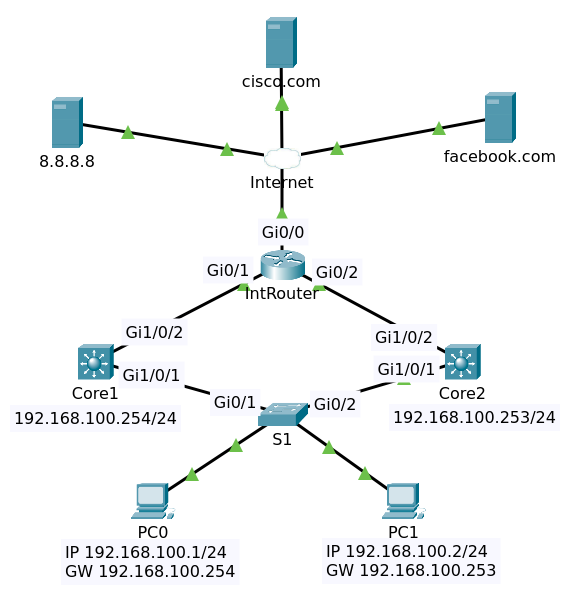

# HSRP (Hot Standby Routing Protocol)

## Contents

  * [Background](#background)
  * [Basic Configurations](#basic-configurations)
  * [HSRP Configurations](#hsrp-configurations)
    + [Core Switch 1](#core-1)
    + [Core Switch 2](#core-2)
    + [Test HSRP Connection on PC](#test-hsrp-connection-on-pc)
  * [HSRP Commands](#hsrp-commands)
    + [Show MAC Address of Gateway](#show-mac-address-of-gateway)
    + [Show Active and Standby](#show-active-and-standby)
  * [Final](#final)
  * [Reference](#reference)
  
## Background

This is a topology before implementation HSRP.

Here’s what we have:

- There is IntRouter that connects to Internet Cloud.
  - Port Gi0/0 has an ip dhcp. 
  - Port Gi0/1 has an ip address 192.168.1.126/26
  - Port Gi0/2 has an ip address 192.168.1.254/26
- The multilayer switches are connected with layer 3 interface to an upstream router IntRouter.
  - Switch Core1 as a first gateway
    - Port Gi1/0/1 has an ip address 192.168.100.1/24
    - Port Gi1/0/2 has an ip address 192.168.1.65/26
  - Switch Core2 as a second gateway
    - Port Gi1/0/1 has an ip address 192.168.100.2/24
    - Port Gi1/0/2 has an ip address 192.168.1.193/26
- OSPF is used as routing protocol.
- There is a layer 2 switch S1 between multilayer switches and PCs that connect to 192.168.100.0/24 segment.
  - Access Switch S1 has default configuration.
- There are two PCs, PC0 and PC1.
  - PC0
    - IP Address 192.168.100.100/24
    - DNS Server 8.8.8.8
    - Gateway 192.168.100.1
  - PC1
    - IP Address 192.168.100.101/24
    - DNS Server 8.8.8.8
    - Gateway 192.168.100.2

[↟](#contents)

## Basic Configurations

File packet tracer for device router and multilayer switches
- [IntRouter](IntRouter.txt)
- [Core1](Core1-pre.txt)
- [Core2](Core2-pre.txt)

File packet tracer [Pre HSRP](pre-hsrp.pkt).

Both PC0 and PC1 can ping to ip gateway, ip upstream, ip public 8.8.8.8 and ip facebook.com

    C:\>ping 192.168.1.126

    Pinging 192.168.1.126 with 32 bytes of data:

    Reply from 192.168.1.126: bytes=32 time<1ms TTL=254
    Reply from 192.168.1.126: bytes=32 time<1ms TTL=254
    Reply from 192.168.1.126: bytes=32 time<1ms TTL=254
    Reply from 192.168.1.126: bytes=32 time<1ms TTL=254

    Ping statistics for 192.168.1.126:
        Packets: Sent = 4, Received = 4, Lost = 0 (0% loss),
    Approximate round trip times in milli-seconds:
        Minimum = 0ms, Maximum = 0ms, Average = 0ms

    C:\>ping 8.8.8.8

    Pinging 8.8.8.8 with 32 bytes of data:

    Reply from 8.8.8.8: bytes=32 time<1ms TTL=126
    Reply from 8.8.8.8: bytes=32 time<1ms TTL=126
    Reply from 8.8.8.8: bytes=32 time<1ms TTL=126
    Reply from 8.8.8.8: bytes=32 time<1ms TTL=126

    Ping statistics for 8.8.8.8:
        Packets: Sent = 4, Received = 4, Lost = 0 (0% loss),
    Approximate round trip times in milli-seconds:
        Minimum = 0ms, Maximum = 0ms, Average = 0ms

    C:\>ping facebook.com

    Pinging 8.8.8.10 with 32 bytes of data:

    Request timed out.
    Reply from 8.8.8.10: bytes=32 time<1ms TTL=126
    Reply from 8.8.8.10: bytes=32 time<1ms TTL=126
    Reply from 8.8.8.10: bytes=32 time<1ms TTL=126

    Ping statistics for 8.8.8.10:
        Packets: Sent = 4, Received = 3, Lost = 1 (25% loss),
    Approximate round trip times in milli-seconds:
        Minimum = 0ms, Maximum = 0ms, Average = 0ms

[↟](#contents)

## HSRP Configurations

### Core 1

Enter configuration for HSRP

    conf t
    interface vlan 1
    standby 1 ip 192.168.100.254
    end
    write

Show ip interface by entering command `ip interface brief`

    Interface              IP-Address      OK? Method Status                Protocol 
    GigabitEthernet1/0/1   unassigned      YES unset  up                    up 
    GigabitEthernet1/0/2   192.168.1.65    YES manual up                    up 
    ......
    Vlan1                  192.168.100.1   YES manual up                    up

### Core 2

Enter configuration for HSRP

    conf t
    interface vlan 1
    standby 1 ip 192.168.100.254
    end
    write

Show ip interface by entering command `ip interface brief`

    Interface              IP-Address      OK? Method Status                Protocol 
    GigabitEthernet1/0/1   unassigned      YES unset  up                    up 
    GigabitEthernet1/0/2   192.168.1.193   YES manual up                    up 
    ......
    Vlan1                  192.168.100.2   YES manual up                    up

[↟](#contents)

### Test HSRP Connection on PC

At PC0 do test ping to gateway.

    C:\>ping 192.168.100.254

    Pinging 192.168.100.254 with 32 bytes of data:

    Reply from 192.168.100.254: bytes=32 time<1ms TTL=255
    Reply from 192.168.100.254: bytes=32 time<1ms TTL=255
    Reply from 192.168.100.254: bytes=32 time<1ms TTL=255
    Reply from 192.168.100.254: bytes=32 time<1ms TTL=255

    Ping statistics for 192.168.100.254:
        Packets: Sent = 4, Received = 4, Lost = 0 (0% loss),
    Approximate round trip times in milli-seconds:
        Minimum = 0ms, Maximum = 0ms, Average = 0ms

Then test ping to ip upstream, ip public 8.8.8.8 and ip facebook.com

### Show MAC Address of Gateway

Enter command `sh ip arp` at switch Core1 to show mac address of ip gateway 192.168.1.254

    Protocol  Address          Age (min)  Hardware Addr   Type   Interface
    Internet  192.168.1.65            -   0003.E412.1C02  ARPA   GigabitEthernet1/0/2
    Internet  192.168.1.126           0   0007.EC7C.B702  ARPA   GigabitEthernet1/0/2
    Internet  192.168.100.1           -   0090.2B4D.4071  ARPA   Vlan1
    Internet  192.168.100.2           0   0050.0F2D.B286  ARPA   Vlan1
    Internet  192.168.100.254         0   0000.0C07.AC01  ARPA   Vlan1

>0000.0C07.AC01 is the MAC address that we have. HSRP uses the 0000.0c07.acXX MAC address where XX is the HSRP group number

[↟](#contents)

### Show Active and Standby

Enter command `sh standby` at Core1

    Vlan1 - Group 1
      State is Standby
        7 state changes, last state change 00:00:41
      Virtual IP address is 192.168.100.254
      Active virtual MAC address is 0000.0C07.AC01
        Local virtual MAC address is 0000.0C07.AC01 (v1 default)
      Hello time 3 sec, hold time 10 sec
        Next hello sent in 1.676 secs
      Preemption disabled
      Active router is 192.168.100.2
      Standby router is local
      Priority 100 (default 100)
      Group name is hsrp-Vl1-1 (default)
  
Enter command `sh standby` at Core2

    Vlan1 - Group 1
      State is Active
        5 state changes, last state change 00:00:18
      Virtual IP address is 192.168.100.254
      Active virtual MAC address is 0000.0C07.AC01
        Local virtual MAC address is 0000.0C07.AC01 (v1 default)
      Hello time 3 sec, hold time 10 sec
        Next hello sent in 2.288 secs
      Preemption disabled
      Active router is local
      Standby router is 192.168.100.1
      Priority 100 (default 100)
      Group name is hsrp-Vl1-1 (default)
      
Or you can use command `sh standby brief`

At Core1

                         P indicates configured to preempt.
                         |
    Interface   Grp  Pri P State    Active          Standby         Virtual IP
    Vl1         1    100   Standby  192.168.100.2   local           192.168.100.254

While at Core 2

                         P indicates configured to preempt.
                         |
    Interface   Grp  Pri P State    Active          Standby         Virtual IP
    Vl1         1    100   Active   local           192.168.100.1   192.168.100.254

There are a couple of interesting things here:

- We can see the virtual IP address here (192.168.100.254).
- It also shows the virtual MAC address (0000.0c07.ac01).
- You can see which router is active or in standby mode.
- The hello time is 3 seconds, and the hold time is 10 seconds.
- Preemption is disabled.

The active router will respond to ARP requests from computers, and it will be actively forwarding packets from them. It will send hello messages to the routers that are in standby mode. Routers in standby mode will listen to the hello messages, if they don’t receive anything from the active router, they will wait for the hold time to expire before taking over. The hold time is 10 seconds by default.

Each HSRP router will go through several states before it ends up as an active or standby router. This is what will happen:

| State | Explanation
|-------|------------
| Initial | This is the first state when HSRP starts. You’ll see this just after you configured HSRP or when the interface just got enabled.
| Listen | The router knows the virtual IP address and will listen for hello messages from other HSRP routers.
| Speak | The router will send hello messages and join the election to see which router will become active or standby.
| Standby | The router didn’t become the active router but will keep sending hello messages. If the active router fails, it will take over.
| Active | The router will actively forward packets from clients and send hello messages.

[↟](#contents)

## Final

File packet tracer for multilayer switches

- [Core1](Core1.txt)
- [Core2](Core2.txt)

File packet tracer [HSRP](hsrp.pkt).

## Reference

- [Introduction to Gateway Redundancy](https://networklessons.com/cisco/ccie-routing-switching/introduction-gateway-redundancy)
- [HSRP (Hot Standby Routing Protocol)](https://networklessons.com/cisco/ccie-routing-switching/hsrp-hot-standby-routing-protocol)

[↟](#contents)

