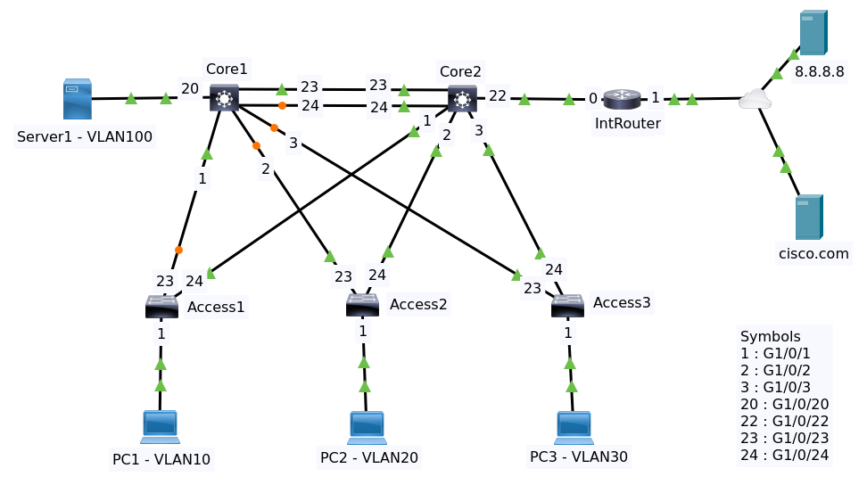
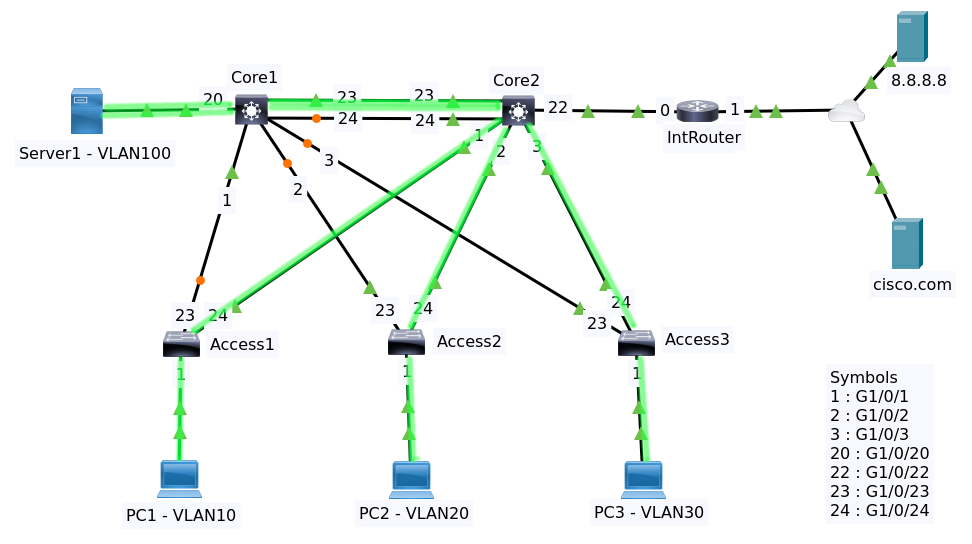
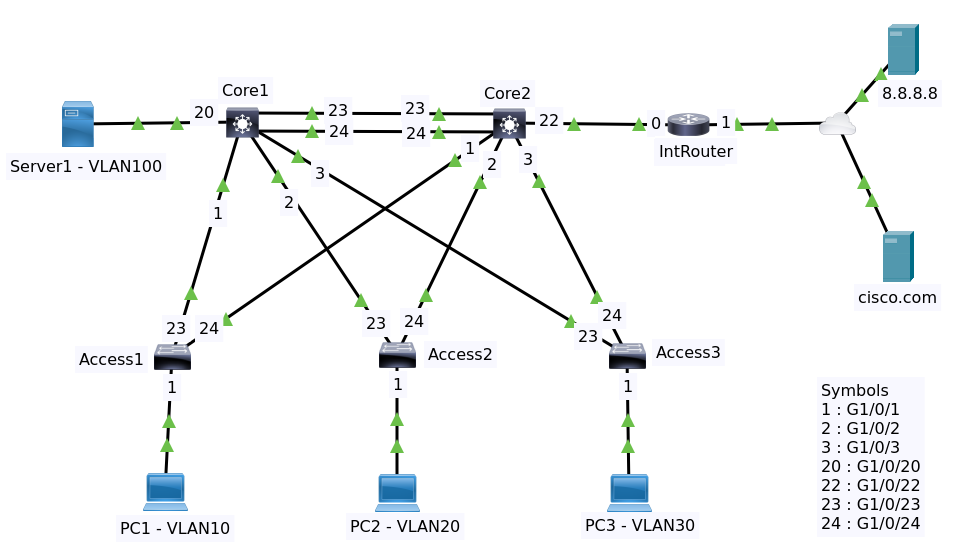

# Readme

## Contents

  * [Background](#background)
  * [Solution](#solution)
    + [CDP and LLDP](#cdp-and-lldp)
    + [Spanning Tree](#spanning-tree)
    + [CDP and LLDP](#cdp-and-lldp)
    + [VLAN Separation Optimisation](#vlan-separation-optimisation)
      - [Priority For VLANs Odd](#priority-for-vlans-odd)
      - [Priority For VLANs Even](priority-for-vlans-even)
    + [Ether Channel](#ether-channel)
      - [Configure Ether Channel on Core1](#configure-ether-channel-on-core1)
      - [Configure Ether Channel on Core2](#configure-ether-channel-on-core2)
      - [Some Ether Channel Commands](#some-ether-channel-commands)
    + [Spanning Tree Optimisation](#spanning-tree-optimisation)
      - [Change Type of Port Channel to P2p](#change-type-of-port-channel-to-p2p)
      - [Caveats](#caveats)
    + [Configure SVI](#configure-svi)
      - [Core 1](#core-1)
      - [Core 2](#core-2)
      - [Access 1](#access-1)
      - [Access 2](#access-2)
      - [Access 3](#access-3)
    + [Configure HSRP](#configure-hsrp)
      - [VLAN 1](#vlan-1)
      - [VLAN 10](#vlan-10)
      - [VLAN 20](#vlan-20)
      - [VLAN 30](#vlan-30)
      - [VLAN 100](#vlan-100)
    + [Routing Protocol](#routing-protocol)
      - [Setup IP on No Switchport on Core2](#setup-ip-on-no-switchport-on-core2)
      - [Setup IP on IntRouter](#setup-ip-on-introuter)
      - [Configure EIGRP on Core2 and IntRouter](#configure-eigrp-on-core2-and-introuter)
      - [Configure Gateway of Last Resort on Core1](#configure-gateway-of-last-resort-on-core1)
      - [Configure IP Default Gateway on Access Switches](#configure-ip-default-gateway-on-access-switches)

## Background

This is a continuation of the [Campus Network Part 1](https://github.com/awarmanf/road_to_ccna/tree/master/37_Campus_Network_Part_1).



File packet tracer [Topology](topology-1.pkt)

Imagine that you had many servers here as well as many PCs on switch 2 and switch 3 trying to 
get to a group of servers on the left end side. Let's say they were moving large files.

How would traffic flow? So traffic from all of these PCs in VLAN 10, 20 and 30 would end up 
going via Core2 and then going across the single link, Gi1/0/23, to Core1 to get to these servers.

That's gonna be a problem because we're gonna have a bottleneck or an issue on Gi1/0/23 this is 
a gigabit port but all of these uplinks are also gigabit ports and PCs are sending
traffic at gig speeds. So if you have 100 PCs sending traffic to multiple servers this Gi1/0/23 
link is gonna be over saturated.

## Solution

We're going to split traffic across the core switches. We want to optimize our spanning tree and 
this topology and ensure that Core1 is the route for odd VLANs (VLAN 1, VLAN 10, VLAN 30) and 
Core2 is the root for even VLANs (VLAN 20, VLAN 100). We also need to configure ether channel on 
the core switches so that we don't have one of these links blocking, both of these ports should be
forwarding

[↟](#contents)

### CDP and LLDP

The first step is verify links using CDP and LLDP. Enable cdp and lldp at all switches if they are disabled.

**CCDP**

CDP or Cisco Discovery Protocol is a Cisco proprietary protocol. By default cdp is enabled.

Enter command `sh cdp neighbors` at Core2.

    % CDP is not enabled

The cdp is not enabled. Run cdp.

    conf t
    cdp run 
    end
    write
    
Do the same for all switches. Then enter the same command at Core2.

Access3      Gig 1/0/3        179                    3650        Gig 1/0/24
IntRouter    Gig 1/0/22       179            R       ISR4300     Gig 0/0/0
Access2      Gig 1/0/2        179                    3650        Gig 1/0/24
Core1        Gig 1/0/23       179                    3650        Gig 1/0/23
Core1        Gig 1/0/24       179                    3650        Gig 1/0/24
Access1      Gig 1/0/1        179                    3650        Gig 1/0/24
    
**LLDP**

LLDP or Link Layer Discovery Protocol is an industry standard protocol. LLDP is 
not enabled by default on Cisco devices so you will need to enable LLDP 
if you wanna use LLDP instead of CDP.

LLDP is very useful when you have a multi vendor environments. So if you're using 
Cisco with HPE or Juniper or another vendor you may wanna use LLDP.

Enter command `sh lldp neighbors` at Core2

    % LLDP is not enabled

LLDP is not enabled. Run LLDP

    conf t
    lldp run 
    end
    write

Do the same for all switches and IntRouter. Then enter the same command at Core2.

    Capability codes:
        (R) Router, (B) Bridge, (T) Telephone, (C) DOCSIS Cable Device
        (W) WLAN Access Point, (P) Repeater, (S) Station, (O) Other
    Device ID           Local Intf     Hold-time  Capability      Port ID
    Access1             Gig1/0/1       120        R               Gig1/0/24
    Access2             Gig1/0/2       120        R               Gig1/0/24
    Core1               Gig1/0/23      120        R               Gig1/0/23
    Core1               Gig1/0/24      120        R               Gig1/0/24
    Access3             Gig1/0/3       120        R               Gig1/0/24
    IntRouter           Gig1/0/22      120        R               Gig0/0/0

    Total entries displayed: 6o

[↟](#contents)

### VLAN Separation Optimisation

The problem with this topology is if lots of PCs in the access layer want to send traffic 
to lots of servers over here in the network, all their traffic has to go via core 2, 
and then it's gonna be sent across the single gigabit 1/0/23 link to the servers that's not 
an optimal way of doing it. 



We can see at packet tracer that these ports are blocking and those are forwarding in spanning tree.

Enter command `sh spanning-tree` at Core 1 to show which are forwarding and blocking ports and belong which VLAN.

    VLAN0001
      Spanning tree enabled protocol ieee
      Root ID    Priority    32769
                 Address     0001.43AD.8A02
                 Cost        4
                 Port        23(GigabitEthernet1/0/23)
                 Hello Time  2 sec  Max Age 20 sec  Forward Delay 15 sec

      Bridge ID  Priority    32769  (priority 32768 sys-id-ext 1)
                 Address     0090.219D.70E5
                 Hello Time  2 sec  Max Age 20 sec  Forward Delay 15 sec
                 Aging Time  20

    Interface        Role Sts Cost      Prio.Nbr Type
    ---------------- ---- --- --------- -------- --------------------------------
    Gi1/0/1          Desg FWD 4         128.1    P2p
    Gi1/0/2          Altn BLK 4         128.2    P2p
    Gi1/0/3          Altn BLK 4         128.3    P2p
    Gi1/0/23         Root FWD 4         128.23   P2p
    Gi1/0/24         Altn BLK 4         128.24   P2p

We see for VLAN1 the forwarding ports at Core1 are Gi1/0/1, Gi1/0/23. While the blocking ports are Gi1/0/2, Gi1/0/3 and Gi1/0/24

    VLAN0010
      Spanning tree enabled protocol ieee
      Root ID    Priority    32778
                 Address     0001.43AD.8A02
                 Cost        4
                 Port        23(GigabitEthernet1/0/23)
                 Hello Time  2 sec  Max Age 20 sec  Forward Delay 15 sec

      Bridge ID  Priority    32778  (priority 32768 sys-id-ext 10)
                 Address     0090.219D.70E5
                 Hello Time  2 sec  Max Age 20 sec  Forward Delay 15 sec
                 Aging Time  20

    Interface        Role Sts Cost      Prio.Nbr Type
    ---------------- ---- --- --------- -------- --------------------------------
    Gi1/0/1          Desg FWD 4         128.1    P2p
    Gi1/0/2          Altn BLK 4         128.2    P2p
    Gi1/0/3          Altn BLK 4         128.3    P2p
    Gi1/0/23         Root FWD 4         128.23   P2p
    Gi1/0/24         Altn BLK 4         128.24   P2p

For VLAN 10 the result is the same.

    VLAN0020
      Spanning tree enabled protocol ieee
      Root ID    Priority    32788
                 Address     0001.43AD.8A02
                 Cost        4
                 Port        23(GigabitEthernet1/0/23)
                 Hello Time  2 sec  Max Age 20 sec  Forward Delay 15 sec

      Bridge ID  Priority    32788  (priority 32768 sys-id-ext 20)
                 Address     0090.219D.70E5
                 Hello Time  2 sec  Max Age 20 sec  Forward Delay 15 sec
                 Aging Time  20

    Interface        Role Sts Cost      Prio.Nbr Type
    ---------------- ---- --- --------- -------- --------------------------------
    Gi1/0/1          Desg FWD 4         128.1    P2p
    Gi1/0/2          Altn BLK 4         128.2    P2p
    Gi1/0/3          Altn BLK 4         128.3    P2p
    Gi1/0/23         Root FWD 4         128.23   P2p
    Gi1/0/24         Altn BLK 4         128.24   P2p

For VLAN 20 the result is the same.

    VLAN0030
      Spanning tree enabled protocol ieee
      Root ID    Priority    32798
                 Address     0001.43AD.8A02
                 Cost        4
                 Port        23(GigabitEthernet1/0/23)
                 Hello Time  2 sec  Max Age 20 sec  Forward Delay 15 sec

      Bridge ID  Priority    32798  (priority 32768 sys-id-ext 30)
                 Address     0090.219D.70E5
                 Hello Time  2 sec  Max Age 20 sec  Forward Delay 15 sec
                 Aging Time  20

    Interface        Role Sts Cost      Prio.Nbr Type
    ---------------- ---- --- --------- -------- --------------------------------
    Gi1/0/1          Desg FWD 4         128.1    P2p
    Gi1/0/2          Altn BLK 4         128.2    P2p
    Gi1/0/3          Altn BLK 4         128.3    P2p
    Gi1/0/23         Root FWD 4         128.23   P2p
    Gi1/0/24         Altn BLK 4         128.24   P2p

For VLAN 30 the result is the same.

    VLAN0100
      Spanning tree enabled protocol ieee
      Root ID    Priority    32868
                 Address     0001.43AD.8A02
                 Cost        4
                 Port        23(GigabitEthernet1/0/23)
                 Hello Time  2 sec  Max Age 20 sec  Forward Delay 15 sec

      Bridge ID  Priority    32868  (priority 32768 sys-id-ext 100)
                 Address     0090.219D.70E5
                 Hello Time  2 sec  Max Age 20 sec  Forward Delay 15 sec
                 Aging Time  20

    Interface        Role Sts Cost      Prio.Nbr Type
    ---------------- ---- --- --------- -------- --------------------------------
    Gi1/0/1          Desg FWD 4         128.1    P2p
    Gi1/0/2          Altn BLK 4         128.2    P2p
    Gi1/0/3          Altn BLK 4         128.3    P2p
    Gi1/0/20         Desg FWD 19        128.20   P2p
    Gi1/0/23         Root FWD 4         128.23   P2p
    Gi1/0/24         Altn BLK 4         128.24   P2p

For VLAN 100 the result is the same.

>The only traffic that is permitted out of a spanning tree port and accepted in on a spanning tree port are 
network protocols such as CDP, LLDP, spanning tree and a few others. 

We want to optimize the spanning tree and ensure that Core1 is the route for odd VLANs 
and Core2 is the root for even VLANs.

- VLAN1,  VLAN10, VLAN30 are odd VLANs handle by Core1
- VLAN20, VLAN100 are even VLANs handle by Core2

[↟](#contents)

#### Priority For VLANs Odd

Configuration for Core1

    conf t
    spanning-tree vlan 1 priority 0
    spanning-tree vlan 10 priority 0
    spanning-tree vlan 30 priority 0
    end
    write
    
>Or spanning-tree vlan 1 root primary

After some time the colors have changed. All ports are now forwarding they're green whereas before they won't green.

Configuration for Core2, make this switch as the backup root for odd vlans.

    conf t
    spanning-tree vlan 1 priority 4096
    spanning-tree vlan 10 priority 4096
    spanning-tree vlan 30 priority 4096
    end
    write
    
>bridge priority in increments of 4096

Verifying spanning tree by entering command `show spanning-tree vlan 1` (odd vlan) at Core1

    VLAN0001
      Spanning tree enabled protocol ieee
      Root ID    Priority    1
                 Address     0090.219D.70E5
                 This bridge is the root
                 Hello Time  2 sec  Max Age 20 sec  Forward Delay 15 sec

      Bridge ID  Priority    1  (priority 0 sys-id-ext 1)
                 Address     0090.219D.70E5
                 Hello Time  2 sec  Max Age 20 sec  Forward Delay 15 sec
                 Aging Time  20

    Interface        Role Sts Cost      Prio.Nbr Type
    ---------------- ---- --- --------- -------- --------------------------------
    Gi1/0/1          Desg FWD 4         128.1    P2p
    Gi1/0/3          Desg FWD 4         128.3    P2p
    Gi1/0/24         Desg FWD 4         128.24   P2p
    Gi1/0/2          Desg FWD 4         128.2    P2p
    Gi1/0/23         Desg FWD 4         128.23   P2p

>Notice this switch is the root switch for VLAN 1 and all ports are forwarding.

Verifying spanning tree by entering command `show spanning-tree vlan 1` (odd vlan) at Core2

    VLAN0001
      Spanning tree enabled protocol ieee
      Root ID    Priority    1
                 Address     0090.219D.70E5
                 Cost        4
                 Port        23(GigabitEthernet1/0/23)
                 Hello Time  2 sec  Max Age 20 sec  Forward Delay 15 sec

      Bridge ID  Priority    4097  (priority 4096 sys-id-ext 1)
                 Address     0001.43AD.8A02
                 Hello Time  2 sec  Max Age 20 sec  Forward Delay 15 sec
                 Aging Time  20

    Interface        Role Sts Cost      Prio.Nbr Type
    ---------------- ---- --- --------- -------- --------------------------------
    Gi1/0/22         Desg FWD 4         128.22   P2p
    Gi1/0/23         Root FWD 4         128.23   P2p
    Gi1/0/1          Desg FWD 4         128.1    P2p
    Gi1/0/24         Altn BLK 4         128.24   P2p
    Gi1/0/2          Desg FWD 4         128.2    P2p
    Gi1/0/3          Desg FWD 4         128.3    P2p

All ports are forwarding except for Gi1/0/24.

Verifying spanning tree by entering command `show spanning-tree vlan 20` (even vlan) at Core1

    VLAN0020
      Spanning tree enabled protocol ieee
      Root ID    Priority    32788
                 Address     0001.43AD.8A02
                 Cost        4
                 Port        23(GigabitEthernet1/0/23)
                 Hello Time  2 sec  Max Age 20 sec  Forward Delay 15 sec

      Bridge ID  Priority    32788  (priority 32768 sys-id-ext 20)
                 Address     0090.219D.70E5
                 Hello Time  2 sec  Max Age 20 sec  Forward Delay 15 sec
                 Aging Time  20

    Interface        Role Sts Cost      Prio.Nbr Type
    ---------------- ---- --- --------- -------- --------------------------------
    Gi1/0/1          Desg FWD 4         128.1    P2p
    Gi1/0/3          Altn BLK 4         128.3    P2p
    Gi1/0/24         Altn BLK 4         128.24   P2p
    Gi1/0/2          Altn BLK 4         128.2    P2p
    Gi1/0/23         Root FWD 4         128.23   P2p

Verifying spanning tree by entering command `show spanning-tree vlan 20` (even vlan) at Core2

    VLAN0020
      Spanning tree enabled protocol ieee
      Root ID    Priority    32788
                 Address     0001.43AD.8A02
                 This bridge is the root
                 Hello Time  2 sec  Max Age 20 sec  Forward Delay 15 sec

      Bridge ID  Priority    32788  (priority 32768 sys-id-ext 20)
                 Address     0001.43AD.8A02
                 Hello Time  2 sec  Max Age 20 sec  Forward Delay 15 sec
                 Aging Time  20

    Interface        Role Sts Cost      Prio.Nbr Type
    ---------------- ---- --- --------- -------- --------------------------------
    Gi1/0/23         Desg FWD 4         128.23   P2p
    Gi1/0/1          Desg FWD 4         128.1    P2p
    Gi1/0/24         Desg FWD 4         128.24   P2p
    Gi1/0/2          Desg FWD 4         128.2    P2p
    Gi1/0/3          Desg FWD 4         128.3    P2p

[↟](#contents)

#### Priority For VLANs Even

Configuration for Core1

    conf t
    spanning-tree vlan 20,100 priority 4096
    end
    write

Configuration for Core2

    conf t
    spanning-tree vlan 20,100 priority 0
    end
    write

Verifying spanning tree by entering command `show spanning-tree vlan 20` (even vlan) at Core1

    VLAN0020
      Spanning tree enabled protocol ieee
      Root ID    Priority    20
                 Address     0001.43AD.8A02
                 Cost        4
                 Port        23(GigabitEthernet1/0/23)
                 Hello Time  2 sec  Max Age 20 sec  Forward Delay 15 sec

      Bridge ID  Priority    4116  (priority 4096 sys-id-ext 20)
                 Address     0090.219D.70E5
                 Hello Time  2 sec  Max Age 20 sec  Forward Delay 15 sec
                 Aging Time  20

    Interface        Role Sts Cost      Prio.Nbr Type
    ---------------- ---- --- --------- -------- --------------------------------
    Gi1/0/1          Desg FWD 4         128.1    P2p
    Gi1/0/3          Desg FWD 4         128.3    P2p
    Gi1/0/24         Altn BLK 4         128.24   P2p
    Gi1/0/2          Desg FWD 4         128.2    P2p
    Gi1/0/23         Root FWD 4         128.23   P2p

Verifying spanning tree by entering command `show spanning-tree vlan 20` (even vlan) at Core2

    VLAN0020
      Spanning tree enabled protocol ieee
      Root ID    Priority    20
                 Address     0001.43AD.8A02
                 This bridge is the root
                 Hello Time  2 sec  Max Age 20 sec  Forward Delay 15 sec

      Bridge ID  Priority    20  (priority 0 sys-id-ext 20)
                 Address     0001.43AD.8A02
                 Hello Time  2 sec  Max Age 20 sec  Forward Delay 15 sec
                 Aging Time  20

    Interface        Role Sts Cost      Prio.Nbr Type
    ---------------- ---- --- --------- -------- --------------------------------
    Gi1/0/23         Desg FWD 4         128.23   P2p
    Gi1/0/1          Desg FWD 4         128.1    P2p
    Gi1/0/24         Desg FWD 4         128.24   P2p
    Gi1/0/2          Desg FWD 4         128.2    P2p
    Gi1/0/3          Desg FWD 4         128.3    P2p

The new topology



[↟](#contents)

### Ether Channel

We want to bond two links between core switches - Gig1/0/23 and Gig1/0/24 - in an ether channel with LACP (IEEE standard).

For reading
[Etherchannel on Cisco IOS Catalyst Switch](https://networklessons.com/switching/etherchannel-cisco-ios-catalyst-switch)

#### Configure Ether Channel on Core1

At Core1

    conf t
    int range gi1/0/23 - 24
    shutdown
    switchport mode trunk
    channel-group 1 mode active
    no shutdown
    end
    write

Enter command `sh running`. We show only the important stuffs

    ......
    !
    interface Port-channel1
     switchport mode trunk
    !
    ......
    !
    interface GigabitEthernet1/0/23
     switchport mode trunk
     channel-group 1 mode active
    !
    interface GigabitEthernet1/0/24
     switchport mode trunk
     channel-group 1 mode active
    !
    ......

[↟](#contents)

#### Configure Ether Channel on Core2

Do the same with Core2

    conf t
    int range gi1/0/23 - 24
    shutdown
    switchport mode trunk
    channel-group 1 mode active
    no shutdown
    end
    write

[↟](#contents)

#### Some Ether Channel Commands

- Command `sh etherchannel summary`

```
Flags:  D - down        P - in port-channel
        I - stand-alone s - suspended
        H - Hot-standby (LACP only)
        R - Layer3      S - Layer2
        U - in use      f - failed to allocate aggregator
        u - unsuitable for bundling
        w - waiting to be aggregated
        d - default port


Number of channel-groups in use: 1
Number of aggregators:           1   

Group  Port-channel  Protocol    Ports
------+-------------+-----------+----------------------------------------------

1      Po1(SU)           LACP   Gig1/0/23(P) Gig1/0/24(P) 
```

- Command `sh etherchannel port-channel`

```
                Channel-group listing:
                ----------------------

Group: 1
----------
                Port-channels in the group:
                ---------------------------

Port-channel: Po1    (Primary Aggregator)
------------

Age of the Port-channel   = 00d:00h:05m:29s
Logical slot/port   = 2/1       Number of ports = 2 
GC                  = 0x00000000      HotStandBy port = null
Port state          = Port-channel 
Protocol            =   LACP
Port Security       = Disabled

Ports in the Port-channel:

Index   Load   Port     EC state        No of bits
------+------+------+------------------+-----------
  0     00     Gig1/0/23Active             0
  0     00     Gig1/0/24Active             0
Time since last port bundled:    00d:00h:05m:03s    Gig1/0/24

```

- Command `sh interfaces port-channel 1 status`

```
Port      Name               Status       Vlan       Duplex  Speed Type
Po1                          connected    trunk      auto    auto  
```
   
[↟](#contents)

### Spanning Tree Optimisation

At Core1 enter command `sh spanning-tree vlan 1`

    VLAN0001
      Spanning tree enabled protocol ieee
      Root ID    Priority    1
                 Address     0090.219D.70E5
                 This bridge is the root
                 Hello Time  2 sec  Max Age 20 sec  Forward Delay 15 sec

      Bridge ID  Priority    1  (priority 0 sys-id-ext 1)
                 Address     0090.219D.70E5
                 Hello Time  2 sec  Max Age 20 sec  Forward Delay 15 sec
                 Aging Time  20

    Interface        Role Sts Cost      Prio.Nbr Type
    ---------------- ---- --- --------- -------- --------------------------------
    Gi1/0/1          Desg FWD 4         128.1    P2p
    Gi1/0/2          Desg FWD 4         128.2    P2p
    Gi1/0/3          Desg FWD 4         128.3    P2p
    Po1              Desg FWD 3         128.29   Shr

Notice the difference? 
We want to change the type to P2p on the interface Po1 to make it converge quicker.

[↟](#contents)

#### Change Type of Port Channel to P2p

At Core1

    conf t
    int port-channel 1
    spanning-tree link-type point-to-point

Do the same with Core2

Now command `sh spanning-tree vlan 1` at Core1 shows the Po1's type changed to P2p

    Interface        Role Sts Cost      Prio.Nbr Type
    ---------------- ---- --- --------- -------- --------------------------------
    Gi1/0/1          Desg FWD 4         128.1    P2p
    Gi1/0/2          Desg FWD 4         128.2    P2p
    Gi1/0/3          Desg FWD 4         128.3    P2p
    Po1              Desg FWD 3         128.29   P2p

At Core2 enter command `sh spanning-tree vlan 1`

    VLAN0001
      Spanning tree enabled protocol ieee
      Root ID    Priority    1
                 Address     0090.219D.70E5
                 Cost        3
                 Port        29(Port-channel1)
                 Hello Time  2 sec  Max Age 20 sec  Forward Delay 15 sec

      Bridge ID  Priority    4097  (priority 4096 sys-id-ext 1)
                 Address     0001.43AD.8A02
                 Hello Time  2 sec  Max Age 20 sec  Forward Delay 15 sec
                 Aging Time  20

    Interface        Role Sts Cost      Prio.Nbr Type
    ---------------- ---- --- --------- -------- --------------------------------
    Po1              Root FWD 3         128.29   P2p
    Gi1/0/1          Desg FWD 4         128.1    P2p
    Gi1/0/2          Desg FWD 4         128.2    P2p
    Gi1/0/3          Desg FWD 4         128.3    P2p
    Gi1/0/22         Desg FWD 4         128.22   P2p

We see that no ports in blocking mode. Previously one of the ports on Core2 was blocking for VLAN 1.

Enter command `sh running` and notice the differences.

    ......
    !
    interface Port-channel1
     switchport mode trunk
     spanning-tree link-type point-to-point
    !
    ......

[↟](#contents)

#### Caveats

When you enter command `sh spanning-tree vlan xx` where xx is any vlan at Core1 or Core2 shows output like this.

    Interface        Role Sts Cost      Prio.Nbr Type
    ---------------- ---- --- --------- -------- --------------------------------
    Gi1/0/2          Desg FWD 4         128.2    P2p
    Gi1/0/3          Desg FWD 4         128.3    P2p
    Gi1/0/1          Desg FWD 4         128.1    P2p

The interface Po1 is not listed! Just reboot all devices at Packet Tracer.

### Configure SVI

Core1
- VLAN   1 : 10.1.1.251/24
- VLAN  10 : 10.1.10.251/24
- VLAN  20 : 10.1.20.251/24
- VLAN  30 : 10.1.30.251/24
- VLAN 100 : 10.1.100.251/24

Core2
- VLAN   1 : 10.1.1.252/24
- VLAN  10 : 10.1.10.252/24
- VLAN  20 : 10.1.20.252/24
- VLAN  30 : 10.1.30.252/24
- VLAN 100 : 10.1.100.252/24

Access 1
- VLAN   1 : 10.1.1.1/24

Access 2
- VLAN   1 : 10.1.1.2/24

Access 3
- VLAN   1 : 10.1.1.3/24

[↟](#contents)

#### Core 1

Enter command `sh ip route`

    Default gateway is not set

    Host               Gateway           Last Use    Total Uses  Interface
    ICMP redirect cache is empty

Enable ip routing

    conf t
    ip routing
    end
    write
    
Enter command `sh ip route` again

    Codes: C - connected, S - static, I - IGRP, R - RIP, M - mobile, B - BGP
           D - EIGRP, EX - EIGRP external, O - OSPF, IA - OSPF inter area
           N1 - OSPF NSSA external type 1, N2 - OSPF NSSA external type 2
           E1 - OSPF external type 1, E2 - OSPF external type 2, E - EGP
           i - IS-IS, L1 - IS-IS level-1, L2 - IS-IS level-2, ia - IS-IS inter area
           * - candidate default, U - per-user static route, o - ODR
           P - periodic downloaded static route

    Gateway of last resort is not set

Configure ip address at VLANs

    conf t
    int vlan 1
    no shutdown
    ip address 10.1.1.251 255.255.255.0
    int vlan 10
    ip address 10.1.10.251 255.255.255.0
    int vlan 20
    ip address 10.1.20.251 255.255.255.0
    int vlan 30
    ip address 10.1.30.251 255.255.255.0
    int vlan 100
    ip address 10.1.100.251 255.255.255.0
    end
    write

Enter command `sh ip interface brief`

    Interface              IP-Address      OK? Method Status                Protocol 
    Port-channel1          unassigned      YES unset  up                    up 
    GigabitEthernet1/0/1   unassigned      YES unset  up                    up 
    GigabitEthernet1/0/2   unassigned      YES unset  up                    up 
    GigabitEthernet1/0/3   unassigned      YES unset  up                    up 
    ......
    GigabitEthernet1/0/20  unassigned      YES unset  up                    up 
    ......
    GigabitEthernet1/0/23  unassigned      YES unset  up                    up 
    GigabitEthernet1/0/24  unassigned      YES unset  up                    up 
    ......
    Vlan1                  10.1.1.251      YES manual up                    up 
    Vlan10                 10.1.10.251     YES manual up                    up 
    Vlan20                 10.1.20.251     YES manual up                    up 
    Vlan30                 10.1.30.251     YES manual up                    up 
    Vlan100                10.1.100.251    YES manual up                    up

Enter command `sh ip route`

    Codes: C - connected, S - static, I - IGRP, R - RIP, M - mobile, B - BGP
           D - EIGRP, EX - EIGRP external, O - OSPF, IA - OSPF inter area
           N1 - OSPF NSSA external type 1, N2 - OSPF NSSA external type 2
           E1 - OSPF external type 1, E2 - OSPF external type 2, E - EGP
           i - IS-IS, L1 - IS-IS level-1, L2 - IS-IS level-2, ia - IS-IS inter area
           * - candidate default, U - per-user static route, o - ODR
           P - periodic downloaded static route

    Gateway of last resort is not set

         10.0.0.0/24 is subnetted, 5 subnets
    C       10.1.1.0 is directly connected, Vlan1
    C       10.1.10.0 is directly connected, Vlan10
    C       10.1.20.0 is directly connected, Vlan20
    C       10.1.30.0 is directly connected, Vlan30
    C       10.1.100.0 is directly connected, Vlan100

[↟](#contents)

#### Core 2

Do the same thing at Core2. Enable ip routing

    conf t
    ip routing
    end
    write

Configure ip address at VLANs

    conf t
    int vlan 1
    no shutdown
    ip address 10.1.1.252 255.255.255.0
    int vlan 10
    ip address 10.1.10.252 255.255.255.0
    int vlan 20
    ip address 10.1.20.252 255.255.255.0
    int vlan 30
    ip address 10.1.30.252 255.255.255.0
    int vlan 100
    ip address 10.1.100.252 255.255.255.0
    end
    write

Test ping to ip vlan 1, vlan 10, etc. belong to Core1.

#### Access 1

    conf t
    int vlan 1
    no shutdown
    ip address 10.1.1.1 255.255.255.0
    end
    write

#### Access 2

    conf t
    int vlan 1
    no shutdown
    ip address 10.1.1.2 255.255.255.0
    end
    write

#### Access 3

    conf t
    int vlan 1
    no shutdown
    ip address 10.1.1.3 255.255.255.0
    end
    write

[↟](#contents)

### Configure HSRP

After configuring SVI which ip gateway to be used for PCs and Server? We can configure HSRP 
to make an ip virtual gateway.

So before confuring networking on PC we setup HSRP on Core1 and Core2 for each VLAN.

#### VLAN 1

Configuration at Core1 & Core2

    conf t
    interface vlan 1
    standby 1 ip 10.1.1.254
    end
    write

On Access1 do ping to that ip

    Access1#ping 10.1.1.254

    Type escape sequence to abort.
    Sending 5, 100-byte ICMP Echos to 10.1.1.254, timeout is 2 seconds:
    .!!!!
    Success rate is 80 percent (4/5), round-trip min/avg/max = 0/0/0 ms

Now, we can continue to create hsrp for other vlans.

#### VLAN 10

Configuration on Core1 & Core2

    conf t
    interface vlan 10
    standby 1 ip 10.1.10.254
    end
    write

Configuration on PC1

- IP Address 10.1.10.1/24
- Gateway 10.1.10.254

Tes ping to gateway.

#### VLAN 20

Configuration at Core1 & Core2

    conf t
    interface vlan 20
    standby 1 ip 10.1.20.254
    end
    write

Configuration on PC2

- IP Address 10.1.20.1/24
- Gateway 10.1.20.254

Tes ping to gateway.

#### VLAN 30

Configuration at Core1 & Core2

    conf t
    interface vlan 30
    standby 1 ip 10.1.30.254
    end
    write

Configuration on PC3

- IP Address 10.1.30.1/24
- Gateway 10.1.30.254

Tes ping to gateway.

#### VLAN 100

Configuration at Core1 & Core2

    conf t
    interface vlan 100
    standby 1 ip 10.1.100.254
    end
    write

Configuration on Server1

- IP Address 10.1.100.1/24
- Gateway 10.1.100.254

Tes ping to gateway.

[↟](#contents)

### Routing Protocol

We configure routing protocol on Core2 and IntRouter. We will use EIGRP for internet 
connection. We will setup ip address first on Core2 and IntRouter.

#### Setup IP on No Switchport on Core2

Configure ip address on port Gi1/0/22, make it as non switchport.

    conf t
    interface gigabitEthernet 1/0/22
    no switchport
    ip address 10.10.10.2 255.255.255.252
    end
    write

Enter command `sh ip interface brief`

    Interface              IP-Address      OK? Method Status                Protocol 
    Port-channel1          unassigned      YES unset  up                    up 
    GigabitEthernet1/0/1   unassigned      YES unset  up                    up 
    GigabitEthernet1/0/2   unassigned      YES unset  up                    up 
    GigabitEthernet1/0/3   unassigned      YES unset  up                    up 
    ......
    GigabitEthernet1/0/22  10.10.10.2      YES manual up                    up 
    GigabitEthernet1/0/23  unassigned      YES unset  up                    up 
    GigabitEthernet1/0/24  unassigned      YES unset  up                    up 
    ......
    Vlan1                  10.1.1.252      YES manual up                    up 
    Vlan10                 10.1.10.252     YES manual up                    up 
    Vlan20                 10.1.20.252     YES manual up                    up 
    Vlan30                 10.1.30.252     YES manual up                    up 
    Vlan100                10.1.100.252    YES manual up                    up

#### Setup IP on IntRouter

Configure ip address on port Gi0/0/0

    conf t
    int gi0/0/0
    ip address 10.10.10.1 255.255.255.252
    no shutdown
    end
    write

Tes ping to 10.10.10.2 belong to Core2.

Configure ip address port Gi0/0/1

    conf t
    int gi0/0/1
    ip address 8.8.8.254 255.255.255.0
    no shutdown
    end
    write

Test ping to 8.8.8.8.

[↟](#contents)

#### Configure EIGRP on Core2 and IntRouter

Configure eigrp on Core2 and IntRouter

    conf t
    router eigrp 100
    network 0.0.0.0
    no auto-summary
    end
    write

Enter command `sh ip route` on Core2

    Codes: C - connected, S - static, I - IGRP, R - RIP, M - mobile, B - BGP
           D - EIGRP, EX - EIGRP external, O - OSPF, IA - OSPF inter area
           N1 - OSPF NSSA external type 1, N2 - OSPF NSSA external type 2
           E1 - OSPF external type 1, E2 - OSPF external type 2, E - EGP
           i - IS-IS, L1 - IS-IS level-1, L2 - IS-IS level-2, ia - IS-IS inter area
           * - candidate default, U - per-user static route, o - ODR
           P - periodic downloaded static route

    Gateway of last resort is not set

         8.0.0.0/24 is subnetted, 1 subnets
    D       8.8.8.0 [90/3072] via 10.10.10.1, 00:00:10, GigabitEthernet1/0/22
         10.0.0.0/8 is variably subnetted, 6 subnets, 2 masks
    C       10.1.1.0/24 is directly connected, Vlan1
    C       10.1.10.0/24 is directly connected, Vlan10
    C       10.1.20.0/24 is directly connected, Vlan20
    C       10.1.30.0/24 is directly connected, Vlan30
    C       10.1.100.0/24 is directly connected, Vlan100
    C       10.10.10.0/30 is directly connected, GigabitEthernet1/0/22

On Core2 tes ping to 8.8.8.254

    Type escape sequence to abort.
    Sending 5, 100-byte ICMP Echos to 8.8.8.254, timeout is 2 seconds:
    !!!!!
    Success rate is 100 percent (5/5), round-trip min/avg/max = 0/0/0 ms

We can't ping to 8.8.8.8 because the port Gi0/0/1 on IntRouter should be natted !

On IntRouter enter command `sh ip route`

    Codes: L - local, C - connected, S - static, R - RIP, M - mobile, B - BGP
           D - EIGRP, EX - EIGRP external, O - OSPF, IA - OSPF inter area
           N1 - OSPF NSSA external type 1, N2 - OSPF NSSA external type 2
           E1 - OSPF external type 1, E2 - OSPF external type 2, E - EGP
           i - IS-IS, L1 - IS-IS level-1, L2 - IS-IS level-2, ia - IS-IS inter area
           * - candidate default, U - per-user static route, o - ODR
           P - periodic downloaded static route

    Gateway of last resort is not set

         8.0.0.0/8 is variably subnetted, 2 subnets, 2 masks
    C       8.8.8.0/24 is directly connected, GigabitEthernet0/0/1
    L       8.8.8.254/32 is directly connected, GigabitEthernet0/0/1
         10.0.0.0/8 is variably subnetted, 7 subnets, 3 masks
    D       10.1.1.0/24 [90/25625856] via 10.10.10.2, 00:01:15, GigabitEthernet0/0/0
    D       10.1.10.0/24 [90/25625856] via 10.10.10.2, 00:01:15, GigabitEthernet0/0/0
    D       10.1.20.0/24 [90/25625856] via 10.10.10.2, 00:01:15, GigabitEthernet0/0/0
    D       10.1.30.0/24 [90/25625856] via 10.10.10.2, 00:01:15, GigabitEthernet0/0/0
    D       10.1.100.0/24 [90/25625856] via 10.10.10.2, 00:01:15, GigabitEthernet0/0/0
    C       10.10.10.0/30 is directly connected, GigabitEthernet0/0/0
    L       10.10.10.1/32 is directly connected, GigabitEthernet0/0/0

On PC1, P2, PC3 and Server1 we can ping to 8.8.8.254.

[↟](#contents)

#### Configure Gateway of Last Resort on Core1

We should configure gateway at Core1 in order to ping to internet.

    conf t
    ip route 0.0.0.0 0.0.0.0 10.1.1.252
    end
    write

On Core1 enter command `sh ip route`

    Codes: C - connected, S - static, I - IGRP, R - RIP, M - mobile, B - BGP
           D - EIGRP, EX - EIGRP external, O - OSPF, IA - OSPF inter area
           N1 - OSPF NSSA external type 1, N2 - OSPF NSSA external type 2
           E1 - OSPF external type 1, E2 - OSPF external type 2, E - EGP
           i - IS-IS, L1 - IS-IS level-1, L2 - IS-IS level-2, ia - IS-IS inter area
           * - candidate default, U - per-user static route, o - ODR
           P - periodic downloaded static route

    Gateway of last resort is 10.1.1.252 to network 0.0.0.0

         10.0.0.0/24 is subnetted, 5 subnets
    C       10.1.1.0 is directly connected, Vlan1
    C       10.1.10.0 is directly connected, Vlan10
    C       10.1.20.0 is directly connected, Vlan20
    C       10.1.30.0 is directly connected, Vlan30
    C       10.1.100.0 is directly connected, Vlan100
    S*   0.0.0.0/0 [1/0] via 10.1.1.252

>The term *Gateway of last resort* is associated with layer 3 routing tables. It is 
essentially the same as default route and describes the next hop to which you would forward 
IP packets whose destination address did not have a match in the layer 3 routing table.

On Core1 do ping to 8.8.8.254

    Core1#ping 8.8.8.254

    Type escape sequence to abort.
    Sending 5, 100-byte ICMP Echos to 8.8.8.254, timeout is 2 seconds:
    !!!!!
    Success rate is 100 percent (5/5), round-trip min/avg/max = 0/0/0 ms

#### Configure IP Default Gateway on Access Switches

For access switches, Access1, Access2 and Access3, we only configure ip default-gateway. 
No need to enable ip routing.

    conf t
    ip default-gateway 10.1.1.254
    end
    write

>The term `ip default-gateway` it is used in configuring layer 2 switches to provide a next 
hop for management traffic from the switch to remote destinations. Use `ip default-gateway` command when ip routing is disabled.

Test ping to ip internet 8.8.8.254 belong to IntRouter.

    Access1#ping 8.8.8.254

    Type escape sequence to abort.
    Sending 5, 100-byte ICMP Echos to 8.8.8.254, timeout is 2 seconds:
    !!!!!
    Success rate is 100 percent (5/5), round-trip min/avg/max = 0/0/0 ms

Do similar thing on Access2 and Access3.

File packet tracer [Topology Final](topology-hsrp.pkt)

[↟](#contents)

