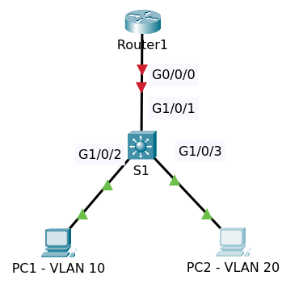
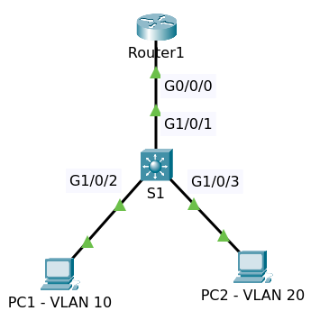

# Router on a Stick

Topology pre configuration

File packet tracer [Topology Initial](Router_on_a_stick.pkt)

## Instruction

* Configure Router on a stick as follows:
  - VLAN 1 = 10.1.1.0/24,
  - VLAN 10 = 10.1.10.0/24,
  - VLAN 20 = 10.1.20.0/24
  - Configure IP Router as last ip address in subnet
* Configure ip address Multilayer Switch S1 10.1.1.253/24
* Configure VLANs on Multilayer Switch:
  - PC1 in VLAN 10
  - PC2 in VLAN 20
* Configure link between Switch and Router
* Make sure PC1 can ping PC2
  - PC1
    + IP 10.1.10.1/24
    + Gateway 10.1.10.254
  - PC2
    + IP 10.1.20.2/24
    + Gateway 10.1.20.254

## Configuration

### Multilayer Switch S1

#### Configure VLANs

    conf t
    interface GigabitEthernet1/0/1
    switchport mode trunk
    interface GigabitEthernet1/0/2
    switchport access vlan 10
    switchport mode access
    switchport nonegotiate
    interface GigabitEthernet1/0/3
    switchport access vlan 20
    switchport mode access
    switchport nonegotiate
    end
    write

#### Configure SVI and default gateway

You must disable _ip routing_ and configure _ip default-gateway_

    conf t
    no ip routing
    ip default-gateway 10.1.1.254    
    interface Vlan1
    no shutdown
    ip address 10.1.1.253 255.255.255.0
    end
    write

>Default configuration the _ip routing_ is not enabled.

### Router R1

Configure VLANs and IP Address

    conf t
    interface GigabitEthernet0/0/0
    no shutdown
    exit
    
    interface GigabitEthernet0/0/0.1
    encapsulation dot1Q 1 native
    ip address 10.1.1.254 255.255.255.0
    
    interface GigabitEthernet0/0/0.10
    encapsulation dot1Q 10
    ip address 10.1.10.254 255.255.255.0
    
    interface GigabitEthernet0/0/0.20
    encapsulation dot1Q 20
    ip address 10.1.20.254 255.255.255.0
    end
    write

Enter command `sh ip interface brief`

    Interface                IP-Address      OK? Method Status                Protocol 
    GigabitEthernet0/0/0     unassigned      YES unset  up                    up 
    GigabitEthernet0/0/0.1   10.1.1.254      YES manual up                    up 
    GigabitEthernet0/0/0.10  10.1.10.254     YES manual up                    up 
    GigabitEthernet0/0/0.20  10.1.20.254     YES manual up                    up 
    GigabitEthernet0/0/1     unassigned      YES unset  administratively down down 
    Vlan1                    unassigned      YES unset  administratively down down

Test ping to ip 10.1.1.253 (S1).

On Switch S1 do the similar

    S1#sh ip interface brief 
    Interface              IP-Address      OK? Method Status                Protocol 
    GigabitEthernet1/0/1   unassigned      YES unset  up                    up 
    GigabitEthernet1/0/2   unassigned      YES unset  up                    up 
    GigabitEthernet1/0/3   unassigned      YES unset  up                    up 
    GigabitEthernet1/0/4   unassigned      YES unset  down                  down 
    ......
    GigabitEthernet1/1/4   unassigned      YES unset  down                  down 
    Vlan1                  10.1.1.253      YES manual up                    up

### Configure Network on PC1 and PC2

PC1

- IP 10.1.10.1/24
- Gateway 10.1.10.254

PC2

- IP 10.1.20.2/24
- Gateway 10.1.20.254

Test ping PC1 to PC2, S1 and R1.

## Final

Topology configuration

File packet tracer [Topology Final](Router_on_a_stick_Final.pkt)

