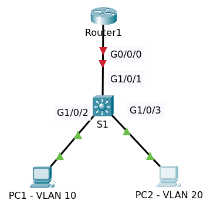
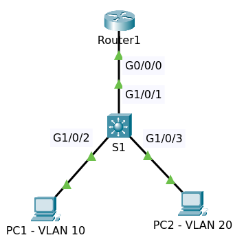

# DHCP Server

Topology pre configuration

File packet tracer [Topology Initial](DHCP_Server_Initial.pkt)

## Instruction

* Configure router R1 as follows:
  - VLAN 1 = 10.1.1.254/24,
  - VLAN 10 = 10.1.10.254/24,
  - VLAN 20 = 10.1.20.254/24
  - Loopback1 = 1.1.1.1/32
  - Then configure DHCP Server on VLAN10 and VLAN20
    + Pool name vlan10 and vlan20
    + Default gateway = ip router
    + DNS Server = ip router
    + Exclude ip address range 10.1.x.200 to 10.1.x.254 (where x is vlan number)
* Configure Multilayer Switch S1
  - VLAN1 with ip 10.1.1.253/24
  - Configure VLANs
    + PC1 in VLAN 10
    + PC2 in VLAN 20
* Configure PCs to ip dhcp

Make sure PC1 can ping PC2, switch S1, ip loopback R1 and vice versa.

## Configuration

### Multilayer Switch S1

#### Configure VLANs

    conf t
    interface GigabitEthernet1/0/1
    switchport mode trunk
    
    interface GigabitEthernet1/0/2
    switchport access vlan 10
    switchport mode access
    switchport nonegotiate
    
    interface GigabitEthernet1/0/3
    switchport access vlan 20
    switchport mode access
    switchport nonegotiate
    end
    write

#### Configure SVI and default gateway

You must disable _ip routing_ and configure _ip default-gateway_

    conf t
    no ip routing
    ip default-gateway 10.1.1.254    
    interface Vlan1
    no shutdown
    ip address 10.1.1.253 255.255.255.0
    end
    write

>Default configuration the _ip routing_ is not enabled.

### Router R1

Configure VLANs and IP Address

    conf t
    interface GigabitEthernet0/0/0
    no shutdown
    exit
    
    interface GigabitEthernet0/0/0.1
    encapsulation dot1Q 1 native
    ip address 10.1.1.254 255.255.255.0
    
    interface GigabitEthernet0/0/0.10
    encapsulation dot1Q 10
    ip address 10.1.10.254 255.255.255.0
    
    interface GigabitEthernet0/0/0.20
    encapsulation dot1Q 20
    ip address 10.1.20.254 255.255.255.0
    
    interface loopback 1
    ip address 1.1.1.1 255.255.255.255
    end
    write

Enter command `sh ip interface brief`

    Interface                IP-Address      OK? Method Status                Protocol 
    GigabitEthernet0/0/0     unassigned      YES unset  up                    up 
    GigabitEthernet0/0/0.1   10.1.1.254      YES manual up                    up 
    GigabitEthernet0/0/0.10  10.1.10.254     YES manual up                    up 
    GigabitEthernet0/0/0.20  10.1.20.254     YES manual up                    up 
    GigabitEthernet0/0/1     unassigned      YES unset  administratively down down 
    Loopback1                1.1.1.1         YES manual up                    up 
    Vlan1                    unassigned      YES unset  administratively down down

Test ping to ip 10.1.1.253 (S1).

On Switch S1 do the similar

    S1#sh ip interface brief 
    Interface              IP-Address      OK? Method Status                Protocol 
    GigabitEthernet1/0/1   unassigned      YES unset  up                    up 
    GigabitEthernet1/0/2   unassigned      YES unset  up                    up 
    GigabitEthernet1/0/3   unassigned      YES unset  up                    up 
    GigabitEthernet1/0/4   unassigned      YES unset  down                  down 
    ......
    GigabitEthernet1/1/4   unassigned      YES unset  down                  down 
    Vlan1                  10.1.1.253      YES manual up                    up

Configure DHCP Server on router R1

For VLAN 10

    conf t
    ip dhcp pool vlan10
    network 10.1.10.0 255.255.255.0
    default-router 10.1.10.254
    dns-server 10.1.10.254
    exit
    ip dhcp excluded-address 10.1.10.200 10.1.10.254

For VLAN 20

    ip dhcp pool vlan20
    network 10.1.20.0 255.255.255.0
    default-router 10.1.20.254
    dns-server 10.1.20.254
    exit
    ip dhcp excluded-address 10.1.20.200 10.1.20.254

    end
    write

### Configure Network on PC1 and PC2

Enable dhcp on PC1 and PC2.

Test ping PC1 to PC2, switch S1, ip loopback router R1 and vice versa.

### Some dhcp commands 

On router R1 enter command `sh ip dhcp pool vlan10` to show information on pool vlan10.

    Pool vlan10 :
     Utilization mark (high/low)    : 100 / 0
     Subnet size (first/next)       : 0 / 0 
     Total addresses                : 254
     Leased addresses               : 1
     Excluded addresses             : 2
     Pending event                  : none

     1 subnet is currently in the pool
     Current index        IP address range                    Leased/Excluded/Total
     10.1.10.1            10.1.10.1        - 10.1.10.254       1    / 2     / 254

Do the similar with vlan20.

Enter command `sh ip dhcp binding` to show list of ip mac address binding

    IP address       Client-ID/              Lease expiration        Type
                     Hardware address
    10.1.10.1        0060.2F7A.9C7A           --                     Automatic
    10.1.20.1        000C.8576.3D43           --                     Automatic

## Final

Topology configuration

File packet tracer [Topology Final](DHCP_Server_Final.pkt)

