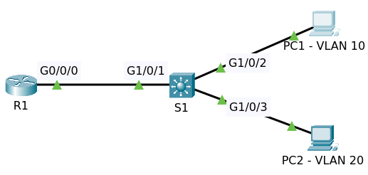

# DHCP Server 2

Topology pre configuration

File packet tracer [Topology Initial](DHCP_with_VLANs_Initial.pkt)

## Instruction

* Configure router R1 as follows:
  - Exclude first 10 IP addresses in each subnet from pool
  - Pool names = vlan10 and vlan20
  - Networks
    + VLAN10 10.1.10.0/24
    + VLAN20 10.1.20.0/24
  - Default Gateway = Switch1
  - DNS Server = router R1
  - Make sure PCs can ping each other and the ip loopback of router R1

## Pre Configuration

### Router R1

Router R1 has already been configured.

Enter comman `sh ip interface brief`

    Interface              IP-Address      OK? Method Status                Protocol 
    GigabitEthernet0/0/0   10.1.1.254      YES manual up                    up 
    GigabitEthernet0/0/1   unassigned      YES unset  administratively down down 
    Loopback0              1.1.1.1         YES manual up                    up 
    Vlan1                  unassigned      YES unset  administratively down down

Enter command `sh running-config`

    ......
    !
    interface Loopback0
     ip address 1.1.1.1 255.255.255.255
    !
    interface GigabitEthernet0/0/0
     ip address 10.1.1.254 255.255.255.0
     duplex auto
     speed auto
    !
    interface GigabitEthernet0/0/1
     no ip address
     duplex auto
     speed auto
     shutdown
    !
    interface Vlan1
     no ip address
     shutdown
    !
    ......

### Multilayer Switch S1

Switch S1 has already been configured.

Enter comman `sh ip interface brief`

    Interface              IP-Address      OK? Method Status                Protocol 
    GigabitEthernet1/0/1   unassigned      YES unset  up                    up 
    GigabitEthernet1/0/2   unassigned      YES unset  up                    up 
    GigabitEthernet1/0/3   unassigned      YES unset  up                    up 
    GigabitEthernet1/0/4   unassigned      YES unset  down                  down 
    ......
    GigabitEthernet1/1/4   unassigned      YES unset  down                  down 
    Vlan1                  10.1.1.1        YES manual up                    up 
    Vlan10                 10.1.10.1       YES manual up                    up 
    Vlan20                 10.1.20.1       YES manual up                    up

Enter command `sh running-config`

    interface GigabitEthernet1/0/1
    !
    interface GigabitEthernet1/0/2
     switchport access vlan 10
    !
    interface GigabitEthernet1/0/3
     switchport access vlan 20
    !
    interface GigabitEthernet1/0/4
    !
    ......
    interface GigabitEthernet1/1/4
    !
    interface Vlan1
     ip address 10.1.1.1 255.255.255.0
    !
    interface Vlan10
     mac-address 0090.219d.7001
     ip address 10.1.10.1 255.255.255.0
    !
    interface Vlan20
     mac-address 0090.219d.7002
     ip address 10.1.20.1 255.255.255.0
    !

## Configuration

### Router R1

Configure DHCP Server on router R1.

For VLAN 10

    conf t
    ip dhcp excluded-address 10.1.10.1 10.1.10.10
    ip dhcp pool vlan10
    network 10.1.10.0 255.255.255.0
    default-router 10.1.10.1
    dns-server 10.1.1.254
    end
    write

For VLAN 20

    conf t
    ip dhcp excluded-address 10.1.20.1 10.1.20.10    
    ip dhcp pool vlan20
    network 10.1.20.0 255.255.255.0
    default-router 10.1.20.1
    dns-server 10.1.1.254
    end
    write

### Multilayer Switch S1

Enter command `sh interfaces gigabitEthernet 1/0/1 switchport`

    Name: Gig1/0/1
    Switchport: Enabled
    Administrative Mode: dynamic auto
    Operational Mode: static access
    Administrative Trunking Encapsulation: dot1q
    Operational Trunking Encapsulation: native
    Negotiation of Trunking: On
    Access Mode VLAN: 1 (default)
    Trunking Native Mode VLAN: 1 (default)
    Voice VLAN: none
    ......

The port Gig1/0/1 already on VLAN 1 and switch S1 can ping to ip 10.1.1.254 belong to router R1.

We have configured DHCP on the router, but the router is separated by a layer 3 switch.
We need to do some configuration on the switch to allow DHCP request messages to be 
forwarded to the router.

#### IP Helper

Configure _ip helper_ on SVI for each VLAN to forward DHCP requests to the router R1.

For VLAN 10

    conf t
    int vlan 10
    ip helper-address 10.1.1.254
    end
    write

For VLAN 20

    conf t
    int vlan 20
    ip helper-address 10.1.1.254
    end
    write

Now DHCP requests will be forwarded to the router but the router needs to know about those networks.

If a router receives a DHCP request from a network that it's not aware of, it won't allocate IP addresses.
So on the router R1, create a static route pointing to the switch for network 10.1.10.0 and 10.1.20.0.

    conf t
    ip route 10.1.10.0 255.255.255.0 10.1.1.1
    ip route 10.1.20.0 255.255.255.0 10.1.1.1
    end
    write

On router R1, enter command `sh ip route`

    Gateway of last resort is not set

         1.0.0.0/32 is subnetted, 1 subnets
    C       1.1.1.1/32 is directly connected, Loopback0
         10.0.0.0/8 is variably subnetted, 4 subnets, 2 masks
    C       10.1.1.0/24 is directly connected, GigabitEthernet0/0/0
    L       10.1.1.254/32 is directly connected, GigabitEthernet0/0/0
    S       10.1.10.0/24 [1/0] via 10.1.1.1
    S       10.1.20.0/24 [1/0] via 10.1.1.1

Test ping to ip 10.1.10.1 and 10.1.20.1.

#### Static Routing

Back to switch S1, configure routing to the ip loopback of router R1.

    conf t
    ip route 1.1.1.1 255.255.255.255 10.1.1.254
    end
    write

Test ping to 1.1.1.1

#### Enable IP Routing

Inter VLAN routing should be enabled in order to the PCs from different VLANs can ping each other.

    conf t
    ip routing
    end
    write

### Configure Network on PC1 and PC2

Enable dhcp on PC1 and PC2.

Test ping PC1 to PC2, switch S1, ip loopback router R1 and vice versa.

## Final

File packet tracer [Topology Final](DHCP_with_VLANs_Final.pkt)

