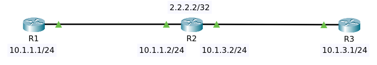
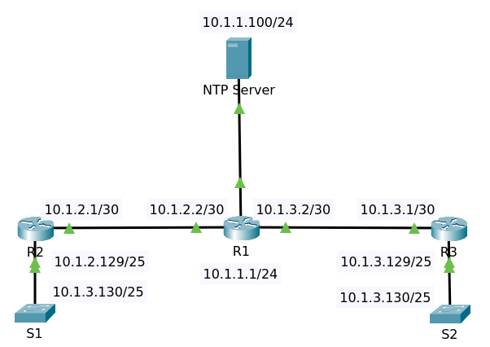
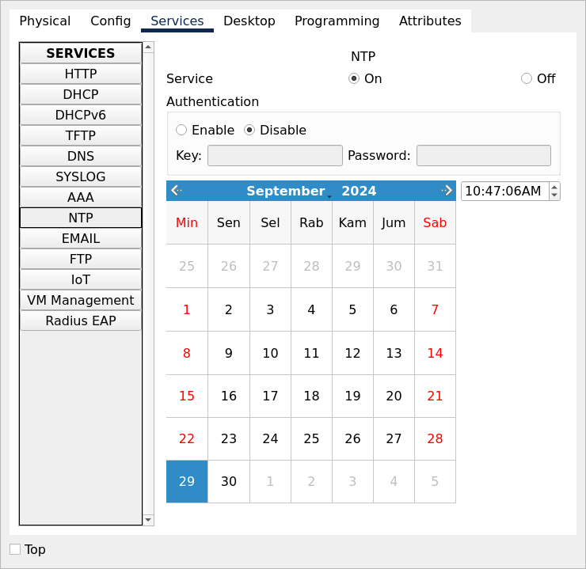

# NTP Server

## Setup Router as NTP Server



File packet tracer [Topology](topology.pkt)

### Setup Router R2 as NTP Server

Configuration

    conf t
    no ip domain-lookup
    clock timezone WIB 7
    interface Loopback0
    ip address 2.2.2.2 255.255.255.255
    exit

    interface GigabitEthernet0/0/0
    ip address 10.1.1.2 255.255.255.0
    no shutdown
    exit

    interface GigabitEthernet0/0/1
    ip address 10.1.3.2 255.255.255.0
    no shutdown
    exit

    router eigrp 1
    network 10.0.0.0
    network 2.2.2.2 0.0.0.0
    no auto-summary
    end
    write

Enter command `sh running-config | sec router eigrp`

    router eigrp 1
     network 10.0.0.0
     network 2.2.2.2 0.0.0.0

Others

    R2#sh running-config | sec interface GigabitEthernet0/0/0
    interface GigabitEthernet0/0/0
     ip address 10.1.1.2 255.255.255.0
     duplex auto
     speed auto

Set clock

    clock set 12:30:00 17 Sep 2024

>Real clock now minus 7

Setup NTP

    conf t
    ntp master 10
    ntp server 2.2.2.2
    
#### NTP commands

Command `sh ntp associations`

    address         ref clock       st   when     poll    reach  delay          offset            disp
     ~2.2.2.2       .LOCL.          11   5        16      377    1.00           1.00              0.12
    *~127.127.1.1   .LOCL.          9    4        64      377    0.00           0.00              0.11
     * sys.peer, # selected, + candidate, - outlyer, x falseticker, ~ configured

Command `sh ntp status`

    Clock is synchronized, stratum 10, reference is 127.127.1.1
    nominal freq is 250.0000 Hz, actual freq is 249.9990 Hz, precision is 2**24
    reference time is FFFFFFFFEA672136.000002B6 (12:27:34.694 UTC Tue Sep 17 2024)
    clock offset is 0.00 msec, root delay is 0.00  msec
    root dispersion is 0.00 msec, peer dispersion is 0.11 msec.
    loopfilter state is 'CTRL' (Normal Controlled Loop), drift is - 0.000001193 s/s system poll interval is 4, last update was 8 sec ago.

### Setup Router R1 as NTP Client

Configuration

    conf t
    no ip domain-lookup
    clock timezone WIB 7
    interface GigabitEthernet0/0/0
    ip address 10.1.1.1 255.255.255.0
    no shutdown
    
    router eigrp 1
    network 10.0.0.0
    no auto-summary

    ntp server 2.2.2.2

    end
    write

Enter command `sh ntp status`

    Clock is synchronized, stratum 11, reference is 2.2.2.2
    nominal freq is 250.0000 Hz, actual freq is 249.9990 Hz, precision is 2**24
    reference time is FFFFFFFFEA76C8A8.000000DA (9:26:0.218 UTC Sun Sep 29 2024)
    clock offset is 2.00 msec, root delay is 2.00  msec
    root dispersion is 2016.33 msec, peer dispersion is -137269716642249.73 msec.
    loopfilter state is 'CTRL' (Normal Controlled Loop), drift is - 0.000001193 s/s system poll interval is 4, last update was 8 sec ago.

Enter command `sh clock`

    20:4:0.772 WIB Tue Sep 17 2024

Enter command `sh ntp associations`

    address         ref clock       st   when     poll    reach  delay          offset            disp
    *~2.2.2.2       .LOCL.          11   12       16      377    2.00           2.00              -137269716642249.73
     ~127.127.1.1   .LOCL.          9    11       64      377    0.00           0.00              -137269716642249.73
     * sys.peer, # selected, + candidate, - outlyer, x falseticker, ~ configured

### Setup Router R3 as NTP Client

Configuration

    conf t
    no ip domain-lookup
    clock timezone WIB 7
    interface GigabitEthernet0/0/0
    ip address 10.1.3.1 255.255.255.0
    no shutdown
    
    router eigrp 1
    network 10.0.0.0
    no auto-summary

    ntp server 2.2.2.2

    end
    write

Enter command `sh ntp status`

    Clock is unsynchronized, stratum 16, no reference clock
    nominal freq is 250.0000 Hz, actual freq is 249.9990 Hz, precision is 2**24
    reference time is 00000000.00000000 (00:00:00.000 UTC Mon Jan 1 1990)
    clock offset is 0.00 msec, root delay is 0.00  msec
    root dispersion is 0.00 msec, peer dispersion is 0.00 msec.
    loopfilter state is 'FSET' (Drift set from file), drift is - 0.000001193 s/s system poll interval is 4, never updated.

Enter command `sh clock`

    *20:4:47.571 WIB Tue Sep 17 2024

Enter command `sh ntp associations`

    address         ref clock       st   when     poll    reach  delay          offset            disp
     ~2.2.2.2       .STEP.          16   1.72655e+0964      0      0.00           0.00              0.48
     ~10.1.3.2      2.2.2.2         11   9        16      377    0.00           3.00              0.12
     * sys.peer, # selected, + candidate, - outlyer, x falseticker, ~ configured

### Problems

With packet tracer the clock at the router R1 or R3 not always synced with the ntp server R2!
    
## Server NTP





>Clock at NTP is in UTC timezone.

File packet tracer [Topology](topology_ntp_server.pkt)

Setup dedicated server as NTP server. All routers and switches have clock synced.

All routers have enabled EIGRP

    conf t
    router eigrp 100
    network 10.0.0.0
    no auto-summary
    end
    write

Enter command `sh run` on switch S2

```
Current configuration : 1187 bytes
!
version 15.0
no service timestamps log datetime msec
no service timestamps debug datetime msec
no service password-encryption
!
hostname S2
!
!
!
clock timezone WIB 7
!
no ip domain-lookup
!
...
!
interface FastEthernet0/1
!
...
!
interface GigabitEthernet0/2
!
interface Vlan1
 ip address 10.1.3.130 255.255.255.128
!
ip default-gateway 10.1.3.129
!
...
!
ntp server 10.1.1.100
!
end
```


