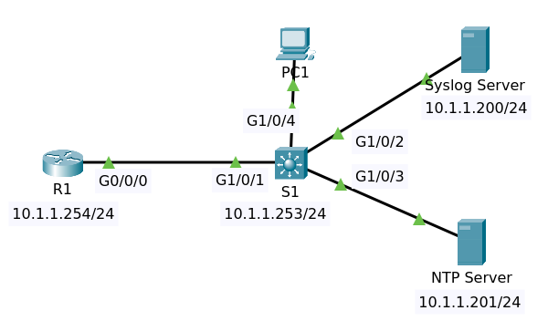
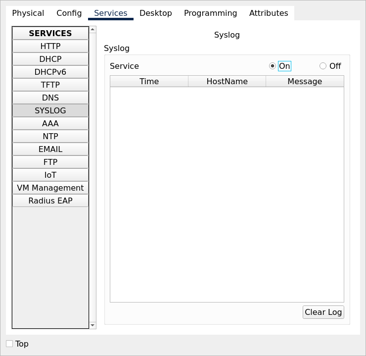
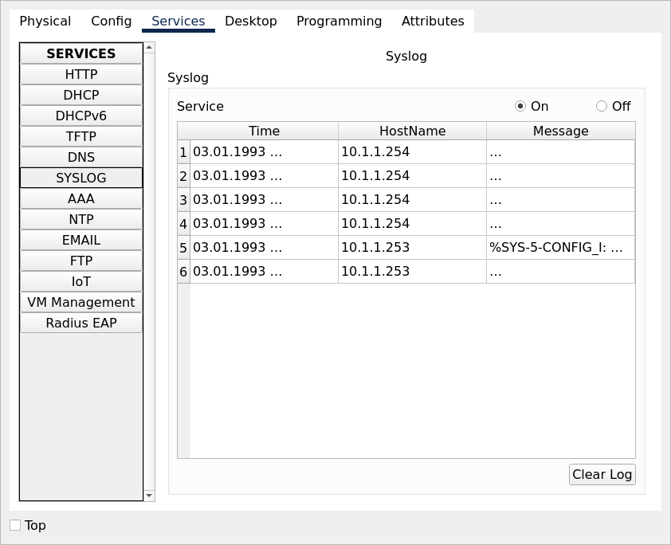
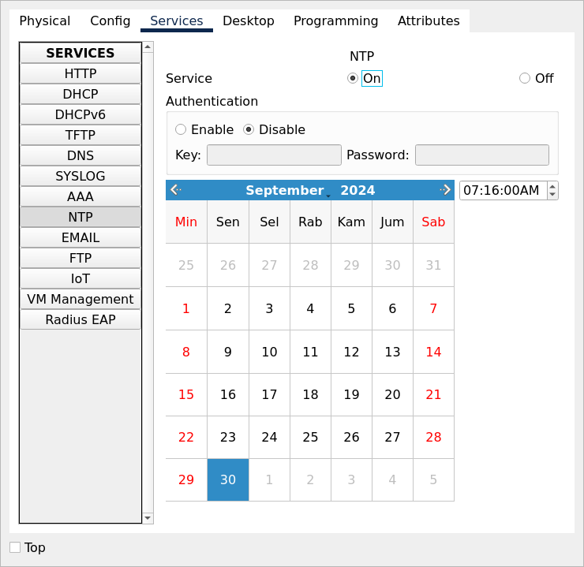
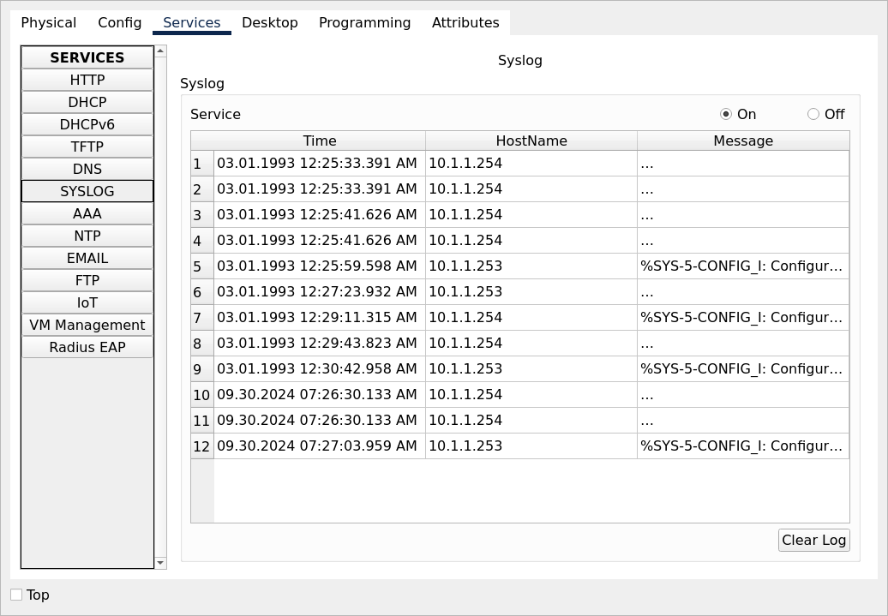

# NTP and Syslog

File packet tracer [Syslog and NTP](Syslog_and_NTP_Initial.pkt).

## Objectives

Configure Syslog and NTP:

Syslog

1. Configure the syslog server
2. Configure R1 and S1 to log messages to the syslog server
3. Create a loopback interface on R1 and verify that syslog messages are displayed
4. Shut the looback interface and verify that syslog messages are displayed. Then enable the loopback interface
5. Shut and then no shut the interface on the switch to the PC and verify that syslog messages are displayed

NTP

1. Configure the NTP server
2. Check the time on R1 and S1
3. Configure R1 and S1 to send timestamps to the syslog server
4. Configure R1 and S1 to get time from the NTP server
5. Verify that the clocks are set right
6. Shut the loopback and then enable it on R1 and verify that syslog messages show the correct time
7. Shut the interface on the switch to the PC and verify that syslog messages are displayed with the correct time

## Syslog Server

Enable

Configure Syslog on router and switch.

    conf t
    logging host 10.1.1.200
    service timestamps log datetime msec 
    end
    write

The logging at Syslog.

## Configure NTP

Enable

Configure ntp server on router and switch.

    conf t
    ntp server 10.1.1.201
    end write

The logging at Syslog now have the real timestamps.

