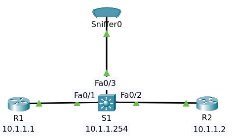
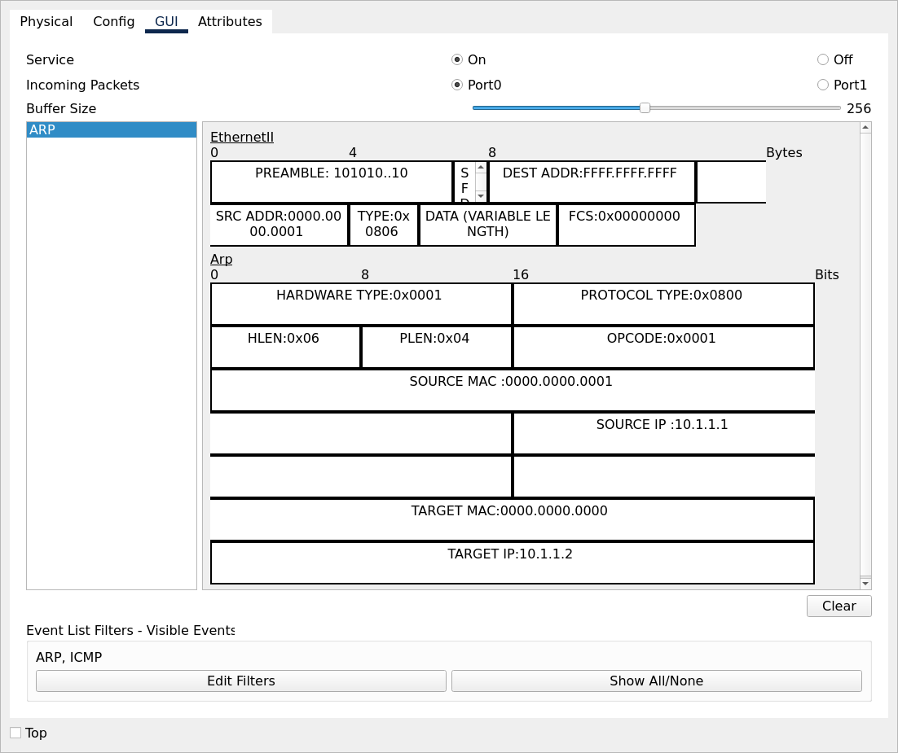
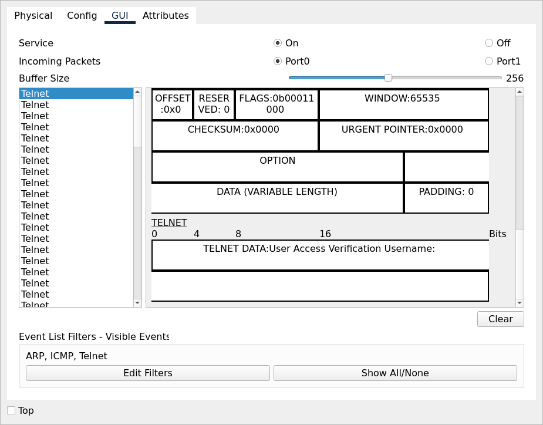
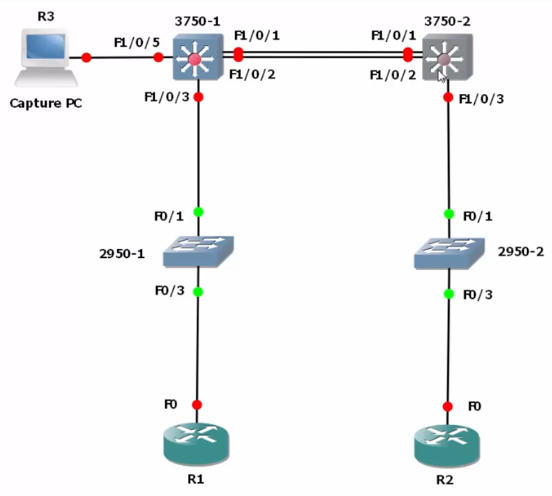

# Port SPAN (Mirroring)

Span or switched port analyzer also called port mirroring or port monitoring, is a way to configure
a switch to make copies of Ethernet frames that are received on certain ports or certain VLANs.

You could say as an example that all traffic arriving on Port Gigabit 1/0/1 gets copied out of 
another port gigabit 1/0/2 or you could say that all traffic that's received or sent on VLAN 1 
is copied out of gigabit 1/0/2. Span becomes really important when you want to monitor traffic 
that's not destined to a specific device.

As an example, you may have a network analyzer or intrusion detection system that needs to monitor
traffic that traverses your network. You can configure a switch to either make copies of frames 
out of a local port or, as you'll learn later, use what is called remote SPAN where you copy 
frames from a local switch to a remote switch so that a remote monitoring station can receive the traffic.



## Initial Configuration

We add a sniffer from packet tracer to sniff the network.

### Router R1

    conf t
    no ip domain-lookup
    int gi0/0
    mac-address 0000.0000.0001
    no shutdown
    ip address 10.1.1.1 255.255.255.0
    end
    write

### Router R2

    conf t
    no ip domain-lookup
    int gi0/0
    mac-address 0000.0000.0002
    no shutdown
    ip address 10.1.1.2 255.255.255.0
    end
    write

### Switch S1

    conf t
    no ip domain-lookup
    int vlan 1
    no shutdown
    ip address 10.1.1.254 255.255.255.0
    end
    write

### Sniffer

It only catch arp & icmp only.

At first, mac address table on S1 is empty.

Enter command `sh mac address-table`

```
          Mac Address Table
-------------------------------------------

Vlan    Mac Address       Type        Ports
----    -----------       --------    -----
```

 When R1 ping to R2 the sniffer catchs the arp traffic.



But the next traffic from R1 to R2 and vice versa couldn't be catched by sniffer.

## Configure SPAN

### Monitor vlan traffic

```
Switch#conf t
Enter configuration commands, one per line.  End with CNTL/Z.
Switch(config)#monitor session ?
  <1-2>  SPAN session ID
Switch(config)#monitor session 1 source ?
  interface  SPAN source or destination interface
  remote     RSPAN
  vlan       SPAN source or destination VLAN
Switch(config)#monitor session 1 source vlan 1 ?
  ,     sequence separator
  -     range separator
  both  SPAN copies both egress and ingress traffic
  rx    SPAN copies only ingress traffic
  tx    SPAN copies only egress traffic
  <cr>
Switch(config)#monitor session 1 source vlan 1 both 

```

You need to be careful spanning a VLAN if a lot of traffic is transmitted and received on that VLAN,
you could oversubscribe the port as an example of this switch had 24 ports and you spanned all of
those ports to this single interface. You would possibly overwhelm this physical interface.

As another example, you don't want to span a gigabit port to 100 meg port and in the same way, you need 
to make sure that you're capturing device can handle the traffic that it's receiving.

You don't want to, as an example, forward 1 gigabit per second of traffic to PC with a slow CPU
that can't capture or handle the amount of traffic that you're throwing at it.

```
Switch(config)#monitor session 1 destination interface fastEthernet 0/3
end
```

We need to specify the same session number and we're going to specify a destination in this case it's 
going to be a local interface on the switch, FastEthernet 0/3.

Enter command `sh running-config | in monitor`

```
monitor session 1 source vlan 1
monitor session 1 destination interface Fa0/3
```

Enter command `sh monitor`

```
Session 1
---------
Type                   : Local Session
Description            : -
Source VLANs           :
    Both               : 1
Destination Ports      : Fa0/3
    Encapsulation      : Native
          Ingress      : Disabled
```

On Sniffer we add telnet to catch. This is the packets telnet .

In this example, because we are capturing traffic sent and received on the VLAN, we're getting some
duplicates.

### Monitor Interface Traffic

On switch S1

    conf t
    no monitor session 1
    monitor session 1 source interface Fa0/1 both
    monitor session 1 destination interface Fa0/3
    end
    write

Enter command `sh run | in monitor`

    monitor session 1 source interface Fa0/1
    monitor session 1 destination interface Fa0/3

Enter command `sh monitor`

    Session 1
    ---------
    Type                   : Local Session
    Description            : -
    Source Ports           : 
        Both               : Fa0/1
    Destination Ports      : Fa0/3
        Encapsulation      : Native
              Ingress      : Disabled

Telnet again from R1 to R2.

### Ingress Traffic

When you enable span on a switch, as we've got over here, the switch no longer learns Mac addresses
on the span destination port. It also doesn't allow traffic to be received from that port.

So if router 1 pings router 2, it works and the mac addresses are shown in the mac address table, 
but router 1 is not able to ping the capturing device (R3).



On switch configure again

    conf t
    no monitor session 1
    monitor session 1 source interface Fa 1/0/3 both
    monitor session 1 destination interface Fa 1/0/5 ingress untagged vlan 1
    end


But the point to remember is that if we don't use the ingress command, the monitoring station is not
able to participate in the network.


