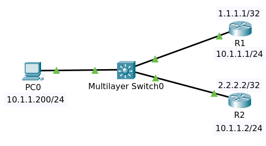
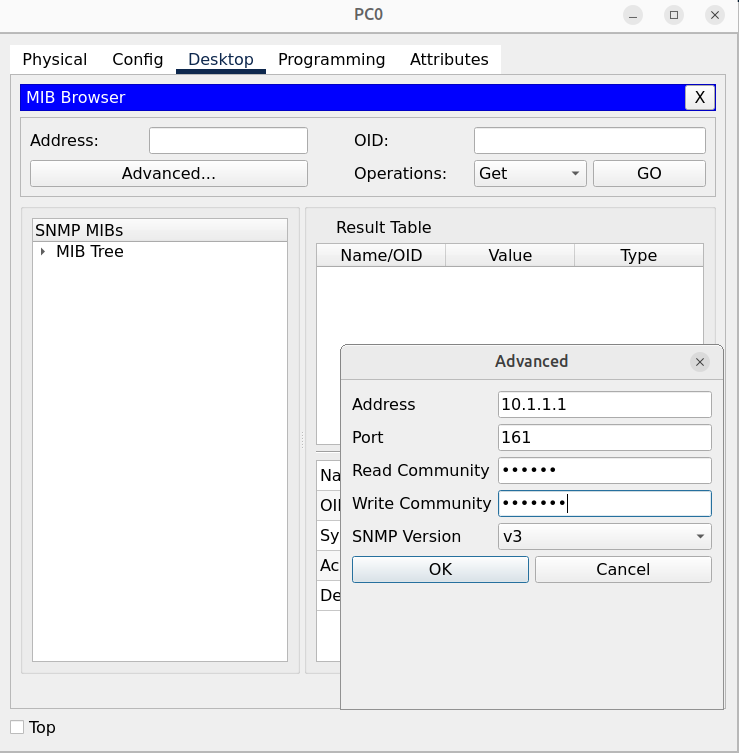
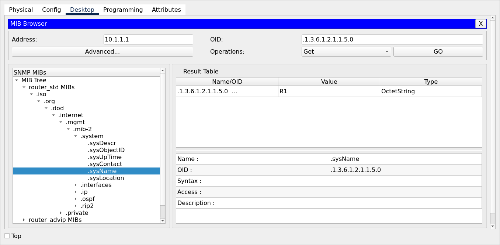
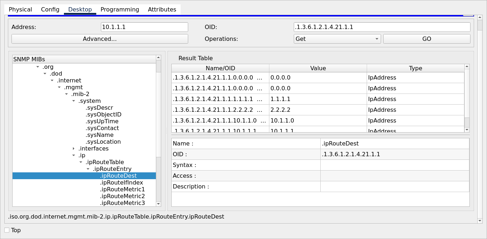
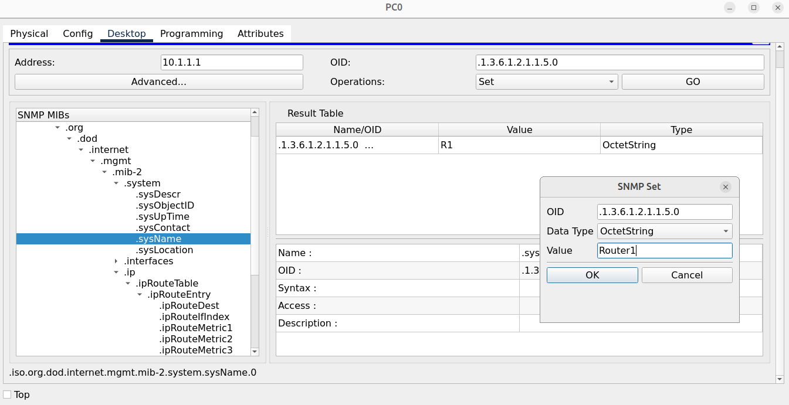

# SNMP

Topology

File packet tracer [SNMP](SNMP_Initial.pkt).

## Objectives

Complete the following SNMP tasks:

1. Enable SNMP on both R1 and R2:
   - ro community = public
   - rw community = private
2. Use the MIB browser (SMNP v3) on the PC to view the hostname of R1 and R2
3. View the interfaces on R1 using the MIB browser on the PC
4. View the interface types on R1 via the MIB Browser
5. View the routing table of R1 via the MIB Browser
6. View the OSPF Area of R1 via the MIB Browser
7. View the router-id R1 via the MIB Browser
8. View the OSPF neighbors of R1 via the MIB Browser
9. Change the name of R1 to "Router1" using the MIB browser on the PC

### Configuration

On R1 and R2

conf t
snmp-server community public ro
snmp-server community private rw

### SNMP Get

On PC open MIB Browser

Using MIB Browser get the sysname.

Showing ip route at MIB Browser.

### SNMP Set

Change the name of the router. Set the Operations to Set.

Then click Go.

