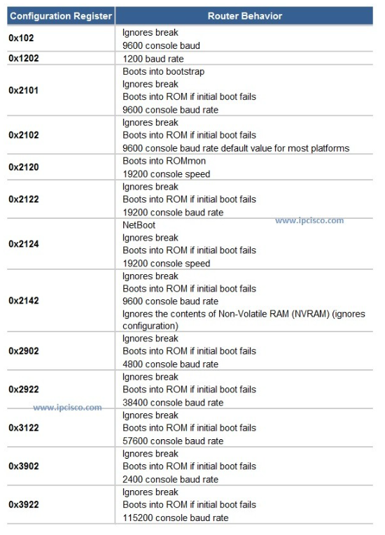
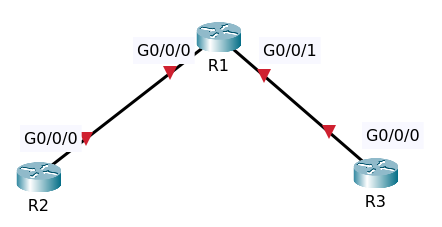
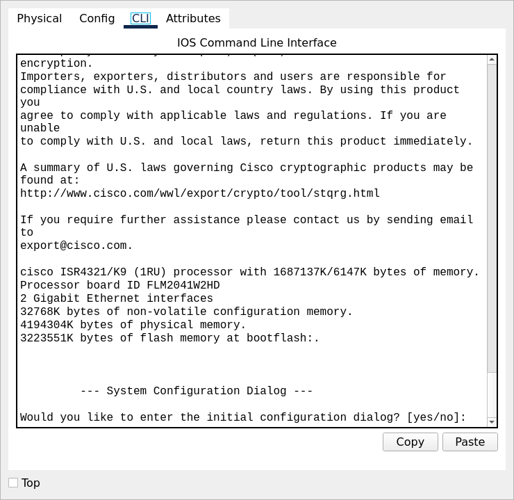
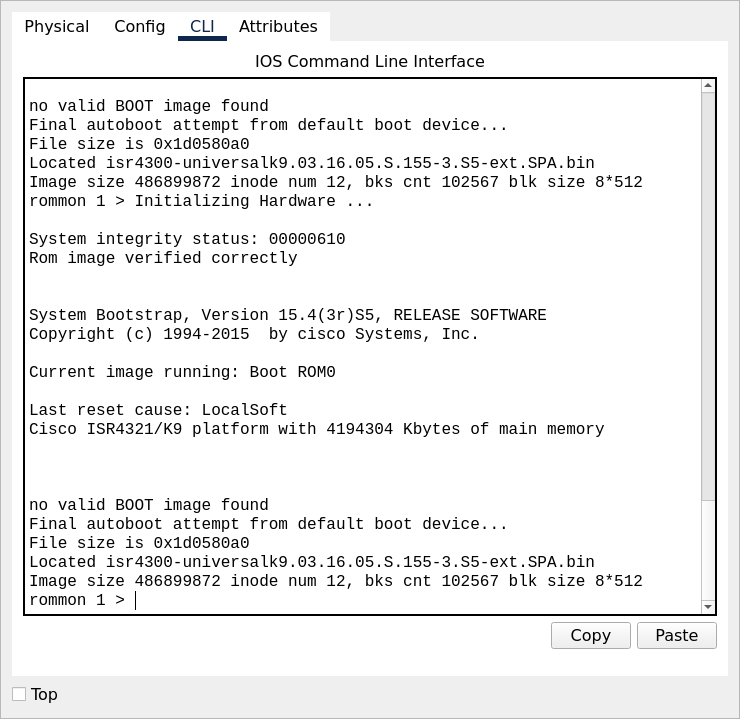
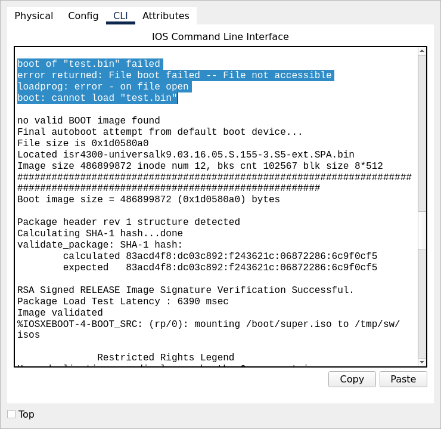

# Configuration Register Troubleshooting

## Introduction

[Understand Configuration Register Usage on all Routers](https://www.cisco.com/c/en/us/support/docs/routers/10000-series-routers/50421-config-register-use.html)



## Objectives

After a power outage the network has stopped working.
Fix the issues and ensure configurations are restored so that the routers can ping all loopbacks.
Verification: Use the Power Cycle Devices option in Packet Tracer to reboot devices. Make sure that configs are restored and loopbacks are pingable.
Using password cisco.
 
>To simulate this, click the "Power Cycle Devices" button in Packet Tracer. 



Pakcet tracer file [Topology](Network_Down_Initial.pkt).

After doing "Power Cycle Devices"



There's no configuration, just a standard default configuration.



Router R2 has booted into ROM Monitor Mode.



Router R3 has a boot file missing.

### Fix Router R2

Use _?_ to view available commands.

```
rommon 1 > ?
boot                boot up an external process
confreg             configuration register utility
dir                 list files in file system
help                monitor builtin command help
reset               system reset
set                 display the monitor variables
tftpdnld            tftp image download
unset               unset a monitor variable
```

Use command `confreg` and set the configuration register to normal boot then enter reset.

```
rommon 3 > confreg 0x2102
rommon 4 > reset
```

The router is now booting up.

Enter command `sh ip interface brief`

```
Interface              IP-Address      OK? Method Status                Protocol 
GigabitEthernet0/0/0   10.1.1.2        YES NVRAM  up                    down 
GigabitEthernet0/0/1   unassigned      YES NVRAM  administratively down down 
Loopback0              2.2.2.2         YES NVRAM  up                    up 
Vlan1                  unassigned      YES NVRAM  administratively down down
```

Let's confirm what the configuration register is set by entering command `show version`.

```
...
cisco ISR4321/K9 (1RU) processor with 1687137K/6147K bytes of memory.
Processor board ID FLM2041W2HD
2 Gigabit Ethernet interfaces
32768K bytes of non-volatile configuration memory.
4194304K bytes of physical memory.
3223551K bytes of flash memory at bootflash:.


Configuration register is 0x2102
```

Shows us that the configuration register is set to _0x2102_. That's what is should be set to.

If the configuration register is set 0x2100 that causes the router to boot into ROM

```
conf t
config-register 0x2100
end
```

Enter command `sh version` notice the next value of configuration register.

```

Configuration register is 0x2102 (will be 0x2100 at next reload)

```

if the router was reload without saving the configuration, it will be end up in ROM monitor mode.

```
R2#reload
System configuration has been modified. Save? [yes/no]:no
Proceed with reload? [confirm]
Initializing Hardware ...

System integrity status: 00000610
Rom image verified correctly


System Bootstrap, Version 15.4(3r)S5, RELEASE SOFTWARE
Copyright (c) 1994-2015  by cisco Systems, Inc.

Current image running: Boot ROM0

Last reset cause: LocalSoft
Cisco ISR4321/K9 platform with 4194304 Kbytes of main memory


no valid BOOT image found
Final autoboot attempt from default boot device...
File size is 0x1d0580a0
Located isr4300-universalk9.03.16.05.S.155-3.S5-ext.SPA.bin
Image size 486899872 inode num 12, bks cnt 102567 blk size 8*512
rommon 1 > 
```

Now fix the problem by running the same procedures.

### Fix Router R1

We've been able to get into the router, but there's no configuration, just a standard default configuration 
exists on the router. As an example, there are no IP addresses, there are no routing protocols running on the router,

Why did it boot and not load the startup configuration? Why did we get prompted with the system configuration 
dialog or initial configuration dialog.

Enter command `show version`

```

Configuration register is 0x2142

```

Notice the configuration register is set to 0x2142,

That again configures the router to ignore NVRAM, in other words, ignore the startup configuration.
So we're going to want to change that, so set config register to 0x2102

```
conf t
config-register 0x2102
end
```

Do `show version` again it show the configuration register at next reload.

```

Configuration register is 0x2142 (will be 0x2102 at next reload)

```

Then reload.

After booting the router R1 has loaded the startup configuration

```
R1#sh ip interface brief 
Interface              IP-Address      OK? Method Status                Protocol 
GigabitEthernet0/0/0   10.1.1.1        YES NVRAM  up                    up 
GigabitEthernet0/0/1   10.1.2.1        YES NVRAM  up                    down 
Loopback0              1.1.1.1         YES NVRAM  up                    up 
Vlan1                  unassigned      YES NVRAM  administratively down down
```

### Fix Router R3

On router 3 do `show version`. Notice the configuration register is set to this value on a 
very old router such as 2500 or 1600, the routers used to have a mini operating system.
Modern day routers don't have that. That value is essentially irrelevant for a lot of modern-day routers.

```

Configuration register is 0x2101

```

Set it to 0x2102.

```
conf t
config-register 0x2102
end
```

Then reload.

There's a issue where test.bin is not found. Why is the router trying to load this test.bin file?

```

boot of "test.bin" failed
error returned: File boot failed -- File not accessible
loadprog: error - on file open
boot: cannot load "test.bin"

```

Command `dir` shows the contents of flash

```
Directory of flash:/

    3  -rw-   486899872          <no date>  isr4300-universalk9.03.16.05.S.155-3.S5-ext.SPA.bin
    7  -rw-         703          <no date>  live-config
    2  -rw-       28282          <no date>  sigdef-category.xml
    1  -rw-      227537          <no date>  sigdef-default.xml

3249049600 bytes total (2761893206 bytes free)
```

The router has defaulted to using the first operating system found in flash that is _isr4300-universalk9.03.16.05.S.155-3.S5-ext.SPA.bin_

Enter command `sh run | in boot`

```
boot system flash test.bin
```

Remove the boot command

```
conf t
no boot system flash test.bin
end
```

Enter command `sh run | in boot` the boot command has been removed.

The router doesn't have any configuration.

```
R3#sh ip interface brief 
Interface              IP-Address      OK? Method Status                Protocol 
GigabitEthernet0/0/0   unassigned      YES NVRAM  administratively down down 
GigabitEthernet0/0/1   unassigned      YES NVRAM  administratively down down 
Vlan1                  unassigned      YES NVRAM  administratively down down
```

Show start shows us the startup configuration with the boot system command but the router once 
again doesn't have any IP addresses configured and doesn't have a routing protocol configured.

when used the `dir` command that a backup configuration is available in the flash of the router?

Enter command `more flash:live-config` to show the contents of the file that actually the startup config

Copy the file from flash to the running configuration of the router.

```
R3#copy flash running-config 
Source filename []? live-config
Destination filename [running-config]? 

703 bytes copied in 0.416 secs (1689 bytes/sec)
```

Enter command `sh ip interface brief`

```
Interface              IP-Address      OK? Method Status                Protocol 
GigabitEthernet0/0/0   10.1.2.2        YES manual administratively down down 
GigabitEthernet0/0/1   unassigned      YES NVRAM  administratively down down 
Loopback0              3.3.3.3         YES manual up                    up 
Vlan1                  unassigned      YES NVRAM  administratively down down
```

Notice the interface Gi0/0/0 is  still shut down. Enter command `no shutdown` for the interface

    conf t
    interface gigabitEthernet 0/0/0
    no shut
    end
    write

But the startup configuration still incorrect.

```
R3#sh running-config | in boot
boot system flash test.bin
```

Remove the boot command

```
conf t
no boot system flash test.bin
end
```

Then copy the running-config to the startup-config.

We need to verify this by power cycling devices, so I'm going to click power cycle devices.


