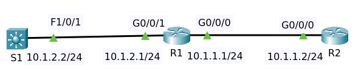
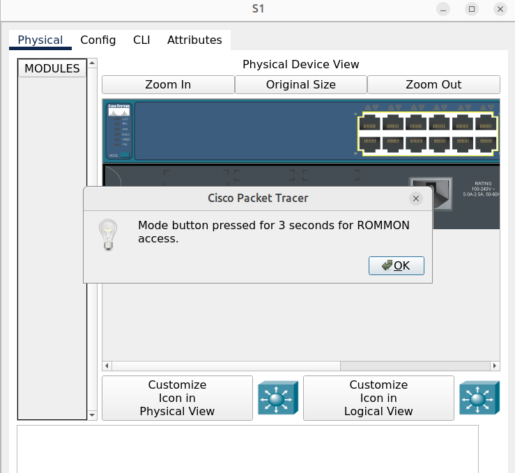
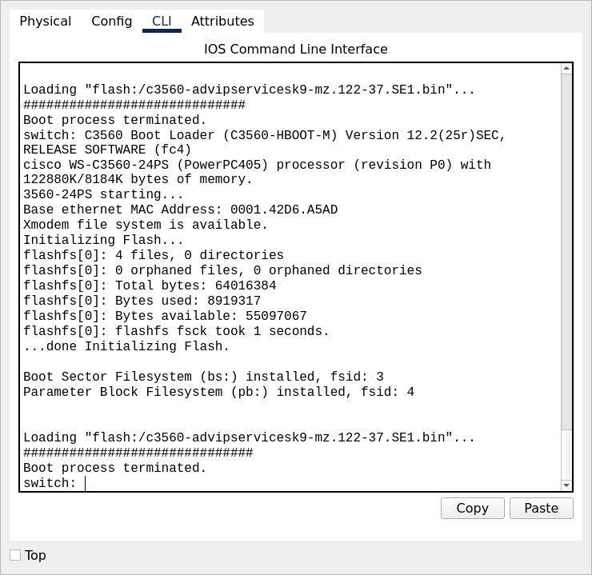
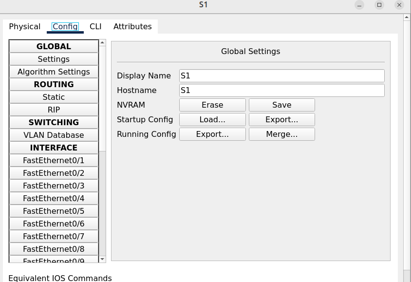
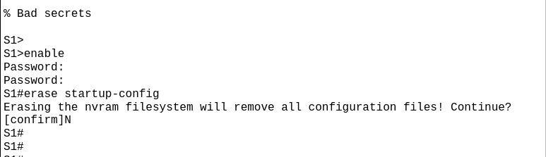

# Password Recovery



Paket tracer file []().

## Objectives

Do a password recovery on devices

1. R1 = reset enable password to "cisco"
2. R2 = reset secret password to "cisco"
3. S1 = reset secret password to "cisco" (watch next video if needed as Packet Tracer does not support all required options)
4. Very that device configurations are restored and that devices can ping all loopbacks
5. Verify that when devices are reloaded, configurations are restored using the new passwords

References

- [Troubleshooting Guide for the Cisco 4000 Series Integrated Services Router](https://goo.gl/fZJLnp)
- [Catalyst 3560 Software Configuration Guide, Release 12.2(52)SE](https://goo.gl/vnCtvn)

## Devices

### Router R1

Can't enter the privilege mode because the password is unknown.

```
R1>en
Password: 
Password: 
Password: 
% Bad secrets

R1>
```

On the router turn off the power and turn it on again, then press Ctrl+C.

```
R1>Initializing Hardware ...

System integrity status: 00000610
Rom image verified correctly

System Bootstrap, Version 15.4(3r)S5, RELEASE SOFTWARE
Copyright (c) 1994-2015  by cisco Systems, Inc.

Current image running: Boot ROM0

Last reset cause: LocalSoft
Cisco ISR4321/K9 platform with 4194304 Kbytes of main memory

no valid BOOT image found
Final autoboot attempt from default boot device...
File size is 0x1d0580a0
Located isr4300-universalk9.03.16.05.S.155-3.S5-ext.SPA.bin
Image size 486899872 inode num 12, bks cnt 102567 blk size 8*512
###########
monitor: command "boot" aborted due to user interrupt
rommon 1 > 
```

Question mark Enter shows us various options available in ROM mon or ROM monitor mode

```
rommon 1 > ?
boot                boot up an external process
confreg             configuration register utility
dir                 list files in file system
help                monitor builtin command help
reset               system reset
set                 display the monitor variables
tftpdnld            tftp image download
unset               unset a monitor variable
```

We're going to want to bypass the startup configuration by setting the configuration register to 0x2142 then reset.

```
rommon 2 > confreg 0x2142
rommon 3 > reset
Initializing Hardware ...
```

Now router has booted using a default configuration. Type enable. Notice, the startup configuration 
shows me the enable password that is shown in clear text so we would know that password here, but you 
can bypass that even if you don't know what the password is.

Enter command `sh startup-config`

```
...
no service timestamps log datetime msec
no service timestamps debug datetime msec
no service password-encryption
!
hostname R1
!
!
!
enable password youdontknow
!
```

Enter command `sh ip interface brief`

```
Interface              IP-Address      OK? Method Status                Protocol 
GigabitEthernet0/0/0   unassigned      YES unset  administratively down down 
GigabitEthernet0/0/1   unassigned      YES unset  administratively down down 
Vlan1                  unassigned      YES unset  administratively down down
```

Copy the startup config to the running config

```
copy startup-config running-config
```

Enter command `sh ip interface brief` again.

```
Interface              IP-Address      OK? Method Status                Protocol 
GigabitEthernet0/0/0   10.1.1.1        YES manual administratively down down 
GigabitEthernet0/0/1   10.1.2.1        YES manual administratively down down 
Loopback0              1.1.1.1         YES manual up                    up 
Vlan1                  unassigned      YES unset  administratively down down
```

You still have to no shutdown the interfaces. First make password to cisco

    conf t
    service password-encryption 
    enable password cisco
    interface gigabitEthernet0/0/0
    no shutdown 
    interface gigabitEthernet0/0/1
    no shutdown

Now, just be careful, even though we've saved the configuration and we can log back into the router.
The running configuration doesn't affect the configuration register.
So show version,

```
Configuration register is 0x2142
```

I need to configure the configuration register, so I'm going to set that to 0x2102.

```
conf t
config-register 0x2102
end
```

### Router R2

The router R2 has a similar problem when I type enable, I don't know the password of R2.

We're going to want to bypass the startup configuration by setting the configuration register to 0x2142 then reset.

```
rommon 2 > confreg 0x2142
rommon 3 > reset
Initializing Hardware ...
```

Now router has booted using a default configuration. Type enable. Notice, the startup configuration 
has the secret password set. We don't know what that password is.

Enter command `sh startup-config`

```
no service timestamps log datetime msec
no service timestamps debug datetime msec
no service password-encryption
!
hostname R2
!
!
!
enable secret 5 $1$mERr$iVh58iN/84.Z6GN4Yams11
!
...
```

Copy the startup config to running config.

```
copy startup-config running-config
```

Enter command `sh ip interface brief`

You still have to no shutdown the interfaces. Then reset password to cisco.

```
conf t
enable secret cisco
end
write
```

Now, again, just because we've saved the configuration of the router doesn't mean that things are going to work.
I need to set the configuration register to 0x2102.

```
conf t
config-register 0x2102
end
```

### Switch S1

In our example, we have a default configuration where password recovery is permitted.

Follow the steps in this procedure if you have forgotten or lost the switch password.

1. Connect a terminal or PC with terminal-emulation software to the switch console port.
2. Set the line speed on the emulation software to 9600 baud.
3. Power off the switch.
4. Reconnect the power cord to the switch and, within 15 seconds, press the Mode button while 
the System LED is still flashing green. Continue pressing the Mode button until the System LED 
turns briefly amber and then solid green; then release the Mode button.



Press the Mode button



The switch is in rom mon mode.

Now that the boot process was terminated. Enter question mark.

```
switch: ?
           ? -- Present list of available commands
        boot -- Load and boot an executable image
      delete -- Delete file(s)
         dir -- List files in directories
  flash_init -- Initialize flash filesystem(s)
        help -- Present list of available commands
      rename -- Rename a file
       reset -- Reset the system
         set -- Set or display environment variables
       unset -- Unset one or more environment variables
```

Now that we've got into ROM monitor mode, we need to use the command `flash_init`.

```
switch: flash_init
Initializing Flash...
...The flash is already initialized.
```

We're told that the flash is already initialized. Next command is `dir flash:`

```
switch: dir flash:
Directory of flash:/

3    -rw-  8662192   <date>               c3560-advipservicesk9-mz.122-37.SE1.bin
4    -rw-  1306      <date>               config.text
2    -rw-  28282     <date>               sigdef-category.xml
1    -rw-  227537    <date>               sigdef-default.xml
55097067 bytes available (8919317 bytes used)
```

We are told to rename the `config.text` file as `config.text.old`

```
switch: rename flash:config.text flash:config.text.old
```

Show the content of flash again

```
switch: dir flash:
Directory of flash:/

3    -rw-  8662192   <date>               c3560-advipservicesk9-mz.122-37.SE1.bin
4    -rw-  1306      <date>               config.text.old
2    -rw-  28282     <date>               sigdef-category.xml
1    -rw-  227537    <date>               sigdef-default.xml
55097067 bytes available (8919317 bytes used)
```

We expect that when we boot the switch, it will take to the initial configuration dialog.

In the real world what we should be able to do is now bypass the configuration and type enable
and then rename the config back to what it was, copy the configuration, reset passwords and 
save the configuration and then reload the switch. But it doesn't happen in packet tracer.

```
S1>en
Password: 
Password: 
Password: 
% Bad secrets

S1>
```



Erase the NVRAM.



That actually has taken me directly to privilege mode in Packet Tracer. That wouldn't happen in the real world.
What we need to do is power cycle the device again and now when it reboots we should see an initial configuration dialog.

So if I type enable, I'm in privilege mode. So show startup configuration shows us that no startup configuration exists

```
Switch>en
Switch#sh star
Switch#sh startup-config 
startup-config is not present

Switch#rename flash:config.text.old flash:config.text
              ^
% Invalid input detected at '^' marker.
```

That command isn't supported in Packet Tracer. 
Simply copy the configuration to the running-config

```
Switch#copy flash: running-config 
Source filename []? config.text.old
Destination filename [running-config]? 

1306 bytes copied in 0.416 secs (3139 bytes/sec)
```

Reset password and no shut interface vlan 1.

```
conf t
enable secret cisco
interface vlan 1
no shut
end
write
```


