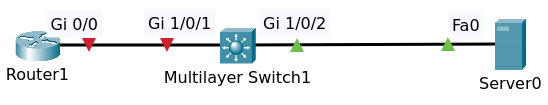
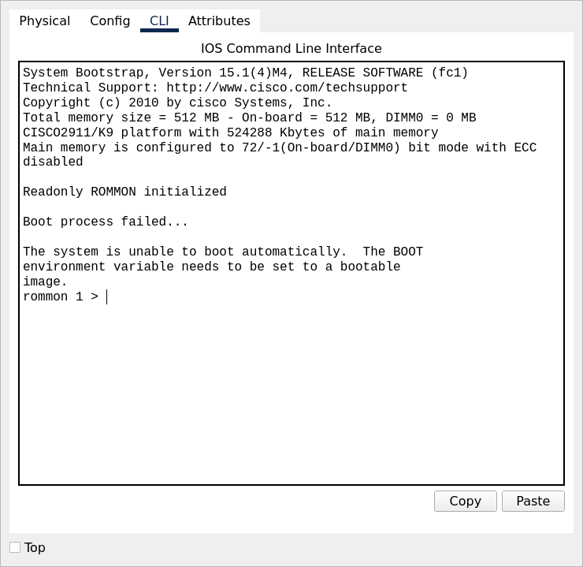
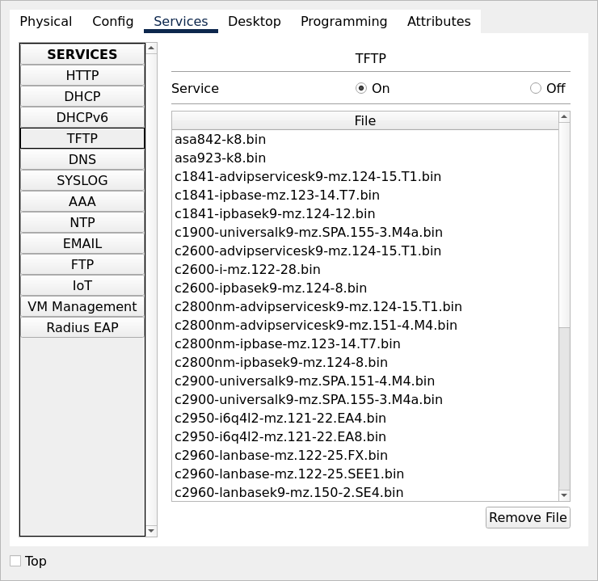

# Restore Cisco IOS Images

An intern has deleted the operating system on your router.



File packet tracer [Topology](Restore_IOS_Initial.pkt).

## Objectives

Tasks:

1. Restore the operating system of the router from the TFTP server
   - File to use: c2900-universalk9-mz.SPA.151-4.M4.bin
2. Verification
   - Ensure the router boots correctly
   - Make sure the router can ping the TFTP server 10.1.1.100 and switch 10.1.1.2

## Devices R1



The operating system of this router has been deleted. So the boot process has failed.
We are currently in ROM MON mode or ROM monitor mode. 

Fortunately, you have a backup of the router operating system on a TFTP server in your network. You 
need to restore this operating system and get the router working.

help shows us various commands that we can use in ROM MON mode. One of them is DIR and we can look 
at the flash of the router. At the moment, no files are available in flash.

```
rommon 1 > ?
boot                boot up an external process
confreg             configuration register utility
dir                 list files in file system
help                monitor builtin command help
reset               system reset
set                 display the monitor variables
tftpdnld            tftp image download
unset               unset a monitor variable
rommon 2 > dir flash:
         File size           Checksum   File name
rommon 3 > 
```

If we use the command reset, the boot process fails and we're back in ROM monitor mode.

We use command `tftpdnld` or  TFTP download, which allows us to download an image from a TFTP server. In this network
we have at TFTP Server with an IP address of 10.1.1.100.



TFTP Server

Use command `tftpdnld`

```
rommon 2 > tftpdnld

Missing or illegal ip address for variable IP_ADDRESS
Illegal IP address.

usage: tftpdnld
  Use this command for disaster recovery only to recover an image via TFTP.
  Monitor variables are used to set up parameters for the transfer.
  (Syntax: "VARIABLE_NAME=value" and use "set" to show current variables.)
  "ctrl-c" or "break" stops the transfer before flash erase begins.

  The following variables are REQUIRED to be set for tftpdnld:
            IP_ADDRESS: The IP address for this unit
        IP_SUBNET_MASK: The subnet mask for this unit
       DEFAULT_GATEWAY: The default gateway for this unit
           TFTP_SERVER: The IP address of the server to fetch from
             TFTP_FILE: The filename to fetch

  The following variables are OPTIONAL:
          TFTP_VERBOSE: Print setting. 0=quiet, 1=progress(default), 2=verbose
      TFTP_RETRY_COUNT: Retry count for ARP and TFTP (default=7)
          TFTP_TIMEOUT: Overall timeout of operation in seconds (default=7200)
         TFTP_CHECKSUM: Perform checksum test on image, 0=no, 1=yes (default=1)
         FE_SPEED_MODE: 0=10/hdx, 1=10/fdx, 2=100/hdx, 3=100/fdx, 4=Auto(deflt)
```

Configure for tftpdnld

```
rommon 3 > IP_ADDRESS=10.1.1.1
rommon 4 > IP_SUBNET_MASK=255.255.255.0
rommon 5 > DEFAULT_GATEWAY=10.1.1.100
rommon 6 > TFTP_SERVER=10.1.1.100
rommon 7 > TFTP_FILE=c2900-universalk9-mz.SPA.151-4.M4.bin
```

Enter command `set` to verify

```
rommon 8 > set
DEFAULT_GATEWAY=10.1.1.100
IP_ADDRESS=10.1.1.1
IP_SUBNET_MASK=255.255.255.0
PS1=rommon ! > 
TFTP_FILE=c2900-universalk9-mz.SPA.151-4.M4.bin
TFTP_SERVER=10.1.1.100
```

Now download it using command `tftpdnld`

Use command `dir flash:`

```
rommon 10 > dir flash:
         File size           Checksum   File name
  33591768 bytes (0x20091d8)  0x93d8    c2900-universalk9-mz.SPA.151-4.M4.bin
```

Use command `reset` to boot the router. It's now loading the operating system.

Enter privilege mode and show ip interface.

```
R1#sh ip interface brief
Interface              IP-Address      OK? Method Status                Protocol 
GigabitEthernet0/0     10.1.1.1        YES NVRAM  up                    up 
GigabitEthernet0/1     unassigned      YES NVRAM  administratively down down 
GigabitEthernet0/2     unassigned      YES NVRAM  administratively down down 
Vlan1                  unassigned      YES NVRAM  administratively down down
```

