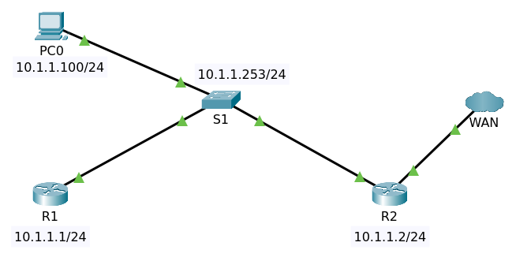

# Infrastructure Recovery

Links
 
- [Hashing Examples Generate the hash of the string you input](https://ccnax.com/hashing-examples/)
- [Cisco Type 7 Password Decryption](https://ccnax.com/cisco-type-7-password-decryption/)

Topology



## Enable Password

Enable password on R1 without `service password-encryption`.

    conf t
    enable password
    cisco
    end
    wr

Enter command `sh run`

    Current configuration : 658 bytes
    !
    version 15.1
    no service timestamps log datetime msec
    no service timestamps debug datetime msec
    no service password-encryption
    !
    hostname R1
    !
    !
    !
    enable password cisco
    !
    ......

Enable `service password-encryption`

    conf t
    service password-encryption
    end
    wr

Enter command `sh run`

    no service timestamps log datetime msec
    no service timestamps debug datetime msec
    service password-encryption
    !
    hostname R1
    !
    !
    !
    enable password 7 0822455D0A16

But the encrypted can be decrypted using tool at this [link](https://ccnax.com/cisco-type-7-password-decryption/)

## Enable Secret

Cisco recommend that you use enable secret rather than enable password.

```
R1#conf t
Enter configuration commands, one per line.  End with CNTL/Z.
R1(config)#enable secret cisco
The enable secret you have chosen is the same as your enable password.
This is not recommended.  Re-enter the enable secret.
R1(config)#do sh run | in enable
enable secret 5 $1$mERr$hx5rVt7rPNoS4wqbXKX7m0
enable password 7 0822455D0A16
R1(config)#enable secret hello
enable secret 5 $1$mERr$y/Ce7lzaUL0HOujQUgwuB/
enable password 7 0822455D0A16
R1(config)#end
R1#
```

## Disable Services

On R2 disable services like cdp on the port which is facing the internet.

    conf t
    interface gigabitEthernet 0/1
    no cdp enable 
    end
    wr

Where interface `gigabitEthernet 0/1` is facing the internet.

## Line Console Security

### Enable password

On switch S1 setup password to enter user mode.

    conf t
    line console 0
    password cisco
    login
    end
    wr

Enter command `sh running-config | begin line`

    line con 0
     password cisco
     login
    !
    line vty 0 4
     login
    line vty 5 15
     login

Enter command `disable` and `exit` now you must enter password to user mode.

    S1 con0 is now available

    Press RETURN to get started.

    User Access Verification

    Password: 

### Local Username and Password Database

    conf t
    username yudi secret cisco
    line con 0
    no password
    login local
    end
    write

>You must use `login local` then remove the entry for password.

Enter command `sh run`

    !
    username yudi secret 5 $1$mERr$hx5rVt7rPNoS4wqbXKX7m0
    !
    ...
    !
    line con 0
     login local
    !
    ...

You can create another user which has privilege 15

    conf t
    username arief privilege 15 secret cisco
    end
    write

Enter command `sh run`

    ...
    !
    username arief secret 5 $1$mERr$hx5rVt7rPNoS4wqbXKX7m0
    username yudi secret 5 $1$mERr$hx5rVt7rPNoS4wqbXKX7m0
    !
    ...
    !
    line con 0
     login local
    !
    ...


When you login at the console with that username arief you are directyly to privilege mode.

### Timeout

Auto logout with timeout

    conf t
    line con 0
    exec-timeout 3
    end
    wr

Auto logout in 3 minutes if no activities

    S1 con0 is now available

    Press RETURN to get started!

    User Access Verification

    Username: yudi
    Password: 

After 1 minute

    % Password:  timeout expired!

### Logging Synchronous

    conf t
    line con 0
    logging synchronous

## Telnet Security

If no password set the telnet connection will be closed. On R1 telnet to S1 and R2.

    R1>telnet 10.1.1.253
    Trying 10.1.1.253 ...Open

    [Connection to 10.1.1.253 closed by foreign host]
    R1>telnet 10.1.1.2
    Trying 10.1.1.2 ...Open

    [Connection to 10.1.1.2 closed by foreign host]

On R2 do setup username and password

    conf t
    enable secret cisco
    username yudi secret cisco
    username arief privilege 15 secret cisco
    line con 0
    login local
    exec-timeout 5
    end
    write

On R2 enter `sh run`

    !
    enable secret 5 $1$mERr$hx5rVt7rPNoS4wqbXKX7m0
    !
    ...
    !
    username arief privilege 15 secret 5 $1$mERr$hx5rVt7rPNoS4wqbXKX7m0
    username yudi secret 5 $1$mERr$hx5rVt7rPNoS4wqbXKX7m0
    !
    ...
    !
    no ip domain-lookup
    !
    ...
    !
    line con 0
     login local
     exec-timeout 5
    !

On R2 setup `login local` on `line vty`

    conf t
    line vty 0 4
    login local
    exec-timeout 3
    end
    wr

>You can set different password for different vty line (IMHO, that is more complicated).

On R1 telnet to R2

    R1>telnet 10.1.1.2
    Trying 10.1.1.2 ...Open


    User Access Verification

    Username: yudi
    Password: 
    R2>en
    Password: 
    R2#

>You can enter privilege mode if the `enable password` or `enable secret` is not enabled.

Below R2 telnet to R1 can enter privilege mode because the password not enable.

    R2>telnet 10.1.1.1
    Trying 10.1.1.1 ...Open


    User Access Verification

    Password: 
    R1>en
    % No password set.
    R1>

### Sessions and Line

On R1 and R2 telnet to S1. Show users on S1

    S1#sh users 
        Line       User       Host(s)              Idle       Location
    *  0 con 0     yudi       idle                 00:00:00 
       2 vty 0     yudi       idle                 00:00:19 10.1.1.1
       3 vty 1     yudi       idle                 00:00:04 10.1.1.2

      Interface    User               Mode         Idle     Peer Address

### Multiple sessions 

While on R1 on session telnet with S1

    R1>telnet 10.1.1.253
    Trying 10.1.1.253 ...Open

    User Access Verification

    Username: yudi
    Password: 
    S1>

You can go back to R1 by press _Ctrl + Shift + 6_ then _Shift + X_

    S1>

Press press _Ctrl + Shift + 6_ then _Shift + X_ here.

    R1>telnet 10.1.1.253
    Trying 10.1.1.253 ...Open

    User Access Verification

    Username: yudi
    Password: 
    S1>

Now the users on S1

    S1#sh users 
        Line       User       Host(s)              Idle       Location
    *  0 con 0     yudi       idle                 00:00:00 
       2 vty 0     yudi       idle                 00:01:19 10.1.1.1
       3 vty 1     yudi       idle                 00:00:54 10.1.1.1

Do the same with the router R2. So the list of vty users on S1 will have maximum :

    S1#sh users 
        Line       User       Host(s)              Idle       Location
    *  0 con 0     yudi       idle                 00:00:00 
       2 vty 0     yudi       idle                 00:00:03 10.1.1.2
       3 vty 1     yudi       idle                 00:01:31 10.1.1.2
       4 vty 2     yudi       idle                 00:01:09 10.1.1.1
       5 vty 3     yudi       idle                 00:00:41 10.1.1.1
       6 vty 4     yudi       idle                 00:00:30 10.1.1.1

      Interface    User               Mode         Idle     Peer Address

No connecting is permitted on S1

    R2>telnet 10.1.1.253
    Trying 10.1.1.253 ...Open

    [Connection to 10.1.1.253 closed by foreign host]

### Clear Line

Command `clear line` is not available on this switch only on router.

On router R2 show maximum connections on telnet

    R2#sh users 
        Line       User       Host(s)              Idle       Location
    *  0 con 0     arief      idle                 00:00:00 
     134 vty 0     yudi       idle                 00:01:43 10.1.1.253
     135 vty 1     yudi       idle                 00:01:32 10.1.1.253
     136 vty 2     yudi       idle                 00:00:44 10.1.1.1
     137 vty 3     yudi       idle                 00:00:34 10.1.1.1
     138 vty 4     yudi       idle                 00:00:03 10.1.1.1

      Interface    User               Mode         Idle     Peer Address
    R2#sh line
       Tty Line Typ     Tx/Rx    A Roty AccO AccI   Uses   Noise  Overruns   Int
    *    0    0 CTY              -    -    -    -      0       0     0/0       -
         1    1 AUX   9600/9600  -    -    -    -      0       0     0/0       -
    *  132  132 VTY              -    -    -    -      1       0     0/0       -
    *  133  133 VTY              -    -    -    -      1       0     0/0       -
    *  134  134 VTY              -    -    -    -      1       0     0/0       -
    *  135  135 VTY              -    -    -    -      1       0     0/0       -
    *  136  136 VTY              -    -    -    -      1       0     0/0       -
    Line(s) not in async mode -or- with no hardware support:
    3-131

But command `clear line` is not working here

    R2#clear line tty 132
                      ^
    % Invalid input detected at '^' marker.
	    
    R2#clear line vty 132
                  ^
    % Invalid input detected at '^' marker.

### Show sessions

On router R1 telnetting to R2

    R1>telnet 10.1.1.2
    Trying 10.1.1.2 ...Open

    User Access Verification

    Username: yudi
    Password: 
    R2>

Press press _Ctrl + Shift + 6_ then _Shift + X_ here.

    R1>sh sess
    R1>sh sessions 
    Conn Host                Address             Byte  Idle Conn Name
       1 10.1.1.2            10.1.1.2               0     0 10.1.1.2
       2 10.1.1.2            10.1.1.2               0     0 
    *  3 10.1.1.2            10.1.1.2               0     0 
    R1>

To change session just enter session number then press <Enter>.

## SSH

Setup

- hostname
- domain name
- username local
- generate key

On router R2

    conf t
    hostname R2
    ip domain-name cisco.com
    crypto key generate rsa general-keys modulus 1024
    line vty 0 4
    transport input ssh
    login local
    exit
    ip ssh version 2

Enter command `sh ip ssh`

    SSH Enabled - version 2.0
    Authentication timeout: 120 secs; Authentication retries: 3

On R1 login ssh to R2

    R1>ssh -l yudi 10.1.1.2

    Password: 

    R2>

On R2 enter command `sh ssh`

    Connection      Version Mode Encryption		Hmac	State             Username
    0               1.99    IN   aes128-cbc      hmac-sha1     Session Started         yudi
    0               1.99    OUT  aes128-cbc      hmac-sha1     Session Started         yudi
    %No SSHv1 server connections running.

## Banner

For the CCNA course, we're going to concentrate on the 

- exect banner
- login banner
- motd (message of the day) banner

In the pt the available banners are only two

    R2(config)#banner ?
      login  Set login banner
      motd   Set Message of the Day banner

    conf t
    banner motd %
    Banner MOTD
    ===========
    %
    banner login %
    Banner Login
    ============
    %
    end
    write

On R1 ssh to R2

    R1>ssh -l yudi 10.1.1.2

    Password: 

    Banner MOTD
    ===========

    R2>
