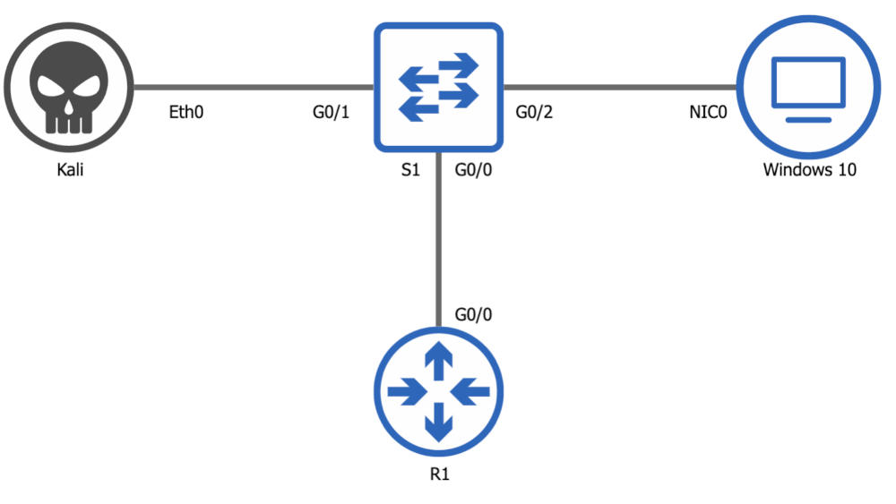

# Dynamic ARP Inspection (DAI)

- DAI is a security feature that validates Address Resolution Protocol (ARP) packets in a network.
- DAI allows a network administrator to intercept, log, and discard ARP packets with invalid MAC address to IP address bindings.
- This capability protects the network from certain _man-in-the-middle_ attacks.

Click the image to open the youtube video.

## Requirements

- Either enable DHCP Snooping
- Or, manually configure entries

## DAI Configuration

Configuration examples per network diagram

- Substitute VLAN 1 with your VLAN
- Substitute g0/0 and g0/1 with the interfaces you use

Enable DHCP snooping:

    conf t
    ip dhcp snooping
    ip dhcp snooping vlan 1
    no ip dhcp snooping information option
    exit
    show ip dhcp snooping

Specify trusted ports:

    conf t
    int G0/0
    ip dhcp snooping trust

Optional: Rate limit untrusted ports (packets per second)

    int G0/1
    ip dhcp snooping limit rate 10
    end

## Verification

Verify that it is working:

    show ip dhcp snooping
    debug ip dhcp snooping events
    debug ip dhcp snooping packets

## Another Option

If you don’t want to use DHCP Snooping, manually configure entries:

    conf t
    arp access-list win10pc
    permit ip host 10.1.1.1 mac host 1010.0001.0001
    exit
    ip arp inspection filter win10pc vlan 1
    int G0/2
    no ip arp inspection trust

Enable DAI:

    conf t
    ip arp inspection vlan 1
    ip arp inspection validate src-mac
    int G0/0
    ip arp inspection trust
    end

Then Verify

    show ip arp inspection

## DAI Rate limiting timers

Optional: Rate limiting recovery:

- DAI rate limits by default (Whereas DHCP Snooping does not by default)
  - Default on untrusted ports is 15 packets per second (pps)
  - Trusted ports are not rate limited by default
  - G0/0 uses a rate limit of 10 pps and burst of 1 second (default interval) = 10 pps
  - G0/1 uses a rate limit of 10 packets over a burst period of 5 seconds = 10 pps over 5 seconds

Configuration

    conf t
    int G0/0
    ip arp inspection limit rate 10
    int g0/1
    ip arp inspection limit rate 10 burst interval 5
    end

Verify

    show ip arp inspection interfaces

## References

Go here for more:

- [Catalyst 4500 Series Switch Cisco IOS Software Configuration Guide, 12.2(25)EW](http://bit.ly/ciscodai)
- [David Bombal](http://www.davidbombal.com)

