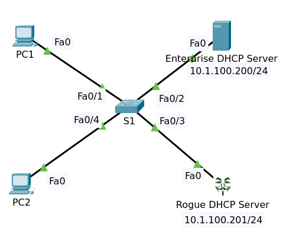

# DHCP Snooping



File packet tracer [Topology](DHCP_Snooping_Initial.pkt).

## Objectives

Configure DHCP Snooping

1. Only trust the Enterprrise DHCP Server
2. Block the Rogue DHCP Server

Verification:

1. Use debugs to view results
2. Prove that DHCP packets are not allowed from the Rogue server

## Background

Enterprise DHCP Server

- IP Address 10.1.1.200/24
- DHCP Pool serverPool
  - Start IP Address 10.1.1.0
  - Maximum number of users 100
  - Default gateway 10.1.1.254
  - DNS Server 10.1.1.200

Rogue DHCP Server

- IP Address 10.1.1.201/24
- DHCP Pool serverPool
  - Start IP Address 10.1.100.0
  - Maximum number of users 200
  - Default gateway 10.1.100.254
  - DNS Server 10.1.100.254

PC1 & PC2 get DHCP from Enterprise DHCP Server. But when enter command `ipconfig /renew` PC1 get dhcp from rogue dhcp server

```
C:\>ipconfig /renew

   IP Address......................: 10.1.100.4
   Subnet Mask.....................: 255.255.255.0
   Default Gateway.................: 10.1.100.254
   DNS Server......................: 10.1.100.254
```

The same thing happens at PC2. We can see that the PCs are getting IP addresses from 
the rogue DHCP server, in some cases they get an IP address from the enterprise 
server, but in other cases they get an IP address from the rogue DHCP server.

## Solutions

Do configure

    conf t
    ip dhcp snooping
    ip dhcp snooping vlan 1
    no ip dhcp snooping information option
    int Fa0/2
    ip dhcp snooping trust
    int Fa0/3
    ip dhcp snooping limit rate 10
    end

Verifying

Enter command `sh ip dhcp snooping`

    Switch DHCP snooping is enabled
    DHCP snooping is configured on following VLANs:
    1
    Insertion of option 82 is disabled
    Option 82 on untrusted port is not allowed
    Verification of hwaddr field is enabled
    Interface                  Trusted    Rate limit (pps)
    -----------------------    -------    ----------------
    FastEthernet0/4            no         unlimited       
    FastEthernet0/1            no         unlimited       
    FastEthernet0/2            yes        unlimited       
    FastEthernet0/3            no         10              

Enter command `ip dhcp snooping binding`

    MacAddress          IpAddress        Lease(sec)  Type           VLAN  Interface
    ------------------  ---------------  ----------  -------------  ----  -----------------
    00:01:43:C9:50:1C   10.1.1.4         86400       dhcp-snooping  1     FastEthernet0/1
    00:02:4A:09:21:A9   10.1.1.1         86400       dhcp-snooping  1     FastEthernet0/4
    Total number of bindings: 2

Enter command `sh ip dhcp snooping database`

    Agent URL : 
    Write delay Timer : 300 seconds
    Abort Timer : 

    Agent Running : No
    Delay Timer Expiry : Not Running
    Abort Timer Expiry : Not Running

    Last Succeded Time : None
    Last Failed Time : None
    Last Failed Reason : No failure recorded.

    Total Attempts       :        5   Startup Failures :        0
    Successful Transfers :        0   Failed Transfers :        0
    Successful Reads     :        0   Failed Reads     :        0
    Successful Writes    :        5   Failed Writes    :        0
    Media Failures       :        0

Test release and renew ip dhcp at PCs. They will get ip from Enterprise DHCP Server.


