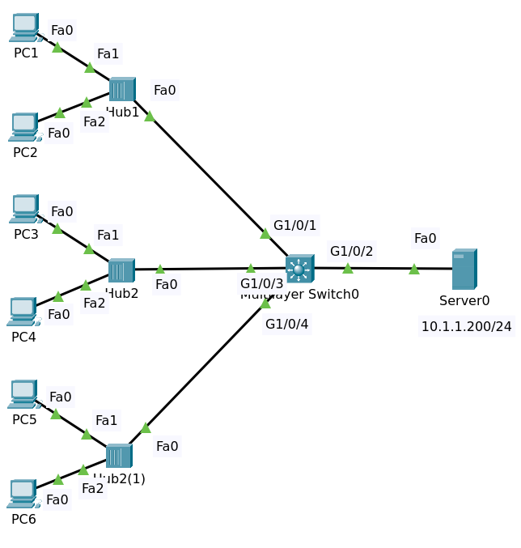

# Port Security

## Topology



File packet tracer [Port Security](Port_Security_Initial.pkt)

## Objectives

Configure Port Security as follows:

1. Usejust one port security command on G1/0/1
   - By default, how MAC addresses are permitted?
   - Verify that only the first host is allowed.
   - What happens when the second host sends traffic into the network?
   - Is the first host's MAC address written to the running configuration?
   - What happens when the switch is power cycled (save config first)? 

2. Enable port security on G1/0/3 and automatically add the MAC address to the running configuration
   - What happens when the second host sends traffic?
   - What happens when the switch is power cycled (don't save config)? 

3. Enable port security on G1/0/4 by manually specifying PC5's MAC address.
   Drop other traffic and send log messages when a violation occurs.

4. Increase the number of devices allowed on G1/0/1 to two devices and  verify that both PCs receive IP addresses from the DHCP server.

### Port Security on Gi 1/0/1

On switch enable port security on interface Gi 1/0/1. We can't enable on the dynamic port. We must make it `mode access` 

```
Switch#conf t
Switch(config)#hostname Switch1
Switch(config)#interface gigabitEthernet 1/0/1
Switch(config-if)#switchport port-security 
Command rejected: GigabitEthernet1/0/1 is a dynamic port.
Switch(config-if)#switchport mode access
Switch(config-if)#switchport nonegotiate
Switch(config-if)#switchport port-security 
Switch(config-if)#end
Switch#
```

Enter command `sh port-security`

```
Secure Port MaxSecureAddr CurrentAddr SecurityViolation Security Action
               (Count)       (Count)        (Count)
--------------------------------------------------------------------
     Gig1/0/1        1          0                 0         Shutdown
----------------------------------------------------------------------
```

- The port security has been enabled on this port gigabit 1/0/1.
- The maximum Mac address count is 1.
- The action is to shut the port down when a second host sends traffic onto the network.

Enter command `sh port-security interface gigabitEthernet 1/0/1`

```
Port Security              : Enabled
Port Status                : Secure-up
Violation Mode             : Shutdown
Aging Time                 : 0 mins
Aging Type                 : Absolute
SecureStatic Address Aging : Disabled
Maximum MAC Addresses      : 1
Total MAC Addresses        : 0
Configured MAC Addresses   : 0
Sticky MAC Addresses       : 0
Last Source Address:Vlan   : 0000.0000.0000:0
Security Violation Count   : 0
```

- The port security is enabled
- The status is secure-up
- The violation mode is shutdown
- Maximum mac address is one

Look at addresses.

Enter command `sh port-security address` to look at addresses.

```
               Secure Mac Address Table
-----------------------------------------------------------------------------
Vlan    Mac Address       Type                          Ports   Remaining Age
                                                                   (mins)
----    -----------       ----                          -----   -------------
-----------------------------------------------------------------------------
Total Addresses in System (excluding one mac per port)     : 0
Max Addresses limit in System (excluding one mac per port) : 1024
```

No addresses have been learnt at the moment.

#### PC1 renew ip address

Send traffic from PC1 by entering command `ipconfig /renew`.

Show port-security

```
Secure Port MaxSecureAddr CurrentAddr SecurityViolation Security Action
               (Count)       (Count)        (Count)
--------------------------------------------------------------------
     Gig1/0/1        1          1                 0         Shutdown
----------------------------------------------------------------------
```

Again Enter command `sh port-security address` to look at addresses.

```
-----------------------------------------------------------------------------
Vlan    Mac Address       Type                          Ports   Remaining Age
                                                                   (mins)
----    -----------       ----                          -----   -------------
1	00C0.1111.1111	DynamicConfigured	GigabitEthernet1/0/1		-
-----------------------------------------------------------------------------
```

On the switch, it now learned about this address, it was dynamically configured on this port gigabit 101.

Enter command `sh port-security interface gigabitEthernet 1/0/1`

```
Port Security              : Enabled
Port Status                : Secure-up
Violation Mode             : Shutdown
Aging Time                 : 0 mins
Aging Type                 : Absolute
SecureStatic Address Aging : Disabled
Maximum MAC Addresses      : 1
Total MAC Addresses        : 1
Configured MAC Addresses   : 0
Sticky MAC Addresses       : 0
Last Source Address:Vlan   : 00C0.1111.1111:1
Security Violation Count   : 0
```

The mac address of PC1 is set static

Enter command `sh mac address-table`

```
          Mac Address Table
-------------------------------------------

Vlan    Mac Address       Type        Ports
----    -----------       --------    -----

   1    00c0.1111.1111    STATIC      Gig1/0/1
```

#### PC2 renew ip address

What happens when we use do command `ipconfig /renew` IP config slash renew on PC 2.

On the switch the port is forced to shutdown

```
%LINK-5-CHANGED: Interface GigabitEthernet1/0/1, changed state to administratively down

%LINEPROTO-5-UPDOWN: Line protocol on Interface GigabitEthernet1/0/1, changed state to down
```

And reqeust to renew ip address on PC2 was failed.

```
C:\>ipconfig /renew
DHCP request failed. 
```

Enter command `sh port-security`

```
Secure Port MaxSecureAddr CurrentAddr SecurityViolation Security Action
               (Count)       (Count)        (Count)
--------------------------------------------------------------------
     Gig1/0/1        1          0                 1         Shutdown
----------------------------------------------------------------------
```

We can see that a violation took place, action is to shut the port down and that's what happened.
If we looked the port-security on the interface

```
Port Security              : Enabled
Port Status                : Secure-shutdown
Violation Mode             : Shutdown
Aging Time                 : 0 mins
Aging Type                 : Absolute
SecureStatic Address Aging : Disabled
Maximum MAC Addresses      : 1
Total MAC Addresses        : 0
Configured MAC Addresses   : 0
Sticky MAC Addresses       : 0
Last Source Address:Vlan   : 00C0.2222.2222:1
Security Violation Count   : 1
```

It showed the last Mac address and a violation took place because it went over the maximum number of Mac addresses permitted.
Enter command `sh ip interface brief` to verify that the interface `Gig1/0/1` is administratively shutdown.

#### No Shutdown the Interface

Now bring the interface `Gi1/0/1` to up

    conf t
    interface gi 1/0/1
    shutdown
    no shutdown

Show port-security.

```
Secure Port MaxSecureAddr CurrentAddr SecurityViolation Security Action
               (Count)       (Count)        (Count)
--------------------------------------------------------------------
     Gig1/0/1        1          0                 0         Shutdown
----------------------------------------------------------------------
```

Show port-security address.

```
               Secure Mac Address Table
-----------------------------------------------------------------------------
Vlan    Mac Address       Type                          Ports   Remaining Age
                                                                   (mins)
----    -----------       ----                          -----   -------------
1	00C0.1111.1111	DynamicConfigured	GigabitEthernet1/0/1		-
-----------------------------------------------------------------------------
Total Addresses in System (excluding one mac per port)     : 0
Max Addresses limit in System (excluding one mac per port) : 1024
```

Show port-security interface gigabitEthernet 1/0/1.

```
Port Security              : Enabled
Port Status                : Secure-up
Violation Mode             : Shutdown
Aging Time                 : 0 mins
Aging Type                 : Absolute
SecureStatic Address Aging : Disabled
Maximum MAC Addresses      : 1
Total MAC Addresses        : 0
Configured MAC Addresses   : 0
Sticky MAC Addresses       : 0
Last Source Address:Vlan   : 00C0.2222.2222:1
Security Violation Count   : 0
```

#### PC2 renew ip address

Show port-security address.

```
Secure Port MaxSecureAddr CurrentAddr SecurityViolation Security Action
               (Count)       (Count)        (Count)
--------------------------------------------------------------------
     Gig1/0/1        1          1                 0         Shutdown
----------------------------------------------------------------------
Switch1#sh port-security address 
               Secure Mac Address Table
-----------------------------------------------------------------------------
Vlan    Mac Address       Type                          Ports   Remaining Age
                                                                   (mins)
----    -----------       ----                          -----   -------------
1	00C0.1111.1111	DynamicConfigured	GigabitEthernet1/0/1		-
1	00C0.2222.2222	DynamicConfigured	GigabitEthernet1/0/1		-
-----------------------------------------------------------------------------
Total Addresses in System (excluding one mac per port)     : 1
Max Addresses limit in System (excluding one mac per port) : 1024
```

Show port-security interface gigabitEthernet 1/0/1.

```
Port Security              : Enabled
Port Status                : Secure-up
Violation Mode             : Shutdown
Aging Time                 : 0 mins
Aging Type                 : Absolute
SecureStatic Address Aging : Disabled
Maximum MAC Addresses      : 1
Total MAC Addresses        : 1
Configured MAC Addresses   : 0
Sticky MAC Addresses       : 0
Last Source Address:Vlan   : 00C0.2222.2222:1
Security Violation Count   : 0
```

Show mac address-table. Now the mac address of PC2 is set static.

```
          Mac Address Table
-------------------------------------------

Vlan    Mac Address       Type        Ports
----    -----------       --------    -----

   1    00c0.2222.2222    STATIC      Gig1/0/1
```

When the switch is power cycled a different Mac address could be learnt. It is not restricting Mac 
addresses on the port. It's only restricting the number of Mac addresses allowed on that port. 
Anyone could plug a PC into that port as long as they're the first PC that the switch learns. If the 
switch reboots, a different Mac address could be launched on that port and the original Mac address 
could be seen as a violating Mac address.

#### Increase the number of device to 2 on Gi 1/0/1

Configure again

```
conf t
interface gigabitEthernet 1/0/1
shutdown
switchport port-security maximum 2
no shutdown
end
```

Let's renew ip on PC1 and PC2, the port is not shut down.

Show port-security.

```
Secure Port MaxSecureAddr CurrentAddr SecurityViolation Security Action
               (Count)       (Count)        (Count)
--------------------------------------------------------------------
     Gig1/0/1        2          2                 0         Shutdown
     Gig1/0/3        1          1                 0         Shutdown
     Gig1/0/4        1          1                 9         Restrict
----------------------------------------------------------------------
```

Show port-security address.

```
               Secure Mac Address Table
-----------------------------------------------------------------------------
Vlan    Mac Address       Type                          Ports   Remaining Age
                                                                   (mins)
----    -----------       ----                          -----   -------------
1	00C0.2222.2222	DynamicConfigured	GigabitEthernet1/0/1		-
1	00C0.1111.1111	DynamicConfigured	GigabitEthernet1/0/1		-
   1    00C0.3333.3333    SecureSticky                  Gig1/0/3     -
   1    00C0.5555.5555    SecureConfigured              Gig1/0/4     -
-----------------------------------------------------------------------------
Total Addresses in System (excluding one mac per port)     : 1
Max Addresses limit in System (excluding one mac per port) : 1024
```

Show port-security interface gigabitEthernet 1/0/1.

```
Port Security              : Enabled
Port Status                : Secure-up
Violation Mode             : Shutdown
Aging Time                 : 0 mins
Aging Type                 : Absolute
SecureStatic Address Aging : Disabled
Maximum MAC Addresses      : 2
Total MAC Addresses        : 2
Configured MAC Addresses   : 0
Sticky MAC Addresses       : 0
Last Source Address:Vlan   : 00C0.2222.2222:1
Security Violation Count   : 0
```

### Port Security on Gi 1/0/3

On Gigabit 1/0/3, we want to automatically add the Mac address to the running configuration so that 
we limit specific Mac addresses on that port.

```
conf t
interface gigabitEthernet 1/0/3
switchport mode access
switchport nonegotiate
switchport port-security mac-address sticky 
switchport port-security 
end
```

Enter command `sh port-security`

```
Secure Port MaxSecureAddr CurrentAddr SecurityViolation Security Action
               (Count)       (Count)        (Count)
--------------------------------------------------------------------
     Gig1/0/1        1          0                 1         Shutdown
     Gig1/0/3        1          0                 0         Shutdown
----------------------------------------------------------------------
```

Show running configuration

```
interface GigabitEthernet1/0/1
 switchport mode access
 switchport port-security
 shutdown
!
interface GigabitEthernet1/0/2
!
interface GigabitEthernet1/0/3
 switchport mode access
 switchport port-security
 switchport port-security mac-address sticky 
!
```

Enter command `sh port-security interface gigabitEthernet 1/0/3`

```
Port Security              : Enabled
Port Status                : Secure-up
Violation Mode             : Shutdown
Aging Time                 : 0 mins
Aging Type                 : Absolute
SecureStatic Address Aging : Disabled
Maximum MAC Addresses      : 1
Total MAC Addresses        : 0
Configured MAC Addresses   : 0
Sticky MAC Addresses       : 0
Last Source Address:Vlan   : 0000.0000.0000:0
Security Violation Count   : 0
```

#### PC3 renew ip address

Show port-security

```
Secure Port MaxSecureAddr CurrentAddr SecurityViolation Security Action
               (Count)       (Count)        (Count)
--------------------------------------------------------------------
     Gig1/0/1        1          0                 1         Shutdown
     Gig1/0/3        1          1                 0         Shutdown
----------------------------------------------------------------------
```

Show port-security address.

```
               Secure Mac Address Table
-----------------------------------------------------------------------------
Vlan    Mac Address       Type                          Ports   Remaining Age
                                                                   (mins)
----    -----------       ----                          -----   -------------
1	00C0.1111.1111	DynamicConfigured	GigabitEthernet1/0/1		-
1    00C0.3333.3333    SecureSticky                  Gig1/0/3     -
-----------------------------------------------------------------------------
```

Show port-security interface gigabitEthernet 1/0/3.

```
Port Security              : Enabled
Port Status                : Secure-up
Violation Mode             : Shutdown
Aging Time                 : 0 mins
Aging Type                 : Absolute
SecureStatic Address Aging : Disabled
Maximum MAC Addresses      : 1
Total MAC Addresses        : 1
Configured MAC Addresses   : 0
Sticky MAC Addresses       : 1
Last Source Address:Vlan   : 00C0.3333.3333:1
Security Violation Count   : 0
```

Show mac address table

```
          Mac Address Table
-------------------------------------------

Vlan    Mac Address       Type        Ports
----    -----------       --------    -----

   1    00c0.3333.3333    STATIC      Gig1/0/3
   1    00d0.ba47.41ca    DYNAMIC     Gig1/0/2
```

Show running configuration.

```
!
interface GigabitEthernet1/0/3
 switchport mode access
 switchport port-security
 switchport port-security mac-address sticky 
 switchport port-security mac-address sticky 00C0.3333.3333
!
```

The mac address of PC3 was automatically added to the running configuration.

#### PC4 renew ip address

The interface is shutting down.

```
%LINK-5-CHANGED: Interface GigabitEthernet1/0/3, changed state to administratively down

%LINEPROTO-5-UPDOWN: Line protocol on Interface GigabitEthernet1/0/3, changed state to down
```

Show port-security.

```
Secure Port MaxSecureAddr CurrentAddr SecurityViolation Security Action
               (Count)       (Count)        (Count)
--------------------------------------------------------------------
     Gig1/0/1        1          0                 1         Shutdown
     Gig1/0/3        1          1                 1         Shutdown
----------------------------------------------------------------------
```

Show port-security interface gigabitEthernet 1/0/3.

```
Port Security              : Enabled
Port Status                : Secure-shutdown
Violation Mode             : Shutdown
Aging Time                 : 0 mins
Aging Type                 : Absolute
SecureStatic Address Aging : Disabled
Maximum MAC Addresses      : 1
Total MAC Addresses        : 1
Configured MAC Addresses   : 0
Sticky MAC Addresses       : 1
Last Source Address:Vlan   : 00C0.4444.4444:1
Security Violation Count   : 1
```

Show interface status

```
Switch1#sh interfaces status
Port      Name               Status       Vlan       Duplex  Speed Type
Gig1/0/1                     connected    1          auto    auto  10/100BaseTX
Gig1/0/2                     connected    1          auto    auto  10/100BaseTX
Gig1/0/3                     err-disabled 1          auto    auto  10/100BaseTX
```

### Port Security on Gi 1/0/4

Configure

```
conf t
interface gigabitEthernet 1/0/4
switchport mode access
switchport nonegotiate
switchport port-security
switchport port-security mac-address 00C0.5555.5555
switchport port-security violation restrict
end
```

Show port-security

```
Secure Port MaxSecureAddr CurrentAddr SecurityViolation Security Action
               (Count)       (Count)        (Count)
--------------------------------------------------------------------
     Gig1/0/1        1          0                 0         Shutdown
     Gig1/0/3        1          1                 1         Shutdown
     Gig1/0/4        1          1                 0         Restrict
----------------------------------------------------------------------
```

Show port-security interface gigabitEthernet 1/0/4

```
Port Security              : Enabled
Port Status                : Secure-up
Violation Mode             : Restrict
Aging Time                 : 0 mins
Aging Type                 : Absolute
SecureStatic Address Aging : Disabled
Maximum MAC Addresses      : 1
Total MAC Addresses        : 1
Configured MAC Addresses   : 1
Sticky MAC Addresses       : 0
Last Source Address:Vlan   : 0000.0000.0000:0
Security Violation Count   : 0
```

Show running configuration

```
!
interface GigabitEthernet1/0/4
 switchport mode access
 switchport port-security
 switchport port-security violation restrict 
 switchport port-security mac-address 00C0.5555.5555
!
```

#### PC5 renew ip address

Show port-security 

```
Secure Port MaxSecureAddr CurrentAddr SecurityViolation Security Action
               (Count)       (Count)        (Count)
--------------------------------------------------------------------
     Gig1/0/1        1          0                 0         Shutdown
     Gig1/0/3        1          1                 1         Shutdown
     Gig1/0/4        1          1                 0         Restrict
----------------------------------------------------------------------
```

Show port-security address.

```
               Secure Mac Address Table
-----------------------------------------------------------------------------
Vlan    Mac Address       Type                          Ports   Remaining Age
                                                                   (mins)
----    -----------       ----                          -----   -------------
   1    00C0.3333.3333    SecureSticky                  Gig1/0/3     -
   1    00C0.5555.5555    SecureConfigured              Gig1/0/4     -
-----------------------------------------------------------------------------
Total Addresses in System (excluding one mac per port)     : 0
Max Addresses limit in System (excluding one mac per port) : 1024
```

Show port-security interface gigabitEthernet 1/0/4.

```
Port Security              : Enabled
Port Status                : Secure-up
Violation Mode             : Restrict
Aging Time                 : 0 mins
Aging Type                 : Absolute
SecureStatic Address Aging : Disabled
Maximum MAC Addresses      : 1
Total MAC Addresses        : 1
Configured MAC Addresses   : 1
Sticky MAC Addresses       : 0
Last Source Address:Vlan   : 00C0.5555.5555:1
Security Violation Count   : 0
```


Show mac address-table.

```
          Mac Address Table
-------------------------------------------

Vlan    Mac Address       Type        Ports
----    -----------       --------    -----

   1    00c0.5555.5555    STATIC      Gig1/0/4
   1    00d0.ba47.41ca    DYNAMIC     Gig1/0/2
```

#### PC6 renew ip address

Interface not shut down.

But in SecurityViolation the number is increased.

Show port-security

```
Secure Port MaxSecureAddr CurrentAddr SecurityViolation Security Action
               (Count)       (Count)        (Count)
--------------------------------------------------------------------
     Gig1/0/1        1          0                 1         Shutdown
     Gig1/0/3        1          1                 0         Shutdown
     Gig1/0/4        1          1                 2         Restrict
----------------------------------------------------------------------
```

Show port-security interface gigabitEthernet 1/0/4

```
Port Security              : Enabled
Port Status                : Secure-up
Violation Mode             : Restrict
Aging Time                 : 0 mins
Aging Type                 : Absolute
SecureStatic Address Aging : Disabled
Maximum MAC Addresses      : 1
Total MAC Addresses        : 1
Configured MAC Addresses   : 1
Sticky MAC Addresses       : 0
Last Source Address:Vlan   : 00C0.6666.6666:1
Security Violation Count   : 2
```

### Auto Recovery

When the port is error disabled then you would have to manually re-enable that port, 
which causes a large administrative overhead. So rather than doing that, you can go 
into global configuration mode on the switch and use the error disable recovery 
command to specify a cause and a recovery value.

```
conf t
errdisable recovery cause psecure-violation
errdisable recovery interval 30
```

Unfortunately, this feature not available on packet tracer.


