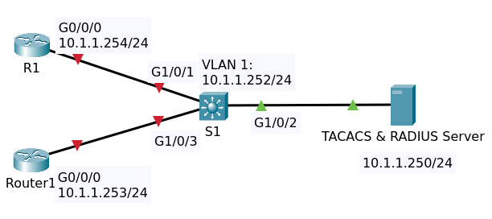
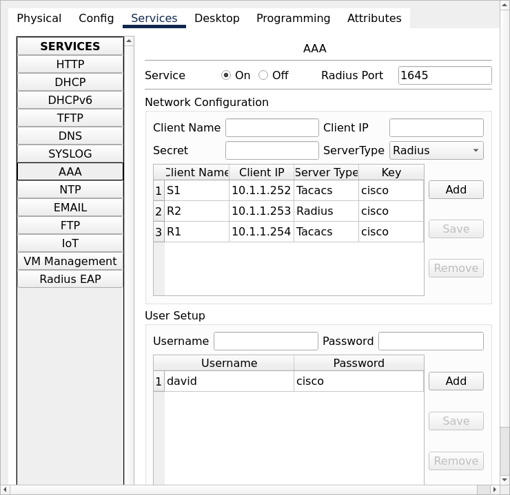

# AAA, TACACS and RADIUS

## Topology



File packet tracer [Topology](TACACS_RADIUS _initial.pkt).

## Objectives

Configure TACACS and RADIUS as follows:

Server

1. Add R1 as a TACACS client:
   - Client Name = R1
   - Client IP = 10.1.1.254
   - Secret = cisco
   - Type = TACACS

2. Add R2 as a RADIUS client:
   - Client Name = R2
   - Client IP = 10.1.1.253
   - Secret = cisco
   - Type = RADIUS

3. Add S1 as a TACACS client:
   - Client Name = S1
   - Client IP = 10.1.1.252
   - Secret = cisco
   - Type = TACACS

4. Add user:
   - Use your own name as the username
   - Password = cisco

R1

1. Configure aaa authentication (for login and enable) using TACACS with server 10.1.1.250.
   Use local authentication as a backup with username "backup" and password "cisco"
2. Test that you can login using your own name

R2

1. Configure aaa authentication (for login and enable) using RADIUS with server 10.1.1.250.
   Use local authentication as a backup with username "backup" and password "cisco"
2. Test that you can login using your own name

S1

1. Configure aaa authentication (for login and enable) using TACACS with server 10.1.1.250.
   Use local authentication as a backup with username "backup" and password "cisco"
2. Test that you can login using your own name

Verification

1. You should be able to login to all network devices using your own name.
2. Create another user on the server and verify that the new user can also login
3. Verify that the local backup user cannot login while the server is reachable
4. Disable the port on the switch to the server. 
   Verify that you can login using the local backup account.
5. Enable the switch port and verify that the backup user can now no longer login,
   but you can login with your name.

Simulation

1. Verify that when you login as your own user, that TACACS and RADIUS messages are sent between the switch and the server

## Configuration

### TACACS and Radius Server

Enable service AAA. Then add client

| Client Name | Client IP | Secret | ServerType |
| ----------- | --------- | ------ | ---------- |
| R1 | 10.1.1.254 | cisco | TACACS |
| R2 | 10.1.1.253 | cisco | RADIUS |
| S1 | 10.1.1.252 | cisco | TACACS |

Add user david and password cisco




### Router R1

#### IP connectivity

    conf t
    hostname R1
    int Gi0/0/0
    ip address 10.1.1.254 255.255.255.0
    no shutdown
    end

Test ping to TACACS Server 10.1.1.250.

#### AAA Authentication (Login and Enable)

    conf t
    aaa new-model
    username backup password cisco
    aaa authentication login default group tacacs+ local 
    aaa authentication enable default group tacacs+ local 
    tacacs-server host 10.1.1.250 key cisco
    end

Show run conf.

```
hostname R1
!
...
!
aaa new-model
!
aaa authentication login default group tacacs+ local 
aaa authentication enable default group tacacs+ local 
!
...
!
username backup password 0 cisco
!
...
!
interface GigabitEthernet0/0/0
 ip address 10.1.1.254 255.255.255.0
 duplex auto
 speed auto
!
...
!
tacacs-server host 10.1.1.250 key cisco
!
!
!
line con 0
!
line aux 0
!
line vty 0 4
!
!
!
end
```

Test tacacs by login console using user david and password cisco.

```
User Access Verification

Username: david
Password: 
R1>en
Username: 
Password: 
R1#
```

>This is a bug in packet tracer, username david should be displayed.

Go to router R2, test login vty using telnet to router R1. Then enter command `sh line` on R1.

```
   Tty Line Typ     Tx/Rx    A Roty AccO AccI   Uses   Noise  Overruns   Int
*    0    0 CTY              -    -    -    -      0       0     0/0       -
     1    1 AUX   9600/9600  -    -    -    -      0       0     0/0       -
*    2    2 VTY              -    -    -    -      1       0     0/0       -
     3    3 VTY              -    -    -    -      0       0     0/0       -
     4    4 VTY              -    -    -    -      0       0     0/0       -
     5    5 VTY              -    -    -    -      0       0     0/0       -
     6    6 VTY              -    -    -    -      0       0     0/0       -
Line(s) not in async mode -or- with no hardware support:
```


### Router R2

#### IP connectivity

    conf t
    hostname R2
    int Gi0/0/0
    ip address 10.1.1.253 255.255.255.0
    no shutdown
    end

Test ping to TACACS Server 10.1.1.250.

#### AAA Authentication (Login and Enable)

    conf t
    aaa new-model
    username backup password cisco
    aaa authentication login default group radius local 
    aaa authentication enable default group radius local 

For radius server 

    radius server host
    address ipv4 10.1.1.250
    key cisco
    end

Notes

```
R2(config)#radius server ?
  WORD  Name for the radius server configuration
R2(config)#radius server host
R2(config-radius-server)#address ?
  ipv4  IPv4 Address
R2(config-radius-server)#address ipv4 ?
  Hostname or A.B.C.D  IPv4 Address of radius server
R2(config-radius-server)#address ipv4 10.1.1.250 ?
  auth-port  UDP port for RADIUS authentication server (default is 1645)
  <cr>
R2(config-radius-server)#address ipv4 10.1.1.250
R2(config-radius-server)#key ?
  LINE  The UNCRYPTED (cleartext) shared key
R2(config-radius-server)#key cisco
 WARNING: Command has been added to the configuration using a type 0 password. However, type 0 passwords will soon be deprecated. Migrate to a supported password type
*Oct 03 05:41:16.626: %AAAA-4-CLI_DEPRECATED: WARNING: Command has been added to the configuration using a type 0 password. However, type 0 passwords will soon be deprecated. Migrate to a supported password type
R2(config-radius-server)# end
```

Show run config.

```
hostname R2
!
...
!
aaa new-model
!
aaa authentication login default group radius local 
aaa authentication enable default group radius local 
!
...
!
username backup password 0 cisco
!
...
!
interface GigabitEthernet0/0/0
 ip address 10.1.1.253 255.255.255.0
 duplex auto
 speed auto
!
...
!
radius server host
 address ipv4 10.1.1.250 auth-port 1645
 key cisco
radius server 10.1.1.250
 address ipv4 10.1.1.250 auth-port 1645
 key cisco
!
!
!
line con 0
!
line aux 0
!
line vty 0 4
!
!
!
end
```

Test login console using user david and password cisco. It takes too long to login.
Go to router R1, test login vty using telnet to router R2.

### Switch S1

#### IP connectivity

    conf t
    hostname S1
    int vlan 1
    ip address 10.1.1.252 255.255.255.0
    no shutdown
    end

Test ping to TACACS Server 10.1.1.250.

#### AAA Authentication (Login and Enable)

    conf t
    aaa new-model
    username backup password cisco
    aaa authentication login default group tacacs+ local 
    aaa authentication enable default group tacacs+ local 
    tacacs-server host 10.1.1.250 key cisco
    end

Show run conf.

## Verification

1. Verify that the local backup user cannot login while the server is reachable
2. Disable the port on the switch to the server. 
   Verify that you can login using the local backup account.
3. Enable the switch port and verify that the backup user can now no longer login,
   but you can login with your name.

## Catatan penulis

Ternyata jika router di-confreg ke 0x2142 masih ditampilkan username dan password untk login !


