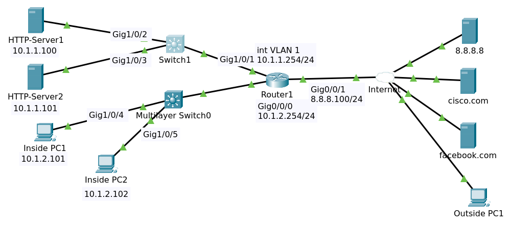

# ACL



File packet tracer [ACL Initial](ACL_Initial.pkt).

## Objectives

Configure ACLs as follows:

1. Restrict traffic internally using Router1 as follows:
   - Use access list number 100
   - Inside PC1 can only access the HTTP server 1 using HTTP on subnet 10.1.1.0/24
   - Inside PC2 can only access the HTTP server 2 using HTTPS on subnet 10.1.1.0/24
   - No other PCs or servers on subnet 10.1.2.0/24 can access subnet 10.1.1.0/24 
   (Explicitly add this line. This is normally done to log the traffic with the word log, but PT does not support logging)
   - Hosts on subnet 10.1.2.0/24 can access any other network
   - Bind access list in the most efficient place on Router1

2. Verification:
   - Verify that Inside PC1 can access the internal HTTP server 1 using HTTP, but not ping HTTP server 2
   - Verify that Inside PC2 can access the internal HTTP server 2 using HTTPS, but not ping HTTP server 1
   - Verify that both inside PC1 and PC2 can browse to cisco.com and facebook.com

## Seting ACL

On Router R1

```
conf t
access-list 100 permit tcp host 10.1.2.101 host 10.1.1.100 eq 80
access-list 100 permit tcp host 10.1.2.102 host 10.1.1.101 eq 443
access-list 100 deny ip 10.1.2.0 0.0.0.255 10.1.1.0 0.0.0.255
access-list 100 permit ip 10.1.2.0 0.0.0.255 any
end
```

>In the real world you can add log `access-list 100 deny ip 10.1.2.0 0.0.0.255 10.1.1.0 0.0.0.255 log`

Enter command `sh access-lists`

```
Extended IP access list 100
    10 permit tcp host 10.1.2.101 host 10.1.1.100 eq www
    20 permit tcp host 10.1.2.102 host 10.1.1.101 eq 443
    30 deny ip 10.1.2.0 0.0.0.255 10.1.1.0 0.0.0.255
    40 permit ip 10.1.2.0 0.0.0.255 any
```

### Edit ACL

If the acl got wrong like this

```
Extended IP access list 100
    10 permit tcp host 10.1.2.101 host 10.1.1.100 eq www
    20 permit tcp host 10.1.2.10 host 10.1.1.101 eq 443
    30 deny ip 10.1.2.0 0.0.0.255 10.1.1.0 0.0.0.255
    40 permit ip 10.1.2.0 0.0.0.255 any
```

>Notice the rule number 20

First, you delete that number and create it again

```
conf t
ip access-list extended 100
no 20
20 permit tcp host 10.1.2.102 host 10.1.1.101 eq 443
```

### Delete ACL

If the acl got wrong like this

```
Extended IP access list 100
    10 permit tcp host 10.1.2.101 host 10.1.1.100 eq www
    20 permit tcp host 10.1.2.102 host 10.1.1.101 eq 443
    30 deny ip 10.1.2.0 0.0.0.255 10.1.1.0 0.0.0.255
    40 permit ip 10.1.2.0 0.0.0.255 any
    50 permit tcp host 10.1.2.10 host 10.1.1.101 eq 443```
```

>Notice the rule number 50

You can delete it

```
conf t
ip access-list extended 100
no 50
```

Then rule 50 will be deleted.

>If you typed `no access list 100` that would remove the entire access list.

## Bind the ACL to Port

```
Router1#conf t
Router1(config)#interface gigabitEthernet 0/0/0
Router1(config-if)#ip access-group ?
  <1-199>  IP access list (standard or extended)
  WORD     Access-list name
Router1(config-if)#ip access-group 100 ?
  in   inbound packets
  out  outbound packets
Router1(config-if)#ip access-group 100 in
Router1(config-if)#end
```

Show running config

```
!
hostname Router1
!
...
!
interface GigabitEthernet0/0/0
 ip address 10.1.2.254 255.255.255.0
 ip access-group 100 in
 ip nat inside
 duplex auto
 speed auto
!
...
!
access-list 100 permit tcp host 10.1.2.101 host 10.1.1.100 eq www
access-list 100 permit tcp host 10.1.2.102 host 10.1.1.101 eq 443
access-list 100 deny ip 10.1.2.0 0.0.0.255 10.1.1.0 0.0.0.255
access-list 100 permit ip 10.1.2.0 0.0.0.255 any
!
...
```

Enter command `sh access-lists`

```
Extended IP access list 100
    10 permit tcp host 10.1.2.101 host 10.1.1.100 eq www (6 match(es))
    20 permit tcp host 10.1.2.102 host 10.1.1.101 eq 443 (28 match(es))
    30 deny ip 10.1.2.0 0.0.0.255 10.1.1.0 0.0.0.255 (221 match(es))
    40 permit ip 10.1.2.0 0.0.0.255 any (157 match(es))
```

