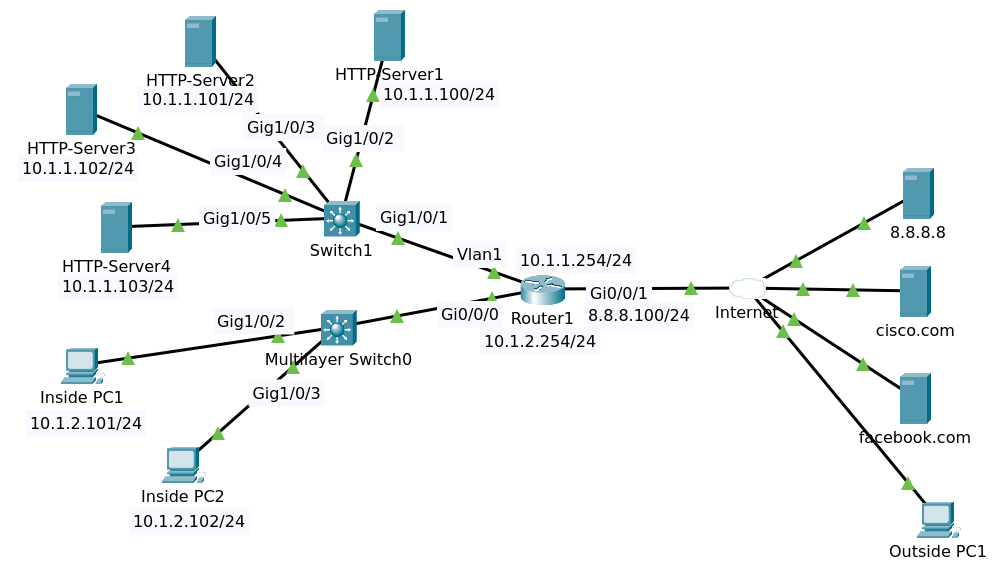

# ACL



File packet tracer [ACL2 Initial](ACL2_Initial.pkt).

## Objectives

Configure ACLs as follows (hints below):

1. Restrict traffic internally as follows:
   - Use access list number 100
   - Inside PC 1 on subnet 10.1.2.0/24 can only access HTTP servers 1 and 2 on subnet 10.1.1.0/24 using HTTP and HTTPS (Use only two lines in your ACL to accomplish this).
   - No other PCs or servers on subnet 10.1.2.0/24 can access subnet 10.1.1.0/24 (Explicitly add this line. This is normally done to log the traffic with the word log, but PT does not support logging)
   - Hosts on subnet 10.1.2.0/24 can access any other network
   - Bind access list in the most efficient place on Router1

2. Restrict traffic externally as follows:
   - Use access list number 101
   - Any external device can access internal HTTP Servers using HTTP or HTTPS
   - No external device can access the user subnet 10.1.2.0/24 (Explicitly add this line. This is normally done to log the traffic with the word log, but PT does not support logging)
   - Bind access list in the most efficient place on Router1

3. Verification:
   - Verify that Inside PC1 can access the internal HTTP servers 1 and 2, but not other HTTP servers (server 3 and 4)
   - Verify that Inside PC2 cannot access the internal HTTP servers
   - Verify that both inside PC1 and PC2 can browse to cisco.com and facebook.com
   - Verify that Outside PC1 can access both internal servers using HTTP (server 1) and HTTPS (Server), but not ping the inside PCs
 
Hints:

1. Think about how binary works
2. Think about DNS traffic
3. Think about return traffic from the Internet servers

## Seting ACL

Seting ACL on router R1

### Inbound on gigabitEthernet 0/0/0

Configuration

```
conf t
access-list 100 permit tcp host 10.1.2.101 10.1.1.100 0.0.0.1 eq www
access-list 100 permit tcp host 10.1.2.101 10.1.1.100 0.0.0.1 eq 443
access-list 100 deny ip 10.1.2.0 0.0.0.255 10.1.1.0 0.0.0.255
access-list 100 permit ip 10.1.2.0 0.0.0.255 any
end
write
```

Show running config

```
access-list 100 permit tcp host 10.1.2.101 10.1.1.100 0.0.0.1 eq www
access-list 100 permit tcp host 10.1.2.101 10.1.1.100 0.0.0.1 eq 443
access-list 100 deny ip 10.1.2.0 0.0.0.255 10.1.1.0 0.0.0.255
access-list 100 permit ip 10.1.2.0 0.0.0.255 any
```

Show access-lists

```
Extended IP access list 100
    10 permit tcp host 10.1.2.101 10.1.1.100 0.0.0.1 eq www
    20 permit tcp host 10.1.2.101 10.1.1.100 0.0.0.1 eq 443
    30 deny ip 10.1.2.0 0.0.0.255 10.1.1.0 0.0.0.255
    40 permit ip 10.1.2.0 0.0.0.255 any
```

Inbound

```
conf t
interface gigabitEthernet 0/0/0
ip access-group 100 in
end
write
```

Show running config

```
!
interface GigabitEthernet0/0/0
 ip address 10.1.2.254 255.255.255.0
 ip access-group 100 in
 duplex auto
 speed auto
!
```

### Inbound on gigabitEthernet 0/0/1

Configuration

```
conf t
access-list 101 permit tcp any 10.1.1.0 0.0.0.255 eq www
access-list 101 permit tcp any 10.1.1.0 0.0.0.255 eq 443
access-list 101 permit tcp any 10.1.2.0 0.0.0.255 established
access-list 101 permit udp host 8.8.8.8 eq domain 10.1.2.0 0.0.0.255
access-list 101 deny ip any 10.1.2.0 0.0.0.255
end
write
```

Show running config

```
access-list 101 permit tcp any 10.1.1.0 0.0.0.255 eq www
access-list 101 permit tcp any 10.1.1.0 0.0.0.255 eq 443
access-list 101 permit tcp any 10.1.1.0 0.0.0.255 established
access-list 101 permit udp host 8.8.8.8 eq domain 10.1.2.0 0.0.0.255
access-list 101 deny ip any 10.1.2.0 0.0.0.255
```

Show access-list

```
Extended IP access list 101
    10 permit tcp any 10.1.1.0 0.0.0.255 eq www
    20 permit tcp any 10.1.1.0 0.0.0.255 eq 443
    30 permit tcp any 10.1.1.0 0.0.0.255 established
    40 permit udp host 8.8.8.8 eq domain 10.1.2.0 0.0.0.255
    50 deny ip any 10.1.2.0 0.0.0.255
```

Inbound

```
conf t
interface gigabitEthernet 0/0/1
ip access-group 101 in
end
write
```

```
!
interface GigabitEthernet0/0/1
 ip address 8.8.8.100 255.255.255.0
 ip access-group 101 in
 duplex auto
 speed auto
 no cdp enable
!
```

### Ping

From PC1 ping to facebook.com timed out.

```
C:\>ping facebook.com

Pinging 8.8.8.10 with 32 bytes of data:

Request timed out.
Request timed out.
Request timed out.
Request timed out.

Ping statistics for 8.8.8.10:
    Packets: Sent = 4, Received = 0, Lost = 4 (100% loss)
```

Edit ACL like this

```
conf t
ip access-list extended 101
no 50
50 permit icmp any 10.1.2.0 0.0.0.255 echo-reply
60 deny ip any 10.1.2.0 0.0.0.255
end
write
```

Show access-list

Extended IP access list 100
    10 permit tcp host 10.1.2.101 10.1.1.100 0.0.0.1 eq www
    20 permit tcp host 10.1.2.101 10.1.1.100 0.0.0.1 eq 443
    30 deny ip 10.1.2.0 0.0.0.255 10.1.1.0 0.0.0.255
    40 permit ip 10.1.2.0 0.0.0.255 any (25 match(es))
Extended IP access list 101
    10 permit tcp any 10.1.1.0 0.0.0.255 eq www
    20 permit tcp any 10.1.1.0 0.0.0.255 eq 443
    30 permit tcp any 10.1.2.0 0.0.0.255 established
    40 permit udp host 8.8.8.8 eq domain 10.1.2.0 0.0.0.255 (4 match(es))
    50 permit icmp any 10.1.2.0 0.0.0.255 echo-reply (4 match(es))
    60 deny ip any 10.1.2.0 0.0.0.255 (4 match(es))


