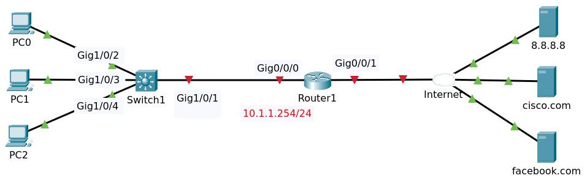

# Dynamic NAT PAT



File packet tracer [Topology](Dynamic_NAT_PAT_Initial.pkt).

## Objectives

Configure the network as follows:

1. Configure the router to get an IP address via DHCP from your ISP
2. Configure the router to allocate IP addresses via DHCP to clients in your network:
   - Network = 10.1.1.0/24
   - Default Gateway = 10.1.1.254
   - DNS = 8.8.8.8
3. Configure the router so internal hosts can access the internet servers using PAT (router IP address)

## Router R1 Configuration

### IP Address 

```
conf t
interface gigabitEthernet 0/0/0
ip address 10.1.1.254 255.255.255.0
no shutdown 
exit
interface gigabitEthernet 0/0/1
ip address dhcp
no shutdown
exit
```

### DHCP

```
ip dhcp pool dhcp_pool
network 10.1.1.0 255.255.255.0
default-router 10.1.1.254
dns-server 8.8.8.8
exit
ip dhcp excluded-address 10.1.1.100 10.1.1.254
end
write
```

Show ip interface brief 

```
Interface              IP-Address      OK? Method Status                Protocol 
GigabitEthernet0/0/0   10.1.1.254      YES manual up                    up 
GigabitEthernet0/0/1   8.8.8.100       YES DHCP   up                    up 
Vlan1                  unassigned      YES unset  administratively down down
```

Show ip route.

```
...
Gateway of last resort is 8.8.8.8 to network 0.0.0.0

     8.0.0.0/8 is variably subnetted, 2 subnets, 2 masks
C       8.8.8.0/24 is directly connected, GigabitEthernet0/0/1
L       8.8.8.100/32 is directly connected, GigabitEthernet0/0/1
     10.0.0.0/8 is variably subnetted, 2 subnets, 2 masks
C       10.1.1.0/24 is directly connected, GigabitEthernet0/0/0
L       10.1.1.254/32 is directly connected, GigabitEthernet0/0/0
S*   0.0.0.0/0 [254/0] via 8.8.8.8
```

Show running config.

```
!
ip dhcp excluded-address 10.1.1.100 10.1.1.254
!
ip dhcp pool dhcp_pool
 network 10.1.1.0 255.255.255.0
 default-router 10.1.1.254
 dns-server 8.8.8.8
!
...
!
interface GigabitEthernet0/0/0
 ip address 10.1.1.254 255.255.255.0
 duplex auto
 speed auto
!
interface GigabitEthernet0/0/1
 ip address dhcp
 duplex auto
 speed auto
!
```

Tes ping to cisco.com

```
Router#ping cisco.com
Translating "cisco.com"...domain server (8.8.8.8)
Type escape sequence to abort.
Sending 5, 100-byte ICMP Echos to 8.8.8.9, timeout is 2 seconds:
.!!!!
Success rate is 80 percent (4/5), round-trip min/avg/max = 0/0/0 ms
```

### Access List and Binding

```
conf t
access-list 100 permit ip 10.1.1.0 0.0.0.255 any
interface gigabitEthernet 0/0/0
ip access-group 100 in
end
wr
```

### NAT

```
conf t
interface gigabitEthernet 0/0/0
ip nat inside
interface gigabitEthernet 0/0/1
ip nat outside 
exit
ip nat inside source list 100 interface gigabitEthernet 0/0/1 overload 
end
write
```

## Verifying

### PC1

On PC1 test ping to ip dns 8.8.8.8 and facebook.com

```
C:\>ping 8.8.8.8

Pinging 8.8.8.8 with 32 bytes of data:

Reply from 8.8.8.8: bytes=32 time<1ms TTL=127
Reply from 8.8.8.8: bytes=32 time<1ms TTL=127
Reply from 8.8.8.8: bytes=32 time<1ms TTL=127
Reply from 8.8.8.8: bytes=32 time<1ms TTL=127

Ping statistics for 8.8.8.8:
    Packets: Sent = 4, Received = 4, Lost = 0 (0% loss),
Approximate round trip times in milli-seconds:
    Minimum = 0ms, Maximum = 0ms, Average = 0ms

C:\>ping facebook.com

Pinging 8.8.8.10 with 32 bytes of data:

Request timed out.
Reply from 8.8.8.10: bytes=32 time<1ms TTL=127
Reply from 8.8.8.10: bytes=32 time<1ms TTL=127
Reply from 8.8.8.10: bytes=32 time<1ms TTL=127

Ping statistics for 8.8.8.10:
    Packets: Sent = 4, Received = 3, Lost = 1 (25% loss),
Approximate round trip times in milli-seconds:
    Minimum = 0ms, Maximum = 0ms, Average = 0ms
```

On router show ip dhcp binding

```
IP address       Client-ID/              Lease expiration        Type
                 Hardware address
10.1.1.1         0007.EC6A.6ECE           --                     Automatic
10.1.1.2         000A.4186.291A           --                     Automatic
10.1.1.3         0009.7C78.31BE           --                     Automatic
```

Show ip nat translations

```
Pro  Inside global     Inside local       Outside local      Outside global
icmp 8.8.8.100:10      10.1.1.2:10        8.8.8.10:10        8.8.8.10:10
icmp 8.8.8.100:11      10.1.1.2:11        8.8.8.10:11        8.8.8.10:11
icmp 8.8.8.100:12      10.1.1.2:12        8.8.8.10:12        8.8.8.10:12
icmp 8.8.8.100:9       10.1.1.2:9         8.8.8.10:9         8.8.8.10:9
udp 8.8.8.100:1025     10.1.1.2:1025      8.8.8.8:53         8.8.8.8:53
udp 8.8.8.100:1026     10.1.1.2:1026      8.8.8.8:53         8.8.8.8:53
```

### PC2

On PC2 browsing to http://cisco.com

On Router show ip nat translations 

```
Pro  Inside global     Inside local       Outside local      Outside global
udp 8.8.8.100:1024     10.1.1.1:1025      8.8.8.8:53         8.8.8.8:53
udp 8.8.8.100:1025     10.1.1.2:1025      8.8.8.8:53         8.8.8.8:53
udp 8.8.8.100:1026     10.1.1.2:1026      8.8.8.8:53         8.8.8.8:53
udp 8.8.8.100:1027     10.1.1.1:1026      8.8.8.8:53         8.8.8.8:53
tcp 8.8.8.100:1025     10.1.1.1:1025      8.8.8.9:80         8.8.8.9:80
tcp 8.8.8.100:1026     10.1.1.1:1026      8.8.8.9:80         8.8.8.9:80
```

Enter command `clear ip nat translations *` to clear the nat table.


