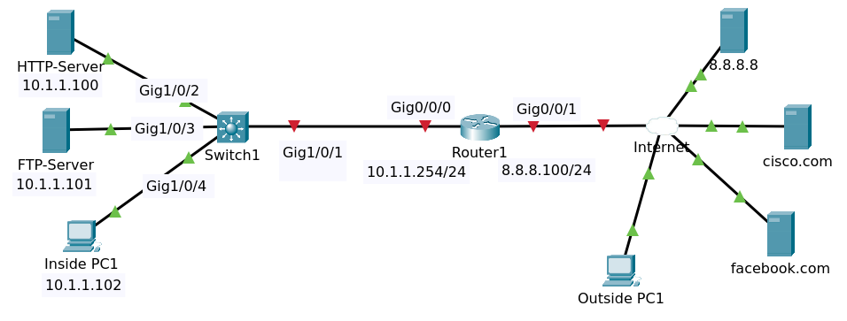

# Static NAT



File packet tracer [Topology](Static_NAT_Initial.pkt).

## Objectives

Configure the network as follows

1. Router details:
   - Outside = 8.8.8.100/24
   - Inside = 10.1.1.254/24
   - Default Route to 8.8.8.8
2. Configure static NAT so that the outside PC can access the internal HTTP, FTP and TFTP servers.
   - HTTP = 8.8.8.200 (NAT only the required port). DNS = myhttp.com
   - FTP = 8.8.8.201 (full static NAT). DNS = myftp.com
3. Verify that both the inside and the outside PCs can access the internal servers.
   - Inside host to use internal IP addresses
   - Outside host to use DNS names

## Router R1 Configuration

### IP Address 

```
conf t
hostname Router1
interface gigabitEthernet 0/0/0
ip address 10.1.1.254 255.255.255.0
no shutdown 
exit
interface gigabitEthernet 0/0/1
ip address 8.8.8.100 255.255.255.0
no shutdown
exit
ip domain-lookup
ip name-server 8.8.8.8
ip route 0.0.0.0 0.0.0.0 8.8.8.8
end
write
```

Show ip interface brief 

```
Interface              IP-Address      OK? Method Status                Protocol 
GigabitEthernet0/0/0   10.1.1.254      YES manual up                    up 
GigabitEthernet0/0/1   8.8.8.100       YES manual up                    up 
Vlan1                  unassigned      YES unset  administratively down down
```

Tes ping to cisco.com

```
Router1#ping facebook.com
Translating "facebook.com"...domain server (8.8.8.8)
Type escape sequence to abort.
Sending 5, 100-byte ICMP Echos to 8.8.8.10, timeout is 2 seconds:
.!!!!
Success rate is 80 percent (4/5), round-trip min/avg/max = 0/0/0 ms
```

### NAT

Configure nat for Server HTTP (NAT only the required port)

```
conf t
ip nat inside source static tcp 10.1.1.100 80 8.8.8.200 80
ip nat inside source static tcp 10.1.1.100 443 8.8.8.200 443
```

Configure full static nat for FTP Server.

```
ip nat inside source static 10.1.1.101 8.8.8.201
```

Configure nat inside and outside.

```
interface gigabitEthernet 0/0/0
ip nat inside 
interface gigabitEthernet 0/0/1
ip nat outside
end
write
```

Show running config

```
hostname Router1
!
...
!
ip name-server 8.8.8.8
!
...
!
interface GigabitEthernet0/0/0
 ip address 10.1.1.254 255.255.255.0
 ip nat inside
 duplex auto
 speed auto
!
interface GigabitEthernet0/0/1
 ip address 8.8.8.100 255.255.255.0
 ip nat outside
 duplex auto
 speed auto
!
interface Vlan1
 no ip address
 shutdown
!
ip nat inside source static tcp 10.1.1.100 80 8.8.8.200 80 
ip nat inside source static tcp 10.1.1.100 443 8.8.8.200 443 
ip nat inside source static 10.1.1.101 8.8.8.201 
ip classless
ip route 0.0.0.0 0.0.0.0 8.8.8.8 
```

Show ip nat translations

```
Pro  Inside global     Inside local       Outside local      Outside global
tcp 8.8.8.200:443      10.1.1.100:443     ---                ---
tcp 8.8.8.200:80       10.1.1.100:80      ---                ---
---  8.8.8.201         10.1.1.101         ---                ---
```

## Verifying

### Outside PC1

#### Browsing http and https

Browsing to http://myhttp.com and https://myhttp.com.

On Router1 show ip nat translations

```
Pro  Inside global     Inside local       Outside local      Outside global
tcp 8.8.8.200:443      10.1.1.100:443     ---                ---
tcp 8.8.8.200:443      10.1.1.100:443     8.8.8.20:1028      8.8.8.20:1028
tcp 8.8.8.200:443      10.1.1.100:443     8.8.8.20:1029      8.8.8.20:1029
tcp 8.8.8.200:80       10.1.1.100:80      ---                ---
tcp 8.8.8.200:80       10.1.1.100:80      8.8.8.20:1026      8.8.8.20:1026
tcp 8.8.8.200:80       10.1.1.100:80      8.8.8.20:1027      8.8.8.20:1027
---  8.8.8.201         10.1.1.101         ---                ---
```

On Router enter command  `clear ip nat translation *`

```
Pro  Inside global     Inside local       Outside local      Outside global
tcp 8.8.8.200:443      10.1.1.100:443     ---                ---
tcp 8.8.8.200:80       10.1.1.100:80      ---                ---
---  8.8.8.201         10.1.1.101         ---                ---
```

#### Access to FTP Server

Open command prompt and enter command `ftp myftp.com`. Using user cisco and password cisco.

```
C:\>ftp myftp.com
Trying to connect...myftp.com
Connected to myftp.com
220- Welcome to PT Ftp server
Username:cisco
331- Username ok, need password
Password:
230- Logged in
(passive mode On)
ftp>dir
...blah...
```

On Router1 show ip nat translations

```
Pro  Inside global     Inside local       Outside local      Outside global
tcp 8.8.8.200:443      10.1.1.100:443     ---                ---
tcp 8.8.8.200:80       10.1.1.100:80      ---                ---
tcp 8.8.8.201:1028     10.1.1.101:1028    8.8.8.20:1031      8.8.8.20:1031
tcp 8.8.8.201:21       10.1.1.101:21      8.8.8.20:1030      8.8.8.20:1030
---  8.8.8.201         10.1.1.101         ---                ---
```

Now try to download the file

```
ftp>get asa842-k8.bin

Reading file asa842-k8.bin from myftp.com: 
File transfer in progress...

[Transfer complete - 5571584 bytes]

5571584 bytes copied in 17.413 secs (73314 bytes/sec)
```

On Router1 show ip nat translations

```
Router1#sh ip nat translations 
Pro  Inside global     Inside local       Outside local      Outside global
...
tcp 8.8.8.201:1028     10.1.1.101:1028    8.8.8.20:1031      8.8.8.20:1031
tcp 8.8.8.201:1030     10.1.1.101:1030    8.8.8.20:1032      8.8.8.20:1032
tcp 8.8.8.201:1032     10.1.1.101:1032    8.8.8.20:1033      8.8.8.20:1033
tcp 8.8.8.201:21       10.1.1.101:21      8.8.8.20:1030      8.8.8.20:1030
---  8.8.8.201         10.1.1.101         ---                ---
```

### Extras

These are not in the video course.

The HTTP Server and Inside PC can't ping to internet only the FTP Server.

Show ip nat translations

```
Pro  Inside global     Inside local       Outside local      Outside global
icmp 8.8.8.201:5       10.1.1.101:5       8.8.8.8:5          8.8.8.8:5
icmp 8.8.8.201:6       10.1.1.101:6       8.8.8.8:6          8.8.8.8:6
icmp 8.8.8.201:7       10.1.1.101:7       8.8.8.8:7          8.8.8.8:7
icmp 8.8.8.201:8       10.1.1.101:8       8.8.8.8:8          8.8.8.8:8
tcp 8.8.8.200:443      10.1.1.100:443     ---                ---
tcp 8.8.8.200:80       10.1.1.100:80      ---                ---
---  8.8.8.201         10.1.1.101         ---                ---
```

Now we want to use PAT to enable the HTTP Server and Inside PC to access the internet.

First, create access-list and create pat

```
conf t
access-list 100 permit ip 10.1.1.100 0.0.0.0 any
access-list 100 permit ip 10.1.1.102 0.0.0.0 any
ip nat inside source list 100 interface gigabitEthernet 0/0/1 overload
end
write
```

#### Verifying

On inside PC ping to 8.8.8.8, facebook.com and cisco.com are successful.

On Router1 show ip nat translations

``` 
Pro  Inside global     Inside local       Outside local      Outside global
icmp 8.8.8.100:19      10.1.1.102:19      8.8.8.8:19         8.8.8.8:19
icmp 8.8.8.100:20      10.1.1.102:20      8.8.8.8:20         8.8.8.8:20
icmp 8.8.8.100:21      10.1.1.102:21      8.8.8.8:21         8.8.8.8:21
icmp 8.8.8.100:22      10.1.1.102:22      8.8.8.8:22         8.8.8.8:22
icmp 8.8.8.100:23      10.1.1.102:23      8.8.8.9:23         8.8.8.9:23
icmp 8.8.8.100:24      10.1.1.102:24      8.8.8.9:24         8.8.8.9:24
icmp 8.8.8.100:25      10.1.1.102:25      8.8.8.9:25         8.8.8.9:25
icmp 8.8.8.100:26      10.1.1.102:26      8.8.8.9:26         8.8.8.9:26
icmp 8.8.8.100:27      10.1.1.102:27      8.8.8.10:27        8.8.8.10:27
icmp 8.8.8.100:28      10.1.1.102:28      8.8.8.10:28        8.8.8.10:28
icmp 8.8.8.100:29      10.1.1.102:29      8.8.8.10:29        8.8.8.10:29
icmp 8.8.8.100:30      10.1.1.102:30      8.8.8.10:30        8.8.8.10:30
udp 8.8.8.100:1031     10.1.1.102:1031    8.8.8.8:53         8.8.8.8:53
udp 8.8.8.100:1032     10.1.1.102:1032    8.8.8.8:53         8.8.8.8:53
```

But inside PC can't ping to myhttp.com and myftp.com. You know why.

```
C:\>ping myftp.com

Pinging 8.8.8.201 with 32 bytes of data:


Ping statistics for 8.8.8.201:
    Packets: Sent = 1, Received = 0, Lost = 1 (100% loss),

Control-C
^C
C:\>ping myhttp.com

Pinging 8.8.8.200 with 32 bytes of data:


Ping statistics for 8.8.8.200:
    Packets: Sent = 1, Received = 0, Lost = 1 (100% loss),

Control-C
^C
```

>Create dns server local to translate the hostnames myftp.com and myhttp.com to ip local.

Inside PC can browse http://cisco.com and http://facebook.com

On Router1 sh ip nat translations

```
Pro  Inside global     Inside local       Outside local      Outside global
udp 8.8.8.100:1033     10.1.1.102:1033    8.8.8.8:53         8.8.8.8:53
udp 8.8.8.100:1034     10.1.1.102:1034    8.8.8.8:53         8.8.8.8:53
udp 8.8.8.100:1035     10.1.1.102:1035    8.8.8.8:53         8.8.8.8:53
udp 8.8.8.100:1036     10.1.1.102:1036    8.8.8.8:53         8.8.8.8:53
tcp 8.8.8.100:1026     10.1.1.102:1026    8.8.8.9:80         8.8.8.9:80
tcp 8.8.8.100:1027     10.1.1.102:1027    8.8.8.9:80         8.8.8.9:80
tcp 8.8.8.100:1028     10.1.1.102:1028    8.8.8.10:80        8.8.8.10:80
tcp 8.8.8.100:1029     10.1.1.102:1029    8.8.8.10:80        8.8.8.10:80
```


