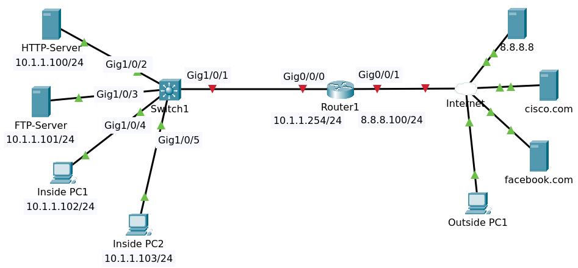

# Static and Dynamic NAT



File packet tracer [Topology](Static_Dynamic_NAT_Initial.pkt).

## Objectives

Configure the network as follows:

1. Router details:
   - Outside = 8.8.8.100/24
   -Inside = 10.1.1.254/24
   - Default Route to 8.8.8.8
2. Configure static NAT so that the outside PC can access the internal HTTP, FTP servers.
   - HTTP = 8.8.8.200 (NAT only the required port). DNS = myhttp.com
   - FTP = 8.8.8.201 (full static NAT). DNS = myftp.com
3. Configure Dynamic NAT using Router IP address so that internal PCs can access the Internet servers
4. Verify that the outside PC can access the internal servers using the server DNS names.
5. Verify that the internal PCs can access the internet servers using their DNS names.

## Router R1 Configuration

### IP Address 

```
conf t
hostname Router1
interface gigabitEthernet 0/0/0
ip address 10.1.1.254 255.255.255.0
no shutdown 
exit
interface gigabitEthernet 0/0/1
ip address 8.8.8.100 255.255.255.0
no shutdown
exit
ip domain-lookup
ip name-server 8.8.8.8
ip route 0.0.0.0 0.0.0.0 8.8.8.8
end
write
```

Show ip interface brief 

```
Interface              IP-Address      OK? Method Status                Protocol 
GigabitEthernet0/0/0   10.1.1.254      YES manual up                    up 
GigabitEthernet0/0/1   8.8.8.100       YES manual up                    up 
Vlan1                  unassigned      YES unset  administratively down down
```

Tes ping to cisco.com

```
Router1#ping facebook.com
Translating "facebook.com"...domain server (8.8.8.8)
Type escape sequence to abort.
Sending 5, 100-byte ICMP Echos to 8.8.8.10, timeout is 2 seconds:
.!!!!
Success rate is 80 percent (4/5), round-trip min/avg/max = 0/0/0 ms
```

### NAT

#### Static NAT

Configure nat for Server HTTP (NAT only the required port)

```
conf t
ip nat inside source static tcp 10.1.1.100 80 8.8.8.200 80
```

Configure full static nat for FTP Server.

```
ip nat inside source static 10.1.1.101 8.8.8.201
```

Configure nat inside and outside.

```
interface gigabitEthernet 0/0/0
ip nat inside 
interface gigabitEthernet 0/0/1
ip nat outside
```

#### Dynamic NAT

Use access-list 1 to keep it simple

```
ip nat inside source list 1 interface gigabitEthernet 0/0/1 overload
access-list 1 permit any
```

Show sh ip nat translations 

```
Pro  Inside global     Inside local       Outside local      Outside global
tcp 8.8.8.200:80       10.1.1.100:80      ---                ---
---  8.8.8.201         10.1.1.101         ---                ---
```

### Verifying

#### Inside PC1

On Inside PC1 open http://facebook.com

On Router1 sh ip nat translations

```
Pro  Inside global     Inside local       Outside local      Outside global
udp 8.8.8.100:1025     10.1.1.102:1025    8.8.8.8:53         8.8.8.8:53
udp 8.8.8.100:1026     10.1.1.102:1026    8.8.8.8:53         8.8.8.8:53
tcp 8.8.8.100:1025     10.1.1.102:1025    8.8.8.10:80        8.8.8.10:80
tcp 8.8.8.100:1026     10.1.1.102:1026    8.8.8.10:80        8.8.8.10:80
```

#### Outside PC1

On Outside PC1 open http://myhttp.com and myftp.com

On Router1 show ip nat translations

```
Pro  Inside global     Inside local       Outside local      Outside global
tcp 8.8.8.200:80       10.1.1.100:80      ---                ---
tcp 8.8.8.200:80       10.1.1.100:80      8.8.8.20:1025      8.8.8.20:1025
tcp 8.8.8.200:80       10.1.1.100:80      8.8.8.20:1026      8.8.8.20:1026
tcp 8.8.8.201:1028     10.1.1.101:1028    8.8.8.20:1028      8.8.8.20:1028
tcp 8.8.8.201:21       10.1.1.101:21      8.8.8.20:1027      8.8.8.20:1027
---  8.8.8.201         10.1.1.101         ---                ---
```


