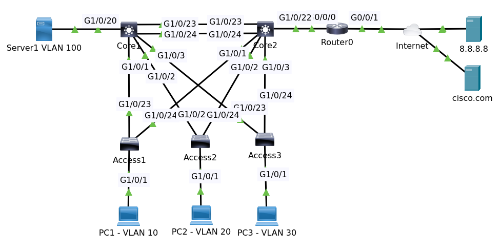

# Basic VLAN 2.4



File packet tracer [Topology]().

## Objectives

Configure the network as follows:

1. Configure ISR g0/0/1 for DHCP
2. Enable NAT to NAT internal network to ISR G0/0/1 interface (PAT)
3. Verify that PCs can ping cisco.com

## IntRouter Configuration

### IP Address

Show ip int br

```
Interface              IP-Address      OK? Method Status                Protocol 
GigabitEthernet0/0/0   10.1.1.253      YES manual up                    up 
GigabitEthernet0/0/1   unassigned      YES unset  up                    up 
Loopback0              1.1.1.1         YES manual up                    up 
Vlan1                  unassigned      YES unset  administratively down down
```

Configuration ip dhcp

```
conf t
interface gigabitEthernet 0/0/1
ip address dhcp
end
write
```

Soon IntRouter will get the ip from dhcp server. Then tes ping to 8.8.8.8.

### PAT

```
conf t
int gi 0/0/0
ip nat inside
int gi 0/0/1
ip nat outside
exit
ip nat inside source list 1 interface gigabitEthernet 0/0/1 overload 
access-list 1 permit any
end
write
```

### EIGRP

The Core1 and Core2 don't have a default route or default gateway.

Configuring default gateways in EIGRP can be a bit more complex. It's out of the scope of 
the CCNA course. We're gonna show it to you here so that you can see how to inject a default 
route into the network. We need to do that because the two core switches don't know how to 
get to the internet. They need to be configured to use the ISR as their default gateway.
Now the way to do this in EIGRP is to redistribute a default route.

```
conf t
router eigrp 100
redistribute static metric 10000 1000 255 1 1500
end
write
```

>The values that we need to specify are bandwidth, delay, reliability, load, and MTU.

Show ip route

```
Codes: L - local, C - connected, S - static, R - RIP, M - mobile, B - BGP
       D - EIGRP, EX - EIGRP external, O - OSPF, IA - OSPF inter area
       N1 - OSPF NSSA external type 1, N2 - OSPF NSSA external type 2
       E1 - OSPF external type 1, E2 - OSPF external type 2, E - EGP
       i - IS-IS, L1 - IS-IS level-1, L2 - IS-IS level-2, ia - IS-IS inter area
       * - candidate default, U - per-user static route, o - ODR
       P - periodic downloaded static route

Gateway of last resort is 8.8.8.8 to network 0.0.0.0

     1.0.0.0/32 is subnetted, 1 subnets
C       1.1.1.1/32 is directly connected, Loopback0
     8.0.0.0/8 is variably subnetted, 2 subnets, 2 masks
C       8.8.8.0/24 is directly connected, GigabitEthernet0/0/1
L       8.8.8.100/32 is directly connected, GigabitEthernet0/0/1
     10.0.0.0/8 is variably subnetted, 6 subnets, 2 masks
C       10.1.1.0/24 is directly connected, GigabitEthernet0/0/0
L       10.1.1.253/32 is directly connected, GigabitEthernet0/0/0
D       10.1.10.0/24 [90/25625856] via 10.1.1.252, 00:25:04, GigabitEthernet0/0/0
                     [90/25625856] via 10.1.1.251, 00:23:04, GigabitEthernet0/0/0
D       10.1.20.0/24 [90/25625856] via 10.1.1.252, 00:25:04, GigabitEthernet0/0/0
                     [90/25625856] via 10.1.1.251, 00:23:04, GigabitEthernet0/0/0
D       10.1.30.0/24 [90/25625856] via 10.1.1.252, 00:25:04, GigabitEthernet0/0/0
                     [90/25625856] via 10.1.1.251, 00:23:04, GigabitEthernet0/0/0
D       10.1.100.0/24 [90/25625856] via 10.1.1.252, 00:25:04, GigabitEthernet0/0/0
                      [90/25625856] via 10.1.1.251, 00:23:04, GigabitEthernet0/0/0
S*   0.0.0.0/0 [254/0] via 8.8.8.8
```

Show ip eigrp topology.

```
IP-EIGRP Topology Table for AS 100/ID(1.1.1.1)

Codes: P - Passive, A - Active, U - Update, Q - Query, R - Reply,
       r - Reply status

P 0.0.0.0/0, 1 successors, FD is 512000
         via Rstatic (512000/0)
P 1.1.1.1/32, 1 successors, FD is 128256
         via Connected, Loopback0
P 10.1.1.0/24, 1 successors, FD is 2816
         via Connected, GigabitEthernet0/0/0
P 10.1.10.0/24, 2 successors, FD is 25625856
         via 10.1.1.252 (25625856/25625600), GigabitEthernet0/0/0
         via 10.1.1.251 (25625856/25625600), GigabitEthernet0/0/0
P 10.1.20.0/24, 2 successors, FD is 25625856
         via 10.1.1.252 (25625856/25625600), GigabitEthernet0/0/0
         via 10.1.1.251 (25625856/25625600), GigabitEthernet0/0/0
P 10.1.30.0/24, 2 successors, FD is 25625856
         via 10.1.1.252 (25625856/25625600), GigabitEthernet0/0/0
         via 10.1.1.251 (25625856/25625600), GigabitEthernet0/0/0
P 10.1.100.0/24, 2 successors, FD is 25625856
         via 10.1.1.252 (25625856/25625600), GigabitEthernet0/0/0
         via 10.1.1.251 (25625856/25625600), GigabitEthernet0/0/0
```

#### Default route on Core2

On Core2 show ip route

```
Codes: C - connected, S - static, I - IGRP, R - RIP, M - mobile, B - BGP
       D - EIGRP, EX - EIGRP external, O - OSPF, IA - OSPF inter area
       N1 - OSPF NSSA external type 1, N2 - OSPF NSSA external type 2
       E1 - OSPF external type 1, E2 - OSPF external type 2, E - EGP
       i - IS-IS, L1 - IS-IS level-1, L2 - IS-IS level-2, ia - IS-IS inter area
       * - candidate default, U - per-user static route, o - ODR
       P - periodic downloaded static route

Gateway of last resort is 10.1.1.253 to network 0.0.0.0

     1.0.0.0/32 is subnetted, 1 subnets
D       1.1.1.1 [90/25753600] via 10.1.1.253, 00:29:55, Vlan1
     10.0.0.0/24 is subnetted, 5 subnets
C       10.1.1.0 is directly connected, Vlan1
C       10.1.10.0 is directly connected, Vlan10
C       10.1.20.0 is directly connected, Vlan20
C       10.1.30.0 is directly connected, Vlan30
C       10.1.100.0 is directly connected, Vlan100
D*EX 0.0.0.0/0 [170/26112000] via 10.1.1.253, 00:05:01, Vlan1
```

Now Core can ping to 8.8.8.8. Do the similar on Core1.

All PC1, PC2 and PC3 can ping to 8.8.8.8 and cisco.com, also browse to http://cisco.com.


