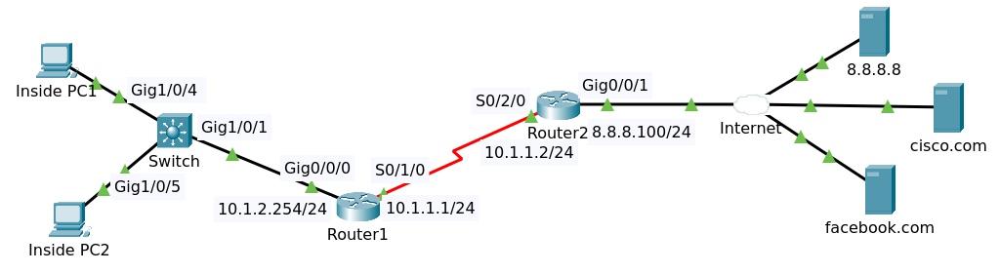
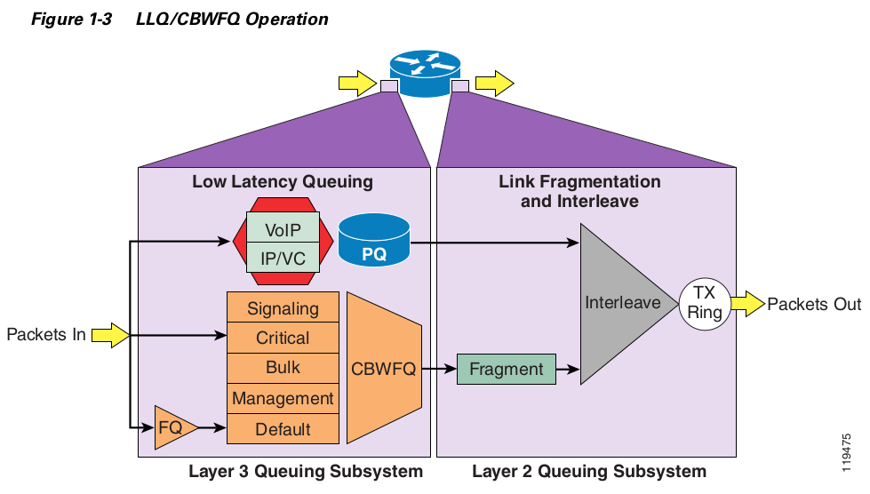

# QoS



File packet tracer [QoS Initial](QOS_Initial.pkt).

## Objectives

Configure QOS as follows:

On Router1:

1. Match traffic:
   - Voice traffic using NBAR (rtp) -> Set DSCP to EF
   - HTTP using NBAR (http) -> Set DSCP to AF31
   - ICMP using NBAR (icmp) -> Set DSCP to AF11

2. Bind outbound on s0/1/0
   - Voice should get priority bandwidth of 100kbps
   - HTTP should get minimum bandwidth of 50kbps
   - ICMP should get minimum bandwidth of 25kbps

On Router2:

1. Match traffic:
   - Voice traffic using DSCP EF -> Set IP Precedence to 5
   - HTTP using DSCP AF31 -> Set IP Precedence to 3
   - ICMP using DSCP AF11 -> Set IP Precedence to 0

2. Bind inbound on s0/2/0

Verification:

1. Open browser on PC1 and PC2 and browse to cisco.com and facebook.com
   - Verify matches in policy
2. Ping cisco.com from PC1 and PC2
   - Verify matches in policy
3. Use simulation mode to view DSCP and IP Precedence Packet markings

## Router1 Configuration

On router one, you're going to match traffic using NBAR (Network Based Application Recognition) and 
then you're going to mark the traffic with DSCP values or differentiated services code point values.

On Serial 0/1/0 you're going to use queuing on the address interface to prioritize voice traffic 
over other traffic types. Voice traffic will be in a priority queue. HTTP and ICMP traffic will be given
a minimum bandwidth guarantee. You need to create an egress or outbound quality of service policy 
on serial 0/1/0 that prioritizes voice traffic.

You are going to implement a low latency queuing or priority queue class-based weighted fair queuing.



### Class Definitions

At initial there is no quality of service configuration on the router. 

```
conf t
class-map voice
match protocol rtp
exit

class-map http 
match protocol http
exit

class-map icmp
match protocol icmp
end
write
```

Show running configuration.

```
!
class-map match-all voice
 match protocol rtp
class-map match-all http
 match protocol http
class-map match-all icmp
 match protocol icmp
!
```

### Policy Creation

```
conf t
policy-map mark
class voice
set ip dscp ef
priority 100
exit
class http
set ip dscp af31
bandwidth 50
exit
class icmp
set ip dscp af11
bandwidth 25
end
write
```

Show values of dscp

```
set ip dscp ?
  <0-63>   Differentiated services codepoint value
  af11     Match packets with AF11 dscp (001010)
  af12     Match packets with AF12 dscp (001100)
  af13     Match packets with AF13 dscp (001110)
  af21     Match packets with AF21 dscp (010010)
  af22     Match packets with AF22 dscp (010100)
  af23     Match packets with AF23 dscp (010110)
  af31     Match packets with AF31 dscp (011010)
  af32     Match packets with AF32 dscp (011100)
  af33     Match packets with AF33 dscp (011110)
  af41     Match packets with AF41 dscp (100010)
  af42     Match packets with AF42 dscp (100100)
  af43     Match packets with AF43 dscp (100110)
  cs1      Match packets with CS1(precedence 1) dscp (001000)
  cs2      Match packets with CS2(precedence 2) dscp (010000)
  cs3      Match packets with CS3(precedence 3) dscp (011000)
  cs4      Match packets with CS4(precedence 4) dscp (100000)
  cs5      Match packets with CS5(precedence 5) dscp (101000)
  cs6      Match packets with CS6(precedence 6) dscp (110000)
  cs7      Match packets with CS7(precedence 7) dscp (111000)
  default  Match packets with default dscp (000000)
  ef       Match packets with EF dscp (101110)
  <cr>
```

Show running configuration.

```
!
class-map match-all voice
 match protocol rtp
class-map match-all http
 match protocol http
class-map match-all icmp
 match protocol icmp
!
policy-map mark
 class voice
  priority 100
  set ip dscp ef
 class http
  bandwidth 50
  set ip dscp af31
 class icmp
  bandwidth 25
  set ip dscp af11
!
```

### Policy Application (Bind Policy)

```
conf t
interface serial 0/1/0
service-policy output mark
end
write
```

Show running configuration

```
!
interface Serial0/1/0
 bandwidth 250
 ip address 10.1.1.1 255.255.255.0
 service-policy output mark
 clock rate 250000
!
```

## Router2 Configuration

### Class Definitions

```
conf t
class-map voice
match ip dscp ef
exit
class-map http
match ip dscp af31
exit
class-map icmp
match ip dscp af11
end
write
```

Show running configuration

```
!
class-map match-all voice
 match ip dscp ef
class-map match-all http
 match ip dscp af31
class-map match-all icmp
 match ip dscp af11
!
```

### Policy Creation

```
conf t
policy-map remark
class voice
set precedence critical
exit
class http
set precedence 3
exit
class icmp
set precedence 0
end
write
```

Values of precedence

```
  <0-7>           Enter up to 4 precedence values separated by white-spaces
  critical        Match packets with critical precedence (5)
  flash           Match packets with flash precedence (3)
  flash-override  Match packets with flash override precedence (4)
  immediate       Match packets with immediate precedence (2)
  internet        Match packets with internetwork control precedence (6)
  network         Match packets with network control precedence (7)
  priority        Match packets with priority precedence (1)
  routine         Match packets with routine precedence (0)
```

Show running configuration.

```
!
class-map match-all voice
 match ip dscp ef
class-map match-all http
 match ip dscp af31
class-map match-all icmp
 match ip dscp af11
!
policy-map remark
 class voice
  set precedence 5
 class http
  set precedence 3
 class icmp
  set precedence 0
!
```

>We're rewriting the type of service field or TOS field in the IP header and using precedences rather than DSCP values.

### Policy Application (Bind Policy)

```
conf t
interface serial 0/2/0
service-policy input remark
end
write
```

Show running configuration

```
!
interface Serial0/2/0
 bandwidth 250
 ip address 10.1.1.2 255.255.255.0
 ip nat inside
 service-policy input remark
!
```

## Verifiying

### Router1

Show policy-map

```
  Policy Map mark
    Class voice
      Strict Priority
      Bandwidth 100 (kbps) Burst 2500 (Bytes)
      set ip dscp ef
    Class http
      Bandwidth 50 (kbps) Max Threshold 64 (packets)
      set ip dscp af31
    Class icmp
      Bandwidth 25 (kbps) Max Threshold 64 (packets)
      set ip dscp af11
```

Show policy-map interface serial 0/1/0

```
 Serial0/1/0

  Service-policy output: mark

    Class-map: voice (match-all)
      0 packets, 0 bytes
      5 minute offered rate 0 bps, drop rate 0 bps
      Match: protocol rtp
      QoS Set
        dscp ef
          Packets marked 0
      Queueing
        Strict Priority
        Output Queue: Conversation 264
        Bandwidth 100 (kbps) Burst 2500 (Bytes)
        (pkts matched/bytes matched) 0/0
        (total drops/bytes drops) 0/0

    Class-map: http (match-all)
      0 packets, 0 bytes
      5 minute offered rate 0 bps, drop rate 0 bps
      Match: protocol http
      QoS Set
        dscp af31
          Packets marked 0
      Queueing
        Output Queue: Conversation 265
        Bandwidth 50 (kbps)Max Threshold 64 (packets)
        (pkts matched/bytes matched) 0/0
        (depth/total drops/no-buffer drops) 0/0/0

    Class-map: icmp (match-all)
      0 packets, 0 bytes
      5 minute offered rate 0 bps, drop rate 0 bps
      Match: protocol icmp
      QoS Set
        dscp af11
          Packets marked 0
      Queueing
        Output Queue: Conversation 266
        Bandwidth 25 (kbps)Max Threshold 64 (packets)
        (pkts matched/bytes matched) 0/0
        (depth/total drops/no-buffer drops) 0/0/0

    Class-map: class-default (match-any)
      159 packets, 17951 bytes
      5 minute offered rate 119 bps, drop rate 0 bps
      Match: any
```

### Router2

Show policy-map

```
  Policy Map remark
    Class voice
      set precedence 5
    Class http
      set precedence 3
    Class icmp
      set precedence 0
```

Show policy-map interface serial 0/2/0

```
 Serial0/2/0

  Service-policy input: remark

    Class-map: voice (match-all)
      0 packets, 0 bytes
      5 minute offered rate 0 bps, drop rate 0 bps
      Match: ip dscp ef (46)
      QoS Set
        precedence 5
          Packets marked 0

    Class-map: http (match-all)
      0 packets, 0 bytes
      5 minute offered rate 0 bps, drop rate 0 bps
      Match: ip dscp af31 (26)
      QoS Set
        precedence 3
          Packets marked 0

    Class-map: icmp (match-all)
      0 packets, 0 bytes
      5 minute offered rate 0 bps, drop rate 0 bps
      Match: ip dscp af11 (10)
      QoS Set
        precedence 0
          Packets marked 0

    Class-map: class-default (match-any)
      130 packets, 6337 bytes
      5 minute offered rate 139 bps, drop rate 0 bps
      Match: any
```

### Inside PC1

Open browser and browsing to http://cisco.com

On Router1

```
    Class-map: http (match-all)
      73 packets, 2934 bytes
      5 minute offered rate 146 bps, drop rate 0 bps
      Match: protocol http
      QoS Set
        dscp af31
          Packets marked 73
```

On Router2

```
    Class-map: http (match-all)
      73 packets, 2934 bytes
      5 minute offered rate 146 bps, drop rate 0 bps
      Match: ip dscp af31 (26)
      QoS Set
        precedence 3
          Packets marked 73
```

Open command prompt and ping to cisco.com

On Router1

```
    Class-map: icmp (match-all)
      4 packets, 512 bytes
      5 minute offered rate 16 bps, drop rate 0 bps
      Match: protocol icmp
      QoS Set
        dscp af11
          Packets marked 4
```

On Router2

```
    Class-map: icmp (match-all)
      4 packets, 512 bytes
      5 minute offered rate 16 bps, drop rate 0 bps
      Match: ip dscp af11 (10)
      QoS Set
        precedence 0
          Packets marked 4
```


