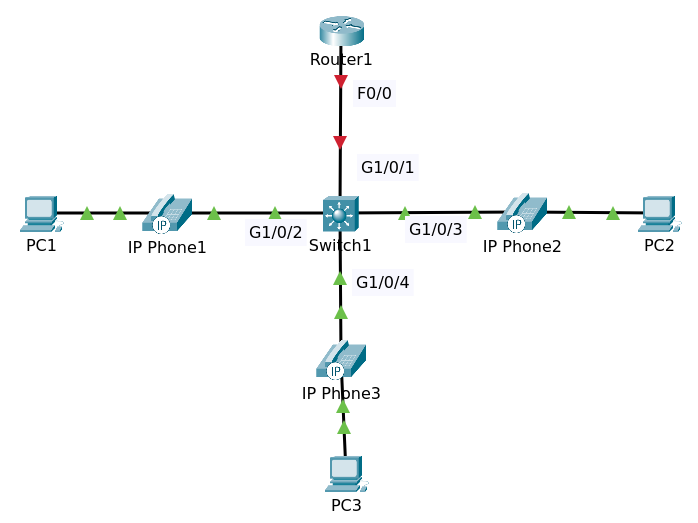

# VoIP: CUCME and Cisco IP Phone

CUCME is Cisco Unified Communications Manager Express.



File packet tracer [Topology](IP_Telephony_Initial.pkt).

## Objectives

Configure Network and make calls between phones using the following:

Router:

1. Configure the router with two DHCP Pools:
   - PCs
     - Subnet: 10.1.100.0/24
     - Gateway: 10.1.100.254/24
     - DNS: 10.1.100.254/24
   - Phones
     - Subnet: 10.1.101.0/24
     - Gateway: 10.1.101.254/24
     - Option 150:10.1.101.254/24

2. Configure the router for inter-VLAN routing (router on a stick)
   - VLAN 1: 10.1.1.254/24
   - VLAN 100: 10.1.100.254/24
   - VLAN 101: 10.1.101.254/24

3. Configure Switch with Voice and Data VLANs

4. Switch Management IP address = 10.1.1.253/24 and default gateway = router.

5. Configure Call Manager Express as follows:

```
telephony-service
 max-ephones 3
 max-dn 3
 ip source-address 10.1.101.254 port 2000
 auto assign 1 to 3
!
ephone-dn 1
 number 1000
!
ephone-dn 2
 number 1001
!
ephone-dn 3
 number 1002
!
ephone 1
 type 7960
 button 1:1
!
ephone 2
 type 7960
 button 1:2
!
ephone 3
 type 7960
 button 1:3
```

6. Once phones register, add the following:

>With auto assign you should not have to do this, but commands listed here in case you need them.

```
ephone 1
 button 1:1
!
ephone 2
 button 1:2
!
ephone 3
 button 1:3
```

7. Verification:
   - Verify phone power usage
   - Verify that Phones are visible via CDP
   - Make sure the IP Phones can call each other
   - Make sure that PCs can ping the switch


## Router

### VLAN 1, VLAN 100 and VLAN 101 Configuration

```
conf t
hostname R1
int f0/0
int f0/0.1
encapsulation dot1Q 1 native
ip address 10.1.1.254 255.255.255.0
exit

int f0/0.100
encapsulation dot1Q 100
ip address 10.1.100.254 255.255.255.0
exit

int fa 0/0.101
encapsulation dot1Q 101
ip address 10.1.101.254 255.255.255.0
end
wr
```

Show running configuration

```
!
interface FastEthernet0/0.1
 encapsulation dot1Q 1 native
 ip address 10.1.1.254 255.255.255.0
!
interface FastEthernet0/0.100
 encapsulation dot1Q 100
 ip address 10.1.100.254 255.255.255.0
!
interface FastEthernet0/0.101
 encapsulation dot1Q 101
 ip address 10.1.101.254 255.255.255.0
!
```

Bring up the interface

```
conf t
int f0/0
no shutdown
```

### DHCP Configuration

PCs

```
ip dhcp pool PCs
network 10.1.100.0 255.255.255.0
default-router 10.1.100.254
dns-server 10.1.100.254
exit
ip dhcp excluded-address 10.1.100.200 10.1.100.254
```

Phones

```
ip dhcp pool Phones
network 10.1.101.0 255.255.255.0
default-router 10.1.101.254
option 150 ip 10.1.101.254
exit
ip dhcp excluded-address 10.1.101.200 10.1.101.254
end
write
```

Show running config

```
!
ip dhcp excluded-address 10.1.100.200 10.1.100.254
ip dhcp excluded-address 10.1.101.200 10.1.101.254
!
ip dhcp pool PCs
 network 10.1.100.0 255.255.255.0
 default-router 10.1.100.254
 dns-server 10.1.100.254
ip dhcp pool Phones
 network 10.1.101.0 255.255.255.0
 default-router 10.1.101.254
 option 150 ip 10.1.101.254
!
```

## Switch

### VLAN Configuration

```
conf t
hostname S1
int g1/0/1
switchport mode trunk
exit

vlan 100
name data
exit

vlan 101
name voice
exit

int vlan 1
ip address 10.1.1.253 255.255.255.0
no shutdown
exit
```

Default gateway

```
ip default-gateway 10.1.1.254
end
write
```

Tes if switch S1 can ping to gateway.

### Enable CDP

Enable cdp if not running.

```
conf t
cdp run
end
write
```

Show cdp neighbors

```
Capability Codes: R - Router, T - Trans Bridge, B - Source Route Bridge
                  S - Switch, H - Host, I - IGMP, r - Repeater, P - Phone
Device ID    Local Intrfce   Holdtme    Capability   Platform    Port ID
Router       Gig 1/0/1        172            R       C2800       Fas 0/0
Router       Gig 1/0/1        172            R       C2800       Fas 0/0.1
Router       Gig 1/0/1        172            R       C2800       Fas 0/0.100
Router       Gig 1/0/1        172            R       C2800       Fas 0/0.101
Switch       Gig 1/0/2        127            H P     7960         
Switch       Gig 1/0/3        127            H P     7960         
Switch       Gig 1/0/4        127            H P     7960 
```

### Configure Access Ports

```
conf t
interface range gigabitEthernet 1/0/2 - 4
switchport mode access
switchport nonegotiate
switchport access vlan 100
switchport voice vlan 101
end
write
```

Show running config

```
!
hostname S1
!
...
!
interface GigabitEthernet1/0/1
 switchport mode trunk
!
interface GigabitEthernet1/0/2
 switchport access vlan 100
 switchport mode access
 switchport nonegotiate
 switchport voice vlan 101
!
interface GigabitEthernet1/0/3
 switchport access vlan 100
 switchport mode access
 switchport nonegotiate
 switchport voice vlan 101
!
interface GigabitEthernet1/0/4
 switchport access vlan 100
 switchport mode access
 switchport nonegotiate
 switchport voice vlan 101
!
...
!
interface Vlan1
 ip address 10.1.1.253 255.255.255.0
!
ip default-gateway 10.1.1.254
!
...
```

Show interfaces gigabitEthernet 1/0/2 switchport

```
Name: Gig1/0/2
Switchport: Enabled
Administrative Mode: static access
Operational Mode: static access
Administrative Trunking Encapsulation: dot1q
Operational Trunking Encapsulation: native
Negotiation of Trunking: Off
Access Mode VLAN: 100 (data)
Trunking Native Mode VLAN: 1 (default)
Voice VLAN: 101
```

You'll notice is this port is configured and is operational as a static access port but 
it's allowing both an untagged and tagged VLAN across it.

So it's a special type of access port that also accepts tagged frames from phones. Two 
VLANs are allowed across that port. This is not like a standard access port.

### Power Usage

Show power inline

```
Available:780.0(w)  Used:30.0(w)  Remaining:750.0(w)

Interface Admin  Oper       Power   Device              Class Max
                            (Watts)
--------- ------ ---------- ------- ------------------- ----- ----
Gig1/0/1  auto   off        0.0     n/a                 n/a   30.0
Gig1/0/2  auto   on         10.0    Switch 7960         3     30.0
Gig1/0/3  auto   on         10.0    Switch 7960         3     30.0
Gig1/0/4  auto   on         10.0    Switch 7960         3     30.0
Gig1/0/5  auto   off        0.0     n/a                 n/a   30.0
Gig1/0/6  auto   off        0.0     n/a                 n/a   30.0
Gig1/0/7  auto   off        0.0     n/a                 n/a   30.0
Gig1/0/8  auto   off        0.0     n/a                 n/a   30.0
Gig1/0/9  auto   off        0.0     n/a                 n/a   30.0
Gig1/0/10 auto   off        0.0     n/a                 n/a   30.0
Gig1/0/11 auto   off        0.0     n/a                 n/a   30.0
Gig1/0/12 auto   off        0.0     n/a                 n/a   30.0
Gig1/0/13 auto   off        0.0     n/a                 n/a   30.0
Gig1/0/14 auto   off        0.0     n/a                 n/a   30.0
Gig1/0/15 auto   off        0.0     n/a                 n/a   30.0
Gig1/0/16 auto   off        0.0     n/a                 n/a   30.0
Gig1/0/17 auto   off        0.0     n/a                 n/a   30.0
Gig1/0/18 auto   off        0.0     n/a                 n/a   30.0
Gig1/0/19 auto   off        0.0     n/a                 n/a   30.0
Gig1/0/20 auto   off        0.0     n/a                 n/a   30.0
Gig1/0/21 auto   off        0.0     n/a                 n/a   30.0
Gig1/0/22 auto   off        0.0     n/a                 n/a   30.0
Gig1/0/23 auto   off        0.0     n/a                 n/a   30.0
Gig1/0/24 auto   off        0.0     n/a                 n/a   30.0
```

## PCs

Enable DHCP on PCs

On Router1 show ip dhcp binding 

```
IP address       Client-ID/              Lease expiration        Type
                 Hardware address
10.1.100.1       0002.4A26.B27D           --                     Automatic
10.1.100.2       0006.2AC5.DEB6           --                     Automatic
10.1.100.3       0004.9AD4.268B           --                     Automatic
10.1.101.2       00D0.BA6A.B528           --                     Automatic
10.1.101.3       0004.9A05.0DC7           --                     Automatic
10.1.101.1       0090.0CB1.438E           --                     Automatic
```

## Configure Call Manager Express on Router R1

### Configure Telephony Service

```
conf t
Enter configuration commands, one per line.  End with CNTL/Z.
telephony-service 
max-ephones 3
max-dn 3
ip source-address 10.1.101.254 port 2000
auto assign 1 to 3
exit

ephone-dn 1
number 1000
exit

ephone-dn 2
number 1001
exitf

ephone-dn 3
number 1002
end
write
```

### Configure Physical Iphone

```
Router#conf t
Enter configuration commands, one per line.  End with CNTL/Z.
Router(config)#ephone 1
Router(config-ephone)#type 7960
Router(config-ephone)#button 1:1
Need to configure ephone mac address or VM station-id
Router(config-ephone)#exit

Router(config)#ephone 2
Router(config-ephone)#type 7960
Router(config-ephone)#button 1:2
Need to configure ephone mac address or VM station-id
Router(config-ephone)#exit

Router(config)#ephone 3
Router(config-ephone)#type 7960
Router(config-ephone)#button 1:3
Need to configure ephone mac address or VM station-id
Router(config-ephone)#end
```

Show running configuration

```
!
telephony-service
 max-ephones 3
 max-dn 3
 ip source-address 10.1.101.254 port 2000
 auto assign 1 to 3
!
ephone-dn 1
 number 1000
!
ephone-dn 2
 number 1001
!
ephone-dn 3
 number 1002
!
ephone 1
 device-security-mode none
 mac-address 0004.9A05.0DC7
 type 7960
 button 1:1
!
ephone 2
 device-security-mode none
 mac-address 0090.0CB1.438E
 type 7960
 button 1:2
!
ephone 3
 device-security-mode none
 mac-address 00D0.BA6A.B528
 type 7960
 button 1:3
!
```

Show ephone 

```
ephone-1 Mac:0004.9A05.0DC7 TCP socket:[1] activeLine:0 REGISTERED in SCCP ver 12 and Server in ver 8
mediaActive:0 offhook:0 ringing:0 reset:0 reset_sent:0 paging 0 debug:0 caps:8
IP:10.1.101.2 1027 7960   keepalive 43 max_line 2
 button 1: dn 1  number 1000 CH1   IDLE

ephone-2 Mac:0090.0CB1.438E TCP socket:[1] activeLine:0 REGISTERED in SCCP ver 12 and Server in ver 8
mediaActive:0 offhook:0 ringing:0 reset:0 reset_sent:0 paging 0 debug:0 caps:8
IP:10.1.101.1 1029 7960   keepalive 43 max_line 2
 button 1: dn 2  number 1001 CH1   IDLE

ephone-3 Mac:00D0.BA6A.B528 TCP socket:[1] activeLine:0 REGISTERED in SCCP ver 12 and Server in ver 8
mediaActive:0 offhook:0 ringing:0 reset:0 reset_sent:0 paging 0 debug:0 caps:8
IP:10.1.101.3 1028 7960   keepalive 43 max_line 2
 button 1: dn 3  number 1002 CH1   IDLE
```

>We've got three phones registered.

When ephone-1 call ephone-2

Show ephone 

```
ephone-1 Mac:0004.9A05.0DC7 TCP socket:[1] activeLine:1 REGISTERED in SCCP ver 12 and Server in ver 8
mediaActive:1 offhook:1 ringing:1 reset:0 reset_sent:0 paging 0 debug:0 caps:8
IP:10.1.101.2 1027 7960   keepalive 43 max_line 2
 button 1: dn 1  number 1000 CH1   CONNECTED
Active Call on DN 1chan 1 :1000 10.1.101.2 1027 to 10.1.101.254 2000 via 10.1.101.2
G729  20 bytes no vad
Tx Pkts 0 bytes 0 Rx Pkts 0 bytes 0 Lost 0
Jitter 0 Latency 0 callingDn -1 calledDn -1 (media path callID 17 srcCallID 18)

ephone-2 Mac:0090.0CB1.438E TCP socket:[1] activeLine:1 REGISTERED in SCCP ver 12 and Server in ver 8
mediaActive:1 offhook:1 ringing:1 reset:0 reset_sent:0 paging 0 debug:0 caps:8
IP:10.1.101.1 1029 7960   keepalive 43 max_line 2
 button 1: dn 2  number 1001 CH1   CONNECTED
Active Call on DN 2chan 1 :1001 10.1.101.1 1029 to 10.1.101.254 2000 via 10.1.101.1
G729  20 bytes no vad
Tx Pkts 0 bytes 0 Rx Pkts 0 bytes 0 Lost 0
Jitter 0 Latency 0 callingDn -1 calledDn -1 (media path callID 17 srcCallID 18)
```


